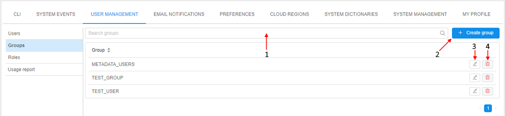
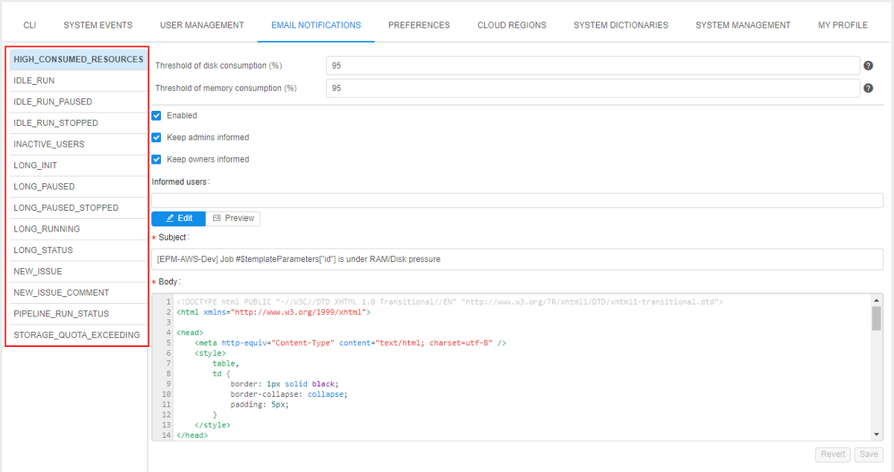
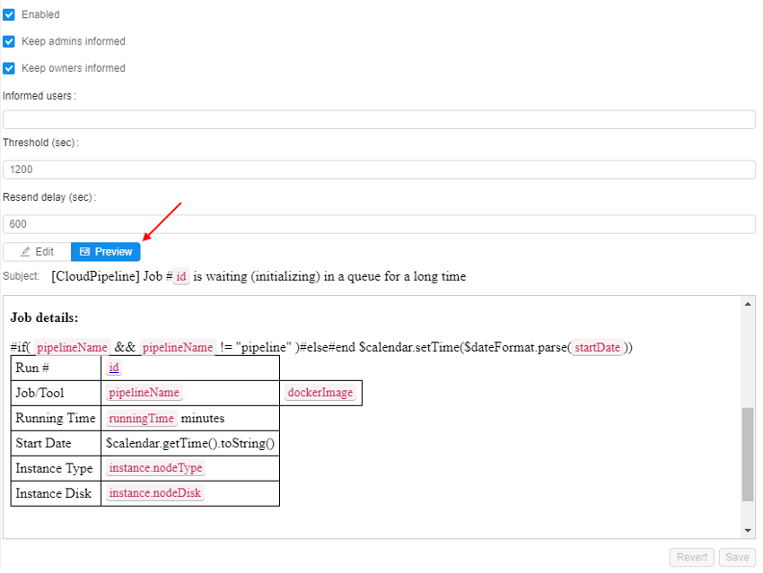

# 12. Manage Settings

Settings consist of CLI, System events, User management tabs, email notifications and Preferences tabs.

- [CLI tab](#cli-tab)
- [System events](#system-events)
    - [Controls](#system-events-controls)
- [User management](#user-management)
    - [Users](#users)
        - [Controls](#users-tab-controls)
    - [Groups](#groups)
        - [Controls](#groups-tab-controls)
    - [Roles](#roles)
        - [Controls](#roles-tab-controls)
- [Email notifications](#email-notifications)
    - [Controls](#email-notifications-tab-controls)
- [Preferences](#preferences)

## CLI tab

"**CLI**" tab generates a **CLI** installation and configuration commands to set **CLI** for Cloud Pipeline. See [14.1. Install and setup CLI](../14_CLI/14.1._Install_and_setup_CLI.md).

| Control | Description |
|---|---|
| **Operation system** | Choose an operation system from drop-down list and the instruction how to install Cloud Pipeline CLI will appear in the window below. |
| **Generate access key** | Generates access token to be used by CLI. |
| **Valid till** | A date access key expires. |

## System events

> This tab is visible only for administrator.

**System events** tab represents system events notifications. Here you can create, edit, delete system events notifications.  
System events notifications are organized into a table. It represents the **body of the notification**, its **severity status** ("_info_", "_warning_" or "_critical_") and **date of creation**, **activity status**.  
**_Note_**: Variants of activity status:

- **Blocking** event emerges in the middle of the window and requires confirmation from the user to disappear.
- **Active** notifications will be shown for all users of the Cloud Pipeline until admin sets them inactive.

Administrator can **edit** and **delete** notifications via corresponding buttons.  

### System events controls

Controls are at the top right of the table.

| Control | Description |
|---|---|
| **Expand/Collapse** | This button (**1**) shows/hides the body of the event. |
| **Refresh** | To refresh a list of notifications press this control (**2**). |
| **+ ADD** | This control (**3**) allows to create new notification. |
| **Edit** | The control (**4**) opens the edit form of the event. |
| **Delete** | To delete an event click the control (**5**). |

## User management

> This tab is visible only for administrator.

The **User management** tab helps to manage user groups and system roles.

To grant or refuse permissions to a specific group of users (e.g. project team members), you can just create a user group and grant or refuse permissions to the specific set of objects to the whole group.  
System roles is one of the principal tool for managing security access to the objects. Even if you have **WRITE** permission for a folder object, you might be not able to create a pipeline there, if you don't have **PIPELINE\_MANAGER** role.  
**_Note_**: About permissions, you can read more [here](../13_Permissions/13._Permissions.md).

**User management** consists of the 3 following tabs:

1. Users
2. Groups
3. Roles.

### Users

This table view displays a list of users and their additional information:

- **Name** - an authenticated domain account (SAML/OAuth/OpenID), e.g. e-mail.
- **Groups** - a set of groups assigned to a user. It could be whether CP's user's groups and groups, given to each user automatically by **SSO authentication system**.  
    **_Note_**: automatically created groups based on SSO authentication system are light-grey colored.
- **Roles** - a set of system roles assigned to a user.

#### Users tab controls

| Control | Description |
|---|---|
| **Search field** | To search particular user from a list of users, start to enter the user's name (see the picture below, **1**). |
| **+ Create user** | This control (see the picture below, **2**) opens a **"Create user"** form, which can be used to create a new user. |
| **Edit** | Allows changing a list of roles or groups assigned to a user (see the picture below, **3**). |

### Groups

The **"Groups"** tab shows a set of user groups created in CP. Here you can grant or refuse users in a group membership.  
Note that this tab displays groups created in CP only, not given by **SSO authentication system**.

#### Groups tab controls

| Control | Description |
|---|---|
| **Search field** | To search particular group from a list of groups, start to enter the group name (see the picture above, **1**). |
| **+ Create group** | Create a new group (see the picture above, **2**). |
| **Edit** | This control (see the picture above, **3**) allows changing a list of users owning this group. |
| **Delete** | Delete a group (see the picture above, **4**). |

### Roles

The "**Roles**" tab shows a set of predefined system roles that couldn't be extended or reduced. Here you can grant or refuse users in a role.  

There is a list of CP system roles:

| Role | Description |
|---|---|
| **ROLE\_ADMIN** | The user gets Read/Write/Execute/Owner permissions to all objects in the system. **_Note_**: The owner of the object can manage its Access Control List. **OWNER** property is assigned to a user has created an object by default. |
| **ROLE\_USER** | basic user. |
| **PIPELINE\_MANAGER** | allows to create/delete **Pipelines** (given to each user by default). |
| **FOLDER\_MANAGER** | allows to create/delete **Folders** (given to each user by default). |
| **CONFIGURATION\_MANAGER** | allows to create/delete **Cluster Configurations** (given to each user by default). |
| **STORAGE\_MANAGER** | allows to create/delete **Data Storages**. |
| **TOOL\_GROUP\_MANAGER** | allows to create/delete **Tool groups**. |
| **ENTITIES\_MANAGER** | allows to create/delete **Entities**. |

Set of user's roles combined with [permission settings](../13_Permissions/13._Permissions.md) defines allowed actions for the user and therefore the layout of GUI buttons. A user sees GUI options in appliance with his rights.  
**_Note_**: roles 3-8 are checked if a user has **WRITE** permission for the parent object.

#### Roles tab controls

| Control | Description |
|---|---|
| **Search field** | To search particular group from a list of roles, start to enter the role name (see the picture above, **1**). |
| **Edit** | Allows changing a list of users assigned the role (see the picture above, **2**). |

## Email notifications

> This tab is visible only for administrator.

The **email notifications** helps to keep track of what's happening in the Cloud Pipeline.
On the left you can see a list of the email notification templates.

### Email notifications tab controls

| Control | Descriptions |
|---|---|
| **Keep admins informed** | If set, all emails with such type will be sent to all users with **ROLE\_ADMIN** role. |
| **Informed** **users** | Select users that will get such email types. |
| **Threshold** | Amount of seconds that is required for the process to generate email. |
| **Resend delay** | Amount of seconds that is required for the process to generate a repeat email notification on that subject. |
| **Subject** | Email notification subject. |
| **Body** | Body of the email notification. |
| **Revert** | Return an email settings to the previous unsaved state. |
| **Save** | Saves current email notification settings. |

Also you can switch from the **Edit** to the **Preview** mode to see how the **Subject** and the **Body** of the email notification will actually look:  

**_Note_**: this is the current list of notification templates. It might be extended in the future.

| Notification type | Description |
|---|---|
| **LONG\_INIT** | tells that the job is initializing for a long time |
| **NEW\_ISSUE** | notifies about new issue |
| **NEW\_ISSUE\_COMMENT** | tells that an issue was commented |
| **LONG\_RUNNING** | tells that the job is running for a long time |
| **PIPELINE\_RUN\_STATUS** | email about current pipeline status |

## Preferences

> This tab is visible only for administrator.

The **Preferences** tab contains different global settings for the Cloud Pipeline. These settings determine default behavior of the Cloud Pipeline.
On the left you can see a set of sections. Each section contains a list of global settings. See more information [here](12.10._Manage_system-level_settings.md).

