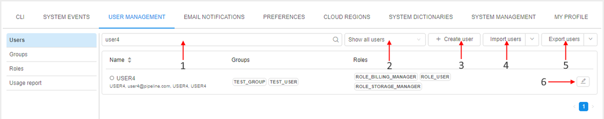
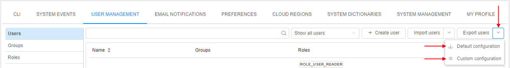
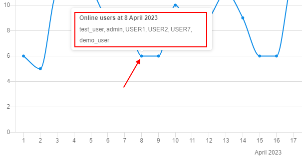
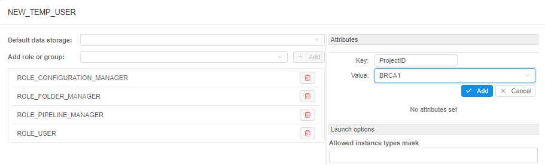
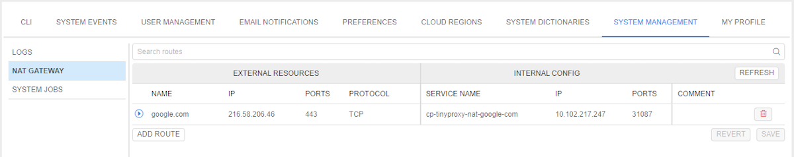
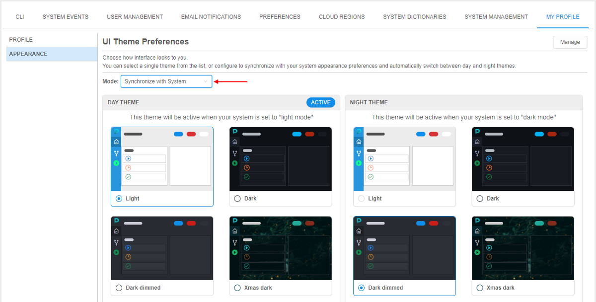

# 12. Manage Settings

System Settings consist of **CLI**, **System events**, **User management**, **Email notifications**, **Preferences**, **Cloud Regions** and **System logs** tabs.  
To open System Settings click the **gear** icon on the main menu in the left side of the Cloud Pipeline application:  

- [CLI tab](#cli-tab)
    - [Pipe CLI](#pipe-cli)
    - [Git CLI](#git-cli)
- [System events](#system-events)
- [User management](#user-management)
    - [Users](#users)
    - [Groups](#groups)
    - [Roles](#roles)
    - [Usage report](#usage-report)
- [Email notifications](#email-notifications)
- [Preferences](#preferences)
- [Cloud Regions](#cloud-regions)
- [System dictionaries](#system-dictionaries)
- [System management](#system-management)
    - [System logs](#system-logs)
    - [NAT gateway](#nat-gateway)
- [My profile](#my-profile)
    - [Profile](#profile)
    - [Appearance](#appearance)

## CLI tab

"**CLI**" tab generates two types of CLI installation and configuration commands to set CLI for the Cloud Pipeline - **Pipe CLI** and **Git CLI**. You can select each of them by click the corresponding option in the "**CLI**" tab menu.

### Pipe CLI

| Control | Description |
|---|---|
| **Operation system** | Choose an operation system from drop-down list and the instruction how to install the Cloud Pipeline CLI will appear in the window below. |
| **Generate access key** | Generates access token to be used by CLI. |
| **Valid till** | A date access key expires. |

For more details see [14.1. Install and setup CLI](../14_CLI/14.1._Install_and_setup_CLI.md).

### Git CLI

Here you can see instructions how to configure your Git client to work with the Cloud Pipeline.

***

## System events

> This tab is visible only for users with the **_ROLE\_ADMIN_** role.

**System events** tab represents system events notifications. Here you can create, edit, delete system events notifications.  
System events notifications are organized into a table. It represents the **body of the notification**, its **severity status** ("_info_", "_warning_" or "_critical_") and **date of creation**, **activity status**.  
**_Note_**: Variants of activity status:

- **Blocking** event emerges in the middle of the window and requires confirmation from the user to disappear.
- **Active** notifications will be shown for all users of the Cloud Pipeline until admin sets them inactive.

Administrator can **edit** and **delete** notifications via corresponding buttons.  

### System events controls

Controls are at the top right of the table.

|   | Control | Description |
|---|---|---|
| **1** | **Expand/Collapse** | This button shows/hides the body of the event. |
| **2** | **Refresh** | To refresh a list of notifications. |
| **3** | **+ ADD** | To create a new notification. |
| **4** | **Edit** | To open the edit form for the event. |
| **5** | **Delete** | To delete an event. |

For more detais see [12.1. Add a new system event](12.1._Add_a_new_system_event.md).

***

## User management

> This tab is visible only for users with the **_ROLE\_ADMIN_** role or the **_ROLE\_USER\_READER_** role.

The **User management** tab helps to manage user groups and system roles.

To grant or refuse permissions to a specific group of users (e.g. project team members), you can just create a user group and grant or refuse permissions to the specific set of objects to the whole group.  
System roles is one of the principal tool for managing security access to the objects. Even if you have **WRITE** permission for a folder object, you might be not able to create a pipeline there, if you don't have the **ROLE\_PIPELINE\_MANAGER** role.  
**_Note_**: About permissions, you can read more [here](../13_Permissions/13._Permissions.md).

**User management** consists of the following subtabs: [**Users**](#users), [**Groups**](#groups), [**Roles**](#roles), [**Usage report**](#usage-report).

### Users

This table view displays a list of users and their additional information:

- **Name** - an authenticated domain account (SAML/OAuth/OpenID), e.g. e-mail.
- **Groups** - a set of groups assigned to a user. It could be whether CP's user's groups and groups, given to each user automatically by **SSO authentication system**.  
    **_Note_**: automatically created groups based on SSO authentication system are light-grey colored.
- **Roles** - a set of system roles assigned to a user.

Additionally, near the name user's state is shown. Possible states:

- _Online_ - for users who are logged in and use the Platform in the moment  
    
- _Offline_ - for users who are not logged in at the moment/do not use the Platform for some time  
    

By hover over the _Offline_ icons - the tooltip will be shown that contains the info when the specific user has utilized the Platform the last time, e.g.:  
    

> Please note, that users' states are visible only for user with the **_ROLE\_ADMIN_** role.

#### Users tab controls

|   | Control | Description |
|---|---|---|
| **1** | **Search field** | Field to search a particular user from a list of users. |
| **2** | **Show users** | This control allows to filter which users to show in the list: <ul><li>all (_by default_)</li><li>only **_blocked_** users. More details about blocking/unblocking see [here](../../release_notes/v.0.16/v.0.16_-_Release_notes.md#blockingunblocking-users-and-groups)</li><li>only **_online_** users - i.e. users that are working at the Platform in the current moment</li><li>only users that exceeded any spending [quota](../Appendix_D/Appendix_D._Costs_management.md#spending-quotas)</li> |
| **3** | **+ Create user** | By click this button, the **"Create user"** form will be opened - to create a new user. More details see [here](12.3._Create_a_new_user.md). |
| **4** | **Import users** | Allows to import users from the list in `.csv` format. |
| **5** | **Export users** | Allows to export all users with selected set of attributes. More details see [below](#export-users). |
| **6** | **Edit** | Allows to change a list of roles/groups assigned to a user. More details see [here](12.4._Edit_delete_a_user.md#edit-a-user). |

#### Export users

The **Export users** button allows administrator to export user list in `.csv` format.  

There are 2 export options:

1. **Default configuration**  
    In this case, the file with all users and full list of their properties (**_ID_**, **_username_**, **_attributes_** (first and last name, email), **_registration date_**, **_first login date_**, list of **_groups_**, list of **_roles_**, **_blocked_**/**_unblocked_** state, **_default data storage_**) will be downloaded to the local workstation.  
    To export full user list with default configuration:  
    - click the **Export users** button in the right upper corner of the **Users** tab in the **User management** dashboard  
          
    **_or_**
    - hover the **v** button next to the **Export users** button and click the **Default configuration** item in the appeared drop-down menu  
        
2. **Custom configuration**  
    Custom configuration allows admins to select which user properties should be downloaded:  
    - hover the **v** button next to the **Export users** button and click the **Custom configuration** item in the appeared drop-down menu  
          
    - the modal window with the list of available user properties to export will appear, e.g.:  
          
        User can select any set of attributes by marking/unmarking corresponding checkboxes. At least 1 checkbox should be marked to export user list.  
        _"Fields"_ section contains the list of all users' attributes (by default, all attributes are selected).  
        _"Metadata"_ section contains the list of all users' metadata attributes (by default, all attributes are deselected).  
        **_Note_**: enabled **Header** checkbox adds the headers row into the exporting file.
    - to download the result file with full user list and custom set of their properties click the **Download CSV** button.

> **_Note_**: not all user's metadata have to be exported. Some of them may contains the sensitive data. To restrict the list of the metadata to export the following system preference should be used - **`misc.metadata.sensitive.keys`**. In this preference, all metadata keys that **_shouldn't be exported_** are being specified (i.e. if these metadata keys are specified in the preference, they will not be displayed at the export pop-up for selection).
>
> Example of that configured preference:  
> 

### Groups

The **"Groups"** subtab shows a set of user groups created in CP. Here you can grant or refuse users in a group membership.  
Note that this tab displays groups created in CP only, not given by **SSO authentication system**.

#### Groups tab controls

|   | Control | Description |
|---|---|---|
| **1** | **Search field** | To search a particular group from a list of groups. |
| **2** | **+ Create group** | To create a new group. More details see [here](12.5._Create_a_group.md). |
| **3** | **Edit** | This control allows to change a list of users owning this group. More details see [here](12.6._Edit_a_group_role.md#edit-a-group-role). |
| **4** | **Delete** | Delete a group. More details see [here](12.7._Delete_a_group.md). |

### Roles

The "**Roles**" subtab shows a set of predefined system roles that couldn't be extended or reduced. Here you can grant or refuse users in a role.  

There is a list of Cloud Pipeline system roles:

| Role | Description |
|---|---|
| **ROLE\_ADMIN** | User gets Read/Write/Execute/Owner permissions to all objects in the Platform. **_Note_**: The owner of the object can manage its Access Control List. **OWNER** property is assigned to a user has created an object by default. |
| **ROLE\_USER** | Basic user. |
| **ROLE\_ADVANCED\_USER** | Allows to use [friendly URLs](../10_Manage_Tools/10.5._Launch_a_Tool.md#launch-a-tool-with-friendly-url) for runs. |
| **ROLE\_ALLOW\_ALL\_POLICY** | By default, users can connect from own run to any other own run. This role allows users to connect from own run to any run of that user or other users (in case of corresponding [permissions](../13_Permissions/13._Permissions.md) on such runs). |
| **ROLE\_ANONYMOUS\_USER** | Specific role for the ability of sharing interactive runs endpoints to the `anonymous` users. **_Note_**:`anonymous` users - users, who have successfully passed the IdP authentication but are not registered in the Cloud Pipeline Platform. |
| **ROLE\_BILLING\_MANAGER** | Users who are granted this role are able to view the whole **Billing reports** info of the platform (as if they were admins). |
| **ROLE\_CONFIGURATION\_MANAGER** | Allows to create/delete **Cluster Configurations** (given to each user by default). |
| **ROLE\_DTS\_MANAGER** | Allows to manage data transfer service. |
| **ROLE\_ENTITIES\_MANAGER** | Allows to create/delete **Entities**. |
| **ROLE\_FOLDER\_MANAGER** | Allows to create/delete **Folders** (given to each user by default). |
| **ROLE\_PIPELINE\_MANAGER** | Allows to create/delete **Pipelines** (given to each user by default). |
| **ROLE\_SERVICE\_ACCOUNT** | Adds no extra permissions. But accounts with this role are not being blocked by LDAP. |
| **ROLE\_STORAGE\_ADMIN** | User gets Read/Write/Owner permissions to all data storages in the Platform. |
| **ROLE\_STORAGE\_ARCHIVE\_MANAGER** | Allows to manage [storages lifecycle processes](../08_Manage_Data_Storage/8.10._Storage_lifecycle.md). |
| **ROLE\_STORAGE\_ARCHIVE\_READER** | Allows read-only access to [storages lifecycle info](../08_Manage_Data_Storage/8.10._Storage_lifecycle.md). |
| **ROLE\_STORAGE\_MANAGER** | Allows to create/delete **Data Storages**. |
| **ROLE\_STORAGE\_TAG\_MANAGER** | Allows to manage storage attributes. |
| **ROLE\_TOOL\_GROUP\_MANAGER** | Allows to create/delete **Tool groups**. |
| **ROLE\_VERSIONED\_STORAGE\_MANAGER** | Allows to create/delete [**Versioned Storages**](../08_Manage_Data_Storage/8.13._Versioned_storages.md). |
| **ROLE\_USER\_READER** | Allows read-only access to the users, groups, roles information and export users feature. |
| **ROLE\_USER\_METADATA\_READER**	| Allows read-only access to the users metadata. Additional to the role **ROLE\_USER\_READER**. |

Set of user's roles combined with [permission settings](../13_Permissions/13._Permissions.md) defines allowed actions for the user and therefore the layout of GUI buttons. A user sees GUI options in appliance with his rights.  
**_Note_**: roles 6-12 are being checked if a user has **WRITE** permission for the parent object.

#### Roles tab controls

| Control | Description |
|---|---|
| **Search field** | To search particular group from a list of roles, start to enter the role name (see the picture above, **1**). |
| **Edit** | Allows changing a list of users assigned the role (see the picture above, **2**). More details see [here](12.8._Change_a_set_of_roles_groups_for_a_user.md#change-a-member-list-for-a-selected-role-or-group). |

### Usage report

The "**Usage report**" subtab shows the Platform's statistics of users activity.  
At this subtab, the summary info about total count of Platform users that were online at different time moments during the certain period is displayed in a chart form:  
    

#### Usage report tab controls

|   | Control | Description |
|---|---|---|
| **1** | **Calendar control** | To select a specific day/month from the calendar. |
| **2** | **Period selector** | To select the type of period of view - day (_by default_) or month. |
| **3** | **User filter** | To restrict the displayed data by specific user(s) or user group(s)/role(s). Multiselect is supported |

##### Day period

By default, the day report is generated for the today (see example on the picture above).  
You can select another day to view statistics by the **Calendar** control.

Report contains the chart with the average count of the Platform users that were online in the selected day - by hours division.

By click any point - info tooltip appears including the time moment and the full list of users that were online in this moment, e.g.:  
    

##### Month period

By default, the month report is generated for the current month.  
You can select another month to view statistics by the **Calendar** control.

There are 2 possible views for the month period:

- **Average** (_default_) - chart shows the number of the Platform online users by days division in the selected month.  
    For each day, the count of online users is being calculated as median value between all hourly values:  
    
- **Unique** - chart shows the summary number of the unique Platform online users by days division during the selected month.  
    For each day, the count of users is being calculated as summary accumulative count of the unique Platform online users at the end of the day:  
      
    By click any point - info tooltip appears including the date and the full list of unique users that were online in this day, e.g.:  
    

***

## Email notifications

> This tab is visible only for users with the **_ROLE\_ADMIN_** role.

The **email notifications** helps to keep track of what's happening in the Cloud Pipeline.
On the left you can see a list of the email notification templates.

### Email notifications tab controls

| Control | Descriptions |
|---|---|
| **Enabled** checkbox | If set, email distribution of the selected type will be enabled. |
| **Keep admins informed** checkbox | If set, all emails with such type will be sent to all users with **ROLE\_ADMIN** role. |
| **Keep owners informed** checkbox | If set, all emails with such type will be sent to the **OWNERS** of the corresponding Cloud Pipeline objects. |
| **Informed users** text field | Select users that will get such email types. |
| **Threshold** text field | Amount of seconds that is required for the process to generate email. |
| **Resend delay** text field | Amount of seconds that is required for the process to generate a repeat email notification on that subject. |
| **Subject** text field | Email notification subject. |
| **Body** text field | Body of the email notification. |
| **Revert** button | Return an email settings to the previous unsaved state. |
| **Save** button | Saves current email notification settings. |

Also you can switch from the **Edit** to the **Preview** mode to see how the **Subject** and the **Body** of the email notification will actually look:  

### Templates

**_Note_**: this is the current list of notification templates. It might be extended in the future.

| Notification type | Description |
|---|---|
| **BILLING\_QUOTA\_EXCEEDING** | tells that billing quota is higher than a threshold value |
| **DATASTORAGE\_LIFECYCLE\_ACTION** | tells that datastorage lifecycle event (data transition) is approaching or has happened |
| **DATASTORAGE\_LIFECYCLE\_RESTORE\_ACTION** | tells that datastorage lifecycle event (data restoring) has happened |
| **FULL\_NODE\_POOL** | tells that all nodes of some node pool(s) are already in use |
| **HIGH\_CONSUMED\_RESOURCES** | tells that memory or disk consuming is higher than a threshold value for a specific period of time |
| **IDLE\_RUN** | tells that the job is idle for a long time |
| **IDLE\_RUN\_PAUSED** | tells that the job was paused because it was idle for a long time |
| **IDLE\_RUN\_STOPPED** | tells that the job was stopped because it was idle for a long time |
| **INACTIVE\_USERS** | tells that some users are not active for a long period of time |
| **LDAP\_BLOCKED\_USERS** | tells that specific users were blocked in the Platform due to their blocking in LDAP |
| **LONG\_INIT** | tells that the job is initializing for a long time |
| **LONG\_PAUSED** | tells that the job has been paused for a long time |
| **LONG\_PAUSED\_STOPPED** | tells that the job, that has been paused for a long time, is stopped at the moment |
| **LONG\_RUNNING** | tells that the job is running for a long time |
| **LONG\_STATUS** | tells that the job is been waiting in a certain status for a long time |
| **NEW\_ISSUE** | notifies about new issue |
| **NEW\_ISSUE\_COMMENT** | tells that an issue was commented |
| **PIPELINE\_RUN\_STATUS** | notifies about current pipeline status |
| **STORAGE\_QUOTA\_EXCEEDING** | tells that a storage has reached volume consumption threshold |

***

## Preferences

> This tab is visible only for users with the **_ROLE\_ADMIN_** role.

The **Preferences** tab contains different global settings for the Cloud Pipeline. These settings determine default behavior of the Cloud Pipeline.  
On the left you can see a set of sections. Each section contains a list of global settings. See more information [here](12.10._Manage_system-level_settings.md).

***

## Cloud Regions

> This tab is visible only for users with the **_ROLE\_ADMIN_** role.

The **Cloud Regions** tab contains different settings for the specific Cloud Regions and Cloud Providers.  
You could manage regions, add or remove them from the Cloud Pipeline.

***

## System dictionaries

> This tab is visible only for users with the **_ROLE\_ADMIN_** role.

The **System dictionaries** tab contains the list of predefined "dictionaries" - sets of "key-value(s)" that could be used by admins when configuring **Cloud Pipeline** objects attributes (metadata).

For example, admins have to set attributes (metadata) for "general" users manually. In case, when such metadata keys aren't different for each user and has certain amount of values, it is convenient to select these values from the predefined values list, not to specify them manually each time.

Each dictionary is the categorical attribute. I.e. it is attribute which values are predefined.
Each dictionary has its name and values:  
      
If the dictionary exists in the system, then admin can use it when specifying attributes for any Platform object (**`Pipeline`**, **`Folder`**, **`Storage`**, **`Project`**, **`Tool`**), and also for **`User`**, **`Group`** or **`Role`**. In this case, it is enough to specify only the dictionary name as the attribute key, the list of dictionary values will appear automatically in the value field:  
    

Also, the different dictionaries may be connected (linked). I.e. admins can create two dictionaries, which values are mapped `1-1` or `1-many`, e.g.:  
      
      
    

In the GUI, such connection is being handled in the following way:

1. Admin specifies the links between the dictionaries items (e.g. for the example above _`ProjectID`:`BRCA1`_ -> _`DataStorage`:`<path>`_).
2. Links have the "autofill" attribute. If the admin selects the source key (_`ProjectID`:`BRCA1`_) as attribute key for any object - the destination key will be specified automatically (_`DataStorage`_ will be added with the _`<path>`_ selection):  
      
    

For more details see [here](12.13._System_dictionaries.md).

**_Note_**: all functionality described above is available only for admins. "General" users can't view/edit System Dictionaries. If non-admin user tries to specify any existing dictionary as the attribute "Key" - it will be displayed as plain text attribute. No dictionary values will be loaded/displayed.

***

## System management

> This tab is visible only for users with the **_ROLE\_ADMIN_** role.

The **System management** tab includes several possibilities to configure/observe the Platform deployment in general.

### System logs

The **System logs** subtab contains the following audit trail events:

- users' authentication attempts
- users' profiles modifications
- platform objects' permissions management
- access to interactive applications from pipeline runs
- access to the data stored in the object storages
- management of the transition rules for [storages lifecycle](../08_Manage_Data_Storage/8.10._Storage_lifecycle.md)
- other platform functionality features

For more details see [here](12.12._System_logs.md).

### NAT gateway

The **NAT gateway** subtab allows to configure network routes.  
This is nessasary when the Cloud Pipeline Platform is deployed in some private subnet and the admin needs to expose a network endpoint for some service.  
Via this form, admins can create/remove network routes from private subnet(s) to the external network resources.

The **NAT gateway** subtab contains:

- the list of existing routes (port forwarding map). Each route record contains:
    - info about external resources
    - info about corresponding internal config (mapping details)
    - comment
- controls to manage the routes list (add/remove/save etc.)

For more details see [here](12.14._NAT_gateway.md).

***

## My profile

The **My profile** tab allows:

- to view main info about the current user
- to configure the view of the Platform pages (for the current user)

### Profile

The **Profile** subtab allows to view the following info for the current loginned user:

- registration user info (username, name, last name, etc.)
- roles assigned to the user
- user attributes (metadata)

### Appearance

The **Appearance** subtab allows to select the UI theme(s) - to configure the view of the Platform pages for the current user.

User can select a single theme that will always shown:  
    

Or configure synchronization with system preferences and automatically switch between day and night themes:  
    
