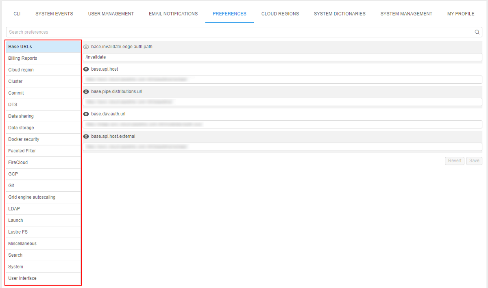

# 12. Manage Settings

System Settings consist of **CLI**, **System events**, **User management**, **Email notifications**, **Preferences** and **Cloud Regions** tabs.  
To open System Settings click the **gear** icon on the main menu in the left side of the Cloud Pipeline application:  

- [CLI tab](#cli-tab)
    - [Pipe CLI](#pipe-cli)
    - [Git CLI](#git-cli)
- [System events](#system-events)
- [User management](#user-management)
    - [Users](#users)
    - [Groups](#groups)
    - [Roles](#roles)
- [Email notifications](#email-notifications)
- [Preferences](#preferences)
- [Cloud Regions](#cloud-regions)

## CLI tab

"**CLI**" tab generates two types of CLI installation and configuration commands to set CLI for the Cloud Pipeline - **Pipe CLI** and **Git CLI**. You can select each of them by click the corresponding option in the "**CLI**" tab menu.

### Pipe CLI

| Control | Description |
|---|---|
| **Operation system** | Choose an operation system from drop-down list and the instruction how to install the Cloud Pipeline CLI will appear in the window below. |
| **Generate access key** | Generates access token to be used by CLI. |
| **Valid till** | A date access key expires. |

For more details see [14.1. Install and setup CLI](../14_CLI/14.1._Install_and_setup_CLI.md).

### Git CLI

Here you can see instructions how to configure your Git client to work with the Cloud Pipeline.

## System events

> This tab is visible only for administrator.

**System events** tab represents system events notifications. Here you can create, edit, delete system events notifications.  
System events notifications are organized into a table. It represents the **body of the notification**, its **severity status** ("_info_", "_warning_" or "_critical_") and **date of creation**, **activity status**.  
**_Note_**: Variants of activity status:

- **Blocking** event emerges in the middle of the window and requires confirmation from the user to disappear.
- **Active** notifications will be shown for all users of the Cloud Pipeline until admin sets them inactive.

Administrator can **edit** and **delete** notifications via corresponding buttons.  

### System events controls

Controls are at the top right of the table.

| Control | Description |
|---|---|
| **Expand/Collapse** | This button (**1**) shows/hides the body of the event. |
| **Refresh** | To refresh a list of notifications press this control (**2**). |
| **+ ADD** | This control (**3**) allows to create new notification. |
| **Edit** | The control (**4**) opens the edit form of the event. |
| **Delete** | To delete an event click the control (**5**). |

## User management

> This tab is visible only for administrator.

The **User management** tab helps to manage user groups and system roles.

To grant or refuse permissions to a specific group of users (e.g. project team members), you can just create a user group and grant or refuse permissions to the specific set of objects to the whole group.  
System roles is one of the principal tool for managing security access to the objects. Even if you have **WRITE** permission for a folder object, you might be not able to create a pipeline there, if you don't have the **ROLE\_PIPELINE\_MANAGER** role.  
**_Note_**: About permissions, you can read more [here](../13_Permissions/13._Permissions.md).

**User management** consists of the 3 following tabs: **Users**, **Groups**, **Roles**.

### Users

This table view displays a list of users and their additional information:

- **Name** - an authenticated domain account (SAML/OAuth/OpenID), e.g. e-mail.
- **Groups** - a set of groups assigned to a user. It could be whether CP's user's groups and groups, given to each user automatically by **SSO authentication system**.  
    **_Note_**: automatically created groups based on SSO authentication system are light-grey colored.
- **Roles** - a set of system roles assigned to a user.

#### Users tab controls

| Control | Description |
|---|---|
| **Search field** | To search particular user from a list of users, start to enter the user's name (see the picture below, **1**). |
| **+ Create user** | This control (see the picture below, **2**) opens a **"Create user"** form, which can be used to create a new user. |
| **Export users** | Allows export all users with selected set of attributes (see the picture below, **3**). |
| **Edit** | Allows changing a list of roles or groups assigned to a user (see the picture below, **4**). |

#### Export users

The **Export users** button allows administrator to export user list in `.csv` format.  

There are 2 export options:

1. **Default configuration**  
    In this case, the file with all users and full list of their properties (**_ID_**, **_username_**, **_attributes_** (first and last name, email), **_registration date_**, **_first login date_**, list of **_groups_**, list of **_roles_**, **_blocked_**/**_unblocked_** state, **_default data storage_**) will be downloaded to the local workstation.  
    To export full user list with default configuration:  
    - click the **Export users** button in the right upper corner of the **Users** tab in the **User management** dashboard  
          
    **_or_**
    - hover the **v** button next to the **Export users** button and click the **Default configuration** item in the appeared drop-down menu  
        
2. **Custom configuration**  
    Custom configuration allows admins to select which user properties should be downloaded:  
    - hover the **v** button next to the **Export users** button and click the **Custom configuration** item in the appeared drop-down menu  
          
    - the modal window with the list of available user properties to export will appear, e.g.:  
          
        User can select any set of attributes by marking/unmarking corresponding checkboxes. At least 1 checkbox should be marked to export user list.  
        **_Note_**: enabled **Header** checkbox adds the headers row into the exporting file
    - to download the result file with full user list and custom set of their properties click the **Download CSV** button.

### Groups

The **"Groups"** tab shows a set of user groups created in CP. Here you can grant or refuse users in a group membership.  
Note that this tab displays groups created in CP only, not given by **SSO authentication system**.

#### Groups tab controls

| Control | Description |
|---|---|
| **Search field** | To search particular group from a list of groups, start to enter the group name (see the picture above, **1**). |
| **+ Create group** | Create a new group (see the picture above, **2**). |
| **Edit** | This control (see the picture above, **3**) allows changing a list of users owning this group. |
| **Delete** | Delete a group (see the picture above, **4**). |

### Roles

The "**Roles**" tab shows a set of predefined system roles that couldn't be extended or reduced. Here you can grant or refuse users in a role.  

There is a list of CP system roles:

| Role | Description |
|---|---|
| **ROLE\_ADMIN** | The user gets Read/Write/Execute/Owner permissions to all objects in the system. **_Note_**: The owner of the object can manage its Access Control List. **OWNER** property is assigned to a user has created an object by default. |
| **ROLE\_USER** | basic user. |
| **ROLE\_PIPELINE\_MANAGER** | allows to create/delete **Pipelines** (given to each user by default). |
| **ROLE\_FOLDER\_MANAGER** | allows to create/delete **Folders** (given to each user by default). |
| **ROLE\_CONFIGURATION\_MANAGER** | allows to create/delete **Cluster Configurations** (given to each user by default). |
| **ROLE\_STORAGE\_MANAGER** | allows to create/delete **Data Storages**. |
| **ROLE\_TOOL\_GROUP\_MANAGER** | allows to create/delete **Tool groups**. |
| **ROLE\_ENTITIES\_MANAGER** | allows to create/delete **Entities**. |

Set of user's roles combined with [permission settings](../13_Permissions/13._Permissions.md) defines allowed actions for the user and therefore the layout of GUI buttons. A user sees GUI options in appliance with his rights.  
**_Note_**: roles 3-8 are checked if a user has **WRITE** permission for the parent object.

#### Roles tab controls

| Control | Description |
|---|---|
| **Search field** | To search particular group from a list of roles, start to enter the role name (see the picture above, **1**). |
| **Edit** | Allows changing a list of users assigned the role (see the picture above, **2**). |

## Email notifications

> This tab is visible only for administrator.

The **email notifications** helps to keep track of what's happening in the Cloud Pipeline.
On the left you can see a list of the email notification templates.

### Email notifications tab controls

| Control | Descriptions |
|---|---|
| **Enabled** checkbox | If set, email distribution of the selected type will be enabled. |
| **Keep admins informed** checkbox | If set, all emails with such type will be sent to all users with **ROLE\_ADMIN** role. |
| **Keep owners informed** checkbox | If set, all emails with such type will be sent to the **OWNERS** of the corresponding Cloud Pipeline objects. |
| **Informed users** text field | Select users that will get such email types. |
| **Threshold** text field | Amount of seconds that is required for the process to generate email. |
| **Resend delay** text field | Amount of seconds that is required for the process to generate a repeat email notification on that subject. |
| **Subject** text field | Email notification subject. |
| **Body** text field | Body of the email notification. |
| **Revert** button | Return an email settings to the previous unsaved state. |
| **Save** button | Saves current email notification settings. |

Also you can switch from the **Edit** to the **Preview** mode to see how the **Subject** and the **Body** of the email notification will actually look:  

**_Note_**: this is the current list of notification templates. It might be extended in the future.

| Notification type | Description |
|---|---|
| **HIGH\_CONSUMED\_RESOURCES** | tells that memory or disk consuming is higher than a threshold value for a specific period of time |
| **IDLE\_RUN** | tells that the job is idle for a long time |
| **IDLE\_RUN\_PAUSED** | tells that the job was paused because it was idle for a long time |
| **IDLE\_RUN\_STOPPED** | tells that the job was stopped because it was idle for a long time |
| **LONG\_INIT** | tells that the job is initializing for a long time |
| **LONG\_RUNNING** | tells that the job is running for a long time |
| **NEW\_ISSUE** | notifies about new issue |
| **NEW\_ISSUE\_COMMENT** | tells that an issue was commented |
| **PIPELINE\_RUN\_STATUS** | email about current pipeline status |

## Preferences

> This tab is visible only for administrator.

The **Preferences** tab contains different global settings for the Cloud Pipeline. These settings determine default behavior of the Cloud Pipeline.
On the left you can see a set of sections. Each section contains a list of global settings. See more information [here](12.10._Manage_system-level_settings.md).

## Cloud Regions

> This tab is visible only for administrator.

The **Cloud Regions** tab contains different settings for the specific Cloud Regions. You could manage regions, add or remove them from the Cloud Pipeline.

