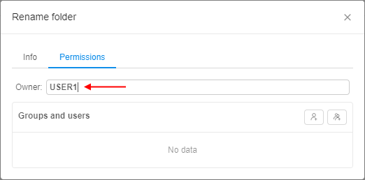

# 13. Permissions

- [Overview](#overview)
    - [Owner property](#owner-property)
        - [How to change an owner](#how-to-change-an-owner)
    - [Admin role](#admin-role)
- [Permission settings](#permission-settings)

## Overview

**Security Policies Scheme** is organized by 2 principal tools: **groups** (user groups and system roles) and **Access Control List** defined for each CP's object.  
**_Note_**: About groups and system roles you can read more [here](../12_Manage_Settings/12._Manage_Settings.md#roles).  
Object's Access Control List specifies who can work with the object and what he can do with it. It is defined as a pair of attributes:

- a User or User Group ID
- Permissions

The permission settings are divided into the following options which can be combined for the object:

- **Read**
- **Write**
- **Execute**

Below is a mapping of the objects' possible actions to permissions which demonstrates what actions will be allowed or denied to a user or user group.  
**_Note_**: according to Security Policies Scheme **WRITE** permission is not enough to add/delete any Cloud Pipeline object. A specific **\*\_MANAGER role** is required also (about roles see [here](../12_Manage_Settings/12._Manage_Settings.md#roles)).

<table>
    <thead>
        <tr class="header">
            <th>Object</th>
            <th>User Action</th>
            <th>Permission</th>
        </tr>
    </thead>
    <tbody>
        <tr>
            <td rowspan="7"><strong>Folder</strong></td>
            <td>
            View folder</td>
            <td rowspan="2">Read</td>
        </tr>
        <tr>
            <td>List folder contents</td>
        </tr>
        <tr>
            <td>Create object (e.g folder, pipeline, etc.)</td>
            <td rowspan="5">Write</td>
        </tr>
        <tr>
            <td>Delete folder</td>
        </tr>
        <tr>
            <td>Rename folder</td>
        </tr>
        <tr>
            <td>Change parent</td>
        </tr>
        <tr>
            <td>Upload metadata</td>
        </tr>
        <tr>
            <td rowspan="6"><strong>Pipeline</strong> <em>*Permissions for a pipeline version are inherited from the pipeline</em></td>
            <td>View pipeline</td>
            <td rowspan="2">Read</td>
        </tr>
        <tr>
            <td>List pipeline attributes</td>
        </tr>
        <tr>
            <td>Delete a pipeline</td>
            <td rowspan="3">Write</td>
        </tr>
        <tr>
            <td>Edit pipeline attributes</td>
        </tr>
        <tr>
            <td>Change parent</td>
        </tr>
        <tr>
            <td>Run a pipeline</td>
            <td>Execute</td>
        </tr>
        <tr>
            <td rowspan="5"><strong>DataStorage</strong> <em>*Permissions for files in data storage are inherited from the data storage</em></td>
            <td>View datastorage</td>
            <td rowspan="2">Read</td>
        </tr>
        <tr>
            <td>List datastorage contents</td>
        </tr>
        <tr>
            <td>Delete a datastorage</td>
            <td rowspan="3">Write</td>
        </tr>
        <tr>
            <td>Edit datastorage attributes/contents</td>
        </tr>
        <tr>
            <td>Change parent</td>
        </tr>
        <tr>
            <td rowspan="5"><strong>Pipeline run</strong></td>
            <td>View runs</td>
            <td rowspan="5">Inherited from a run pipeline</td>
        </tr>
        <tr>
            <td>View run logs</td>
        </tr>
        <tr>
            <td>Launch a pipeline</td>
        </tr>
        <tr>
            <td>Stop a run</td>
        </tr>
        <tr>
            <td>Rerun</td>
        </tr>
        <tr>
            <td rowspan="5"><strong>Tool run</strong></td>
            <td>View runs</td>
            <td rowspan="5">Admin and Owner only</td>
        </tr>
        <tr>
            <td>View run logs</td>
        </tr>
        <tr>
            <td>Launch a pipeline</td>
        </tr>
        <tr>
            <td>Stop a run</td>
        </tr>
        <tr>
            <td>Rerun</td>
        </tr>
        <tr>
            <td rowspan="3"><strong>Cluster node</strong></td>
            <td>View a cluster</td>
            <td rowspan="3">Inherited from a currently assigned run</td>
        </tr>
        <tr>
            <td>View node details</td>
        </tr>
        <tr>
            <td>Terminate a node</td>
        </tr>
        <tr>
            <td rowspan="5"><strong>Docker Registry</strong></td>
            <td>View registry</td>
            <td>Read</td>
        </tr>
        <tr>
            <td>Add registry</td>
            <td rowspan="3">Write</td>
        </tr>
        <tr>
            <td>Delete registry</td>
        </tr>
        <tr>
            <td>Edit registry attributes</td>
        </tr>
        <tr>
            <td>Run a child tool</td>
            <td>Execute</td>
        </tr>
        <tr>
            <td rowspan="5"><strong>Tool group</strong></td>
            <td>View tool group</td>
            <td>Read</td>
        </tr>
        <tr>
            <td>Create tool group</td>
            <td rowspan="3">Write</td>
        </tr>
        <tr>
            <td>Edit tool group</td>
        </tr>
        <tr>
            <td>Delete tool group</td>
        </tr>
        <tr>
            <td>Run a child tool</td>
            <td>Execute</td>
        </tr>
        <tr>
            <td rowspan="5"><strong>Tool</strong></td>
            <td>View enabled tool</td>
            <td rowspan="2">Read</td>
        </tr>
        <tr>
            <td>View disabled tools list</td>
        </tr>
        <tr>
            <td>Edit tool attributes</td>
            <td>Write</td>
        </tr>
        <tr>
            <td>Run tool without a pipeline</td>
            <td>Execute</td>
        </tr>
        <tr>
            <td>Instance management</td>
            <td>Admin and Owner only</td>
        </tr>
        <tr>
            <td rowspan="5"><strong>Run configuration</strong></td>
            <td>View run configuration</td>
            <td>Read</td>
        </tr>
        <tr>
            <td>Delete a run configuration</td>
            <td rowspan="3">Write</td>
        </tr>
        <tr>
            <td>Edit run configuration attributes</td>
        </tr>
        <tr>
            <td>Change parent</td>
        </tr>
        <tr>
            <td>Run a run configuration</td>
            <td>Execute</td>
        </tr>
    </tbody>
</table>

### Owner property

Each object has an additional **"Owner"** property. The owner of the object can manage its Access Control List. **Owner** property is assigned to a user that created an object.

#### How to change an owner

The Owner of an object can be changed easily for:

- Folders;
- Pipelines and pipelines versions;
- Data storages;
- Run configurations;
- Docker registries, Tool Groups and Tools.

**_Note_**: you shall have Owner or Admin role.

To change an owner of an object:

1. Select an object.
2. Click **"Gear"** icon in the top-right corner of the screen.  
    
3. Navigate to **Permissions** tab.  
    **_Note_**: To edit permissions:  
    - for a Folder - click the **"Gear"** icon → **Edit folder**
    - for a Docker registry - click the **"Gear"** icon → **Registry** → **Edit**.
    - for a Tool group - click the **"Gear"** icon → **Group** → **Edit**
    - for a Tool - click the **"Gear"** icon → **Permissions**.
4. Click owner's name. Now you can edit it:  
    
5. Start to enter a desired username and system will suggest you the existing users.  
      
    Click the desired username.
6. Click **"Apply"** control and the changes will be saved.  
    

Also you can change an owner of an object via `pipe` CLI - see [here](../14_CLI/14.4._View_and_manage_Permissions_via_CLI.md#change-owner-property).

### Admin role

Admin property can be given by assigning **ROLE\_ADMIN** to a user (about roles see [here](../12_Manage_Settings/12._Manage_Settings.md#roles)). The user gets Read/Write/Execute/Owner permissions to all objects in the system.  
Initially, a user with **ROLE\_ADMIN** shall be an authenticated domain account (SAML/OAuth/OpenID) defined during a system deployment (in some properties file or database).

## Permission settings

The permissions could be granted to a user in one of the following ways:

- the system has a **"default"** system role or user group. This type of system roles or groups assigned by default once a user is created;
- assigned user groups or system role where every member has the same permissions for specific objects;
- granted permissions for specific user.

The priority of permissions granted for specific object explicitly is higher than the group or role permissions, e.g. if a basic user is included into the group that doesn't have an access to some folder but he has permissions explicitly defined for himself that allow him to work with that folder, he will have an access to it.  
To assign object's permissions to a user or user group you shall move to the object's page and click the **"Gear"** icon in the top-right corner of the screen and select **"Permissions"** tab.

**_Note_**: To edit permissions:

- for a Folder - click the **"Gear"** icon → **Edit folder**
- for a Docker registry - click the **"Gear"** icon → **Registry** → **Edit**.
- for a Tool group - click the **"Gear"** icon → **Group** → **Edit**
- for a Tool - click the **"Gear"** icon → **Permissions**.

You can explicitly define permissions for the object for a particular user or group of users (users within the same Group) in the **"Permission"** form by clicking on its name in the **"Groups and users"** list.  
**_Note_**: if you couldn't find the desired user or user group, you can add it via **"Add a user"** and **"Add a user group"** controls (see the picture below, **1**).

The additional section for a particular user or user group suggests you tick the desired grants. Here you can allow or deny specific permission options (see the picture above, **2**).  
**_Note_**: if you don't tick any possible variant, it will be inherited from the parent object (e.g. a pipeline in a folder inherits permissions from it) (see the picture above, **3**).

**Example 1:** according to the picture above, a user will get **WRITE** and **EXECUTE** permissions for an object, and the **READ** permission will be inherited from the parent object.

**Example 2:** on the picture below we see **Permission** form of a run configuration. We grant a user **READ** and **EXECUTE** permissions, but deny **WRITE** permission. So the user is able to see the run configuration and run it, but he can not edit its parameters:  
