# 14.1. Install and setup CLI

- [How to install and setup `pipe` CLI](#how-to-install-and-setup-pipe-cli)
    - [`configure` command options](#configure-command-options)
        - [`pipe` configuration for using NTLM Authentication Proxy](#pipe-configuration-for-using-ntlm-authentication-proxy)
        - [`pipe` configuration to login without explicitly specified tokens](#pipe-configuration-to-login-without-explicitly-specified-tokens)
- [Allow to run `pipe` commands on behalf of the other user](#allow-to-run-pipe-commands-on-behalf-of-the-other-user)
    - [Using `pipe token` command](#using-pipe-token-command)
    - [Using '--user' option](#using-user-option)
- [Update the CLI](#update-the-cli)

## How to install and setup `pipe` CLI

1. Go to **Settings** → **CLI** tab.
2. Select **Pipe CLI** item at the left panel.
3. Select your Operation System from the list.
4. Follow the installation instructions for your OS (e.g. Linux). Commands below shall be executed in the Terminal.  
    When installation is finished, type `pipe` in the Terminal to test pipe installation. This command shall produce short description of pipe CLI and pipe CLI commands (it is the same as the `pipe --help` command execution).  
    Then type the `pipe --version` command - this command will output only the Cloud Pipeline CLI version:  
    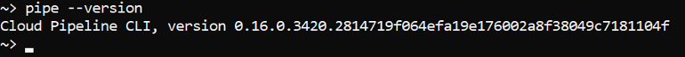
5. Return to the Web GUI and press the **Generate access key** button.
6. Copy **CLI configure command**  
    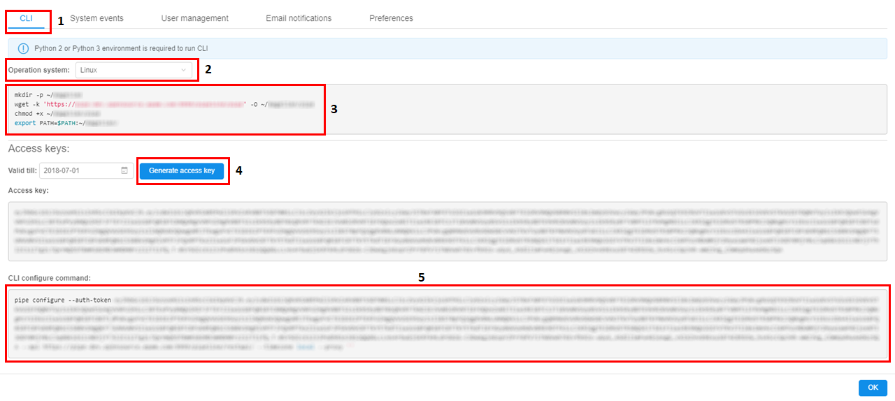
7. Paste copied command into the Terminal and run it to configure:  
    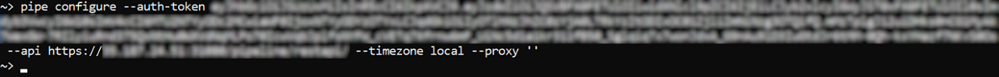
8. Now Cloud Pipeline **CLI** is ready to use. To check it, run the command `pipe --version` again:  
    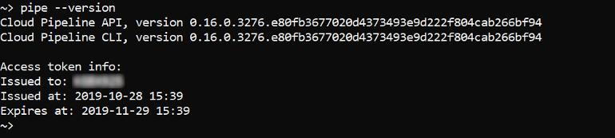  
    This time the command will output the Cloud Pipeline CLI version, API version, short info about received access token (the user-owner name, usage dates)

> **_Note_**: when `pipe` CLI is being configured JWT token is given for one month, if user didn't select another expiration date. The warning about the expiration date of the provided token is printed, if it is less than 7 days left:
>
> - after `pipe configure` command executing:  
>   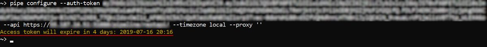
> - when any other command is running, e.g.:  
>   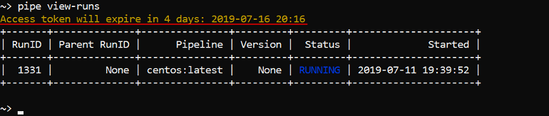

**_Note_**: If any exceptions occur during installation, follow the instructions in the Terminal.  
Notice that Python 2 / Python 3 has to be installed to run CLI. Python can be downloaded here <https://www.python.org/downloads/>.  
**_Note_**: **pip** package manager is required for CLI installation if you selected **Operation System** → **Other** on step 2. Modern **Python** versions come bundled with **pip**. On top of that, with this type of installation you'll also need internet connection to install dependencies.

### `configure` command options

| Options | Description |
|---|---|
| **Required options** |
|  `-a` / `--auth-token` | Token for API authentication |
| `-s` / `--api` | URL of a Cloud Pipeline API endpoint |
| `-tz` / `--timezone` [local\|utc] | Sets presentation timezone. Default: _local_ |
| **Non-required options** |
| `-l` / `--login` | Enables login without explicitly specifying a token |
| `-nb` / `--no-launch-browser` | Prevents the automatically opening a web browser. Works only in combination with `--login` option |
| `-cs` / `--config-store` | Defines mode for storing `pipe` CLI configuration (`home-dir` / `install-dir`) |
| `-p` / `--proxy` | URL of a proxy for all calls |
| `-nt` / `--proxy-ntlm` | Enables NTLM proxy support |
| `-nu` / `--proxy-ntlm-user` | Sets username for NTLM proxy authorization |
| `-np` / `--proxy-ntlm-pass` | Sets password for NTLM proxy authorization |
| `-nd` / `--proxy-ntlm-domain` | Sets domain for NTLM proxy authorization |

> **_Note_**: there is not necessary to set all options while input that command. If some options are not set directly - user shall be prompted for them in an interactive manner, if they will not be set in an interactive manner, default values will be used (where it is possible).

#### `pipe` configuration for using NTLM Authentication Proxy

CLI `pipe` can be configured for using NTLM Authentication Proxy, when running in Linux.

For that, use the `ntlm` options described [above](#configure-command-options) while execute `pipe configure` command.

If `pipe configure` command is being executed with specified `--proxy-ntlm` option, `pipe` will try to get the proxy value from the `--proxy` option or the environment variables (`--proxy` option has a higher priority).  
Example:

```bash
pipe configure --proxy-ntlm --proxy "http://myproxy:3128"
```

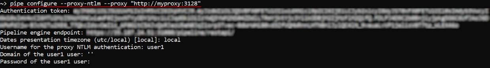

#### `pipe` configuration to login without explicitly specified tokens

It is possible to configure CLI `pipe` avoiding explicitly specifying the token.

For that, use the `--login` option described [above](#configure-command-options) while execute `pipe configure` command.

Once `pipe configure` command is being executed with specified `--login` option:

- user shall fill in all required parameters or specify them immediately in the `configure` command
- `pipe` CLI will generate authorization link
- user will be able to login with browser using that authorization link
- after successful login via the browser, user token will be automatically saved in the `pipe` config file, as usual

Example:

1. In the terminal, specify the configuration command to login without specifying the token:

        pipe configure --login

2. You will be asked to fill in required parameters:
    - URL of a Cloud Pipeline API endpoint (please note, API endpoint may be specified immediately with `configure` command via the `--api` option)
    - timezone - `local` or `utc` - by default `local` (please note, timezone may be specified immediately with `configure` command via the `--timezone` option)
    - proxy address, empty by default (please note, proxy may be specified immediately with `configure` command via the `--proxy` option)  
    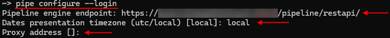
3. The authorization link to login page will appear:  
    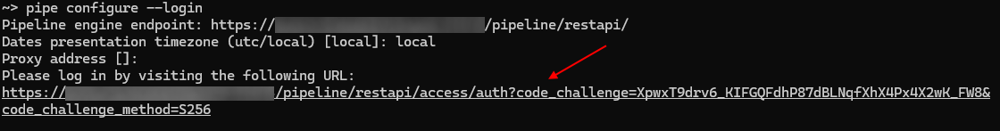
4. If browser is available, login page will be opened automatically, else manually follow with a provided link in your browser, e.g.:  
    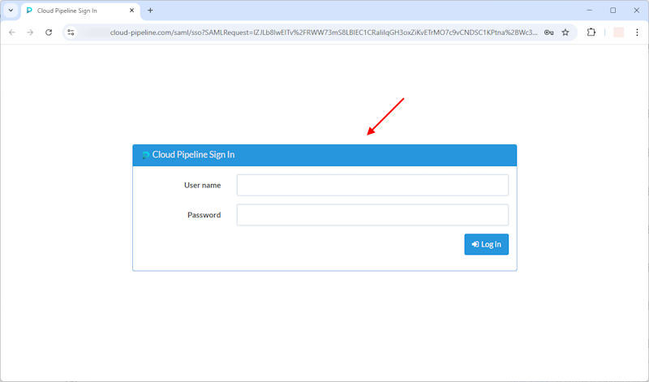
5. Log in by your credentials. The corresponding message will appear:  
    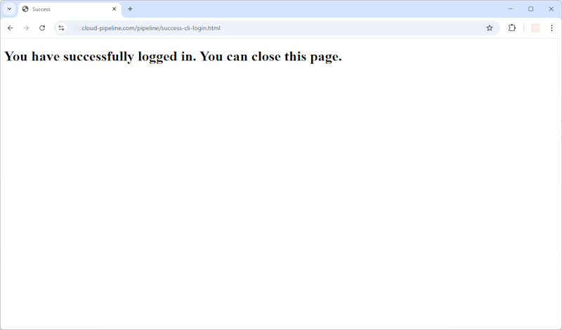
6. Return to your terminal and check that `pipe configure` command is executed and config is stored:  
    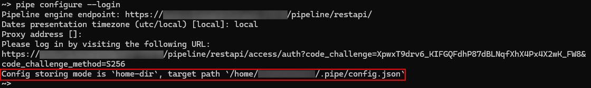
7. `pipe` CLI is ready to use. To check it, run the command `pipe --version`:  
    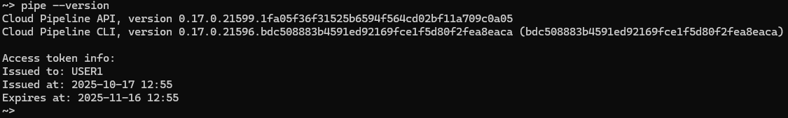

## Allow to run `pipe` commands on behalf of the other user

> **_Note_**: the functionality is able only for users with the **ROLE\_ADMIN** role.

It could be convenient/useful for administrators to perform some operations on behalf of the other user (e.g. check permissions/act as a service account/etc.).  
For that in `pipe` CLI, there are two abilities:

- separate `pipe token` command
- common option **`-u`** (**`--user`**) for all `pipe` commands

### Using `pipe token` command

This command prints the `JWT` token for a specified user.  
`JWT` token could be used manually as authentication API token with the `pipe configure` command (as described [above](#configure-command-options)) - to configure `pipe` CLI on behalf of the desired user.

The format of the command:

``` bash
pipe token <USER_ID> [OPTIONS]
```

`<USER_ID>` is the name of the user account.

| Options | Description |
|-|-|
| **Non-required options** | |
| **`-d`** / **`--duration`** | The number of days the token will be valid. If it's not set - the default value will be used, same as in the GUI |

For example, to get a `JWT` token for the user **USER3** for 5 days:  
    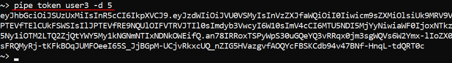

### Using '--user' option

To run separate `pipe` commands on behalf of the other user - the common option, that was added to all pipe commands, can be used: **`--user|-u <USER_ID>`** (where `<USER_ID>` is the name of the user account).

**_Note_**: the option isn't available for the commands `configure`, `--version`, `--help`.

If this option is specified - operation (command execution) will be performed using the corresponding user account.

Some examples:

- view active runs on behalf of the user without **ROLE\_ADMIN** role:  
    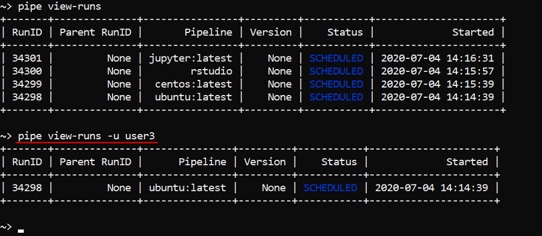
- list storage content on behalf of the user without **ROLE\_ADMIN** role that hasn't read permission on that storage:  
    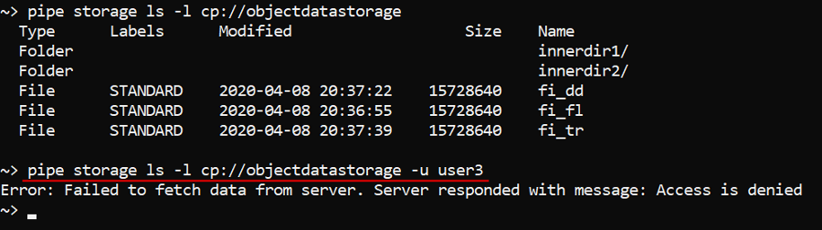
- list storage content and the attempt to upload the file on behalf of the user without **ROLE\_ADMIN** role that has read permission and hasn't write permission on that storage:  
    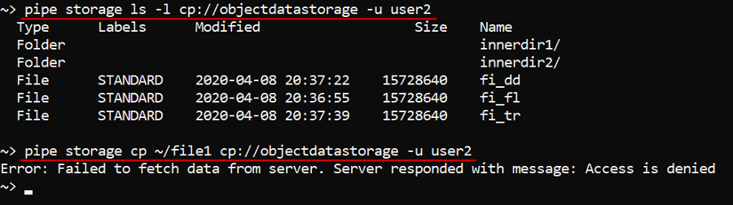

## Update the CLI

The command to update the Cloud Pipeline CLI version:

``` bash
pipe update [PATH]
```

**PATH** - defines the API URL path to download Cloud Pipeline CLI source (optional argument).

This command compare the CLI and API versions. If the CLI version is less than the API one, it will update the CLI - the latest Cloud Pipeline CLI version will be installed. Otherwise no actions will be performed.  
Example:  
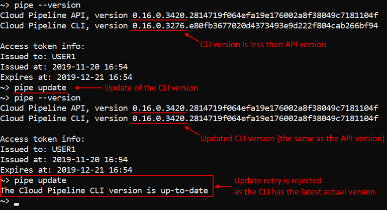
