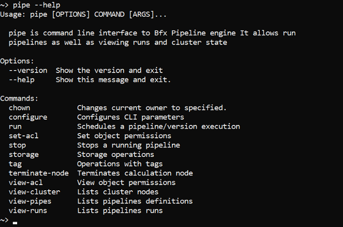

# 14.1. Install and setup CLI

- [How to install and setup `pipe` CLI](#how-to-install-and-setup-pipe-cli)
- [`configure` command options](#configure-command-options)
- [`pipe` configuration for using NTLM Authentication Proxy](#pipe-configuration-for-using-ntlm-authentication-proxy)

## How to install and setup `pipe` CLI

1. Go to **Settings** → **CLI** tab.
2. Select **Pipe CLI** item at the left panel.
3. Select your Operation System from the list.
4. Follow the installation instructions for your OS (e.g. Linux). Commands below shall be executed in the Terminal.  
    When installation is finished, type **`pipe`** in the Terminal to test pipe installation. This command shall produce short description of pipe CLI and pipe CLI commands.
5. Press the **Generate access key** button.
6. Copy **CLI configure command**  
    
7. Paste copied command into the Terminal and run it:  
    
8. Now Cloud Pipeline **CLI** is ready to use. To check it, run any command, e.g. `pipe --help`:  
    

> **_Note_**: when `pipe` CLI is being configured JWT token is given for one month, if user didn't select another expiration date. The warning about the expiration date of the provided token is printed, if it is less than 7 days left:
>
> - after `pipe configure` command executing:  
>   
> - when any other command is running, e.g.:  
>   

**_Note_**: If any exceptions occur during installation, follow the instructions in the Terminal.  
Notice that Python 2 / Python 3 has to be installed to run CLI. Python can be downloaded here <https://www.python.org/downloads/>.  
**_Note_**: **pip** package manager is required for CLI installation if you selected **Operation System** → **Other** on step 2. Modern **Python** versions come bundled with **pip**. On top of that, with this type of installation you'll also need internet connection to install dependencies.

## `configure` command options

| Options | Description |
|---|---|
| **Required options** |
|  `-a` / `--auth-token` | Token for API authentication |
| `-s` / `--api` | URL of a Pipeline API endpoint |
| `-tz` / `--timezone` [local\|utc] | Sets presentation timezone. Default: _local_ |
| **Non-required options** |
| `-p` / `--proxy` | URL of a proxy for all calls |
| `-nt` / `--proxy-ntlm` | Enables NTLM proxy support |
| `-nu` / `--proxy-ntlm-user` | Sets username for NTLM proxy authorization |
| `-np` / `--proxy-ntlm-pass` | Sets password for NTLM proxy authorization |
| `-nd` / `--proxy-ntlm-domain` | Sets domain for NTLM proxy authorization |

> **_Note_**: there is not necessary to set all options while input that command. If some options are not set directly - user shall be prompted for them in an interactive manner, if they will not be set in an interactive manner, default values will be used (where it is possible).

## `pipe` configuration for using NTLM Authentication Proxy

CLI `pipe` can be configured for using NTLM Authentication Proxy, when running in Linux.

For that, use the `ntlm` options described [above](#configure-command-options) while execute `pipe configure` command.

If `pipe configure` command is executing with specified `--proxy-ntlm` option, `pipe` will try to get the proxy value from the `--proxy` option or the environment variables (`--proxy` option has a higher priority).  
Example:

```bash
pipe configure --proxy-ntlm --proxy "http://myproxy:3128"
```


