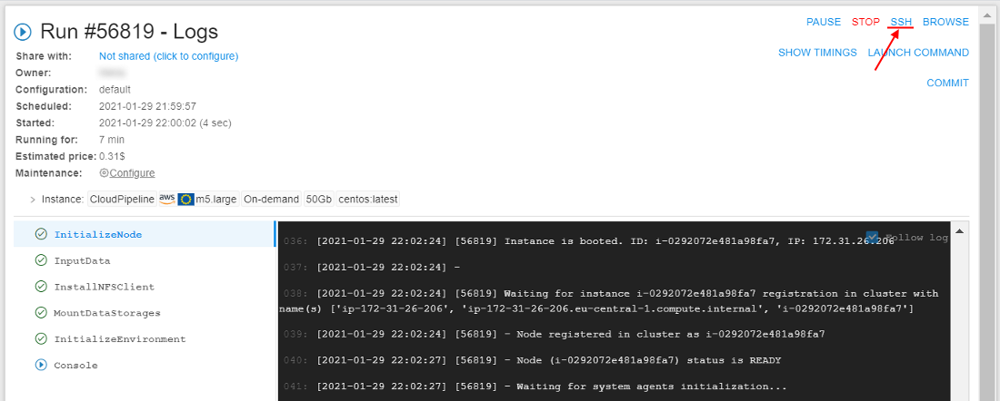

# 14.10. Create SSH tunnel to the running compute instance

## Overview

**Cloud Pipeline** run instances can be accessed via SSH directly from on-premises local workstations using special **network tunnels** (see picture below). Such tunnels can be established between a local **Windows** or **Linux** workstation and a **Cloud Pipeline** run. `pipe` CLI provides a set of command to manage such network tunnels. Notice that `pipe` CLI automatically manages SSH keys and configures **passwordless SSH access**. As a result no manual SSH keys management is required to access **Cloud Pipeline** run from the local workstation.

SSH tunnels to **Cloud Pipeline** runs can be used for interactive SSH sessions, files transferring and third-party applications which depends on SSH protocol.


The command that runs ports tunnelling operations:

``` bash
pipe tunnel COMMAND [ARGS]
```

Where **COMMAND** - one of the following commands:

- **`start <RUN_ID>`** - establishes tunnel connection to specified run instance port and serves it as a local port
- **`stop <RUN_ID`** - stops background tunnel processes with specified run

`start` command possible options:

| Option | Description |
|---|---|
| **Required options** |
| `-lp` / `--local-port` INTEGER | Local port to establish connection from |
| `-rp` / `--remote-port` INTEGER | Remote port to establish connection to |
| **Non-required options** |
| `-ct` / `--connection-timeout` FLOAT | Socket connection timeout in seconds |
| `-s` / `--ssh` | Configures passwordless ssh to specified run instance |
| `-sp` / `--ssh-path` TEXT | Path to ".ssh" directory for passwordless ssh configuration on Linux |
| `-sh` / `--ssh-host` TEXT | Host name for passwordless ssh configuration |
| `-sk` / `--ssh-keep` | Keeps passwordless ssh configuration after tunnel stopping |
| `-l` / `--log-file` TEXT | Logs file for tunnel in background mode |
| `-v` / `--log-level` TEXT | Logs level for tunnel: CRITICAL, ERROR, WARNING, INFO or DEBUG |
| `-t` / `--timeout` INTEGER | Time period in `ms` for background tunnel process health check |
| `-f` / `--foreground` | Establishes tunnel in foreground mode |
| `-r` / `--retries` INTEGER | Number of retries to connect to specified pipeline run. Default is 10 |
| `--trace` | Enables error stack traces displaying

`stop` command possible options:

| Option | Description |
|---|---|
| **Non-required options** |
| `-lp` / `--local-port` INTEGER | Local port to stop tunnel for |
| `-t` / `--timeout` INTEGER | Tunnels stopping timeout in `ms` |
| `-f` / `--force` | Killing tunnels rather than stopping them |
| `-v` / `--log-level` TEXT | Explicit logging level: CRITICAL, ERROR, WARNING, INFO or DEBUG |
| `--trace` | Enables error stack traces displaying |

## Usage example

Firstly, launch a tool in **Cloud Pipeline**. In our example we will use `library/centos` tool launched with default settings. How to launch a tool see [here](../10_Manage_Tools/10.5._Launch_a_Tool.md).  
The launched run will be used in the following sections to establish SSH tunnels to.

When the tool is launched, open its **Run logs** page. Wait for the **SSH** hyperlink to appear. Once the **SSH** hyperlink appears then run is initialized and **SSH tunnels** can be established:  
    

Follow to the corresponding section below to configure local workstation to be able to connect to **Cloud Pipeline** run via SSH.

### Connect from Windows workstation

The tutorial describes how to connect to **Cloud Pipeline** run via SSH from **Windows** workstation.

> **_Note_**: The tutorial requires **PuTTY** application being installed locally. Additionally **plink.exe** and **pscp.exe** CLI clients are used in the tutorial. Download both **PuTTY**, **plink.exe** and **pscp.exe** from the official site using this link: [https://www.chiark.greenend.org.uk/~sgtatham/putty/latest.html](https://www.chiark.greenend.org.uk/~sgtatham/putty/latest.html).

1. Open **PowerShell** console: press _Win_+_R_, type `powershell` and press _Enter_
2. Install `pipe` CLI if it is not installed yet (see details [here](14.1._Install_and_setup_CLI.md#how-to-install-and-setup-pipe-cli))
3. Establish SSH tunnel using the command below. In the command below `56819` is the _Run ID_ of the tool run launched before this example execution, `4567` is just a random free _local port_ and `22` is the **Cloud Pipeline** run _SSH port_. Additional `--ssh` flag enables passwordless SSH access:  
    `pipe tunnel start 56819 -lp 4567 -rp 22 --ssh`  
    
4. Once the tunnel is established either **PuTTY** application or its CLI client can be used to interact with **Cloud Pipeline** run via SSH. Usually a name of an automatically created **PuTTY** session is **`pipeline-<RUN_ID>`**. Notice that no actions later on require a password. This happens because `pipe` CLI automatically manages SSH keys while configuring a network tunnel.
5. Open **PuTTY** application and double click the corresponding session to open an interactive SSH session. There may be a delay between a tunnel establishing and a session creation. In case a corresponding session is missing please try reopen **PuTTY** application a little bit later:  
    
6. After double clicking the corresponding item in **PuTTY** an interactive SSH session appears:  
    
7. Return to **PowerShell** console and use the commands below to interact with **Cloud Pipeline** run via SSH using **PuTTY** CLI clients. Notice that commands below expects **plink.exe** and **pscp.exe** executables to be in the current folder. **_Note_**: use an actual Run ID rather then the example one (`56819`)  

``` powershell
# Open an interactive SSH session
.\plink.exe pipeline-56819

# Execute a single command via SSH
.\plink.exe pipeline-56819 -batch echo '$HOSTNAME'

# Upload a local file to Cloud Pipeline run via SSH
New-Item file-pscp.txt
Set-Content file-pscp.txt 'Content'
.\pscp.exe file-pscp.txt pipeline-56819:/common/workdir/file-pscp.txt

# Download a file from Cloud Pipeline run to a local directory via SSH
.\pscp.exe pipeline-56819:/common/workdir/file-pscp.txt file-pscp-copy.txt
Get-Content file-pscp-copy.txt
```


After, stop the SSH tunnel and the **Cloud Pipeline** run using the commands below. **_Note_**: use an actual Run ID rather then the example one (`56819`)

``` bash
pipe tunnel stop 56819
pipe stop 56819
```

### Connect from Linux workstation

The tutorial describes how to connect to **Cloud Pipeline** run via SSH from **Linux** workstation. The tutorial requires _openssh_ library being installed locally. It can be installed using platform's package manager.

1. Install `pipe` CLI if it is not installed yet (see details [here](14.1._Install_and_setup_CLI.md#how-to-install-and-setup-pipe-cli))
2. Establish SSH tunnel using the command below. In the command below `75376` is the _Run ID_ of the tool run launched before this example execution, `4567` is just a random free _local port_ and `22` is the **Cloud Pipeline** run _SSH port_. Additional `--ssh` flag enables passwordless SSH access:  
    `pipe tunnel start 75376 -lp 4567 -rp 22 --ssh`  
    
3. Once the tunnel is established either _ssh_ or _scp_ CLI clients can be used to interact with **Cloud Pipeline** run via SSH. Usually a name of an automatically created SSH host is **`pipeline-<RUN_ID>`**. Notice that no actions later on require a password. This happens because `pipe` CLI automatically manages SSH keys while configuring a network tunnel.
4. Use the commands below to interact with **Cloud Pipeline** run via SSH using _openssh_ default clients. **_Note_**: use an actual Run ID rather then the example one (`75376`)  

``` bash
# Open an interactive SSH session
ssh pipeline-75376

# Execute a single command via SSH
ssh pipeline-75376 echo \$HOSTNAME

# Upload a local file to Magellan run via SSH
echo "Content" > file-scp.txt
scp file-scp.txt pipeline-75376:/common/workdir/file-scp.txt
 
# Download a file from Magellan run to a local directory via SSH
scp pipeline-75376:/common/workdir/file-scp.txt file-scp-copy.txt
cat file-scp-copy.txt
```


After, stop the SSH tunnel and the **Cloud Pipeline** run using the commands below. **_Note_**: use an actual Run ID rather then the example one (`75376`)

``` bash
pipe tunnel stop 75376
pipe stop 75376
```
