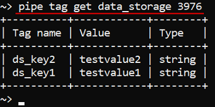
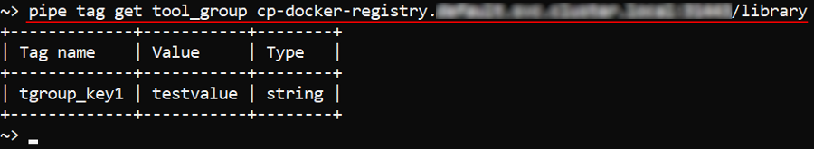
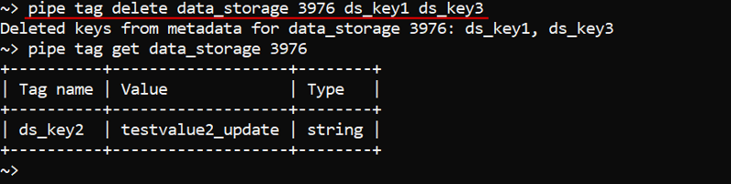

# 14.2. View and manage Attributes via CLI

- [View attributes](#view-attributes)
- [Manage attributes](#manage-attributes)
    - [Add and Edit attributes](#add-and-edit-attributes)
    - [Delete attributes](#delete-attributes)

> Cloud Pipeline CLI has to be installed. See [14.1. Install and setup CLI](14.1._Install_and_setup_CLI.md).

## View attributes

> To view attributes of the object you need **READ** permission for the object. See [13. Permissions](../13_Permissions/13._Permissions.md).

Command to list all tags for a specific object:

``` bash
pipe tag get <Object class> <Object id/name>
```

Two parameters shall be specified:

- **Object class** - defines a name of the object class. Possible values: `data_storage`, `docker_registry`, `folder`, `metadata_entity`, `pipeline`, `tool`, `tool_group`, `configuration`.
- **Object id** or **name** - defines an ID or name of an object of a specified class.  
    **_Note_**: full path to the object has to be specified. Paths to Docker registry and Tool objects should include registry IP address.

The example below lists attributes of the data storage with ID **_3976_**:

``` bash
pipe tag get data_storage 3976
```



To list attributes of the tool group **_library_**:  


## Manage attributes

> A user has to be an administrator (**ROLE\_ADMIN**) or an owner (**OWNER**) of the object to edit attributes. See [13. Permissions](../13_Permissions/13._Permissions.md).

A user can add new attributes, edit or delete existing attributes via CLI.

### Add and Edit attributes

To add new and edit existing attributes the following command is used:

``` bash
pipe tag set <Object class> <Object id/name> <List of KEY=VALUE>
```

Three parameters shall be specified:

1. **Object class** - defines a name of the object class. Possible values: `data_storage`, `docker_registry`, `folder`, `metadata_entity`, `pipeline`, `tool`, `tool_group`, `configuration`.
2. **Object id/name** -  defines an ID or name of an object of a specified class.  
    **_Note_**: full path to the object has to be specified. Paths to Docker registry and Tool objects should include registry IP address.
3. **List of KEY=VALUE** - list of tags to set. Can be specified as a single `KEY=VALUE` pair or a list of them.

**_Note_**: if a specific tag key already exists for an object, it **will be overwritten**.

The example below sets attributes **`ds_key2 = testvalue2_update`** and **`ds_key3 = testvalue3`** for the data storage with ID **_3976_**:

``` bash
pipe tag set data_storage 3976 ds_key2=testvalue2_update ds_key3=testvalue3
```


### Delete attributes

To delete attributes the following command is used:

``` bash
pipe tag delete <Object class> <Object id/name> <List of KEYs>
```

Three parameters shall be specified:

1. **Object class** - defines a name of the object class. Possible values: `data_storage`, `docker_registry`, `folder`, `metadata_entity`, `pipeline`, `tool`, `tool_group`, `configuration`.
2. **Object id/name** - defines an ID or name of an object of a specified class.  
    **_Note_**: full path to the object has to be specified. Paths to Docker registry and Tool objects should include registry IP address.
3. **List of KEYs** - list of attribute keys to delete.

The example below deletes attributes **ds_key1**, **ds_key3** from the the data storage with ID **_3976_**:

``` bash
pipe tag delete data_storage 3976 ds_key1 ds_key3
```


