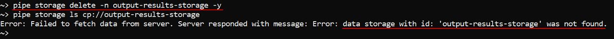
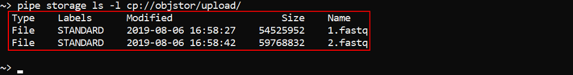

# 14.3. Manage Storage via CLI

- [Create a datastorage](#create-a-datastorage)
- [List storages/storage content](#list-storagesstorage-content)
- [Show storage usage](#show-storage-usage)
- [Edit a datastorage](#edit-a-datastorage)
    - [Change backup duration, STS/LTS duration, versioning](#change-backup-duration-stslts-duration-versioning)
    - [Change a parent folder for a datastorage](#change-a-parent-folder-for-a-datastorage)
- [Delete a datastorage](#delete-a-datastorage)
- [Create a folder in a storage](#create-a-folder-in-a-storage)
- [Upload and download data](#upload-and-download-data)
- [Control File versions](#control-file-versions)
    - [Show files versions](#show-files-versions)
    - [Restore files](#restore-files)
    - [Delete an object from a datastorage](#delete-an-object-from-a-datastorage)
- [Manage datastorage objects attributes](#manage-datastorage-objects-attributes)
    - [Get object attributes](#get-object-attributes)
    - [Set object attributes](#set-object-attributes)
    - [Delete object attributes](#delete-object-attributes)
- [Mounting of storages](#mounting-of-storages)
    - [Mount a storage](#mount-a-storage)
    - [Unmount a storage](#unmount-a-storage)

> Cloud Pipeline CLI has to be installed. See [14.1. Install and setup CLI](14.1._Install_and_setup_CLI.md).

To perform different operations with object storages the command set `pipe storage` is used.

## Create a datastorage

The command to create an object storage:

``` bash
pipe storage create [OPTIONS]
```

| Options | Description |
|---|---|
| **Required options** |
| `-n` / `--name` | Alias of the new object storage |
| `-p` / `--path` | Datastorage path |
| **Non-required options** |
| `-d` / `--description` | Description of the object storage |
| `-sts` / `--short_term_storage` | Number of days for storing data in the short term storage. _**Note**_: _This option is available not for all Cloud Providers_ |
| `-lts` / `--long_term_storage` | Number of days for storing data in the long term storage. _**Note**_: _This option is available not for all Cloud Providers_ |
| `-v` / `--versioning` | Enable versioning for this object storage. _**Note**_: _This option is available not for all Cloud Providers_ |
| `-b` / `--backup_duration` | Number of days for storing backups of the storage. _**Note**_: _This option is available not for all Cloud Providers_ |
| `-t` / `--type` | Type of the Cloud for the object storage. Depends on the Cloud Provider. Possible values - `S3` (for AWS), `AZ` (for MS Azure), `GS` (for GCP) and `NFS` (for FS mounts) |
| `-f` / `--parent_folder` | Name/ID of the folder which will contain the object storage. Default value - library root folder |
| `-c` / `--on_cloud` | To create datastorage on the Cloud. This flag shall be specified, only if a new datastorage is being created. If user want to add an existing storage this flag should not be specified |
| `-r` / `--region_id` | Cloud region ID where storage shall be created |

> **_Note_**: there is not necessary to set all options while input that command. If some options are not set - user shall be prompted for them in an interactive manner, if they will not be set in an interactive manner, default values will be used.

In the example below the object storage **output_results** for the new datastorage **output_results_storage** will be created in the folder with ID **_297_** with the following options: STS duration - 20 days, LTS duration - 45 days, backup duration - 30 days.

``` bash
pipe storage create -n output-results -p output-results-storage -c -sts 20 -lts 45 -b 30 -f 297
```


`-c` flag was specify to create a storage in the Cloud.  
As you can see - **Description**, **Type of the Cloud** and **Cloud Region ID** fields were left empty. So, values for these options will be set as default.

## List storages/storage content

The command to view the full storage list of the current platform deployment:

``` bash
pipe storage ls [OPTIONS]
```

| Options | Description |
|---|---|
| **Non-required options** |
| `-l` / `--show_details` | Show details |

Perform the following command to view full storage list and to check that the object storage from the example above was created:

``` bash
pipe storage ls -l
```


The command to view the content of the datastorage:

``` bash
pipe storage ls [OPTIONS] <Path>
```

**Path** - defines a full path to the datastorage. **Path** value must begin from the Cloud prefix (`S3` (for AWS), `AZ` (for MS Azure), `GS` (for GCP) or common `CP`(instead of described ones, regardless of Provider)).

| Options | Description |
|---|---|
| **Non-required options** |
| `-l` / `--show_details` | Show details |
| `-v` / `--show_versions` | Show object versions. Only for storages with enabled versioning |
| `-r` / `--recursive` | Recursive listing |
| `-p` / `--page` | Maximum number of records to show |
| `-a` / `--all` | Show all results at once ignoring page settings |

Example of the detailed datastorage content view:

``` bash
pipe storage ls --show_details s3://objstor
```

Or you can use the common `CP` prefix instead of `S3`:

``` bash
pipe storage ls --show_details cp://objstor
```

Result will be the same:  


## Show storage usage

To obtain a "disk usage" information on the supported data storage or its inner folder(s) use the command:

``` bash
pipe storage du [OPTIONS] [STORAGE]
```

The command prints for the data storages/path:

- summary number of files in the storage/path
- summary size of files in the storage/path

| Options | Description |
|---|---|
| **Non-required options** |
| `-p` / `--relative-path` | The relative path inside the storage |
| `-f` / `--format` | The size unit format (default: `Mb`). Possible values: `K`, `Kb`, `KB` - for kilobytes; `M`, `Mb`, `MB` - for megabytes; `G`, `Gb`, `GB` - for gigabytes |
| `-d` / `--depth` | The maximum depth level of the nesting folders. **_Note_**_: this option isn't supported for the FS storages yet_ |

**STORAGE** - defines the datastorage name/path.

Without specifying any options and storage this command prints the full list of the available storages (both types - object and FS) with the "usage" information for each of them:  

``` bash
pipe storage du
```

With specifying the storage name this command prints the "usage" information only by that storage, e.g.:

``` bash
pipe storage du objectdatastorage
```


With `-p` (`--relative-path`) option the command prints the "usage" information for the specified path in the required storage, e.g.:  

``` bash
pipe storage du objectdatastorage -p innerdir1
```


With `-d` (`--depth`) option the command prints the "usage" information in the required storage (and path) for the specified folders nesting depth, e.g.:  

``` bash
pipe storage du objectdatastorage -p innerdir2 -d 1
```

Specified command will print the "usage" information for all folders with the nesting depth no more 1 relative to the path `objectdatastorage/innerdir2/`:  
    

With `-f` (`--format`) option user can change the unit for the size value, e.g. to print the storage usage in gigabytes:  

``` bash
pipe storage du objectdatastorage -f GB
```


## Edit a datastorage

### Change backup duration, STS/LTS duration, versioning

The Command to change backup duration, select STS/LTS duration or enable versioning:

``` bash
pipe storage policy [OPTIONS]
```

| Options | Description |
|---|---|
| **Required options** |
| `-n` / `--name` | Alias/path of the storage to update the policy. Specified without Cloud prefix |
| **Non-required options** |
| `-sts` / `--short_term_storage` | Number of days for storing data in the short term storage. _**Note**_: _This option is available not for all Cloud Providers_ |
| `-lts` / `--long_term_storage` | Number of days for storing data in the long term storage. _**Note**_: _This option is available not for all Cloud Providers_ |
| `-v` / `--versioning` | Enable versioning for this object storage. _**Note**_: _This option is available not for all Cloud Providers_ |
| `-b` / `--backup_duration` | Number of days for storing backups of the storage. _**Note**_: _This option is available not for all Cloud Providers_ |

In the example below backup duration is set to 25 days, STS and LTS durations are set to 50 days and 100 days respectively for the datastorage **objstor**. Also, we enable versioning for that datastorage:

``` bash
pipe storage policy -n objstor -b 25 -sts 50 -lts 100 -v
```


> **_Note_**: there is not necessary to set all options while input that command. If some options are not set - user shall be prompted for them in an interactive manner, if they will not be set in an interactive manner, default values will be used.

You can check via the GUI that parameters were changed:  


### Change a parent folder for a datastorage

The command to move a datastorage to a new parent folder:

``` bash
pipe storage mvtodir <Storage> <Directory>
```

**Directory** - name of the folder to which the object storage will be moved.  
**Storage** - alias/path of the storage to move. Specified without Cloud prefix.

In the example below we will move the storage **objstor** to the folder "**InnerFolder**":

``` bash
pipe storage mvtodir objstor InnerFolder
```


## Delete a datastorage

The command to delete an object storage:

``` bash
pipe storage delete [OPTIONS]
```

| Options | Description |
|---|---|
| **Required options** |
| `-n` / `--name` | Alias/path of the storage to delete. Specified without Cloud prefix |
| **Non-required options** |
| `-c` / `--on_cloud` | To delete datastorage from a Cloud. If this option isn't set, datastorage will just become unregistered |
| `-y` / `--yes` | Do not ask confirmation |

In the example below we will delete the **output-results-storage** without asking confirmation:

``` bash
pipe storage delete -n output-results-storage -y
```



As the command above was performed withoud `--on_cloud` option, **output-results-storage** wasn't deleted from a Cloud actually and it might be added again to the Cloud Pipeline platform via described [`storage create`](#create-a-datastorage) command:  


## Create a folder in a storage

The command to create a folder in a storage:

``` bash
pipe storage mkdir <List of FOLDERs>
```

**List of FOLDERs** - defines a list of the folders paths. Each path in the list shall be a full path to a new folder in the specific datastorage. Path value must begin from the Cloud prefix (`S3` (for AWS), `AZ` (for MS Azure), `GS` (for GCP) or common `CP`(instead of described ones, regardless of Provider)).

In the example below we will create folders "**new-folder1**", "**new-folder2**" in the storage **output-results-storage** and then will check that they're exist via described [`storage ls`](#list-storagesstorage-content) command:

``` bash
pipe storage mkdir cp://output-results-storage/new-folder1 cp://output-results-storage/new-folder2
```


## Upload and download data

There are two commands to upload/download data:

``` bash
pipe storage cp [OPTIONS] <Source> <Destination>
pipe storage mv [OPTIONS] <Source> <Destination>
```

By `cp` command you can copy files from one datastorage to another one or between local filesystem and a datastorage (in both directions).  
By `mv` command you can move files from one datastorage to another one or between local filesystem and a datastorage (in both directions).

**Source** - defines a path (in the local filesystem or datastorage) to the object to be copied/moved.
**Destination** - defines a path (in the local filesystem or datastorage) to the object where source object will be copied/moved.

| Options | Description |
|---|---|
| **Non-required options** |
| `-r` / `--recursive` | Recursive source scan. This option is not needed when you copy/move a single file |
| `-f` / `--force` | Rewrite files in destination |
| `-e` / `--exclude` | Exclude all files matching this pattern from processing |
| `-i` / `--include` | Include only files matching this pattern into processing |
| `-q` / `--quiet` | Quiet mode |
| `-s` / `--skip-existing` | Skip files existing in destination, if they have size matching source
| `-t` / `--tags` | Set object attributes during processing. attributes can be specified as single `KEY=VALUE` pair or a list of them. If this option specified all existent attributes will be overwritten |
| `-l` / `--file-list` | Path to the file with file paths that should be copied/moved. This file should be tab delimited and consist of two columns: relative path to file and size |
| `-sl` / `--symlinks` [follow\|filter\|skip] | Describe symlinks processing strategy for local sources. Possible values: **_follow_** - follow symlinks (default); **_skip_** - do not follow symlinks; **_filter_** - follow symlinks but check for cyclic links |

In the example below we will upload files from the local filesystem to the storage **objstor** into the folder "**upload**":

``` bash
pipe storage cp ~/data cp://objstor/upload --recursive
```

Application will start uploading files and print progress. You can view it:  
  
After uploading is complete, check that they're uploaded - via described [`storage ls`](#list-storagesstorage-content) command:
  

In the example below we will upload the file "**2.fastq**" from the local filesystem in the quiet mode, rewrite it to the storage **objstor** into the folder "**upload**" and set two attributes on it:

``` bash
storage cp -f -q ~/data/2.fastq cp://objstor/upload/ -t testkey1=testvalue1 -t testkey2=testvalue2
```

After that, we will check attributes of the uploaded file - via [`storage get-object-tags`](#get-object-attributes) command:  


> **_Note_**: Files uploaded via CLI will have the following attributes and values automatically set:
>
> - **CP\_OWNER**. The value of the attribute will be set as a user ID.
> - **CP\_SOURCE**. The value of the attribute will be set as a local path used to upload.
>
> The example demonstrates automatic file tagging after data uploading:  
> 

The example below demonstrates how to download files from the datastorage folder to the local filesystem. Also we will not download files which names starts from **_`1.`_**:

``` bash
pipe storage cp -r -e 1.* cp://objstor/upload/ ~/data/input/
```


## Control File versions

> **_Note_**: This feature is available not for all Cloud Providers. Currently, it is supported by **AWS** and **GCP**.

### Show files versions

To view file versions for the storage with enabled versioning use the [`storage ls`](#list-storagesstorage-content) command with the both specified `-l` and `-v` options, e.g.:

``` bash
pipe storage ls -l -v cp://versioning-storage
```

  
As you can see - "**file1**" and "**file3**" each has 1 version. "**file2**" has 3 versions. "**file4**" has 2 verions.

To view versions of a specific file specify its full path, e.g.:

``` bash
pipe storage ls -l -v cp://versioning-storage/file4
```


### Restore files

The command to restore a previous version of a file:

``` bash
pipe storage restore [OPTIONS] <Path>
```

**Path** - defines a full path to the file/directory in a datastorage.

| Options | Description |
|---|---|
| **Non-required options** |
| `-v` / `--version` | To restore a specified version |
| `-r` / `--recursive` | To restore the whole directory hierarchy.<br />**_Note_**: this feature is yet supported for the `AWS` Cloud Provider only |
| `-i` / `--include` | Include only files matching this pattern into processing |
| `-e` / `--exclude` | Exclude all files matching this pattern from processing |

By this command you can restore file version in a datastorage. If version is not specified via `-v` option it will try to restore the latest non-deleted version. Otherwise a specified version will be restored.  
If the **Path** is a directory, the command gets the top-level deleted files from the **Path** directory and restore them to the latest version.  

The example below shows how to set one of the previous versions for the "**file2**" as the latest:

``` bash
pipe storage restore -v <Version> cp://versioning-storage/file2
```


**_Note_**: When a specified version of the "**file2**" is restored, a copy of that version is created to become the latest version of the file.

You can restore a deleted file without specifying a version. It works only for files with a _Delete marker_ as the latest version ("**file4**" in the example below). In such case the command will be, e.g.:

``` bash
pipe storage restore cp://versioning-storage/file4
```

  
**_Note_**: Before we restored the file "**file4**" its latest version was a _Delete marker_. After restoration this _marker_ disappeared.

The example below shows how to restore the latest version for only "\*.txt" files recursively in the deleted directory (the directory that was marked with a _Delete marker_ previously), e.g.:

``` bash
pipe storage restore --recursive --include *.txt s3://objstor/examples/
```

After restoring, check that the "\*.txt" file in the subfolder also restored:  


### Delete an object from a datastorage

The command to delete an object from a storage:

``` bash
pipe storage rm [OPTIONS] <Path>
```

**Path** - defines a full path to the object in a datastorage.

| Options | Description |
|---|---|
| **Non-required options** |
| `-y` / `--yes` | Do not ask confirmation |
| `-v` / `--version` | Delete a specified version of an object |
| `-d` / `--hard-delete` | Completely delete an object from a storage |
| `-r` / `--recursive` | Recursive deletion (required for deleting folders) |
| `-e` / `--exclude` | Exclude all files matching this pattern from processing |
| `-i` / `--include` | Include only files matching this pattern into processing |

The example below demonstrates how to delete a file from the storage **objstor**:

``` bash
pipe storage rm cp://objstor/simplefile
```

  

If this command is performed without options over the object from the storage with enabled versioning, that object will not be removed completely, it will remain in a datastorage and get a _Delete marker_. Such objects can be restored via [`storage restore`](#restore-files) command.  
In the example below we set a _Delete marker_ to the file "**file1**":

  
**_Note_**: the latest version of the file "**file1**" is marked with _Delete marker_ now.  

To completely delete an object from a datastorage use `-d` option. In the example below we will completely delete the file "**file2**" from the storage with enabled versioning without asking confirmation:

``` bash
pipe storage rm -y -d cp://versioning-storage/file2
```


To delete a specific version of an object use `-v`option. In the example below we will delete one of the versions of the file "**file4**" from the storage with enabled versioning without asking confirmation:

``` bash
pipe storage rm -y -v <Version> cp://versioning-storage/file4
```


In the example below we will completely delete files from the folder "**initial-data**" - for that we will use `--recursive` option. But we will delete only files whose names contain symbol **_`3`_** - for that we will use `--include` option:

``` bash
pipe storage rm --yes --hard-delete --include *3* --recursive cp://versioning-storage/initial-data/
```


## Manage datastorage objects attributes

This section is about attribute management of the inner datastorages files via CLI.  
To manage attributes of other Cloud Pipeline objects - see [14.2. View and manage Attributes via CLI](14.2._View_and_manage_Attributes_via_CLI.md).

### Get object attributes

The command to list attributes of a specific file in a datastorage:

``` bash
pipe storage get-object-tags [OPTIONS] <Path>
```

**Path** - defines a full path to a file in a datastorage. **Path** value must begin from the Cloud prefix (`S3` (for AWS), `AZ` (for MS Azure), `GS` (for GCP) or common `CP`(instead of described ones, regardless of Provider)).

| Options | Description |
|---|---|
| **Non-required options** |
| `-v` / `--version` | To get attributes for a specified file version. If option is not set, but datastorage versioning is enabled - processing will be performed for the _latest_ file version |

In the example below we will get attributes for the file "**file1**" from the datastorage **objstor**:

``` bash
pipe storage get-object-tags cp://objstor/file1
```


In the example below we will get attributes for the previous version of the file "**file1**" from the datastorage **objstor**:

``` bash
pipe storage get-object-tags -v <Version> cp://objstor/file1
```


### Set object attributes

The command to set attributes for a specific file in a datastorage:

``` bash
pipe storage set-object-tags [OPTIONS] <Path> <List of KEY=VALUE>
```

1. **Path** - defines a full path to a file in a datastorage. **Path** value must begin from the Cloud prefix (`S3` (for AWS), `AZ` (for MS Azure), `GS` (for GCP) or common `CP`(instead of described ones, regardless of Provider)).
2. **List of KEY=VALUE** - list of attributes to set. Can be specified as a single `KEY=VALUE` pair or a list of them.

| Options | Description |
|---|---|
| **Non-required options** |
| `-v` / `--version` | To set attributes for a specified file version. If option is not set, but datastorage versioning is enabled - processing will be performed for the _latest_ file version |

**_Note_**: if a specific attribute key already exists for a file, it **will be overwritten**.

In the example below we will set attributes for the file "**file2**" from the datastorage **objstor** and then check that attributes are set by the [`storage get-object-tags`](#get-object-attributes) command:

``` bash
pipe storage set-object-tags cp://objstor/file2 example_key1=example_value1 example_key2=example_value2
```


### Delete object attributes

The command to delete attributes for a specific file in a datastorage:

``` bash
pipe storage delete-object-tags [OPTIONS] <Path> <List of KEYs>
```

1. **Path** - defines a full path to a file in a datastorage. **Path** value must begin from the Cloud prefix (`S3` (for AWS), `AZ` (for MS Azure), `GS` (for GCP) or common `CP`(instead of described ones, regardless of Provider)).
2. **List of KEYs** - list of attribute keys to delete.

| Options | Description |
|---|---|
| **Non-required options** |
| `-v` / `--version` | To delete attributes for a specified file version. If option is not set, but datastorage versioning is enabled - processing will be performed for the _latest_ file version |

In the example below we will delete attribute **tagkey1** for the previous version of the file "**file1**" from the datastorage **objstor**:

``` bash
pipe storage delete-object-tags -v <Version> cp://objstor/file1 tagkey1
```


## Mounting of storages

`pipe` cli supports mounting data storages (both - File Storages and Object Storages) to Linux and Mac workstations (requires **`FUSE`** installed).

> **_Note_**: This feature is available not for all Cloud Providers. Currently, it is supported only by **AWS**

For the mounted storages, regular listing/read/write commands are supported (e.g. `cp`, `mv`, `ls`, `mkdir`, `rm`, `fallocate`, `truncate`, `dd`, etc. - according to the corresponding OS), users can manage files/folders as with any general hard drive.

### Mount a storage

The command to mount a data storage into the mountpoint:

``` bash
pipe storage mount [OPTIONS] <Mountpoint>
```

**Mountpoint** - defines a full path to a directory on the workstation where the data storage shall be mounted.

| Options | Description |
|---|---|
| **Required options** |
| `-f` / `--file` | File System mode. In this mode, all available File Storages will be mounted into the mountpoint. This option is mutually exclusive with `-b` option |
| `-b` / `--bucket` | Object Storage mode. In this mode, the specified Object Storage will be mounted into the mountpoint. This option is mutually exclusive with `-f` option |
| **Non-required options** |
| `-m` / `--mode` | Allows to set a mask that defines access permissions (to the `owner`/`group`/`others`). This mask is set in the numerical view (three-digit octal number) |
| `-o` / `--options` | Allows to specify any mount options supported by underlying **`FUSE`** implementation |
| `-l` / `--log-file` | If set, standard/error output of mount operations will be written into the specified file |
| `-q` / `--quiet` | Quiet mode |
| `-t` / `--threads` | Enable multithreading - allows several processes simultaneously interact with the mount point |

In the example below we will mount the Object Storage named **objstor** into the directory "**mountdir**" and specify the file "**mount.log**" as log-file for mount operations:

``` bash
pipe storage mount -l ~/mount.log -b objstor ~/mountdir
```


In the example below we will mount the Object Storage named **objectdatastorage** into the directory "**mountdir**" and set full access permissons (read, write, execute) to the owner, read and execute permissions to the group and no permissions to others:

``` bash
pipe storage mount -b objectdatastorage -m 750 ~/mountdir
```


> **_Note_**: if `-m` option isn't specified, during mounting the default permissions mask will be set - `700` (full access to the owner and no permissions to the group and others)

### Unmount a storage

The command to unmount a mountpoint:

``` bash
pipe storage umount [OPTIONS] <Mountpoint>
```

**Mountpoint** - defines a full path to a directory on the workstation where the data storage was mounted.

| Options | Description |
|---|---|
| **Non-required options** |
| `-q` / `--quiet` | Quiet mode |

In the example below we will unmount a storage from the directory "**mountdir**":

``` bash
pipe storage umount ~/mountdir
```


