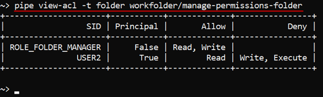

# 14.4. View and manage Permissions via CLI

- [View permissions](#view-permissions)
- [Manage permissions](#manage-permissions)
    - [Example: set permissions for Folder](#example-set-permissions-for-folder)

> Cloud Pipeline CLI has to be installed. See [14. Command-line interface (CLI)](14._Command-line_interface.md).

## View permissions

> To view permissions for the object you need **READ** permission for the object. See [13. Permissions](../13_Permissions/13._Permissions.md).

Command to list all permissions for a specific object:

``` bash
pipe view-acl -t <Object type> <Object id/name>
```

Two parameters are required:

- **Object type** - defines: Pipeline, Folder, Data Storage
- **Object id** or **name** - define a name of an object of a specified class.  
    **_Note_**: full path to the object has to be specified.

In the example below we check permissions for a folder "**ROOT/manage-permissions-folder**":

``` bash
pipe view-acl -t folder "ROOT/manage-permissions-folder"
```



## Manage permissions

> To manage permissions for the object you need to be an **OWNER** of that object or you need to have the **ADMIN** role. See [13. Permissions](../13_Permissions/13._Permissions.md).

Command to set permissions for the object:

``` bash
pipe set-acl -t <Object type> -s <User/Group name> -a/-d/-i <w>/<x>/<r> <Object id/name>
```

The following parameters are required:

- **Object type** - defines Pipeline, Folder, Data Storage, Docker registry, Tool.
- **User** or **Group name** - the name of the user or the group of users to manage their permissions.
- **Allow(`-a`)**/**Deny(`-d`)**/**Inherit(`-i`)** **WRITE(`w`)**, **READ(`r`)** and **EXECUTE(`x`)** permissions in any combinations. See examples below.
- **Object id** or **name** - define a name of an object of a specified class to set permissions for.  
    **_Note_**: full path to the object has to be specified if the name is not unique (the case for **Data Storage**, **Pipeline**).

### Example: set permissions for Folder

Here we demonstrate how to set permissions for a **folder**. You can set permissions for other CP objects in the same way.  
In the example below we grant user **TEST\_USER** **READ** access and deny **WRITE** and **EXECUTE** access to the directory "**new-folder**".

``` bash
pipe set-acl -t folder -s TEST_USER -d wx -a r new-folder
```

