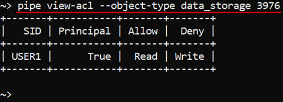

# 14.4. View and manage Permissions via CLI

- [View permissions](#view-permissions)
- [Manage permissions](#manage-permissions)
    - [Example: set permissions for a folder](#example-set-permissions-for-a-folder)
    - [Example: set permissions for a pipeline](#example-set-permissions-for-a-pipeline)
- [Change `OWNER` property](#change-owner-property)

> Cloud Pipeline CLI has to be installed. See [14. Command-line interface (CLI)](14._Command-line_interface.md).

## View permissions

> To view permissions for the object you need **READ** permission for the object. See [13. Permissions](../13_Permissions/13._Permissions.md).

Command to list all permissions for a specific object:

``` bash
pipe view-acl -t|--object-type <Object type> <Object id/name>
```

Two parameters are required:

- **Object type** - defines a name of the object class. Possible values: `pipeline`, `folder`, `data_storage`.
- **Object id/name** - defines a name of an object of a specified class.  
    **_Note_**: full path to the object has to be specified.

In the example below we check permissions for the folder "**_workfolder/manage-permissions-folder_**":

``` bash
pipe view-acl -t folder "workfolder/manage-permissions-folder"
```


To check permissions for the Data Storage with ID **_3976_**:

``` bash
pipe view-acl --object-type data_storage 3976
```



## Manage permissions

> To manage permissions for the object you need to be an **OWNER** of that object or you need to have the **ADMIN** role. See [13. Permissions](../13_Permissions/13._Permissions.md).

Command to set permissions for the object:

``` bash
pipe set-acl -t|--object-type <Object type> -s|--sid <User/Group name> [-g|--group] -a|--allow/-d|--deny/-i|--inherit <w>/<x>/<r> <Object id/name>
```

The following parameters are required:

- **Object type** - defines a name of the object class. Possible values: `pipeline`, `folder`, `data_storage`.
- **User** or **Group name** - defines a name of an user or a group (role) for whom permissions will be set.  
    **_Note_**: the option `-g` (or `--group`) shall be necessarily specified when permissions are being set for a group (role)
- **Allow** (`-a` or `--allow`), **Deny** (`-d` or `--deny`), **Inherit** (`-i` or `--inherit`) - actions that could be performed with permissions.
- **WRITE** (`w`), **READ** (`r`) and **EXECUTE** (`x`) - permissions for setting.
- **Object id** or **name** - defines an ID or name of an object of the specified class to set permissions for.  
    **_Note_**: full path to the object has to be specified if the name is not unique (in cases for **Data Storage**, **Pipeline**).

**_Note_**: permissions and actions over them could be written in command in any combinations. See examples below.

### Example: set permissions for a folder

Here we demonstrate how to set permissions for a **folder**. You can set permissions for other CP objects in the same way.  
In the example below we grant the user **_USER3_** **READ** access and deny **WRITE** and **EXECUTE** access to the directory "**_workfolder/manage-permissions-folder_**".

``` bash
pipe set-acl -t folder -s USER3 -d wx -a r "workfolder/manage-permissions-folder"
```


### Example: set permissions for a pipeline

In the example below we grant the role **_ROLE\_USER_** **READ** and **WRITE** access to the pipeline with ID **_5937_**.

``` bash
pipe set-acl --object-type pipeline --sid ROLE_USER --group --allow rw 5937
```


## Change `OWNER` property

Each object has a mandatory **OWNER** property.  
You can change an owner of the Cloud Pipeline object via CLI. Please note, for do that, you shall be an object **OWNER** or have the **ROLE_ADMIN** role.

> **_Note_**: how to change an object owner via the GUI see [here](../13_Permissions/13._Permissions.md#how-to-change-an-owner).

Command to change an owner of the object:

``` bash
pipe chown <User name> <Object class> <Object id/name>
```

Three parameters shall be specified:

1. **User name** - defines a user name of a desired object owner.
2. **Object class** - defines a name of the object class. Possible values: `data_storage`, `docker_registry`, `folder`, `pipeline`, `tool`, `tool_group`, `configuration`.
3. **Object id/name** - defines an ID or name of an object of the specified object class.  
    **_Note_**: full path to the object has to be specified. Paths to Docker registry and Tool objects should include registry IP address.

The example below will change an owner to **_USER3_** for the pipeline with ID **_5937_**:

``` bash
pipe chown USER3 pipeline 5937
```
