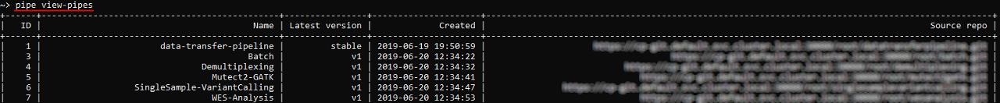
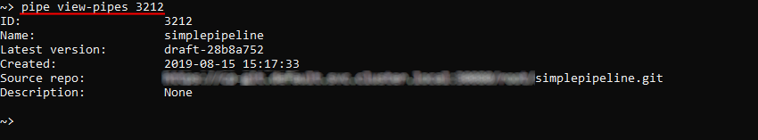
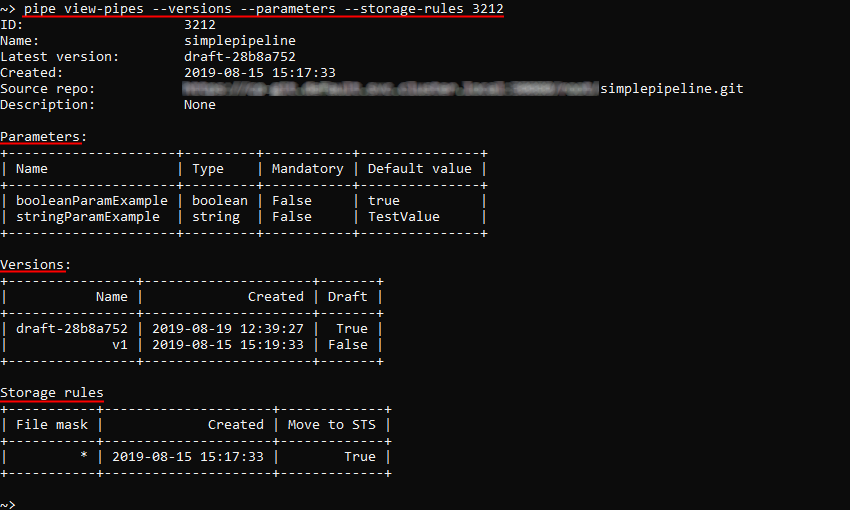
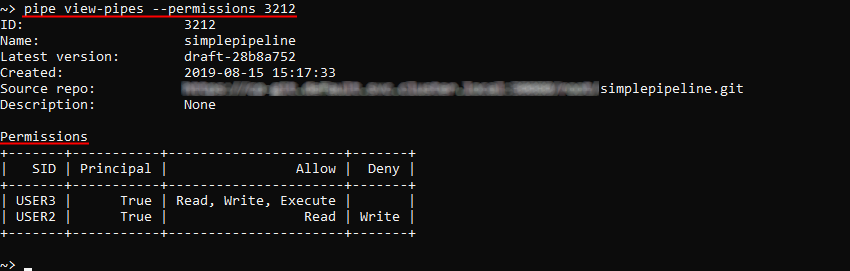

# 14.4. View pipeline definitions via CLI

The command to view pipeline definitions:

``` bash
pipe view-pipes [OPTIONS] [PIPELINE]
```

**PIPELINE** - pipeline name or ID.

| Options | Description |
|---|---|
| **Non-required options** |
| `-v` / `--versions` | List versions of a pipeline |
| `-p` / `--parameters` | List parameters of a pipeline |
| `-s` / `--storage-rules` | List storage rules of a pipeline |
| `-r` / `--permissions` | List user permissions of a pipeline |

Without any arguments that command will output the list of all pipelines, e.g.:  


With specifying pipeline name/ID that command will output the definition of a specific pipeline. E.g., to view info about the pipeline with ID **3212**:

``` bash
pipe view-pipes 3212
```



To view pipeline versions, parameter list and storage rules - use `-v`, `-p` and `-s` options accordingly:  


> **_Note_**: you can view pipeline parameter list by another command - `run -n <Pipeline name/ID> -p`. See more details [here](14.5._Manage_pipeline_executions_via_CLI.md#setting-parameters-for-a-launch).

To view permissions on a specific pipeline - use the `-r` option:  


> **_Note_**: you can view pipeline permissions by another command - `view-acl -t pipeline <Pipeline name/ID>`. See more details [here](14.7._View_and_manage_Permissions_via_CLI.md#view-permissions).
