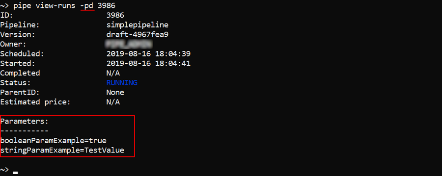
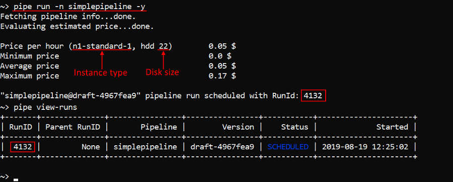

# 14.5. Manage pipeline executions via CLI

- [View pipeline runs](#view-pipeline-runs)
- [Schedule a pipeline execution](#schedule-a-pipeline-execution)
    - [Change execution environment](#change-execution-environment)
    - [Change advanced options](#change-advanced-options)
    - [Setting parameters for a launch](#setting-parameters-for-a-launch)
    - [Launch a cluster](#launch-a-cluster)
    - [Launch a pipeline in a synchronized mode](#launch-a-pipeline-in-a-synchronized-mode)
    - [Launch a job on the existing running instance](#launch-a-job-on-the-existing-running-instance)
    - [Run a tool](#run-a-tool)
    - [Generate pipeline launch command via the GUI](#generate-pipeline-launch-command-via-the-gui)
- [Runs sharing](#runs-sharing)
    - [View sharing status](#view-sharing-status)
    - [Share a run](#share-a-run)
    - [Unshare a run](#unshare-a-run)
- [Run a single command or an interactive session over the SSH protocol](#run-a-single-command-or-an-interactive-session-over-the-ssh-protocol)
- [Stop a pipeline execution](#stop-a-pipeline-execution)
- [Terminate a node](#terminate-a-node)

> Cloud Pipeline CLI has to be installed. See [14. Command-line interface (CLI)](14._Command-line_interface.md).

## View pipeline runs

The command to view runs info:

``` bash
pipe view-runs [OPTIONS] [RUN_ID]
```

| Options | Description |
|---|---|
| **Non-required options** |
| `-s` / `--status` [ANY \| FAILURE \| PAUSED \| PAUSING \| RESUMING \| RUNNING \| STOPPED \| SUCCESS] | List pipeline runs with a specific status |
| `-df` / `--date-from` | List pipeline runs started after specified date |
| `-dt` / `--date-to` | List pipeline runs completed before specified date |
| `-p` / `--pipeline` | List history of runs for a specific pipeline |
| `-pid` / `--parent-id` | List runs for a specific parent pipeline run |
| `-f` / `--find` | Search runs with a specific substring in run parameters values |
| `-t` / `--top` | Display top N records |
| `-nd` / `--node-details` | Display node details |
| `-pd` / `--parameters-details` | Display parameters |
| `-td` / `--tasks-details` | Display tasks |

That command without any arguments will list all active runs available for the current user (more about permissions see [here](../13_Permissions/13._Permissions.md)):  
    

To view information about specific run - enter its RunID at the end of the command, e.g.:  
      
You can additionally display information about instance used by a specific run - by the `-nd` (`--node-details`) flag:  
      
You can additionally display information about pipeline parameters used by a specific run - by the `-pd` (`--parameters-details`) flag:  
      
You can additionally display information about run tasks - by the `-td` (`--tasks-details`) flag:  
    

**_Note_**: by default, the `view-runs` command outputs information about **_active_** runs.  
To view a list of all runs with a specific status (see possible values in the table above) - use the `-s` (`--status`) option, e.g. to view a list of failed runs:

``` bash
pipe view-runs -s FAILURE
```


By default, only last 100 records are displayed. If you want to change this count, use the `-t` (`--top`) option with specifying a number of records to show, e.g.:  


Option `-df` (`--date-from`) allows to output runs **_started_** after specified datetime.  
Datetime shall be specified in one of the following formats: **yyyy-MM-dd HH:mm:ss** or **yyyy-MM-dd**, e.g.:  
    

Option `-dt` (`--date-to`) allows to output runs **_completed_** before specified datetime.  
**_Note_**: since the `view-runs` command outputs by default information about active runs, then for using that command with the `-dt` option one of the completed statuses must be specified, e.g.:  
    

To list history of runs for a specific pipeline use the `-p` (`--pipeline`) option and a pipeline name.  
By default it will print a list of active runs for the **latest** pipeline version. If you want to launch non-latest pipeline version, specify version name after the pipeline name using the `@` symbol, e.g. to list **STOPPED** runs for the **v1** version of the **simplepipeline** pipeline:  

``` bash
pipe view-runs -p simplepipeline@v1 -s STOPPED
```


To list child runs use the `-pid` (`--parent-id`) option and a parent run ID, e.g.:  
    

To find runs with a specific substring in run parameters values use the `-f` (`--find`) option. E.g. to find among all stopped runs only those which parameter values contain the word "Changed":

``` bash
pipe view-runs -s STOPPED -f "Changed"
```


## Schedule a pipeline execution

The command to shedule a pipeline/version execution:

``` bash
pipe run [OPTIONS] [RUN_PARAMETERS]
```

| Options | Description |
|---|---|
| **Non-required options** |
| `-n` / `--pipeline` | Pipeline name or ID |
| `-c` / `--config` | Pipeline configuration name |
| `-di` / `--docker-image` | Docker image |
| `-it` / `--instance-type` | Node type in terms of the Cloud Provider |
| `-id` / `--instance-disk` | Instance disk size |
| `-ic` / `--instance-count` | Number of worker instances to launch in a cluster |
| `-nc` / `--cores` | Number of cores that a cluster shall contain. This option will be ignored if `-ic` (`--instance-count`) option was specified |
| `-r` / `--region-id` | Instance Cloud region |
| `-pt` / `--price-type` [spot \| on-demand] | Price type |
| `-t` / `--timeout` | Timeout (in minutes), when elapsed - run will be stopped |
| `-cmd` / `--cmd-template` | Command template |
| `-p` / `--parameters` | Returns a parameter list for the specified pipeline |
| `-pn` / `--parent-node` | Parent instance Run ID. Allows to run a pipeline as a child job on the existing running instance |
| `-s` / `--sync` | Allows a pipeline to be run in a sync mode. When set - terminal will be blocked until the pipeline won't finish the run.<br />After that the pipeline's finish status will be returned into the terminal output and the terminal will be unblocked |
| `-np` / `--non-pause` | Allows to switch off the auto-pause option. **_Note_**: this option is supported for on-demand runs only |
| `-y` / `--yes` | Do not ask confirmation |
| `-q` / `--quiet` | Quiet mode |

**RUN_PARAMETERS** - list of the pipeline parameters to set. Can be specified as a single `--<Parameter name> <value>` pair or a list of them.

In the example below the pipeline with the name **simplepipeline** will be launched:

``` bash
pipe run -n simplepipeline -y
```

And then we'll check that it was launched by the [`view-runs`](#view-pipeline-runs) command:  


If not additionally specified, described command will launch **default** configuration of the pipeline **latest** version.  
If you want to launch non-default pipeline configuration, specify its name with the `-c` (`--config`) option, e.g.:

``` bash
pipe run -n simplepipeline -c new-config -y
```

  
In the example above the configuration with the name **new-config** of the pipeline **simplepipeline** was launched.

If you want to launch non-latest pipeline version, specify version name after the pipeline name using the `@` symbol, e.g.:

``` bash
pipe run -n simplepipeline@v1 -y
```

  
In the example above default configuration of the version with the name **v1** of the pipeline **simplepipeline** was launched.

### Change execution environment

You can change execution environment for a pipeline run by setting the following options: `-di` (`--docker-image`), `-it` (`--instance-type`), `-id` (`--instance-disk`), `-r` (`--region-id`).  
In the example below the pipeline **simplepipeline** will be launched on the instance **n1-highcpu-2** with the disk size **25** Gb:

``` bash
pipe run -n simplepipeline --instance-type n1-highcpu-2 --instance-disk 25 -y
```


> **_Note_**: for the `-di` (`--docker-image`) option shall specify a full path to the Docker image including its version.

### Change advanced options

You can change advanced options for a pipeline execution by setting the following options: `-pt` (`--price-type`), `-t` (`--timeout`), `-cmd` (`--cmd-template`).  
E.g. the command below will launch the pipeline **simplepipeline** with the `spot` price type and changed command template:

``` bash
pipe run -n simplepipeline -pt spot -cmd "sleep 1d"
```

> **_Note_**: `-pt` flag could take only one from two values - `on-demand` and `spot`, independent on the Cloud Provider.

### Setting parameters for a launch

To view all parameter list for a pipeline use `-p` (`--parameters`) flag, e.g. to view parameters of the **simplepipeline** pipeline:

``` bash
pipe run -n simplepipeline -p
```

  
As you can see, that flag allows to view all parameters with their types.  
If parameters have default values they will be also printed.

To set parameters for a pipeline launch, enter them after all options in the following manner: `--<Parameter1 name> <value> --<Parameter2 name> <value> ...`, e.g.:

``` bash
pipe run -n simplepipeline --booleanParamExample false --stringParamExample "Changed test value" -y
```


### Launch a cluster

You can launch a cluster using `-ic` (`--instance-count`) option. It sets a number of worker instances.  
In the example below the cluster with two child nodes will be launched:

``` bash
pipe run -n simplepipeline -ic 2
```


Also you can launch a cluster using the `-nc` (`--number-cores`) option. With this option you specify a number of cores that a cluster shall contain. In that case worker instance count of the cluster will be calculated automatically based on the supported instance types.

**_Note_**: This option will be ignored if `-ic` (`--instance-count`) option was specified.

In the example below the cluster runs with 16 cores will be launched:

``` bash
pipe run -n simplepipeline -nc 16
```

  
As you can see, for that run single instance with 16 cores was scheduled.

### Launch a pipeline in a synchronized mode

You can launch a pipeline in a synchronized mode by setting the `-s` (`--sync`) flag. In that mode terminal will be blocked until the pipeline won't finish the run. After the pipeline's finish, its status will be returned into the terminal output and the terminal will be unblocked.  
Example of the pipeline **simplepipeline** execution in a sync mode:

``` bash
pipe run -n simplepipeline --sync -y
```


### Launch a job on the existing running instance

You can launch a pipeline as a child job on the existing running instance by setting the `-pn` (`--parent-node`) option. It allows not to initialize a new node for a such job but use already existing one.  
Example of the launching the pipeline **simplepipeline** as a child of the previously launched and initialized instance:

``` bash
pipe run -n simplepipeline --parent-node <Parent RunID> -q -y
```


### Run a tool

Also you can launch a tool - without providing a pipeline name/ID. In that case Docker image shall be mandatory specified. If instance type, instance disk and cmd template aren't specified, default tool settings for them will be used.  
In the example below we will launch the Docker image **ubuntu:latest** on the **n1-highcpu-2** instance with the disk size **27** GB and `sleep infinity` command template:

``` bash
pipe run -di <Docker image path> -it n1-highcpu-2 -id 27 -cmd "sleep infinity" -y
```


> **_Note_**: Docker image path shall be specified in a full manner including version.

### Generate pipeline launch command via the GUI

The construction of the correct `run` command sometimes could be hard for users, so users can generate necessary launch commands via the GUI.  
For that:

1. Via the GUI open the **Launch** page of a pipeline/tool you want to run
2. At the **Launch** page, configure all settings for the run as you want and then click the "**CLI command**" button in the right-upper corner:  
    
3. In the appeared popup copy the `pipe run` command, e.g.:  
    
4. Paste the copied command into the terminal and perform it

> **_Note_**: instead of step 2 described above, you may open the **Run logs** page of any active/completed run and click the **LAUNCH COMMAND** button in the right-upper corner to view the launch command of the selected run:  
    

Also, user can select the **API** tab in the "Launch commands" popup and get the `POST` request for a job launch:  
    

## Runs sharing

> **_Note_**: to share a run with other users/groups, user shall be the **OWNER** of that run or has an **ADMIN** role.

About sharing run via the GUI see [here](../11_Manage_Runs/11.3._Sharing_with_other_users_or_groups_of_users.md).

### View sharing status

The command to view for whom a run is shared:

``` bash
pipe share get RUN_ID
```

The example below lists users/groups for whom the run with ID **38081** is shared:

``` bash
pipe share get 38081
```


### Share a run

The command to share a running job with other users/groups:

``` bash
pipe share add RUN_ID [OPTIONS]
```

| Options | Description |
|---|---|
|`-su` / `--shared-user` | Specifies the user for whom the run will be shared. Multiple options are supported |
|`-sg` / `--shared-group` | Specifies the group/role for which the run will be shared. Multiple options are supported |
|`-ssh` / `--share-ssh`| Share SSH-session of the run. Non-required option for the runs with endpoints |

One of the option `-su` or `-sg` shall be necessarily specified. Both options also can be used simultaneously.  
`-ssh` option is necessarily required only in cases when the run hasn't endpoints.

In the example below we will share the SSH-session of the run with ID **38081** with the user **USER1** and then check it by the command `pipe share get`:

``` bash
pipe share add 38081 -ssh -su USER1
```


### Unshare a run

The command to unshare a running job from other users/groups for whom the access was shared before:

``` bash
pipe share remove RUN_ID [OPTIONS]
```

| Options | Description |
|---|---|
| **Non-required** |
|`-su` / `--shared-user` | Specifies the user for whom the sharing of the run will be disabled. Multiple options are supported |
|`-sg` / `--shared-group` | Specifies the group/role for which the sharing of the run will be disabled. Multiple options are supported |
|`-ssh` / `--share-ssh`| Remove only SSH-sharing for all users/groups for runs with endpoint(s) or remove all users/groups of the run shared list for runs without endpoints |

Without any additional options the command will remove all sharings of the run.

In the example below we will unshare the run with ID **38081** with the role **ROLE_USER** and check it by the command `pipe share get`:

``` bash
pipe share remove 38081 -sg ROLE_USER
```


## Run a single command or an interactive session over the SSH protocol

> **_Note_**: to perform a command or run an interactive session over the running job, user shall be the **OWNER** of that job or has an **ADMIN** role.

The command to run a single command or an interactive session over the SSH protocol for the specified job run:

``` bash
pipe ssh RUN_ID [COMMAND]
```

**COMMAND** - a single command to execute over the running instance with the specified Run ID using the SSH protocol.  
In the example below we will list the content of the **root** directory of the job run with ID **12370**:

``` bash
pipe ssh 12370 'ls -l /root'
```


If **COMMAND** isn't specified, it will start an interactive session over the running instance with the specified Run ID using the SSH protocol. To exit from the interactive session use commands `exit` or `logout`.  
We will perform the same command as was in the example above but in the interactive session:  
    

## Stop a pipeline execution

The command to stop a specific running pipeline:

``` bash
pipe stop [OPTIONS] RUN_ID
```

| Options | Description |
|---|---|
| **Non-required options** |
| `-y` / `--yes` | Do not ask confirmation |

In the example below we will run a pipeline and then stop it:  


## Terminate a node

The command to terminate a specific calculation node:

``` bash
pipe terminate-node [OPTIONS] NODE_NAME
```

| Options | Description |
|---|---|
| **Non-required options** |
| `-y` / `--yes` | Do not ask confirmation |

**NODE_NAME** - calculation node name (ID). You can know it, for example, by the `view-runs` command with the `-nd` option, the [`view-cluster`](14.6._View_cluster_nodes_via_CLI.md) command or via the GUI.

In the example below we will terminate a node of the running pipeline:  

