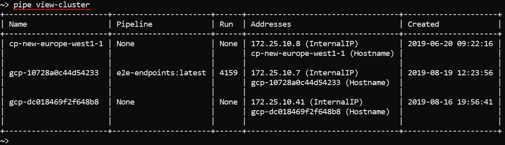
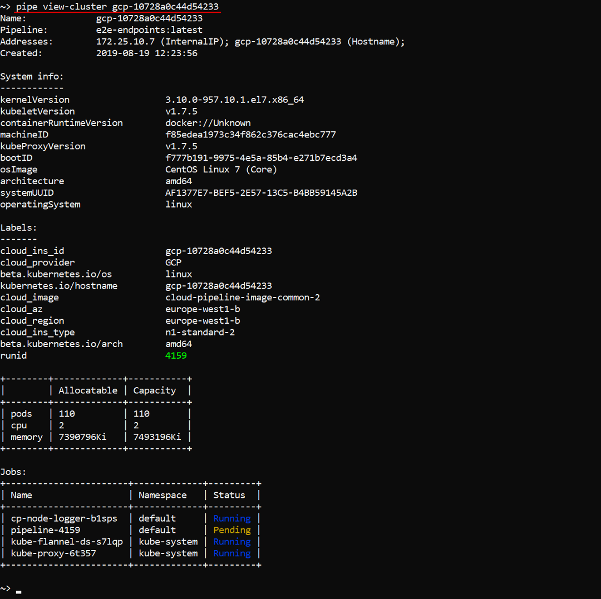
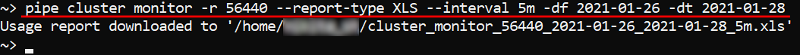
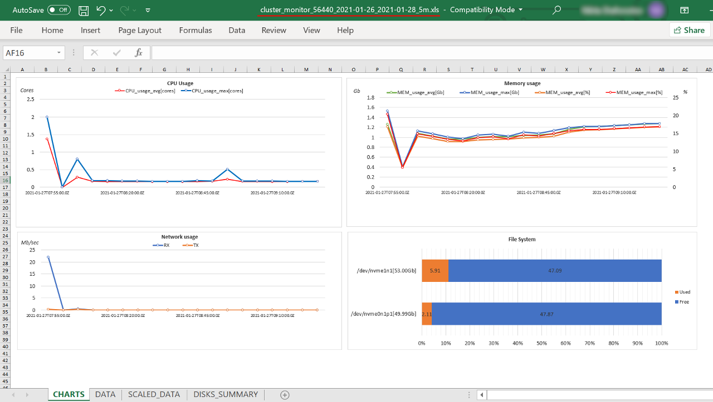

# 14.6. View cluster nodes via CLI

- [Export cluster utilization](#export-cluster-utilization)

The command to view working nodes info:

``` bash
pipe view-cluster [NODE_NAME]
```

**NODE_NAME** - calculation node name (ID).

That command without any arguments will list all working nodes:  


Or you can view full information about specific node by specifying its name/ID at the end of the command, e.g.:  


## Export cluster utilization

Users can export **Cluster Node Monitor** reports by `pipe` abilities.  
The command to download the node usage metrics:

``` bash
pipe cluster monitor [OPTIONS]
```

| Options | Description |
|---|---|
| **Required options** |
| `-i` / `--instance-id` _ID_ | Specifies the cloud instance ID. This option cannot be used in conjunction with the `--run-id` option |
| `-r` / `--run-id` _ID_ | Specifies the pipeline run ID. This option cannot be used in conjunction with the `--instance-id` option |
| **Non-required** |
| `-o` / `--output` _TEXT_ | Set the output file for monitoring report. If not specified the report file will be automatically generated in the current folder |
| `-df` / `--date-from` _TEXT_ | Set the start date for monitoring data collection. If not specified a `--date-to` option value minus 1 day will be used. **_Note_**: data format shall be specified like `yyyy-MM-dd HH:mm:ss` or `yyyy-MM-dd` |
| `-dt` / `--date-to` _TEXT_ | Set the end date for monitoring data collection. If not specified the current date and time will be used. **_Note_**: data format shall be specified like `yyyy-MM-dd HH:mm:ss` or `yyyy-MM-dd` |
| `-p` / `--interval` _TEXT_ | Set the time interval of resources utilization statistics that will be exported. **_Note_**: data format shall be specified like `<N>m` for minutes or `<N>h` for hours, where `<N>` is the required number of minutes/hours. Default value: `1m` |
| `-rt` / `--report-type` _TEXT_ | Exported report type (case insensitive). Currently `CSV` and `XLS` are supported. Default value: `CSV` |

The following command will download the monitoring report of the run with ID "56440" from "26th January 2021" till "28th January 2021" in the Excel-format, data will be split into 5-minute intervals:

```bash
pipe cluster monitor -r 56440 --report-type XLS --interval 5m -df 2021-01-26 -dt 2021-01-28
```



The report will have the same view as one made from the GUI:  
    
