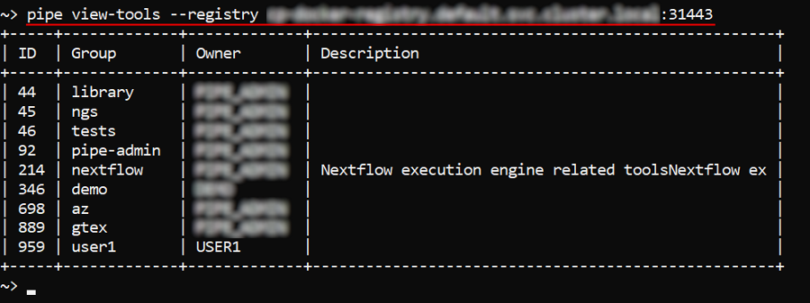
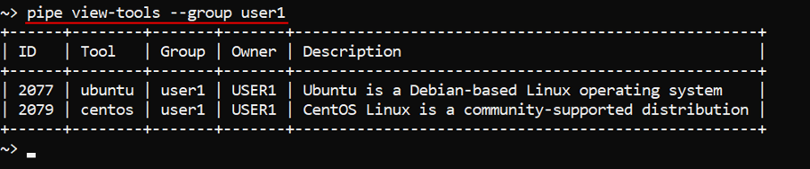
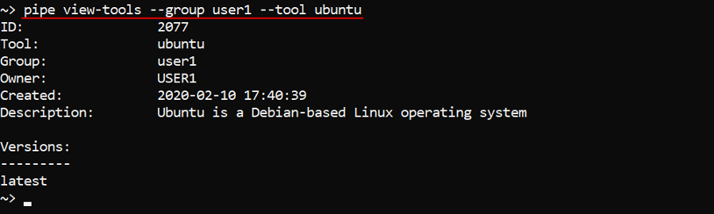
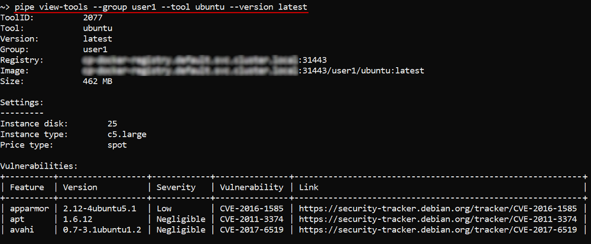

# 14.8. View tools definitions via CLI

- [View a list of groups in the registry](#view-a-list-of-groups-in-the-registry)
- [View a list of tools in the group](#view-a-list-of-tools-in-the-group)
- [View a tool definition](#view-a-tool-definition)
- [View tool version's details](#view-tool-versions-details)
- [Using the "path" to view the object](#using-the-path-to-view-the-object)

Via the CLI users can view details of a tool/specific tool version or tools groups.  
The general command to perform these operations:

``` bash
pipe view-tools [OPTIONS]
```

| Options | Description |
|---|---|
| **Non-required options** |
| `-r` / `--registry` | Defines a specific Docker registry |
| `-g` / `--group` | Defines a specific tool group in a registry |
| `-t` / `--tool` | Defines a specific tool in a tool group |
| `-v` / `--version` | Defines a specific version of a tool |

Without any arguments that command will output a list of the tools contained in:

- In a personal tool group
- If not personal group is available - in the `library` or `default` tool group
- If none of the above is available - a corresponding warning will be printed

> **_Note_**: If more than one registry exists on the current Cloud Pipeline deployment - Docker registry shall be forcibly specified (`-r` becomes a mandatory option) or the corresponding error message will be printed.

## View a list of groups in the registry

With specifying a Docker registry that command will output a list of tools groups of that registry.  
**_Note_**: Docker registry shall be specified as `<registry_name>:<port>`.  
E.g.:

``` bash
pipe view-tools --registry <registry_name>:<port>
```



## View a list of tools in the group

With specifying a tools group that command will output a list of tools in the specific group.  
**_Note_**: If more than one registry exists in the current Cloud Pipeline deployment - Docker registry shall be also specified.  
E.g.:

``` bash
pipe view-tools [--registry <registry_name>] --group <group_name>
```



In the example above, the list of tools in user's personal tools group was printed.

## View a tool definition

To view a specific tool's definition and the list of tool versions - use the tool name together with its group name.  
**_Note_**: If more than one registry exists in the current Cloud Pipeline deployment - Docker registry shall be also specified.  
E.g.:

``` bash
pipe view-tools [--registry <registry_name>] --group <group_name> --tool <tool_name>
```



## View tool version's details

To view details of a specific tool version - use the tool name together with the version and the group name.  
**_Note_**: If more than one registry exists in the current Cloud Pipeline deployment - Docker registry shall be also specified.  
E.g.:

``` bash
pipe view-tools [--registry <registry_name>] --group <group_name> --tool <tool_name> --version <version_name>
```

Details of a specific tool version contain:

- tool definition
- list of the tool version execution settings (if specified)
- list of the tool version vulnerabilities
- list of the tool version packages



## Using the "path" to view the object

Users also can view definitions via the "path" to the object (registry/group/tool). The "full path" format is: `<registry_name>:<port>/<group_name>/<tool_name>:<verion_name>`. In that case, the specifying of command options (`-r`/`-g`/`-t`/`-v`) is not required.
So:

- `pipe view-tools <registry_name>:<port>` will show a list of tools groups in the specified registry
- `pipe view-tools <registry_name>:<port>/<group_name>` will show a list of tools in the specified group
- `pipe view-tools <registry_name>:<port>/<group_name>/<tool_name>` will show a definition of the specified tool
- `pipe view-tools <registry_name>:<port>/<group_name>/<tool_name>:<verion_name>` will show details of the specified tool version
