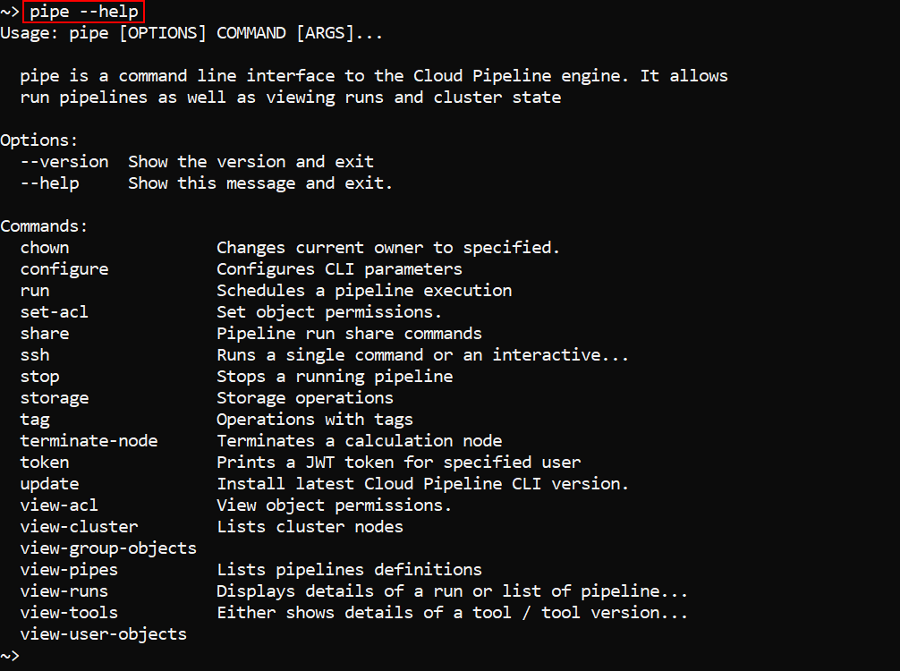

# 14. Command-line interface (CLI)

- [Introduction](#introduction)
- [Working with CLI](#working-with-cli)
- [CLI options and commands](#cli-options-and-commands)
- [Examples](#examples)

> Cloud Pipeline CLI has to be installed. See [14.1. Install and setup CLI](14.1._Install_and_setup_CLI.md).

## Introduction

Working with a Cloud Pipeline from CLI has numerous benefits compared to GUI:

1. It has extra features which are not accessible from GUI such copying or moving files from one storage to another.
2. The uploading file size could exceed 10 Mb.
3. It is more convenient for System administrators.

## Working with CLI

All CLI commands have to be typed into the command line (Terminal) of the computer.

``` bash
pipe [OPTIONS] COMMAND [ARGS]...
```

The **pipe** is a command-line interface for Cloud Pipeline. It has a number of available commands. Each command has a number of arguments as an input.  
To get a list of available options and commands type `pipe` or `pipe --help` into the command line.

## CLI options and commands

| Options |  |
|---|---|
| **`--help`** | Show help message and exit |
| **`--version`** | Show CLI version and exit. Details of the command using see [here](14.1._Install_and_setup_CLI.md#how-to-install-and-setup-pipe-cli) |

| Commands |  |
|---|---|
| **`chown`** | Changes current owner to specified. Details of the command using see [here](14.7._View_and_manage_Permissions_via_CLI.md#change-owner-property). |
| **`configure`** | Configures CLI parameters. This command can be automatically [generated](../12_Manage_Settings/12._Manage_Settings.md#cli-tab). Details of the command using see [here](14.1._Install_and_setup_CLI.md). |
| **`run`** | Schedules a pipeline execution. Details of the command using see [here](14.5._Manage_pipeline_executions_via_CLI.md#schedule-a-pipeline-execution). |
| **`set-acl`** | Set object permissions. Details of the command using see [here](14.7._View_and_manage_Permissions_via_CLI.md#manage-permissions). |
| **`ssh`** | Runs a single command or an interactive session over the SSH protocol for the specified job run. Details of the command using see [here](14.5._Manage_pipeline_executions_via_CLI.md#run-a-single-command-or-an-interactive-session-over-the-ssh-protocol). |
| **`stop`** | Stops a running pipeline. Details of the command using see [here](14.5._Manage_pipeline_executions_via_CLI.md#stop-a-pipeline-execution). |
| **`storage`** | Storage operations. Details of the command using see [here](14.3._Manage_Storage_via_CLI.md). |
| **`tag`** | Operations with attributes. Details of the command using see [here](14.2._View_and_manage_Attributes_via_CLI.md). |
| **`terminate-node`** | Terminates calculation node. Details of the command using see [here](14.5._Manage_pipeline_executions_via_CLI.md#terminate-a-node). |
| **`token`** | Prints the authentication token for a specified user. Details of the command using see [here](14.1._Install_and_setup_CLI.md#using-pipe-token-command). |
| **`update`** | Checks the Cloud Pipeline CLI version and updates it to the latest one if required. Details of the command using see [here](14.1._Install_and_setup_CLI.md#update-the-cli). |
| **`view-acl`** | View object permissions. Details of the command using see [here](14.7._View_and_manage_Permissions_via_CLI.md#view-permissions). |
| **`view-cluster`** | Lists cluster nodes. Details of the command using see [here](14.6._View_cluster_nodes_via_CLI.md). |
| **`view-group-objects`** | Lists the objects accessible to the specific users group. Details of the command using see [here](14.7._View_and_manage_Permissions_via_CLI.md#view-the-list-of-objects-accessible-by-a-group). |
| **`view-pipes`** | Lists pipelines definitions. Details of the command using see [here](14.4._View_pipeline_definitions_via_CLI.md). |
| **`view-runs`** | Lists pipeline runs. Details of the command using see [here](14.5._Manage_pipeline_executions_via_CLI.md#view-pipeline-runs). |
| **`view-tools`** | Displays details of a tool/tool version. Details of the command using see [here](14.8._View_tools_definitions_via_CLI.md). |
| **`view-user-objects`** | Lists the objects accessible to the specific user. Details of the command using see [here](14.7._View_and_manage_Permissions_via_CLI.md#view-the-list-of-objects-accessible-by-a-user). |

**_Note_**: To see command's arguments and options type **`pipe command --help`**.

## Examples

To see a list of available CLI commands type **`pipe`** or **`pipe --help`** in the terminal.



**_Note_**: each command might have its own set of commands that consequently might have their own set of commands... To learn more about a specific command, type the following in the terminal: **`pipe COMMAND --help`**.

For instance, we can list a number of **`pipe storage`** commands with **`pipe storage --help`**.  


Another example - a user can see a list of pipelines runs by **`pipe view-runs`** command.  

