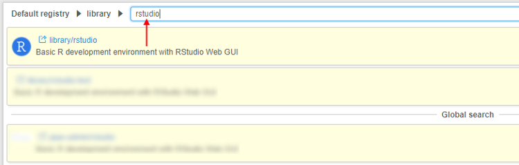

# 15.1 Starting an Interactive application

- [Starting a service](#starting-a-service)
- [Terminating a service](#terminating-a-service)

> To run a **Tool** or a **Pipeline** as an **Interactive service** you need to have **EXECUTE** permissions for that Tool/Pipeline. For more information see [13. Permissions](../13_Permissions/13._Permissions.md).

On this page, you'll find an example of launching an Interactive application. Launching steps remain the same for all applications (_Jupiter Notebook_, _Rstudio_, etc.).  
All launching steps on this page are illustrated with the example of the **Rstudio** application.  
Rstudio is a popular IDE for R language that:

- is designed to make it easy to write scripts;
- makes it easy to set your working directory and access files on your computer;
- makes graphics much more accessible to a casual user.

## Starting a service

Both Pipelines and Tools can be run as interactive services. The example below shows launching Tool scenario.

1. Search for a Tool that implements a service (type a service name in the search box - list will be filtered).  
    
2. Navigate to the **Tool information** page by clicking on the Tool's name and click the **Run** button then press **OK** (for more information see [10.5. Launch a Tool](../10_Manage_Tools/10.5._Launch_a_Tool.md)).
3. Service will begin to set up.  
    A service instance will be shown in the same way as batch jobs - within **Active Runs** menu.  
    
4. Once an instance is created for a service, a link(s) to the web GUI will be shown within **"Run Log"** form.  
    
5. Clicking the link will load the application web interface. In this example, we show the **Rstudio** web interface.
      
    Service configuration includes the following items:
    - For all out of the box services in the Cloud Pipeline, a user will be automatically authenticated within a service.  
        **_Note_**: authentication within all new services added by the users shall be configured by themselves.  
        Below is an example of the authentication within the **Rstudio** service.  
        
    - Besides, for all out of the box services, you'll also find that all STS data storages, that are available to the user, are available within a service. Data from the STS storages will be available as a local file system and you will be able to work with it just as you do on your laptop.  
        **_Note_**: In case of the **Rstudio** application, you can find all available data storages in the **Home/cloud-data** directory in the bottom-right corner of the screen.  
        
    - Only a user that launched a service can access it. Other users (even if a direct link to the service's GUI is known) will have **_401 - Unauthorized error_**.

## Terminating a service

Stopping a service is performed in the same manner as with a batch job.  
**Option 1**. Load a list of "**Active Runs**" and click the **STOP** button.  

**Option 2**. Load **"Run Logs"** form and click the **STOP** button.  
