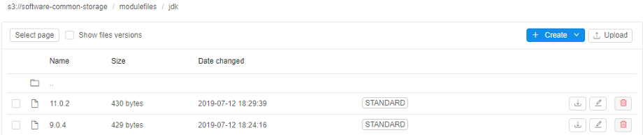

# 15.2. Using Terminal access

> **Terminal access** is available to the **OWNER** of the running job and users with **ADMIN** role. With sufficient permissions, **Terminal access** can be achieved to any running job.
>
> For more information see [13. Permissions](../13_Permissions/13._Permissions.md).

All software in the Cloud Pipeline is located in **Docker containers**, and we can use **Terminal access** to the Docker container via the **Interactive services**.  
This can be useful when:

- usage of a new bioinformatics tool shall be tested;
- batch job scripts shall be tested within a real execution environment;
- docker image shall be extended and saved (install more packages/bioinformatics tools) - see [10.4. Edit a Tool](../10_Manage_Tools/10.4._Edit_a_Tool.md#commit-a-tool).

## Using Terminal access

Both **Pipelines** and **Tools** can be run as **interactive services**. The example below shows launching tool scenario:

1. Navigate to the list of registered **Tools** and search for the Tool required (e.g. **"base-generic-centos7"**).  
    
2. Go to the **Tool** page and click the arrow near the **Run** button → Select **"Custom Settings"**.  
    
3. **Launch Tool page** form will load (it's the same form that is used to configure a batch run). The following fields shall be filled:
    - **Node type**
    - **Disk size**
    - **Cloud Region**
    - "**Start idle**" box should be chosen. Click the **Launch** button when all above parameters are set.  
    
4. Once a run is scheduled and configured **SSH** hyperlink will appear in the **"Run Log"** form in the right upper corner of the form.  
    **_Note_**: This link is only visible to the owner of the run and users with **ROLE\_ADMIN** role assigned.  
    
5. Clicking the **SSH** link will load a new browser tab with an authenticated **Terminal**.  
    **_Note_**: If an **unauthorized user** will load a direct link, **"Permission denied"** error will be returned.  
    

## Example: using of Environment Modules for the Cloud Pipeline runs

> Configure of **Environment Modules** using is available only for users with **ADMIN** role.

The `Environment Modules` [package](http://modules.sourceforge.net/index.html) provides for the dynamic modification of a user's environment via `modulefiles`.

In the example below, we will use `Modules` to switch between two versions of **Java Development Kit**.

1. At the beginning we will create a storage for all `JDK` versions files and `modulefiles`. For that: open the **Library**, click **Create +** → **Storages** → **Create new object storage**
2. While creating - specify a storage name and mount point, e.g. `/opt/software`:  
      
    Click the **Create** button.
3. Open the created storage and create two folders in it:
    - **app** - here we will upload `JDK` files
    - **modulefiles** - here we will create `modulefiles` for each `JDK` version  
    
4. Open the **modulefiles** folder, create the **jdk** folder in it.
5. Open the **jdk** folder, create `modulefile` for the `JDK ver. 9.0.4` - name it **9.0.4**:  
    
6. Click the file name, click the **Fullscreen** button at the file content panel:  
    
7. At the popup click the **EDIT** button and input the `modulefile` content, e.g. for the `JDK ver. 9.0.4`:  
      
    Save it.
8. Repeat steps 5-7 for the `JDK ver. 11.0.2`. At the end you will have two `modulefiles` in the **jdk** folder:  
    
9. Open **System Settings** popup, click the **Preferences** tab, select **Launch** section.  
    Into the **`launch.env.properties`** field add a new variable - `CP_CAP_MODULES_FILES_DIR`. That variable specify path to the source `modulefiles`.  
      
    As you can see - during the run, when the storage created at step 2 will be mounted to the node in the specified mount-point (`/opt/software`), created above `JDK` `modulefiles` will be available in the **modulefiles** folder created at step 3 - by the path `/opt/software/modulefiles`.  
    Save and close the **Settings** popup.
10. Go to the **Tool** page, open the tool page you want to use the `Environment Modules` with and click the arrow near the **Run** button → Select **"Custom Settings"**.  
    
11. At the **Launch** page expand **Advanced** section.
12. In the **Limit mounts** field select the storage created at step 2 (see more details [here](../06_Manage_Pipeline/6.1._Create_and_configure_pipeline.md#example-limit-mounted-storages)).
13. Click the **Add system parameter** button
14. In the popup select the **`CP_CAP_MODULES`** item and click the **OK** button:  
      
    `CP_CAP_MODULES` parameter enables installation and using the `Modules` for the current run. While installing, `Modules` will be configured to the source `modulefiles` path from the `CP_CAP_MODULES_FILES_DIR` launch environment variable (that was set at step 9). If `CP_CAP_MODULES_FILES_DIR` is not set - default `modulefiles` location will be used.  
    
15. Launch the tool.
16. Open **Run logs** page, wait until **InstallEnvironmentModules** task will appear and check that the `Modules` was installed successfully:  
    
17. Wait until **SSH** hyperlink will appear in the right upper corner. Click it.
18. In the terminal run the command `module use` to check the ource path to the `modulefiles`:  
    
19. Now, we will install `JDK`. For the `ver. 9.0.4` run the following commands:  

```bash
# Download "jdk 9.0.4" archive
wget https://download.java.net/java/GA/jdk9/9.0.4/binaries/openjdk-9.0.4_linux-x64_bin.tar.gz
# Extract archive content
tar -zxf openjdk-9.0.4_linux-x64_bin.tar.gz
# Copy "jdk 9.0.4" files into the mounted data storage
cp -r jdk-9.0.4 /opt/software/app/jdk-9.0.4
```

For the `ver. 11.0.2` run the following commands:  

```bash
# Download "jdk 11.0.2" archive
wget https://download.java.net/java/GA/jdk11/9/GPL/openjdk-11.0.2_linux-x64_bin.tar.gz
# Extract archive content
tar -zxf openjdk-11.0.2_linux-x64_bin.tar.gz
# Copy "jdk 11.0.2" files into the mounted data storage
cp -r jdk-11.0.2 /opt/software/app/jdk-11.0.2
```

Now, you can check the facilities of the `Environment Modules` package.  
Load the available `modulefiles` list:  
  
Load the `JDK ver. 11.0.2`:  
  
Switch to the `JDK ver. 9.0.4`:  
  
Unload all `JDK` versions:  
  
