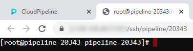

# 15.2 Using Terminal access

> **Terminal access** is available to the **OWNER** of the running job and users with **ADMIN** role. With sufficient permissions, **Terminal access** can be achieved to any running job.
>
> For more information see [13. Permissions](../13_Permissions/13._Permissions.md).

All software in the Cloud Pipeline is located in **Docker containers**, and we can use **Terminal access** to the Docker container via the **Interactive services**.  
This can be useful when:

- usage of a new bioinformatics tool shall be tested;
- batch job scripts shall be tested within a real execution environment;
- docker image shall be extended and saved (install more packages/bioinformatics tools) - see [10.4. Edit a Tool](../10_Manage_Tools/10.4._Edit_a_Tool.md#commit-a-tool).

## Using Terminal access

Both **Pipelines** and **Tools** can be run as **interactive services**. The example below shows launching tool scenario:

1. Navigate to the list of registered **Tools** and search for the Tool required (e.g. **"base-generic-centos7"**).  
    
2. Go to the **Tool** page and click the arrow near the **Run** button → Select **"Custom Settings"**.  
    
3. **Launch Tool page** form will load (it's the same form that is used to configure a batch run). The following fields shall be filled:
    - **Node type**
    - **Disk size**
    - **Cloud Region**
    - "**Start idle**" box should be chosen. Click the **Launch** button when all above parameters are set.  
    
4. Once a run is scheduled and configured **SSH** hyperlink will appear in the **"Run Log"** form in the right upper corner of the form.  
    **_Note_**: This link is only visible to the owner of the run and users with **ROLE\_ADMIN** role assigned.  
    
5. Clicking the **SSH** link will load a new browser tab with an authenticated **Terminal**.  
    **_Note_**: If an **unauthorized user** will load a direct link, **"Permission denied"** error will be returned.  
    