# 15.3. Interactive service examples

- [Running Apache Spark cluster with RStudio Web GUI](#running-apache-spark-cluster-with-rstudio-web-gui)
    - [Launch the RStudio tool with Apache Cluster](#launch-the-rstudio-tool-with-apache-cluster)
    - [Example of `sparklyr` script](#example-of-sparklyr-script)
    - [Monitoring execution via Spark UI](#monitoring-execution-via-spark-ui)

> To run a **Tool** or a **Pipeline** as an **Interactive service** you need to have **EXECUTE** permissions for that Tool/Pipeline. For more information see [13. Permissions](../13_Permissions/13._Permissions.md).

On this page, you'll find examples of launching Interactive applications with various features.

## Running Apache Spark cluster with RStudio Web GUI

### Launch the RStudio tool with Apache Cluster

1. Navigate to the list of registered **Tools** and search for the **RStudio** Tool:  
    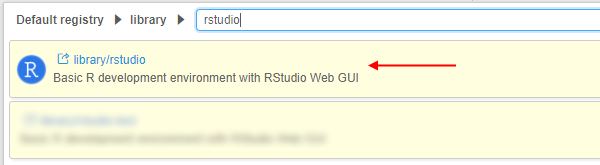
2. Go to the **Tool** page and click the arrow near the **Run** button → Select **"Custom Settings"**.  
    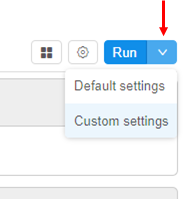
3. At the **Launch** page select **Node type** (from which the subsequent cluster will consist).  
    **_Note_**: it is recommended to select nodes with more memory volume, because it is critical for Spark's in-memory processing
4. Click the **Configure cluster** button:  
    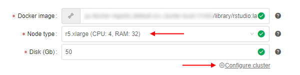
5. At the popup select the **Cluster** tab, set the number of **Child nodes** to create (e.g. 2 or more), then tick the **Enable Apache Spark** checkbox and confirm by the **OK** button:  
    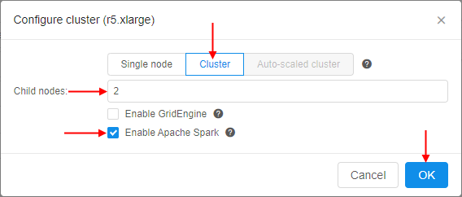  
    Or you could enable Apache Spark by manually adding the system parameter `CP_CAP_SPARK` with `true` value:  
    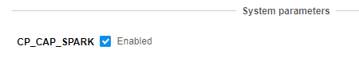
6. Click the **Launch** button:  
    
    At the popup confirm the launch.
7. Check that the cluster has appeared in the **ACTIVE RUNS** tab of the **Runs** page:  
    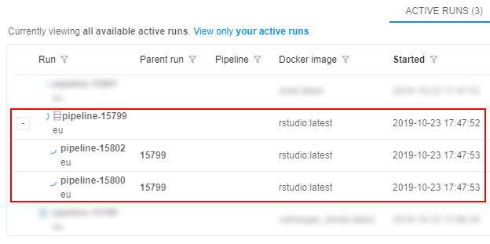
8. Wait until all components are initialized. The cluster tile in the **ACTIVE RUNS** tab will turn into yellow. Click on the parent run to open the **Run logs** page:  
    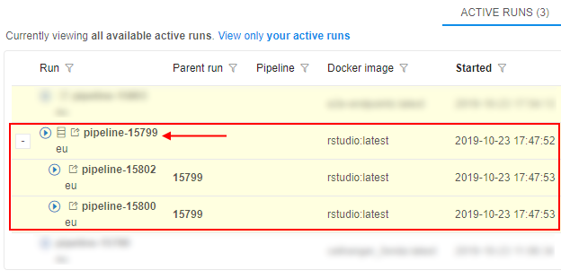
9. At the **Run logs** page there are two endpoints:
    - **_RStudio_** - it exposes RStudio's Web IDE
    - **_SparkUI_** - it exposes Web GUI of the Spark. It allows to monitor Spark master/workers/application via the web-browser. Details are
available in the [Spark UI manual](https://jaceklaskowski.gitbooks.io/mastering-apache-spark/spark-webui.html)  
    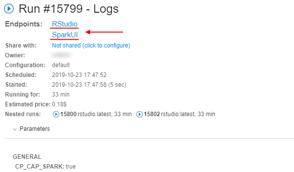
10. Click the **RStudio** endpoint. This will load RStudio Web GUI with the pre-installed `sparklyr` package in the new tab of the web-browser:  
    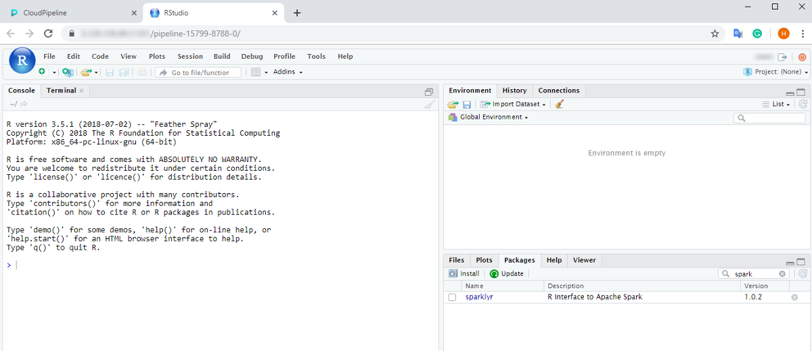

From here one can start coding in R using `sparklyr` to run the workload over the cluster.

### Example of `sparklyr` script

It is assumed that a **Spark** cluster with the RStudio Web GUI and `sparklyr` package is up and running, as shown in the previous section.

#### Accessing datasets from the Cloud Pipeline's Spark

1. **Access to data via File Storages**  
If the user has an access to the FS storage - then datasets from such storage can be accessed via the **`file://`** schema or without a schema at all. But this approach may start to degrade once there is 100+ cores cluster with a lot of
I/O operations.
2. **Access to data via Object Storages**  
    **_Note_**: this feature is available only for `AWS` Cloud Provider.  
    Spark cluster configuration uses the stable version of the [Hadoop-AWS module](https://hadoop.apache.org/docs/current/hadoop-aws/tools/hadoop-aws/index.html), that allows to directly access (read/write) the datasets in the S3 buckets using Spark jobs.  
    The only difference with the filesystem access - is the URL schema. **`s3a://`** prefix shall be used instead of **`s3://`**. E.g. if there is a user's S3 bucket named "**_test-object-storage_**" with the "**_test\_dataset.parquet_**" dataset - then it can be accessed as "**_s3a://test-object-storage/test\_dataset.parquet_**" from the `sparklyr` code (or any other Spark job).

#### Prepare and run `sparklyr` script

This section provides prepare and run of R script that shows how to connect to the Spark cluster, deployed in the Cloud Pipeline, and read/write the data from/to object data storage.

> **_Note_**: we will use S3 bucket with directly access to data as described above. This script will not work for other Cloud Providers.

For this example, a small public VCF file will be used. It is located in some S3 bucket e.g.:  
    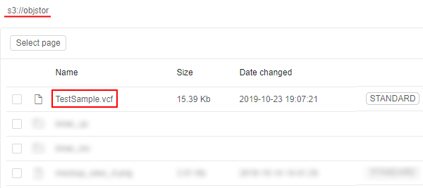

So, prepare the following script:

``` R
library(sparklyr)
# Cloud Pipeline provides the SPARK's master URL in SPARK_MASTER variable
# SPARK_HOME variabe is set by the Cloud Pipeline and will be used by sparklyr - no need to specify it explicitly
# Spark version will be retrieved by sparklyr from the $SPARK_HOME/RELEASE file - no need to specify it explicitly
master <- Sys.getenv("SPARK_MASTER")
sc <- spark_connect(master=master)
# Get the current Cloud Pipeline's unique Run ID to write the results into the unique directory
unique_id <- Sys.getenv("RUN_ID")
# Setup input VCF (tab-delimited) file location and the resulting parquet file
# Note that both input and output are located in the S3 bucket and are addressed via s3a:// schema
example_data_vcf_path <- "s3a://objstor/TestSample.vcf"
example_data_parquet_path <- paste("s3a://objstor/results", unique_id, "example_data.parquet", sep="/")
# Read VCF from the storage and convert to the DataFrame
example_data_df <- spark_read_csv(sc = sc,
                                  name = "example_data_vcf",
                                  path = example_data_vcf_path,
                                  header = F,
                                  delimiter = "\t")
# Write DataFrame as a parquet to the storage
spark_write_parquet(example_data_df, path = example_data_parquet_path)
```

1. Paste that script into the RStudio console and launch it:  
    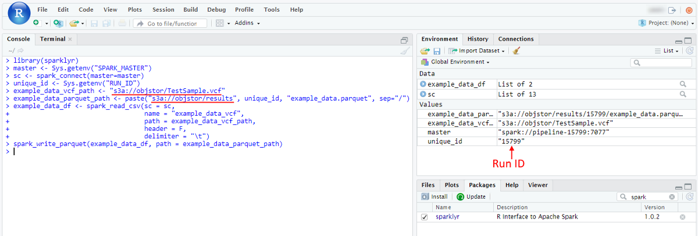
2. Once script is finished - resulting parquet will be written to the storage. To check it open in the **Library** the storage, that was specified for output results:  
    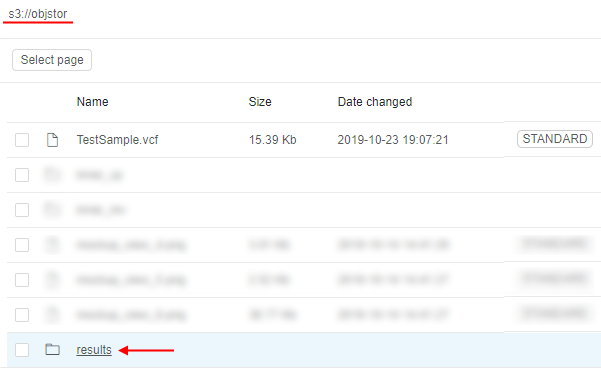
3. Open the path for output results - you will see the directory with the name equal to the Run ID that contains resulting files:  
    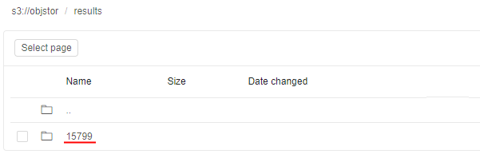  
    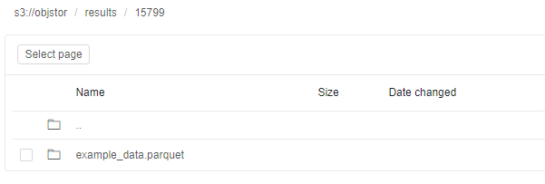  
    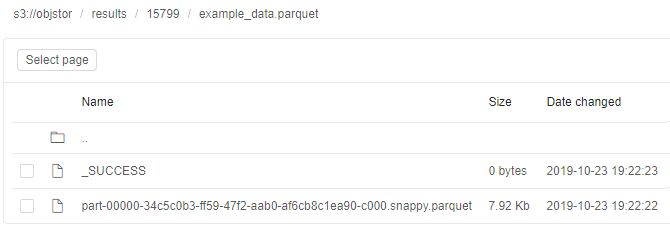

### Monitoring execution via Spark UI

1. To view the details of the jobs being executed in Spark, how the memory is used and get other useful information - the **SparkUI** endpoint from the **Run logs** page shall be opened.  
While executing the example [script](#prepare-and-run-sparklyr-script), open the Spark UI endpoint:  
    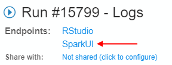
2. A list of active applications and workers will be shown:  
    
3. To get the details of the underlying jobs, executed by the Spark instance, click the application name:  
    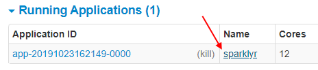  
    The following page will be opened:  
    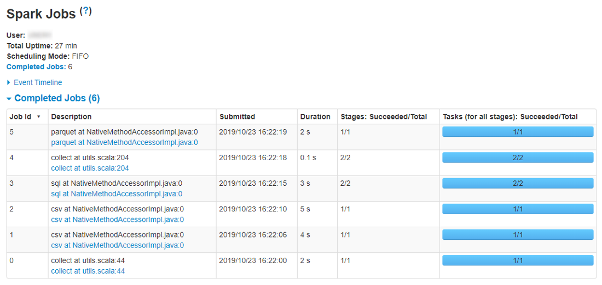

For more details about Spark UI opportunities see [here](https://jaceklaskowski.gitbooks.io/mastering-apache-spark/spark-webui.html).
