# VSCode interactions

## Overview

This page describes installation and usage of the Cloud Pipeline VSCode/Cursor extension.  
This extension allows to use the following Cloud Pipeline functionality within your development environment:

- list your active compute runs
- start new instances from the available tools
- stop running instances
- open a run in a remote development window so you can work on the machine where the job is running

## Installation

1. Navigate to the CLI settings - **Settings** → **CLI** → **VSCode extension**:  
    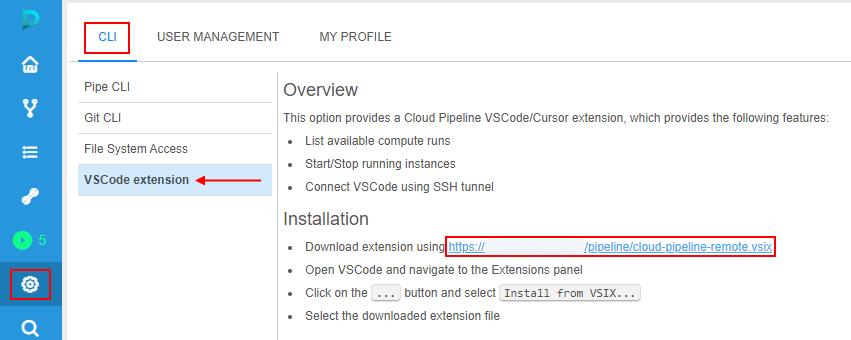
2. Click download link provided within the settings page.  
    `cloud-pipeline-remote.vsix` extension installation file will be automatically downloaded to your local workstation.
3. Open VSCode or Cursor development application and open **Extensions** panel:  
    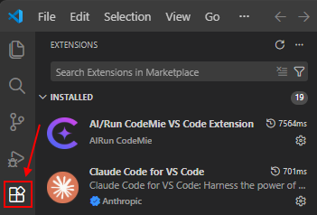
4. Click **More actions** menu in the top-right corner and select **Install from VSIX...**  
    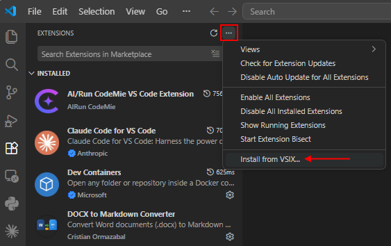
5. Select `cloud-pipeline-remote.vsix` file, which was downloaded previously:  
    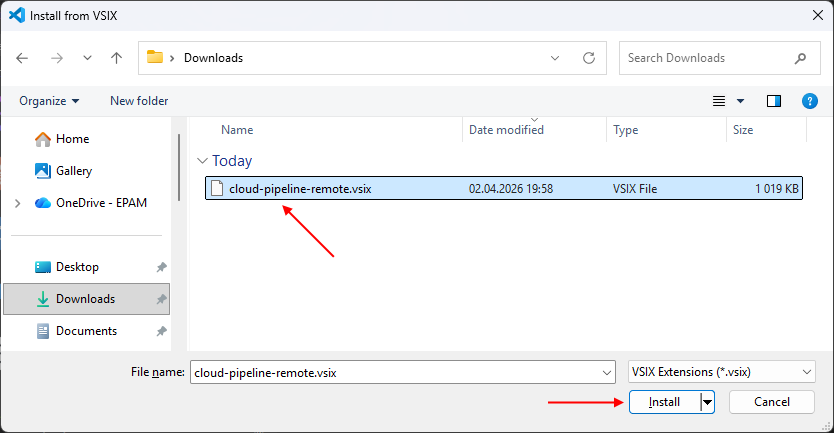
6. Cloud Pipeline Remote extension will appear in the VSCode toolbar:  
    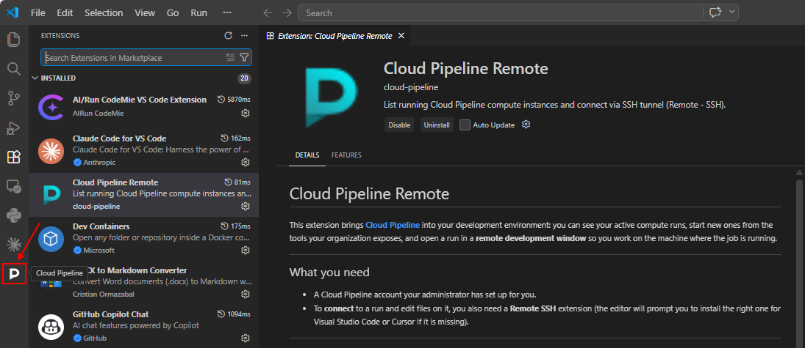

## Authentication

Authentication flow uses the same approach as the Cloud Pipeline `pipe` CLI:

- If `pipe` CLI was previously [configured](../14_CLI/14.1._Install_and_setup_CLI.md#how-to-install-and-setup-pipe-cli) and used on a current workstation - its configuration and authentication token will be used.  
In such case, no additional configuration is required for the VSCode extension.
- If no `pipe` CLI config is found - VSCode extension will prompt to sign-in:  
    - click Cloud Pipeline Remote extension in the toolbar
    - click **Sign-in** option:  
    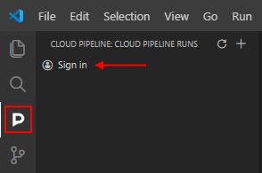  
    - VSCode will prompt for a permission to open web-browser, please approve:  
    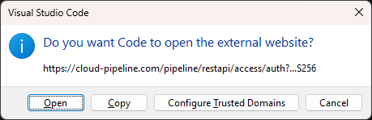  
    - A new browser window will be opened to perform authentication. If everything goes well - you will see a message about successful login:
    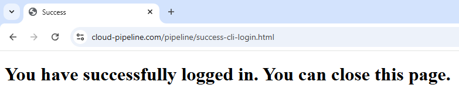
- At this point, Cloud Pipeline Remote extension is fully configured and ready to be used.

## Operations

### View a list of active runs

- By default, Cloud Pipeline Remote extension panel will show a list of currently active runs of a current user.  
List of runs is auto-refreshed every 5 seconds:  
    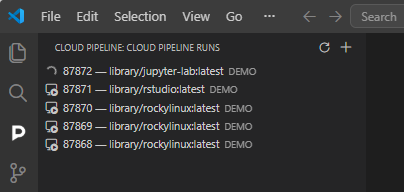
- Runs can be shown in two states:  
    - **_Starting_**  - an instance is being initialized, connection can't be established yet.
    - **_Ready_**  - run is available for connection.
- Hover an instance with a mouse to see the run details:  
    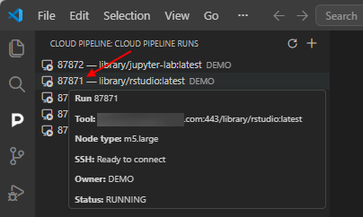

### Connect to an instance

- Once an instance is ready for connection - double click it or right click and select **Connect via SSH**:  
    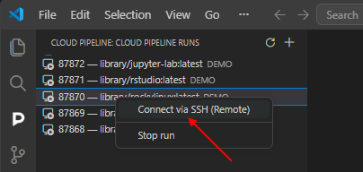

> Please note, Cloud Pipeline VSCode extension depends on Microsoft Remote SSH plugin.  
> If it is not installed - you will be prompted to do so. Click **Install Remote - SSH** and wait for the installation to complete.  
> 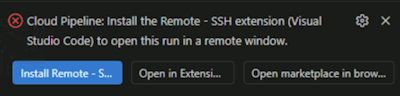

- This will open a new VScode window, which will start connecting to a selected instance.  
    If you will be prompted to select the platform for the remote host, select `Linux`:  
    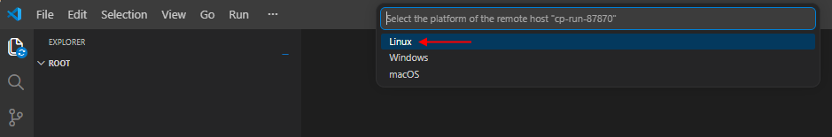
- Once connection is established - you will see a filesystem of the remote instance and be able to open terminal and execute code remotely:  
    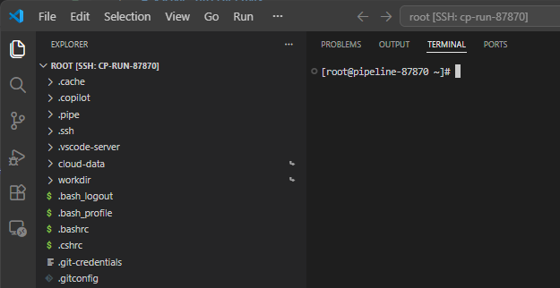

> To stop connection to the instance - close VSCode window with opened remote connection and select **Stop SSH Tunnel** option from the context menu (right-click the instance):  
>   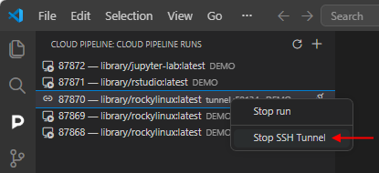  
> _OR_ hover the instance in the list and click **Stop SSH Tunnel** icon:  
>   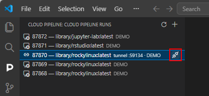

### Start a new instance

Cloud Pipeline Remote extension also allows to start new runs right from the VSCode/Cursor IDEs:

- Click  icon in the Cloud Pipeline Remote extension panel
- This will load a list of available tools. **_Note_**: it may take a couple of seconds to load.  
    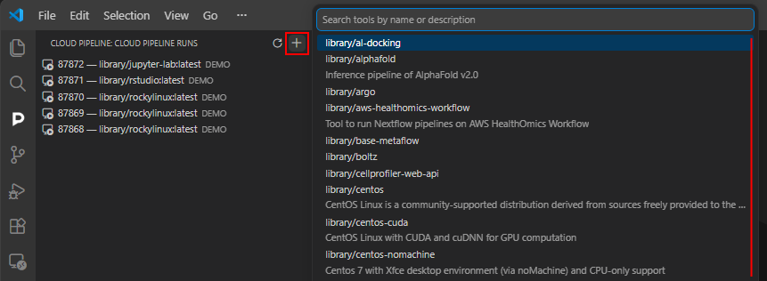
- Search and select a tool to start. This will bring a tool version selection menu:  
    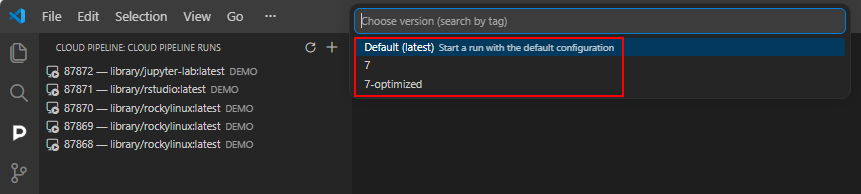

> Cloud Pipeline Remote VSCode extension does not allow to define the tool startup configuration.  
> A default configuration, defined for that tool/version, will be used to start a new instance.

- Select a version to start a new run of the tool/version. A new instance will appear in the list of runs:  
    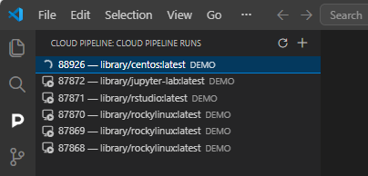

### Stop an instance

Running instances can be stopped via **Stop run** option from the context menu (right-click the instance):  
    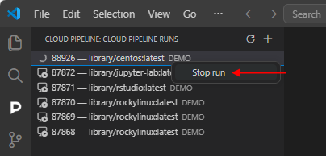

Confirm the stop in the appeared pop-up:  
    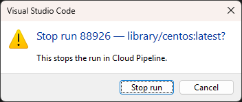
