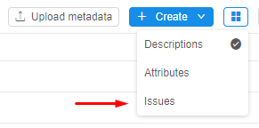
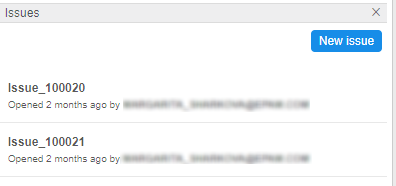
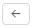
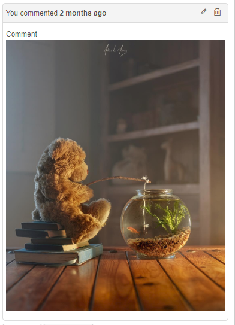
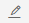

# 16. Issues

- [Open an issue](#open-an-issue)
- [Change an issue title](#change-an-issue-title)
- [Leave a comment](#leave-a-comment)
- [Edit a comment](#edit-a-comment)
- [Delete a comment](#delete-a-comment)
- [Delete an issue](#delete-an-issue)

Issues is a great tool to share results with other users or get feedback. It allows keeping the discussion in one place - traceable and linked to specific data.  
The feature is available for:

- Folders, including Projects
- Pipelines
- Tools.

## Open an issue

> To open an issue, a user shall have **READ** permissions for a discussed object. For more information see [13. Permissions](../13_Permissions/13._Permissions.md).

To open an issue the following steps shall be performed:

1. Navigate to the object you want to discuss and click  **icon** → **Issues**.  
      
    **_Note_**: the second way is to navigate to a folder that contains the object you want to discuss and click  icon in the desired object's line.  
    
2. The **Issues** pane will be opened.  
    
3. Click  button to create a new issue.
4. Fill up the open form:
    - **Title** (e.g. **_new issue_**),
    - **Description** (e.g. **_error_**). Description supports [MARKDOWN](https://en.wikipedia.org/wiki/Markdown) formatting, thus you can write your text in the **Write** tab with special symbols and then preview it in the **Preview** tab.  
          
        **_Note_**: you can address your topic to a specific user if you put **`@`** symbol and start to write username. The system will suggest you choose from the list. After you save your topic, the user will receive e-mail notification.
5. When you finish, press the **Create** button - the topic will be created. You'll see topic title, the author and how much time past since the topic was created.
6. You can click on it to open and see description. If you want to go back to the list of all discussions, click .

## Change an issue title

> To edit an issue title a user shall be **OWNER** of the discussion. For more information see [13. Permissions](../13_Permissions/13._Permissions.md).

To change an issue title the following steps shall be performed:

1. Navigate to the issue which title you want to change and open it.
2. Click the issue title - the **Title** field will be open for editing.  
    
3. Enter new title and click out of the field.
4. The new title will be saved.

## Leave a comment

> To leave a comment a user shall have **READ** permissions for a discussioned object. For more information see [13. Permissions](../13_Permissions/13._Permissions.md).

To leave a comment on an issue the following steps shall be performed:

1. Navigate to the object you want to discuss and click  **icon** → **Issues**.  
    **_Note_**: the second way is to navigate to a folder that contains the object you want to discuss and click  icon in the desired object's line.
2. The **Issues** pane will be opened.
3. Click on an issue you interested in.
4. Fill up the **Comment** form. Comment supports [MARKDOWN](https://en.wikipedia.org/wiki/Markdown) formatting, thus you can write your text in the **Write** tab with special symbols and then preview it in the **Preview** tab.  
      
    **_Note_**: you can address your comment to a specific user if you put **`@`**symbol and start to write username. The system will suggest you choose from the list. After you save your comment, the user will receive an e-mail notification.  
    **_Note_**: you can also drag and drop pictures here, so that everyone can see the issue more clearly:  
    
5. When you finish, press the **Send** button - the comment will be created. You'll see your comment, the author and how much time past since the comment was created.  
    

## Edit a comment

> To edit a comment a user shall be **OWNER** of the comment. For more information see [13. Permissions](../13_Permissions/13._Permissions.md).  
**_Note_**: to edit a topic description the same steps should be performed.

To edit a comment the following steps shall be performed:

1. Navigate to the comment you want to edit.
2. Press  icon - the editing form will be shown.
3. Change your comment and click  to save your changes.  
    **_Note_**:  won't be available until you change something.  
    **_Note_**: if you change your mind and want to leave your comment as is, click .
4. The changes will be saved.

## Delete a comment

> To delete a comment a user shall be **OWNER** of the comment. For more information see [13. Permissions](../13_Permissions/13._Permissions.md).

To delete a comment the following steps shall be performed:

1. Navigate to the comment you want to delete.
2. Click  icon.  
    
3. Confirm your action in the dialog window.
4. The comment is deleted.

## Delete an issue

> To delete an issue a user shall be **OWNER** of the issue. For more information see [13. Permissions](../13_Permissions/13._Permissions.md).

To delete an issue the following steps shall be performed:

1. Navigate to the issue you want to delete and open it.
2. Click  icon.  
    
3. Confirm your action in the dialog window.
4. The issue is deleted.