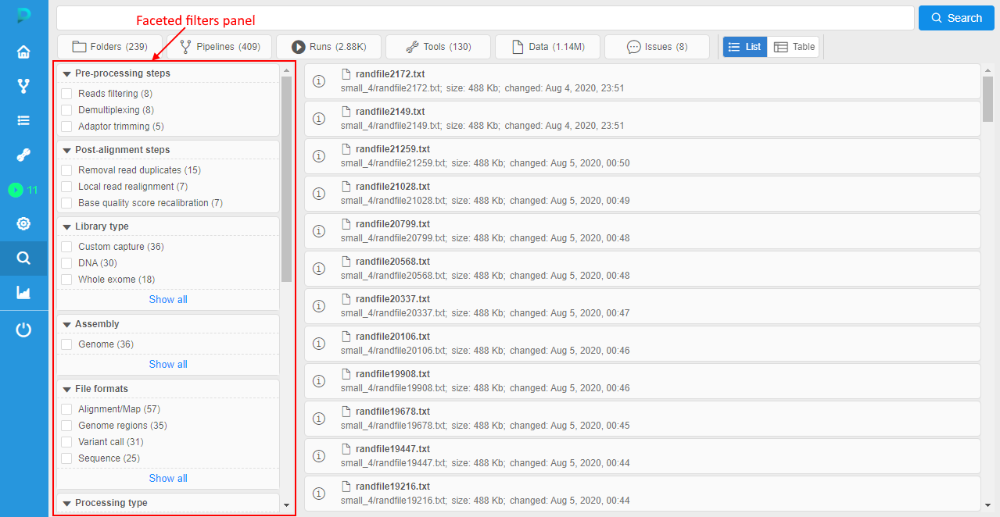
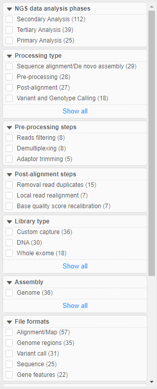
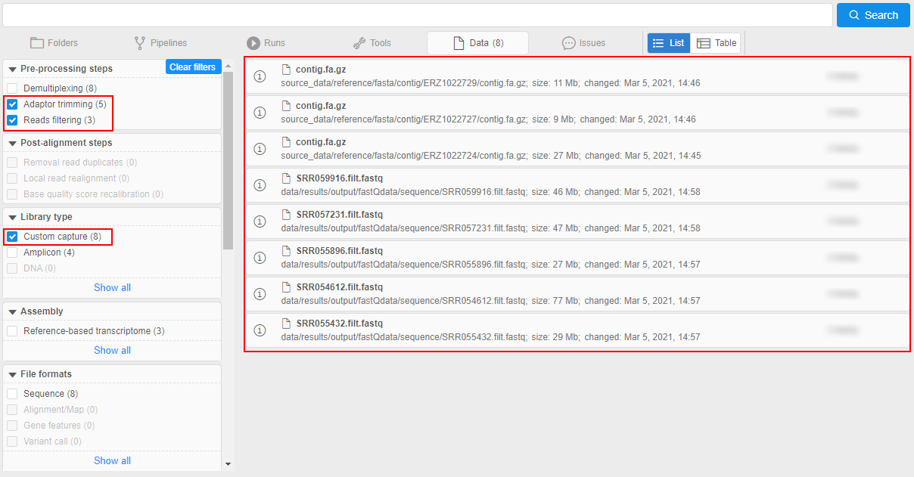
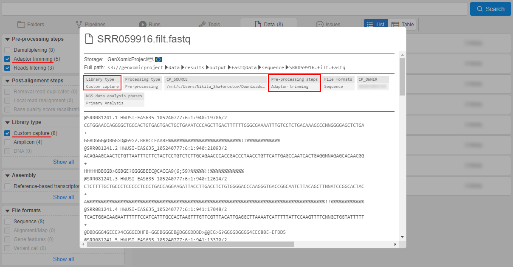

# 17.1. Faceted filters search using tags

- [Preliminary preparation](#preliminary-preparation)
- [Configure faceted filters](#configure-faceted-filters)
- [Faceted filters at the search page](#faceted-filters-at-the-search-page)
    - [Filters displaying](#filters-displaying)
    - [Using faceted filters to search](#using-faceted-filters-to-search)

In **Cloud Pipeline**, besides the [simple](../19_Search/19._Global_search.md#simple-search) Global Search, there is also the [advanced](../19_Search/19._Global_search.md#advanced-search) search included search by tags (attributes).  
Search by tags is being performed via **_faceted filters_** panel. Tags' keys and values displayed in this panel are loaded from **System Dictionaries** marked as filter sources.  
User can restrict (filter) search results - checking/unchecking desired filters.

Let's take a closer look.

## Preliminary preparation

"Faceted filters" search is convenient, when users have well-structured data in the platform and want to search by the attributes.  
But not all specified attributes are being loaded to the faceted filters, only attributes that were added to objects using **System Dictionaries** will be loaded to these filters.  
Firstly, the sets of key and possible values should be created as corresponding dictionaries in the special section of the **System Settings**, e.g.:  
      
About **System Dictionaries** see details [here](../12_Manage_Settings/12.13._System_dictionaries.md).

After the dictionary is created, it can be used for the attribute (tag) creation.  
For that:

1. Navigate to the object you wish to tag
2. Open the "Attributes" panel for the object
3. Click the "**+ Add**" button at the "Attributes" panel:  
    
4. Click the "Key" field. In the appeared list, all available dictionaries list will appear:  
      
    Select the dictionary name that you want to use as the attribute key
5. In the "Value" field, corresponding values of the selected dictionary will appear:  
      
    Select the dictionary value that you want to use as the attribute value
6. Click the "**v Add**" button to confirm:  
    
7. Added attribute will appear in the "Attributes" panel:  
    

About the tagging objects via **System Dictionaries** see details [here](../12_Manage_Settings/12.13._System_dictionaries.md#using-dictionaries).

## Configure faceted filters

To determine which of the available **System Dictionaries** should be used as faceted filters, there is a special system preference **`faceted.filter.dictionaries`**.  
Here, admin shall manually specify dictionaries and some settings of displaying specified dictionaries at the "Faceted filters" panel:  
    

This preference has `JSON`-format.  
Features:

- **`"dictionaries"`** - array of the existing **System Dictionaries** that shall be used and displayed in the "Faceted filters" panel
- **`"dictionary"`** - key to specify a name of the existing dictionary
- **`"order"`** - key to specify an order number by which dictionaries are being sorted in the "Faceted filters" panel. This order number is relative - if dictionary entries are not associated with any object, such entries or even dictionary itself will not be visible at the "Faceted filters" panel
- **`"defaultDictEntriesToDisplay"`** - key to specify a number of the dictionary values that will be always visible (if the count of the dictionary values exceeds this number - extra values will be hidden). This setting is being configured for all faceted filters simultaneously, but can be configured for the specific dictionary separately (individual dictionary setting has higher priority). Possible values for that setting - number or string **`"all"`** - in last case, all dictionary values will be always displayed

Example of the specific dictionary settings:  
    

Here:

- the system dictionary used as faceted filter has name `"File formats"`
- the relative order of that dictionary at the "Faceted filters" panel is `7`
- the default count of that dictionary values that should be always displayed at the "Faceted filters" panel is `5`

## Faceted filters at the search page

### Filters displaying

To open the "Advanced Search" page - click the **Search** icon in the main menu:  
    

The "Faceted filters" panel is placed on the left side of the "Advanced Search" page:  
    

Here all dictionaries specified in the system preference `faceted.filter.dictionaries` are displayed.  
> Please note, that only dictionaries which entries associated with any object are displayed.  
> For example, let some dictionary `Dictionary1` has entries `Value1` and `Value2`. If any platform object is tagged by `Dictionary1:Value1` and no objects are tagged by `Dictionary1:Value2`, in the "Faceted filters" panel `Value2` will not be shown for the filter `Dictionary1`.  
> If there are no platform objects tagged by `Dictionary1:Value1` and `Dictionary1:Value2` - in the "Faceted filters" panel, the filter `Dictionary1` will not be shown at all.

Displaying of filters:  
    

Where:

- **a** - header with the filter name (dictionary name). All filter sections are expanded by default. To collapse the section - click the header with the filter name, e.g.:  
    
- **b** - filter values (dictionary entries associated with objects)
- **c** - footer that allows to show all dictionary entries associated with objects. This element is displayed only for dictionaries which count of associated entries is more than configured `"defaultDictEntriesToDisplay"` value. For the dictionary in example above, `"defaultDictEntriesToDisplay"` value is `4`. Click the footer to show all entries associated with objects:  
      
    Click the footer again to hide "extra" entries
- **d** - checkbox that allows to select only objects from the search results that are associated with the certain dictionary entry (i.e. only objects tagged by the certain attribute)
- **e** - the count of the objects associated with the certain dictionary entry. Filter values are being sorted by this count descending

> If any filter has more than 10 associated entries, under its header the search bar appears - to quick search among entries of this filter, e.g.:  
> 

### Using faceted filters to search

To use faceted filter to search objects by their attributes (tags) - just click the checkbox near the desired filter value. In the search results, only objects were associated with the checked filter value (dictionary entry) will remain, e.g.:  
      
      
    Only objects tagged by this dictionary entry remained in the search results.

After any faceted filter value's checkbox is being changed its state (manually enabled/disabled):

- other filters are being updated - count of associated objects changes according to the new selected condition:  
    - if any value of other faceted filter has no common associated objects with the selected filter value - such value becomes disabled, being colored in grey and has `0` value as a count of associated objects (i.e. for values from different faceted filters (different dictionaries) the logical operation `AND` is being performed), e.g.:  
    
    - but for the same faceted filter which value is selected (same dictionary) other filter values remain without changes - you can selected them, their counts of associated objects doesn't change (i.e. for values from the same faceted filter (the same dictionary) the logical operation `OR` is being performed), e.g.:  
    
- in the panel of object types (under the main search bar), the count of displayed objects is being changed
- also paging is updated

You can select several filters values from different dictionaries. Each time, other filters will be updated according to the rules above, and also displayed search results will be changed according to the selected filters, e.g.:  
    

You can hover over any displayed search result and click the **Info** icon to check that the object is really tagged by selected filters (attributes), e.g.:  
      
    

To clear all filters and remove restrictions click the corresponding button at the top of the "Faceted filters" panel:  
    
