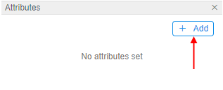
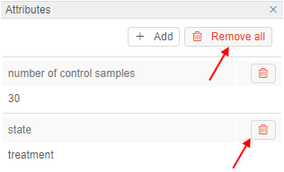

# 17. CP objects tagging by additional attributes

- [Add attributes](#add-attributes)
- [Edit attributes](#edit-attributes)
- [Delete attributes](#delete-attributes)
- [Automatic tagging](#automatic-tagging)

A user can manage custom sets of "**key-values**" attributes for data storage and files. These custom attributes could be used for an additional description of the object and make the search process easier by using attributes as tags.

> To edit object's attributes, you need to be an **OWNER** of the object. For more information see [13. Permissions](../13_Permissions/13._Permissions.md).  
> You can also manage attributes via CLI. See [14.2. View and manage Attributes via CLI](../14_CLI/14.2._View_and_manage_Attributes_via_CLI.md).

How to navigate to Attributes pane of different objects:

- [Folder](../04_Manage_Folder/4._Manage_Folder.md#displays-icon)
- [Metadata](../05_Manage_Metadata/5._Manage_Metadata.md#show-attributeshide-attributes)
- [Pipeline](../06_Manage_Pipeline/6._Manage_Pipeline.md#details-controls)
- [Data storage](../08_Manage_Data_Storage/8._Manage_Data_Storage.md#show-attributeshide-attributes)
- [Tool groups](../10_Manage_Tools/10._Manage_Tools.md#show-attributeshide-attributes) and [tools](../10_Manage_Tools/10._Manage_Tools.md#show-attributeshide-attributes)
- [User](../12_Manage_Settings/12.4._Edit_delete_a_user.md#attributes)
- [Group of users/role](../12_Manage_Settings/12.6._Edit_a_group_role.md#attributes)

**_Note_**: if you were changing the data storage file's attributes, you could return to data storage's attribute by clicking  control.

## Add attributes

1. Navigate to **Attributes** pane of a selected object.
2. Click **+ Add** button.  
    
3. Enter attribute key and value.
4. Click **Add**:  
    

## Edit attributes

1. Navigate to **Attributes** pane of a selected object.
2. Click the attribute key or value field.  
    
3. Change attribute key or value.
4. Press "**Enter**" keyboard button or just out of the active field.

## Delete attributes

1. Navigate to **Attributes** pane of a selected object.
2. Click **Trash** icon to delete a particular attribute.  
    **_Note_**: click **Remove all** to delete all attributes.  
    

## Automatic tagging

In the Cloud Pipeline files are automatically tagged with the following attributes when uploading them to the data storage via CLI/GUI (see a CLI example [14.3. Manage Storage via CLI](../14_CLI/14.3._Manage_Storage_via_CLI.md#upload-and-download-data)):

- **CP\_OWNER**. The value of the attribute will be set as a user ID.
- **CP\_SOURCE**. The value of the attribute will be set as a local path used to upload.  
    **_Note_**: this attribute is set only if a file is uploaded through CLI.

**_Note_**: The exception is that the storage is based on NFS share. Files in such data storage don't have attributes at all.

Besides, files are automatically tagged with the following attributes when uploading them to the data storage as a result of a pipeline run:

| Name | Value |
|---|---|
| **CP\_CALC\_CONFIG** | Instance type |
| **CP\_DOCKER\_IMAGE** | Tool that was used |
| **CP\_JOB\_CONFIGURATION** | Pipeline configuration |
| **CP\_JOB\_ID** | Pipeline ID |
| **CP\_JOB\_NAME** | Pipeline name |
| **CP\_JOB\_VERSION** | Pipeline version |
| **CP\_OWNER** | User ID |
| **CP\_RUN\_ID** | Run ID |
| **CP\_SOURCE** | Local path used to upload data |

How to make pipeline use a CP CLI see [here](../06_Manage_Pipeline/6.1._Create_and_configure_pipeline.md#example-create-a-configuration-that-uses-pipeline-cli-for-data-uploading).