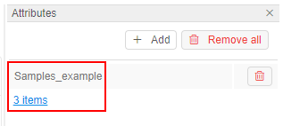
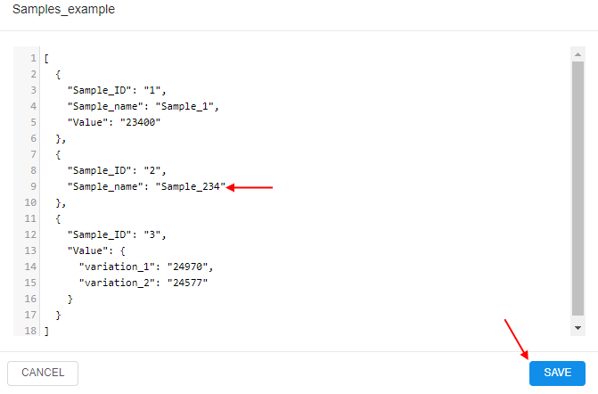
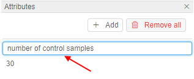
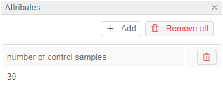
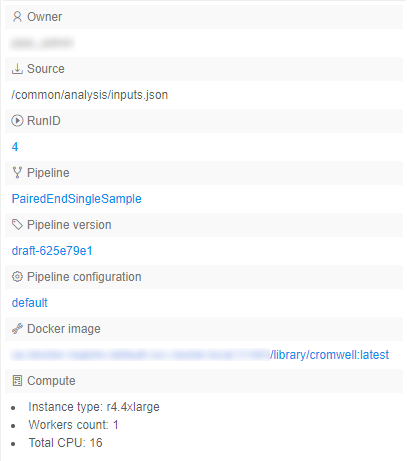

# 17. CP objects tagging by additional attributes

- [Add attributes](#add-attributes)
    - [Add `JSON` object into the attribute value](#add-json-object-into-the-attribute-value)
- [Edit attributes](#edit-attributes)
- [Delete attributes](#delete-attributes)
- [Automatic tagging](#automatic-tagging)

A user can manage custom sets of "**key-values**" attributes for data storage and files. These custom attributes could be used for an additional description of the object and make the search process easier by using attributes as tags.

> To edit object's attributes, you need to be an **OWNER** of the object. For more information see [13. Permissions](../13_Permissions/13._Permissions.md).  
> You can also manage attributes via CLI. See [14.2. View and manage Attributes via CLI](../14_CLI/14.2._View_and_manage_Attributes_via_CLI.md).

How to navigate to Attributes panel of different objects:

- [Folder](../04_Manage_Folder/4._Manage_Folder.md#displays-icon)
- [Metadata](../05_Manage_Metadata/5._Manage_Metadata.md#show-attributeshide-attributes)
- [Pipeline](../06_Manage_Pipeline/6._Manage_Pipeline.md#details-controls)
- [Data storage](../08_Manage_Data_Storage/8._Manage_Data_Storage.md#show-attributeshide-attributes)
- [Tool groups](../10_Manage_Tools/10._Manage_Tools.md#show-attributeshide-attributes) and [tools](../10_Manage_Tools/10._Manage_Tools.md#show-attributeshide-attributes)
- [User](../12_Manage_Settings/12.4._Edit_delete_a_user.md#attributes)
- [Group of users/role](../12_Manage_Settings/12.6._Edit_a_group_role.md#attributes)

**_Note_**: if you were changing the data storage file's attributes, you could return to data storage's attribute by clicking  control.

## Add attributes

1. Navigate to the **Attributes** panel of a selected object.
2. Click the **+ Add** button.  
    
3. Enter an attribute key and value.
4. Click the **Add** button:  
    
5. Added attribute will appear at the **Attributes** panel:  
    

### Add `JSON` object into the attribute value

Also, you can add more complex attributes than just strings.  
In the "Value" field you can specify a raw [`JSON`](https://en.wikipedia.org/wiki/JSON) object, that will be transformed into the pretty-view table.  
View an example:

1. Navigate to the **Attributes** panel of a selected object.
2. Click the **+ Add** button.  
3. Enter an attribute key.  
    
4. Enter the `JSON` object as the attribute value, click the **Add** button:  
    
5. Added attribute will appear at the **Attributes** panel:  
      
    As the value - the link will be displayed that shows the summary count of first-level `JSON` records.
6. Click the value link - the pretty-view detailed table will be opened for the added attribute:  
    
7. If the raw `JSON` has more than one level, downstream records will be shown as the link **_Object_**. You can hover over it and view the downstream records:  
    
8. If you want to edit such attribute value - click the **EDIT** button. The raw `JSON` will be opened:  
      
    You can edit it and click the **SAVE** button to save changes.  
      

## Edit attributes

1. Navigate to the **Attributes** panel of a selected object.
2. Click the attribute key or value field:  
    
3. Change the attribute key or value:  
    
4. Press the **Enter** key or just click out of the active field.
5. Edited attribute will appear at the **Attributes** panel:  
    

## Delete attributes

1. Navigate to the **Attributes** panel of a selected object.
2. Click the **Trash** icon to delete a particular attribute.  
    **_Note_**: click the **Remove all** button to delete all attributes.  
    

## Automatic tagging

In the Cloud Pipeline files are automatically tagged with the following attributes when uploading them to the data storage via CLI/GUI (see a CLI example [14.3. Manage Storage via CLI](../14_CLI/14.3._Manage_Storage_via_CLI.md#upload-and-download-data)):

| Name in GUI | Name in CLI | Value |
|---|---|---|
| **Owner** | **CP\_OWNER** | The value of the attribute will be set as a user ID. |
| **Source** | **CP\_SOURCE** | The value of the attribute will be set as a local path used to upload. **_Note_**: this attribute is set only if a file is uploaded through CLI.|

**_Note_**: The exception is that the storage is based on FS share. Files in such data storage don't have attributes at all.

Besides, files are automatically tagged with the following attributes when uploading them to the data storage as a result of a pipeline run:

| Name in GUI | Name in CLI | Value |
|---|---|---|
| **Owner** | **CP\_OWNER** | User ID |
| **Source** | **CP\_SOURCE** | Local path used to upload data |
| **RunID** | **CP\_RUN\_ID** | Run ID |
| **Pipeline** | **CP\_JOB\_NAME** | Pipeline name |
|  | **CP\_JOB\_ID** | Pipeline ID |
| **Pipeline version** | **CP\_JOB\_VERSION** | Pipeline version |
| **Pipeline configuration** | **CP\_JOB\_CONFIGURATION** | Pipeline configuration |
| **Docker image** | **CP\_DOCKER\_IMAGE** | Tool (docker image) that was used |
| **Compute** | **CP\_CALC\_CONFIG** | Instance type |

Example of the **Attributes** panel for the such file:  

