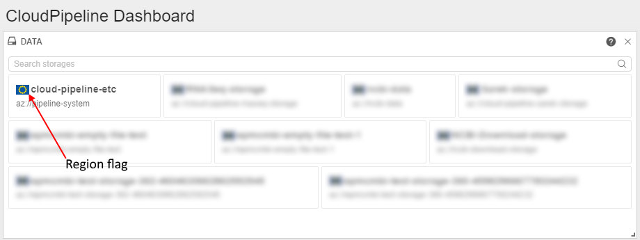
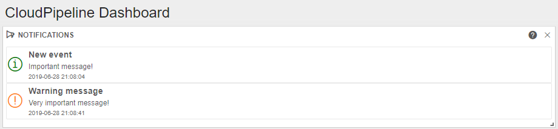
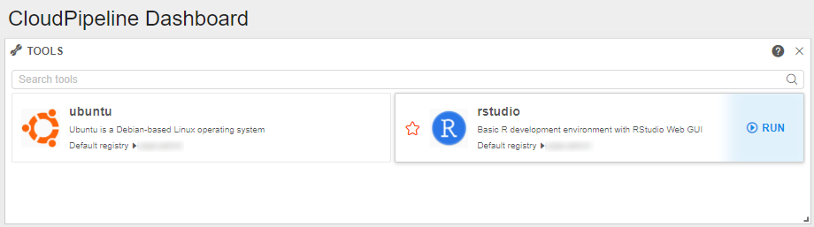
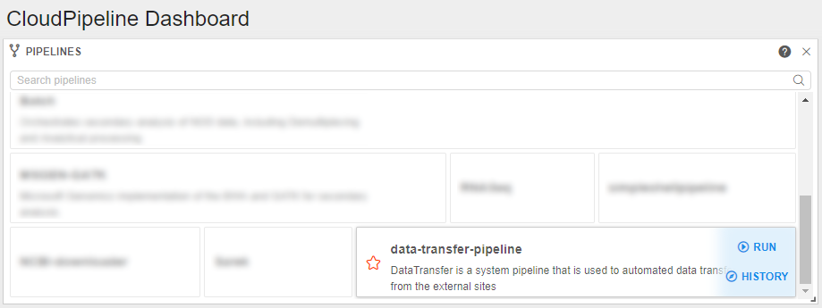
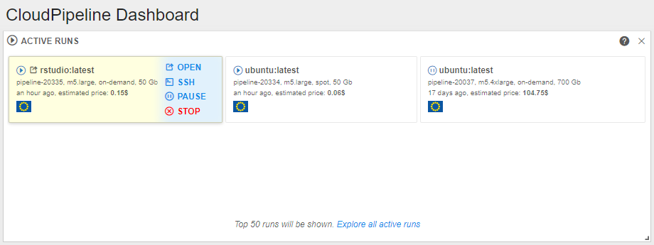
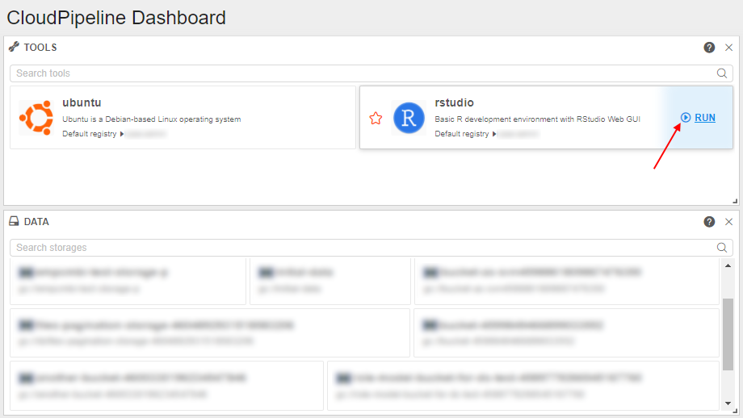
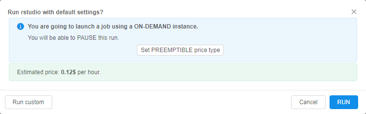
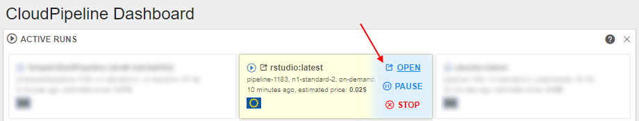

# 18. Home page

- [Home page widgets](#home-page-widgets)
    - [Activities](#activities)
    - [Data](#data)
    - [Notifications](#notifications)
    - [Tools](#tools)
    - [Pipelines](#pipelines)
    - [Recently completed runs](#recently-completed-runs)
    - [Active runs](#active-runs)
    - [Services](#services)
- [Adjust Home page view](#adjust-home-page-view)
- [Start a Run from the Home tab](#start-a-run-from-the-home-tab)

## Home page widgets

### Activities

This widget lists recent comments/issues/posts that occured for the items that you own (e.g. models, pipelines, projects, folders, etc.).  

### Data

List of the data storages (S3 and EFS) that are available to you for **READ/WRITE** operations. These data storages are available from the Platform GUI. Click an item to navigate to the data storage contents.  
**_Note_**: personal Data storages (i.e. a user is an **OWNER** of this Storage) will be shown on top, **WRITE** - second priority, **READ** - third priority.  
**_Note_**: data storages are tagged with region flag to visually distinguish storage locations.  

### Notifications

List of system-wide notifications from administrators posted. These are the same notifications as shown at a login time in the top right corner of the main page.  

### Tools

Tools/Compute stacks/Docker images that are added in your PERSONAL repository or available to your group. To run a Tool - please use a **RUN** button that appears when hovering an item with a mouse. Use a search bar to find tools that are shared by other users and groups. To get a full list of available stacks - please use the **Tools** menu item in the left toolbar.  
**_Note_**: group-level Tools will be shown on the top of the Tools list.  

### Pipelines

Pipelines that are available to you for **READ/WRITE** operations. This is the same list, as available in the **Library** hierarchy. Pipeline can be run right from this widget using a **RUN** button that appears when hovering an item with a mouse. Press the **History** control to view runs history of a chosen pipeline.  

### Recently completed runs

This widget lists your runs that were recently completed. Click a corresponding entry in this widget to navigate to the run details/logs page. Use the **Rerun** control to rerun selected item.  

### Active runs

List of the jobs/tools that are currently in **RUNNING** or **PAUSED** state with some information about instance, elapsed time and estimated price, that is calculated based on the run duration and instance type. If this list is empty - start a new run from the **Tools** or **Pipelines** widgets. Hover a run item to view a list of available action.  
Use **STOP**/**PAUSE**/**RESUME** actions to change the state of the run or use OPEN to navigate to the GUI of the interactive job. Select the **LINKS** button to view/navigate the run input/output parameters. Click a run item to navigate to the details and logs page. **_Note_**: only top 50 active runs will be shown, if more than 50 jobs/tools are running - use **Explore all active runs** link.  

### Services

This widget lists direct links to the Interactive services, that are exposed by the launched Tools. Compared to the **ACTIVE RUNS** widget - this one does NOT show all the active jobs/tools, only links to the web/desktop GUI. If this list is empty - start a new run of an interactive compute stack from the **Tools** widget. Click an item within this widget to navigate to the corresponding service.  

## Adjust Home page view

Dashboard view can be adjusted by clicking the Configure button.  

In the opened window a user can adjust view of the **Home tab** by selecting widgets. Selected items will be displayed after you click **OK**.  
**Restore default layout** control is used to restore default tab configuration.  
  
Also, user can remove widgets by clicking the **"Delete"** icon  on them.

## Start a Run from the Home tab

> User shall have **EXECUTE** rights to run selected Tool/pipeline.

Although Runs can be started from the **Tools** or **Library** tabs respectively (see [10.5. Launch a Tool](../10_Manage_Tools/10.5._Launch_a_Tool.md) and [6.2. Launch a pipeline](../06_Manage_Pipeline/6.2._Launch_a_pipeline.md)), we can start them from the **Home** tab as well.  
In the example below we will start a Run from the **Tools** widget of the **Home** tab:

1. Navigate to the **Home** tab.
2. Select a Tool in the **Tools** widget.
3. Click **Run**.  
    
4. Run a Tool with custom settings with **Run custom** control or run them with default settings with **Run** button.  
      
    **_Note_**: Active runs with endpoints are highlighted in yellow. They expose the **Open** button that shows endpoints. Clicking them will navigate you to the endpoint URL:  
      
    **_Note_**: all widgets that display Runs show input/output links via **LINKS** control. Clicking a link will navigate you to the appropriate Data Storage.  
    