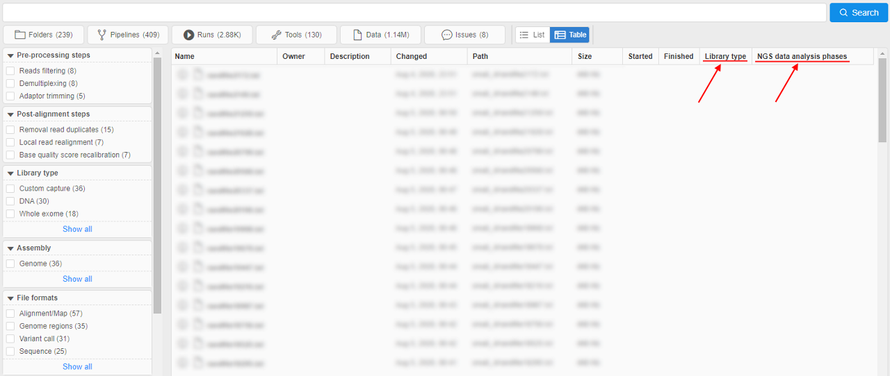
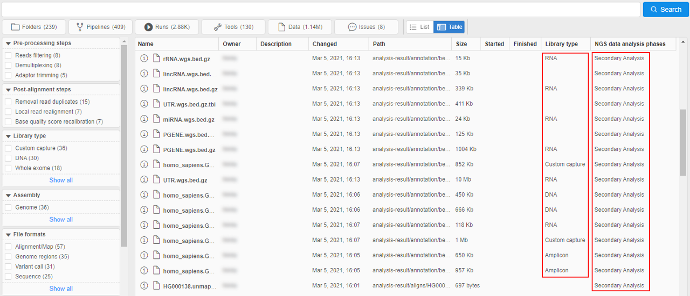

# Global Search

- [Simple search](#simple-search)
- [Advanced search](#advanced-search)
    - [Results output view](#results-output-view)
        - [List view](#list-view)
        - [Table view](#table-view)

When the certain **Cloud Pipeline** deployment grows in terms of data and pipelines being added/implemented - it is crucial to be able to search for specific datasets or tools.  
To find other data and objects, there are two types of the search - **Simple** and **Advanced**.

## Simple search

The following object types are being indexed and can be searched via **Simple search**:

- "**FOLDERS**" - the folders and metadata entities (in "Library")
- "**PIPELINES**" - the pipelines metadata, pipelines files (documents) and configurations
- "**RUNS**" - the job runs
- "**TOOLS**" - the docker registries, groups and tools
- "**DATA**" - the storages and their files (names only)
- "**ISSUES**" - the issues (discussions)

User can open the **Simple search** form by pressing "Ctrl+F" being at any page of the Cloud Pipeline Web GUI (_excluding cases when the **Run logs** page or **Advanced search** page is open_):  
      
    **_Note_**: **Simple search** form will not be opened if any pop-up window is shown

To start searching, a "google-like" query string shall be entered (search can be triggered by pressing "Enter" button or automatically if no new input is provided for 2 seconds):  
    

Special expressions in the query string are available as well (the rules for their assignment are described in pop-up window that appears when hovering over the  icon):  
    

By default search will occur across all the available object types. If user would to limit search scope - appropriate section can be selected above the query input:  
    

To get a brief information for the object found, you can hover an item with a mouse and a "Preview" pane will be shown to the right, e.g.:

- tool preview:  
    
- pipeline preview:  
    

In the "Preview" window user can see:

- name of the found object
- block with indication and highlighting of the object's concrete part, where inputted word was found
- path to the object in library (_optionally_)
- description (_optionally_)
- preview of the found object (_if it's available_) or the link to download (_for files in storages_)
- other useful info like settings, **OWNER** name, attributes (tags), etc.

To open found object, click it to navigate to its location within the **Cloud Pipeline**.

## Advanced search

> Currently, advanced search is available only for admins

To open the **Advanced search** form, open the **Simple search** form (by pressing "Ctrl+F") and click the **Advanced search** button:  
    

_OR_

Click the **Search** icon in the main menu:  
    

**Advanced search** repeats the functionality of the **Simple search** but has some advanced capabilities.

The structure of the **Advanced search** form:  
    

This form contains:

- main search bar - to specify query string (search can be triggered by pressing "Enter" button or by the corresponding **Search** button near the search bar)
- **a** - _similar to **Simple search**_ - panel to restrict object types among which the search should being performed. By default search will occur across all the available object types. If user would to restrict search scope - appropriate section can be selected, e.g.:  
    
- **b** - control that allows to select the view type of the search results - **list** (by default) or **table**. See details below
- **c** - faceted filters panel that allows to search objects by their attributes (tags). Operating principle of this search part is similar to the E-Commerce sites. Details about this panel and working with it see [here](../17_Tagging_by_attributes/17.1._Faceted_filters_search_by_tags.md). Example of the search using filters from this panel:  
      
    
- **d** - _similar to **Simple search**_ - search results. User can use mouse scroll for auto-paging
- _similar to **Simple search**_ - to get a brief information for the object found, you can hover an item with a mouse and click the **Info** to view its "Preview" pane, e.g.:  
      
    

To clear all filters and remove restrictions click the corresponding button at the top of the "Faceted filters" panel:  
    

### Results output view

Search results contain an array of objects (different **Cloud Pipeline** entities - `file`, `storage`, `run`, etc.).

Results output in the **Simple search** has the view as simple list of the object names only.  
In the **Advanced search**, that output contains the additional info - according to the entity type of the certain result.

Info displayed in the search results:

| Entity | Required info | Additional info |
| --- | --- | --- |
| **Folder** | NAME | OWNER |
| **Pipeline** | NAME | OWNER / DESCRIPTION |
| **Document in the Pipeline** | NAME |  |
| **Configuration** | NAME | OWNER / DESCRIPTION |
| **Run** | RUN_ID | OWNER / DOCKER IMAGE or PIPELINE NAME / DATE_STARTED / DATE_COMPLETED |
| **Storage** | ALIAS_NAME | OWNER / PATH / DESCRIPTION |
| **Tool** | NAME | OWNER / DESCRIPTION |
| **File** | NAME | OWNER / PATH / SIZE / DATE_CHANGED |
| **Issue** | TITLE | OWNER / DESCRIPTION |

Objects in results can be shown in two formats:

- `list` view - each result is presented by the "row" in the list, _additional_ info is placed in line
- `table` view - all results are presented by the single table, _additional_ info is placed in columns

User shall have the ability to switch between formats by the special control under the main search bar:  
    

#### List view

This view type is default.

Example of the `list` view in search results:  
    

Here:

- required info (object name and its type icon) is placed in the header of the result row
- additional info is placed in bottom line of the tile and colored in grey
- object owners are specified at the right side in each row

#### Table view

This view presents the table where all search results info (required and additional) is placed into corresponding columns.  
The set of columns is defined by the object types of the search results according to the table above.

Example of the `table` view in search results (with the same results as in example [above](#list-view)):  
    

Also the `table` view can be customized by the admin user.  
To the existing columns, user can add ones for the object attributes (tags) values, where the attribute `key` becomes the column header. If the object in results has the `value` for that attribute - it will be displayed in the corresponding column.

To specify which attributes shall be added to the `table` view, there is the special system preference - **`search.elastic.index.metadata.fields`**.  
In this preference, the additional attributes (tags) keys should be specified as the plain `JSON` string array: `["AttributeKey1", "AttributeKey2", ...]`.

Example:

- specified additional attribute keys:  
      
- when these keys are specified and saved, they will automatically appear as additional columns in the `table` view of the **Advanced search** results:  
    
- for the objects that have values for added attribute keys, they will be shown in the corresponding columns, e.g.:  
    
