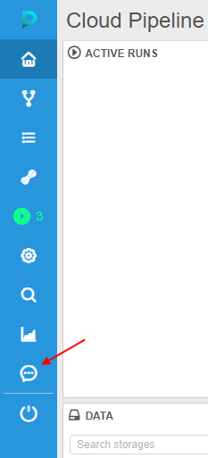
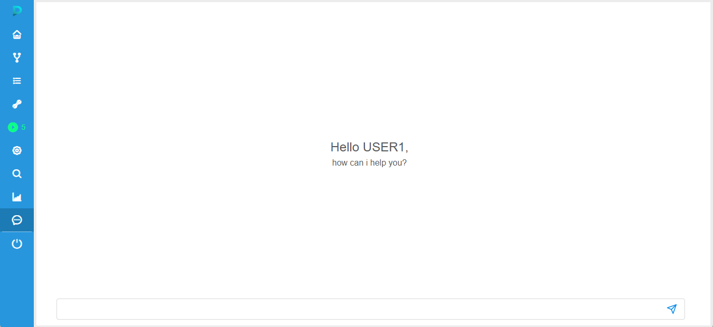
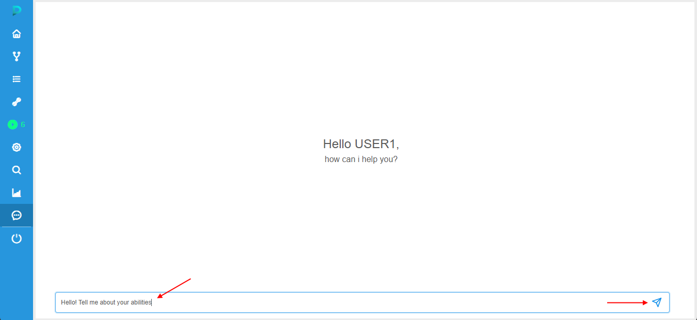
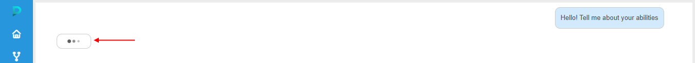
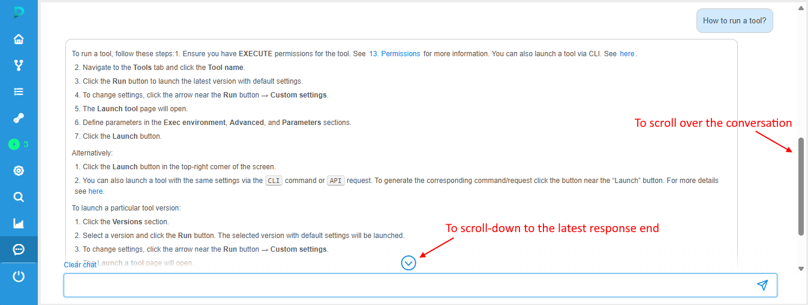
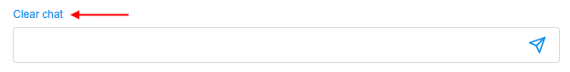
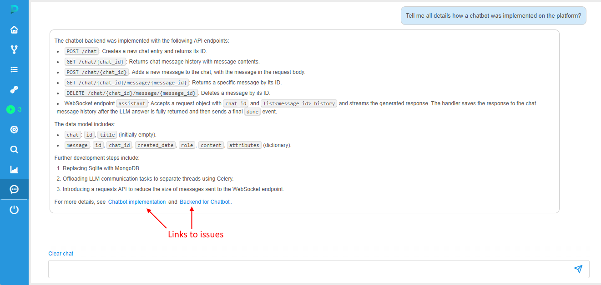
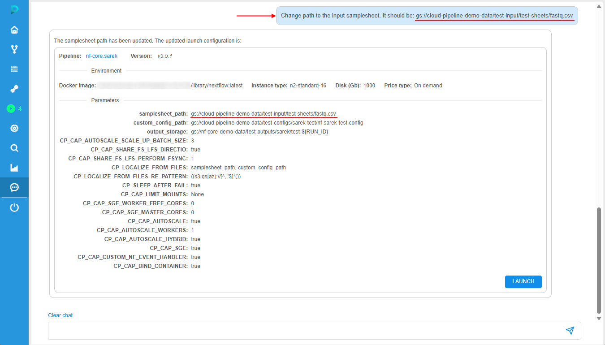
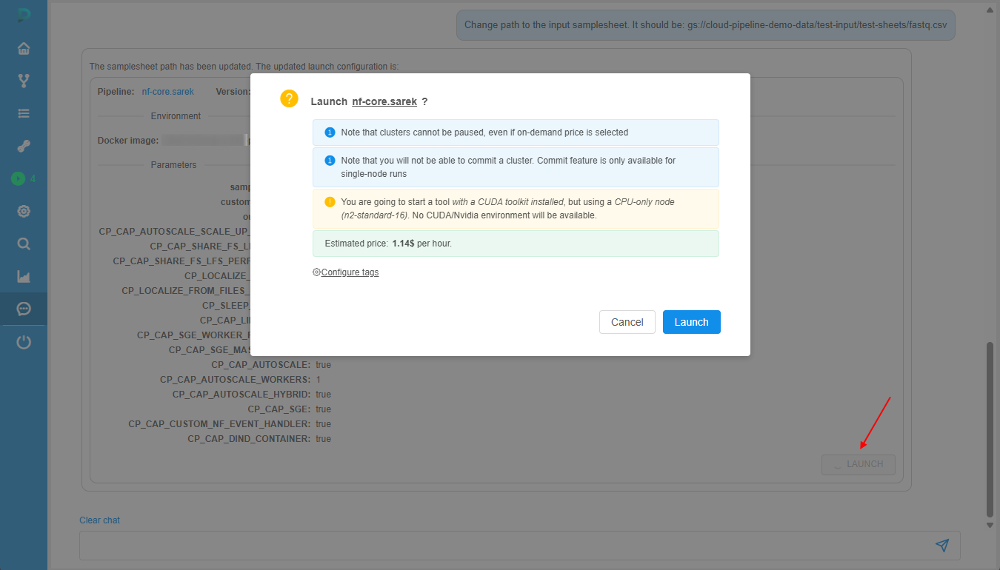
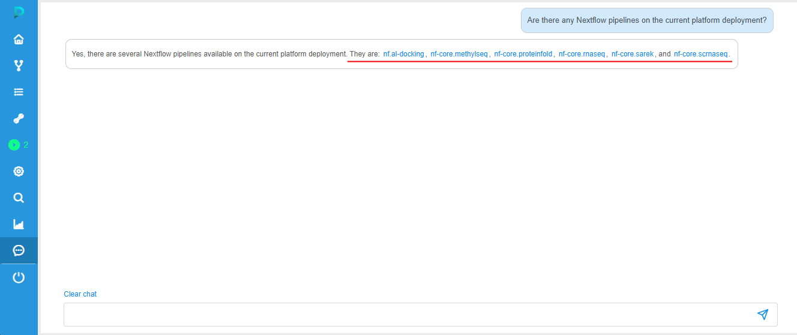

# Integrated chatbot

- [Using chatbot](#using-chatbot)
- [Response types](#response-types)
    - [Documentation-based manuals](#documentation-based-manuals)
    - [Issues-based responses](#issues-based-responses)
    - [Task execution](#task-execution)

Cloud Pipeline has the integrated AI-powered chatbot (based on [Gemini LLM](https://deepmind.google/models/gemini/)), enabling users to perform the following tasks:

- obtain help on the use of platform features
- assist with the data search, analysis and workflows launch

The general flow of interaction with the Cloud Pipeline chatbot is the following:

1. User initiates interaction - opens the chatbot interface.
2. User inputs a question - types a plain text question into the input text field.
3. User submits the question.
4. The chatbot analyzes the text input.
5. The chatbot generates a context-relevant response and displays it in the chat interface.
6. Subsequent possible user actions:  
    - continue the conversation with follow-up questions. Context will be saved by the chatbot during the conversation
    - navigate to the platform pages/documentation via links from the response
    - launch a run prepared by the chatbot

## Using chatbot

Chatbot is being opened from the main sidebar:  
    

Chatbot's start form looks like:  
    

Chatbot page contains:

- chat content form
- request input field with:  
    - text field to specify a request
    - button to submit a request. **_Note_**: request can be submitted by press the _Enter_ key as well

To start a conversation, specify a question and clicks the **submit** button (or press the _Enter_ key), e.g.:  
    

Once the request is submitted:

- your request appears in the chat content as a sent message
- chatbot starts the analysis of the submitted request:  
    
- once the response from the chatbot is generated, it will appear in the chat content as the answer message  
    **_Note_**: analysis process and response generation often take some time, so the response may not appear immediately.  
    

Response may include:

- section with the plain/formatted text - generated answer of the chatbot related to the user request
- hyperlinks to the issues on the platform's GitHub 
- hyperlinks to the platform objects (e.g. pipelines/tools)
- source references to the platform documentation

> If a new request is sent, previous messages will be automatically scroll up, off the page. To view that previous messages, use the vertical scrollbar or mouse wheel.  
> To scroll-down to the end of the latest response, click the corresponding button above the request input field:  
>   
>
> Please note, the chat history is stored during you use the platform. Therefore, you can navigate between platform pages, then return to the chatbot form, and all your chat correspondence will remain.

To remove the current chat correspondence, click the **Clear chat** button above the request input field:  
    

## Response types

Below, there are several of possible chatbot response types are shown.

> **_Note_**: please note that sometimes the AI model might generate incorrect or nonsensical information (hallucinations), or reflect biases present in the training data. So, not always chatbot answers will be absolutely correct or completely repeat the same response for the same request.

### Documentation-based manuals

In case, when help on the use of platform features was requested, a chatbot response contains user's "how-to" instructions and/or platform-reference information based on the platform documentation.  
This type of response may include:

- plain and formatted text
- references to the platform documentation

Example of the "how-to" question and the answer based on the documentation:
    

### Issues-based responses

In case, when user requests some information or help on the platform features that were mentioned in the Issues of the platform's [GitHub page](https://github.com/epam/cloud-pipeline), a chatbot response includes corresponding information based on the Issues content.  
This type of response may include:

- plain and formatted text
- references to the GitHub issues

Example of the answer based on the issues:
    

### Task execution

In case, when the chatbot recognizes a request to perform a task (launch a pipeline/tool), the response contains not only text message, but the prepared "card" that allows to launch a task, e.g.:  
    

This type of response includes:

- plain/formatted text
- "card" with details for a task to launch. That "card" contains:  
    - object (tool/pipeline) name and version. Name is presented as a hyperlink - by click it, the corresponding object's page will be opened
    - **Environment** section that shows main execution settings (_Docker image_, _Instance type_, _Disk size_ and _Price type_)
    - **Parameters** section that shows all task parameters and their values
    - **Launch** button - to confirm task execution

You can continue conversation and ask the chatbot to correct something in settings/parameters of the suggested task execution.  
For example, change a disk size:  
      
Or change a parameter value:  
    

When all settings/parameters are configured, click the **Launch** button to submit job execution.  
The confirmation pop-up will appear:  
      
Once the launch is confirmed, corresponding information will appear as a response from the chatbot, e.g.:  
      
This response includes:

- [state](../11_Manage_Runs/11._Manage_Runs.md#active-run-states) of the just-launched run. This state is automatically updated during the run execution
- run ID that is shown as hyperlink the [**Run logs**](../11_Manage_Runs/11._Manage_Runs.md#run-information-page) page

> Additionally, you may request for a list of available tools/pipelines to navigate or select the one, they will be displayed as hyperlinks, e.g.:  
>     
