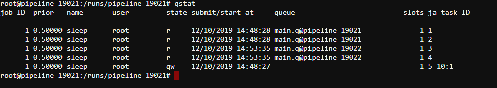
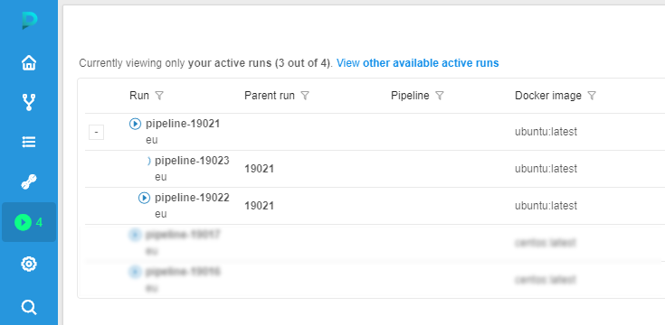
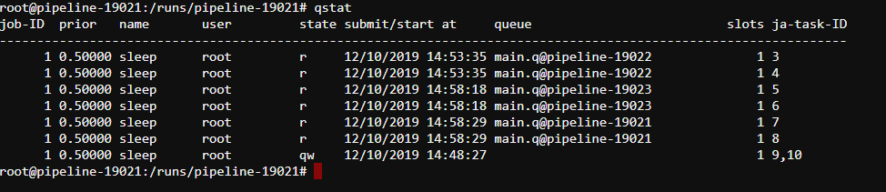

# Appendix C. Working with autoscaled cluster runs

- [Overview](#overview)
- [Limitations](#limitations)
- [How it works](#how-it-works)
    - [Finding expired jobs](#finding-expired-jobs)
    - [Launching workers](#launching-workers)
    - [Determing worker instance types](#determing-worker-instance-types)
    - [Killing excessive workers](#killing-excessive-workers)
    - [Preventing deadlocks](#preventing-deadlocks)
- [Configurations](#configurations)
- [Example](#example)

## Overview

Cloud Pipeline has support for launching runs using a single machine or a cluster of machines.  
Moreover Cloud Pipeline allows to launch so-called *autoscaled clusters* which are basically clusters of machines with dynamic size.  
It means that during the run execution additional worker machines can be attached to the cluster as well as removed from it.  
By the way an autoscaled cluster can have so-called *persistent* workers which cannot be affected by the autoscaler.

## Limitations

Currently only the SGE-based runs can be used efficiently with an autoscaled cluster capability.  
And only the CPU requirements of the SGE jobs are considered while calculating cluster unsatisfied resources.

## How it works

The cluster autoscaling tries to be intuitive and is pretty straightforward in most cases.  
Nevertheless it can get cumbersome with all the all allowed customization parameters.

The overall autoscaling approach is briefly described below.  
Please notice that all the described steps are executed repeatedly for all the cluster lifetime depending on the current situation.  

### Finding expired jobs

Autoscaler is a background process which constantly watches the SGE queues in order to find *expired jobs*.  
Basically expired jobs are the jobs that wait in any queue for more than some predefined time.

### Launching workers

Once expired jobs are found the autoscaler tries to launch an additional worker.  
The only case additional worker won't be launched is if all allowed additional workers are already set up.

### Determing worker instance types

Additional worker instance types can vary from only a master instance type up to some instance types family.  
Therefore there are *homogeneous clusters* that launches only the master instance type machines and *hybrid clusters* which
launches instance types from some instance type family.  
By default all autoscaled clusters are homogeneous.

If an autoscaled cluster is hybrid and it is launching an additional worker then its instance type will be resolved based on the amount of unsatisfied CPU requirements of all pending jobs.

### Killing excessive workers

Once required additional workers are set up the cluster gets bigger and more jobs can be executed simultaneously.  
At some point while jobs finish their execution some additional workers may become excessive.  
In this case the autoscaler will check if all the queues were empty for at least some predefined time and try to remove excessive additional workers from the cluster.

### Preventing deadlocks

In some specific cases autoscaled clusters may enter the *deadlock* situation.  
In terms of autoscaled clusters a deadlock is a situation when submitted jobs cannot be executed in the best allowed cluster configuration.

For example if a hybrid autoscaled cluster which can have at most a machine with 64 CPUs is used to submit a job with a requirement of 100 CPUs then the job won't be ever executed and will stuck in queue forever. Fortunately the autoscaler can detect such deadlocks and prevent them simply killing jobs that cannot be executed anyway.  
It most likely will fail the run execution but it is reasonable since the cluster usage is not properly configured in the run.

Besides an actual deadlock situation where are some similar cases when the cluster has reached its full capacity but some of the jobs are still pending.  
It is not the deadlock situation since the jobs can be still executed but in the different cluster configuration.  
The autoscaler will detect such situations and replace weak addition workers with a better ones.

## Configurations

| Pipeline parameter                  | System preference                   | Description |
| ----------------------------------- | ----------------------------------- | ----------- |
| `GE_AUTOSCALING_SCALE_UP_TIMEOUT`   | `ge.autoscaling.scale.up.timeout`   | Amount of seconds before any pending job is considered as expired. |
| `GE_AUTOSCALING_SCALE_DOWN_TIMEOUT` | `ge.autoscaling.scale.down.timeout` | Amount of seconds all queue should be empty before autoscaler tries to find excessive additional workers. |
| `CP_CAP_AUTOSCALE_HYBRID`           |                                     | Enables hybrid cluster mode. It means that additional worker type can vary within either master instance type family or `CP_CAP_AUTOSCALE_HYBRID_FAMILY` if specified. |
| `CP_CAP_AUTOSCALE_HYBRID_FAMILY`    |                                     | Explicit hybrid cluster additional worker instance type family. |

## Example

In this example we will see how an autoscaled cluster behaves on different conditions.

1. Let's say we have launch a homogeneous autoscaled cluster of `m5.large` instances (2 CPUs per instance) with no persistent workers which can scale up to 2 workers.  
You can find information on how to do that [in the corresponding page](../06_Manage_Pipeline/6._Manage_Pipeline.md#configuration).
2. On the **Runs** page we can see that the launched run doesn't have any workers.  
    
3. On the **Run logs page** click the **SSH** button.
4. In the opened terminal submit 10 single-core jobs to SGE queue using the following command `qsub -b y -t 1:10 sleep 10m`.
5. Check that the jobs have been successfully submitted using `qstat` command:  
    
6. Within several minutes an additional worker will be automatically added to out cluster:  
    
7. Once the addition worker is fully initialized we can see that it takes several jobs from the queue:  
    
8. A few moments later if there are still pending jobs in the queue a second additional worker will be created:  
    
9. And once it is initialized the worker will grab remaining jobs from the queue as well:  
    
10. As long as the most of the jobs are finishing and the workers become excessive they will be removed from the cluster:  
    
11. At first one of the workers becomes stopped:  
    
12. And then the last one becomes stopped too:  
    
13. From this point the cluster can scale up and down again and again depending on the pipeline usage.
