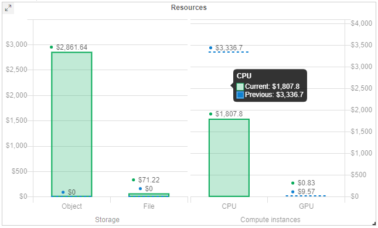
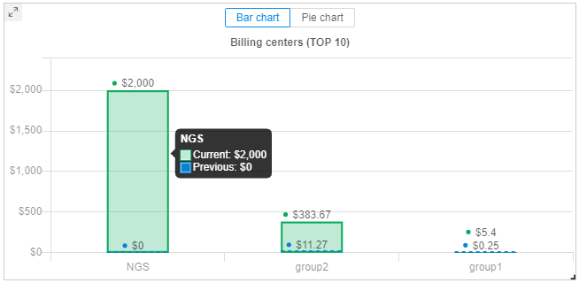
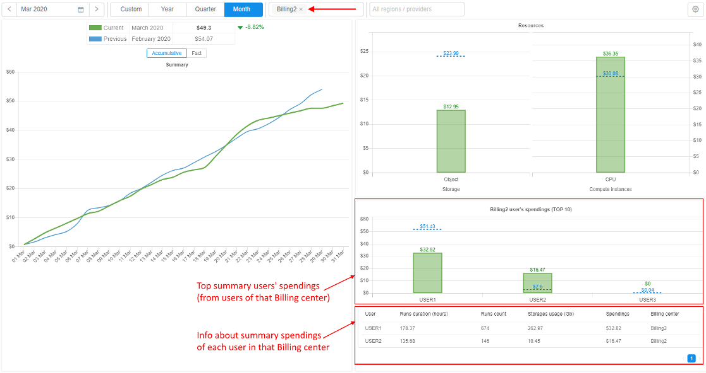
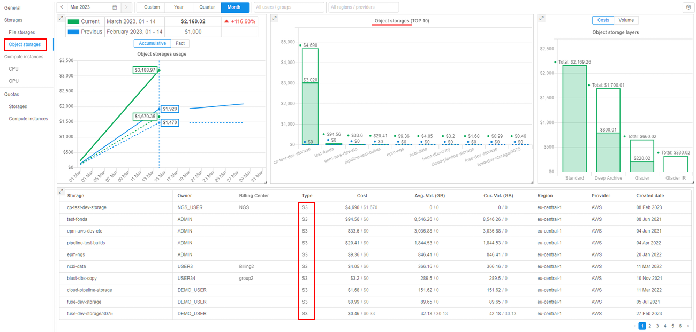
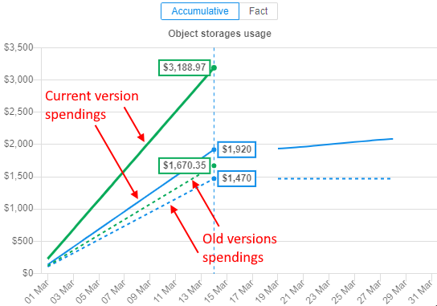
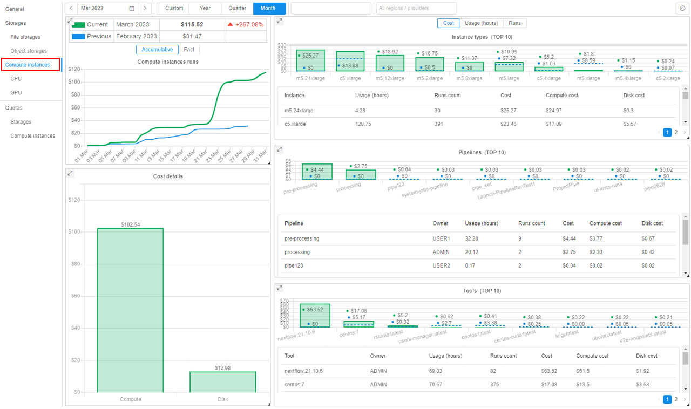
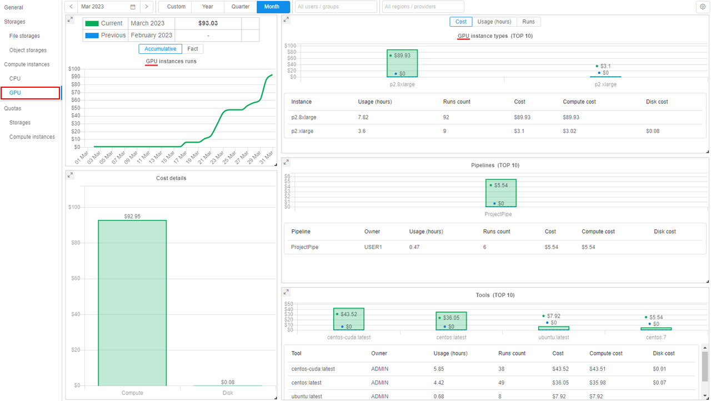

# Costs management rationale and concepts

- [Restricting the size of the compute cluster](#restricting-the-size-of-the-compute-cluster)
- [Compute nodes size](#compute-nodes-size)
- [Number of compute nodes](#number-of-compute-nodes)
- [Spot/Preemptible compute instances](#spotpreemptible-compute-instances)
- [Instance PAUSE/RESUME](#instance-pauseresume)
- [IDLE instances](#idle-instances)
- [Scheduled instances PAUSE/RESUME](#scheduled-instances-pauseresume)
- [Spending quotas](#spending-quotas)
- [Billing reports](#billing-reports)
    - [General costs report](#general-costs-report)
    - [User report](#user-report)
    - [Billing center/group report](#billing-centergroup-report)
    - [Resources reports](#resources-reports)
        - [Storages report](#storages-report)
            - [File storages report](#file-storages-report)
            - [Object storages report](#object-storages-report)
        - [Compute instances report](#compute-instances-report)
    - [Export reports](#export-billling-reports)
    - [Report aggregation level according to the permissions](#report-aggregation-level-according-to-the-permissions)

Any job, run in the Cloud Pipeline, or any file placed into the Cloud Storage - cost money. These costs are incurred by the underlying provider: AWS/GCP/Azure/etc.

At a scale, when hundreds of the platform users submit the jobs and utilize the storage capacity, the cloud bill may grow to a quite high level.

Even more, some of the users may not be aware of the underlying billing and keep the instances up and running for months, but not performing any productive work.
To address these issues, Cloud Pipeline provides a number of features, that allow to reduce and control the costs.

This machinery can be split into separate sections:

- Features that allow to **minimize the costs**, e.g. by limiting the size of the compute nodes or automatically stopping IDLE jobs
- **Reporting features**, that make users aware of the workload costs, e.g. by notifying the users on the IDLE jobs or providing interactive spending dashboard

This document lists the concepts and corresponding features (either Ready and WIP as well).

## Restricting the size of the compute cluster

From the overall Cloud usage experience - the largest bills are generated by the compute resources, not the storages. And the key driver of the compute cost is the size/shape of the compute nodes used.

## Compute nodes size

Each of the Cloud Providers offers lots of different compute instances families and types and most likely the users won't need that variety. Users may even choose huge GPU-enabled nodes by mistake, which are the most expensive.

Cloud Pipeline allows to restrict which sizes are available to the users for a specific platform deployment, thus reducing a chance of spending money unused resources of a huge node.

These restrictions can be applied to the overall platform and than fine-tuned for a specific users' group, specific user or a docker image.

## Number of compute nodes

While we can restrict the size of each single compute node - it is still possible to spin up an uncontrolled number of smaller instances, which still costs a lot.

Cloud Pipeline offers a way to restrict the number of simultaneously running Cloud instances in the following manner:

- Administrator may configure the overall number of compute nodes, that may be created for this particular platform deployment. This restriction will be in effect across all the users/groups/tools. E.g. if the administrators sets this parameter to `50` nodes and we already have 50 nodes running jobs - the 51st node won't be created. The corresponding job will sit in the queue until the previous runs finish and free the space for the new instance.
- Users may also spin-up `on-demand clusters`, i.e. a single job run which require more than a single compute node (e.g. a molecular dynamics job, which needs a 200 of CPU cores interconnected with MPI). In this case - administrator may limit the size of such `on-demand clusters`. E.g. limiting this parameter to `5` will allow user to launch several jobs in a cluster mode, but each cluster will be limited to max `5` hosts.

## Spot/Preemptible compute instances

One of the very first cost reduction options to consider is the usage of Spot/Preemptible compute nodes.

The behavior and savings are a bit different across the underlying Cloud providers, but in general all of them follow the strategy: allow to use the compute resources for a limited time at a greatly reduced costs. It's quite hard to predict the savings in general, but typically this will be *~twice cheaper* than general on-demand instance type.

For more details on the Spot/Preemptible compute instances details, please review the corresponding provider's documentation:

- [AWS Spot instances](https://aws.amazon.com/ec2/spot/)
- [GCP Preemptible VMs](https://cloud.google.com/preemptible-vms/)
- [Azure Preemptible VMs](https://docs.microsoft.com/en-us/azure/batch/batch-low-pri-vms)

While being quite cost-effective, such type of compute instances are not reliable for the long-running or stateful jobs.

Cloud Pipeline encourages users to leverage the Spots/Preemptibles for:

- The **Batch** jobs, e.g. NGS pipelines which can be easily restarted
- **Testing/Proofing** tasks, when some script shall be debugged or a new package tested

For the interactive tasks, e.g. `Jupyter notebooks`, which require online access from the users - such type of instance does not fit well.

Another limitation of the Spots/Preemptibles is that such jobs cannot be `Paused` (i.e. stop consuming money, but keep the job's environment). Such kind of compute nodes can be fully terminated only.

From the Cloud Pipeline's point of view this option is considered a `Price Type` and can be enabled at different levels:

- Globally, at a platform level (if the Spot/Preemptible can be used by any job in the platform)
- User group or a specific user levels (if can be used by the specific users)
- Pipeline level (if a particular pipeline can tolerate Spots/Preemptibles restarts)
- Docker image/version (if a particular image can be launched using a reduced cost instances)

## Instance PAUSE/RESUME

From the existing usage scenarios the best compute costs reduction was observed, when the interactive tools were stopped while not used.

The typical use case here is:

- User launches some IDE (e.g. RStudio/Jupyter)
- Works during the day
- Keeps the instance running over the night or weekends

This introduces really high spendings, but without any actual outcome, as the instance is doing nothing.
To address this, Cloud Pipeline allows to `PAUSE` and `RESUME` any instance/job, which is created using `on-demand` price type.
While the instance is `paused` - compute is not charged, but the job's environment and filesystem is persisted. Once required - the instance can be `resumed`.

Under the hood, the "real" compute instances are `stopped/deallocated` and than restarted. Cloud Pipeline takes care of the software state persistance and restore.

In general, this feature is available via the Web GUI and API and the users are in charge of performing this pause/resume operation. API allows to automate this procedure (e.g. based on the schedule or resources usage) and the subsequent sections describe this approach.

See [Manage runs lifecycles](../11_Manage_Runs/11.1._Manage_runs_lifecycles.md) for more details.

## IDLE instances

This section extends the "plain" `PAUSE/RESUME` by managing the **IDLE** instances.

Besides the describe above night-time/weekends cases, here we also consider under-utilization of the compute resource. E.g. if the user selects 96-cored instance (maybe by mistake), but runs a single-threaded application. In this case lots of CPU resources are just wasted.

Cloud Pipeline mixes together the `PAUSE/RESUME` and instances workload monitoring and offers a set of policies, which can be applied to the compute instances to take care of such **IDLE** instances.

These policies can be used in the following manner:

- Platform administrators can define thresholds for the hardware utilization (CPU/GPU usage) and overall run duration.
- If some job is considered as **IDLE** (the hardware utilization is below the threshold for the configured period of time) – a number of actions can be performed (a single or a mixture of them):
    - Job is marked as **IDLE** in the GUI
    - Email Notification is sent (to the Adminstrators and the Owner of the instance) to make user aware of the event
    - Job can be automatically paused (if it’s price type and cluster mode are compatible with the `PAUSE` operation)
    - Job can be terminated

## Scheduled instances PAUSE/RESUME

For certain use cases (e.g. when then user leverages Cloud Pipeline as a development/research environment) users launch runs and keep them running all the time, including weekends and holidays. As shown in the examples above.

One can use the `IDLE` policy to `PAUSE` such jobs, but the `IDLE` status is set only when the threshold is exceeded. This time (while the platform will decide to treat a job as `IDLE`) also costs some money. So to manage the jobs that shall be stopped for the non-working hours - a `PAUSE/RESUME` schedule is used.

- User (who have permissions to pause/resume a run) is able to set a schedule for an active run or a run being launched
- Schedule is defined as a list of rules (user shall be able to specify any number of them):
    - Action: `PAUSE` or `RESUME`
    - Recurrence:
        - Daily: every N days, time
        - Weekly: every N weeks, weekday, time
- User is able to create/view/modify/delete schedule rules anytime run is active (i.e. running or paused)
- This is applied only to the "Pauseable" runs (i.e. On-demand/Non-cluster)

## Spending quotas

While the described options are mostly focused on the **soft** cost reduction (e.g. help the user to decide on the instance type), the platform shall be also capable of enforcing certain policies if the **soft** restrictions didn't work.

This kind of restriction is controlled by the `spending quotas`. This functionality allows to apply policies to the platform's entities:

- User - quotas can be applied to a specific user
- Users group - group of users can be restricted separately as well
- Billing/Cost center - this is a different dimension of the users grouping. Typically this is a **meta-group**, which is not used to apply security permissions. Such groups describe, e.g. the departments, which have separate budget and can manage it
- Global - administrator can define what is the overall budget for the platform

Each of those user groupings can be managed by the platform administrator or an authorized manager (who is assigned a corresponding platform role).

For each of the quotas configured – there is an option to specify the thresholds (e.g. 50% / 75% / 100%), when a specific action shall be performed by the platform:

- "Notify" (default) - this action will only notify corresponding users that a limited is exceeded. The access to the platform shall not be restricted
- "Read-only & keep jobs" - corresponding users that a limited is exceeded and then will have the "read-only" access to the platform, they won't be able to launch new jobs. All active runs will be kept
- "Read-only & stop jobs" – same as previous, but all the active runs will be stopped
- "Block" - corresponding users will be blocked and won’t have any access to the platform. After a time period for which the limit is set, the access to the platform shall be restored to users according to their permissions.

## Billing reports

To make the users aware of the current bills and quota policy attached - platform logs the information on the compute and storage costs.

This reporting feature is available in two flavors:

- When a compute job is launched - user is notified on the hourly cost of the chosen hardware configuration  
    
- Compute and storage costs are aggregated into the ElasticSearch index on a daily basis and can be queried to build the historical reports

### General costs report

The latter one offers graphical/tabular visualization options to get the insights on a current or a previous period bills:  
    

By these forms users can view the whole system spendings, or spendings divided by the specific resources.  
Presented metrics (resources):

- costs of launching compute instances, used for tools/pipelines runs. There could be:
    - CPU instances
    - GPU instances
- costs of storing user data in storages. There could be costs of storing:
    - in Object storages
    - in File storages
- info about auxiliary costs isn't supported yet

All costs are aggregated and displayed for the specific period (by default - the current calendar month). Selected specific period, for which the costs are being calculated and displayed, is called "**current**". Also, for comparison, the costs for the analogical previous period are displayed in diagrams/charts (where this data is available).  
The user can select the desired (_current_) period to view the costs incurred:

- from one of predefined periods. For each of them there will be a specific "_previous_" period:
    - **Month**. If the month is selected as a current period - costs will be shown for the period from the first day of the month till previous calendar day (if the month hasn't ended yet) or the whole month if it has already ended. The "_previous_" period will be the same days interval but in the previous calendar month  
    
    - **Quarter**. If the quarter is selected as a current period - costs will be shown for the period from the first day of the quarter till previous calendar day (if the quarter hasn't ended yet) or the whole quarter if it has already ended. The "_previous_" period will be the same interval in a quarter but in the previous calendar year  
    
    - **Year**. If the year is selected as a current period - costs will be shown for the period from the first day of the year till previous calendar day (if the year hasn't ended yet) or the whole year if it has already ended. The "_previous_" period will be the same interval in the previous calendar year  
    
- custom period. That period is configured by the user manually and can have any duration. The "_previous_" period isn't displayed in this case  
    

By default, the "Billing Visualization" form looks like on the picture above.  
It contains:

- General report table with the following data:
    - current and previous periods, for which the costs are calculated
    - summary spendings according to selected configurations in the toolbar for the current and previous periods
    - the difference between the costs of current period and the previous one in percentage with a certain mark to determine whether spendings grow or reduce  
    
- The main summary costs diagram. On this diagram, the user can see summary spendings over the current and the previous time periods according to selected configurations in the toolbar. This data could be displayed with the accumulation (as _line chart_) or as fact (as _bar chart_ with actual spending values in each time point of the period without accumulation)
    - if the selected "_current_" period coincides with the current corresponding calendar period - there a slice line is displayed on the current calendar date: on its intersection with the "_current_" chart line, the amount of money which was spent from the beginning of the period to the current date is displayed and on its intersection with the "_previous_" chart line - the amount of money which was spent for the same previous time period is displayed  
    
    - the user can hover any point of the "_current_"/"_previous_" line of the diagram - the summary spendings at the corresponding datetime will appear in the tooltip
        - the aggregation value of timeline division for selected periods less than 4 months is 1 day, in other cases - 1 month  
        > **_Note_**: costs of the current calendar day is being aggregated in the following day, so they aren't displayed in diagrams

        With accumulation:  
          
        And actual values (without accumulation):  
          

- The spendings bar chart with the **Resources** division. On this chart, the user can view the division of summary spendings in a selected time period over the resource groups - _Storages_ (with division into _Object_ and _File_ storages) and _Compute Instances_ (with division into _CPU_ and _GPU_). Also, for each resource, the summary spendings for the same _previous_ period are presented as well:  
    
- The spendings bar chart with the **Billing centers** division. On this chart, the user can view the division of summary spendings (all resource types) in a selected time period over the billing centers (the system displays only top `N` most costly billing centers). For each displayed center/group, the summary spendings for the same _previous_ period is presented as well:  
      
    - Data can be shown as a _bar chart_ (default, see the picture above) or as a _pie chart_  
    
- The report toolbar with the following controls:  
      
    - **calendar control** - to select another "_current_" period that doesn't coincide with the current calendar period (for predefined periods) or manually select desired period duration (for custom period)
    - **period selector** - to select a _current_ time period for the report - from one of predefined periods or the manual custom period
    - filter to restrict shown spendings to a specific billing center (user group) or a user. By default, all available centers/users are selected (no restrictions)
    - filter to restrict shown spendings to a specific Cloud region or Cloud provider. By default, all available regions/providers are selected (no restrictions)
    - options menu. Includes items:
        - to configure discounts for the current Cloud Pipeline deployment (if the are applicable). Discounts can be configured separately - for compute instances and storages
        - to restore origin layout. As all forms at the billing page can be displaced or resized, this item may be helpful to restore the origin forms view
        - to show/hide [spendings quotas](#spending-quotas) on the billing costs charts
        - to export raw spendings data of a displayed report to the local workstation - in _\*.csv_ or image format  
        

The billing report form described above is general.

To get info/charts of summary spendings in any desired period (from available) you shall select the corresponding period via the _Period selector_ and _Calendar control_.

To get info/charts of summary spendings for specific Cloud Provider(s) (_for multi-Provider deployments_) or for specific Region(s) of the Cloud Provider you shall apply the corresponding filter, e.g.:  
    

To get info/charts of summary spendings in the selected period only for the specific resource group you can click that resource in the **Resources** chart or use the corresponding item of the menu in the left side of the page (for more details see sections [below](#resources-reports)).

### User report

To get info/charts of summary spendings in the selected period only for the specific user you can select the desired user from the dropdown list in the main toolbar. In this case:

- the costs data will be calculated and displayed only for the selected user (in the general report table, in the main diagram and in the resources chart)
- the spendings bar chart with the **Billing centers** division will disappear, e.g.:  
    

Filter supports multiselect, i.e. several users can be selected simultaneously. Shown spendings will be summarized for them.  
> **_Note_**: although field is single for the filter by users and billing centers (groups), you can not select some user(s) and some group(s) in the same moment - filter only by one metric may be applied.

### Billing center/group report

To get info/charts of summary spendings in the selected period only for the specific Billing center you can:

- select the desired one from the dropdown list in the main toolbar, e.g.:  
    
- _OR_ click the    Billing Center's bar in the **Billing centers** division chart, e.g.:  
    

In this case:

- the costs data will be calculated and displayed only for the selected Billing center (summary for all its users - in the general report table, in the main diagram and in the resources chart)
- the bar chart with the top `N` of users' spendings in the selected period (among all users in that Billing center) will appear
- the table with short info about summary spendings of each user of that Billing center in the selected period (also info contains summary duration and count of the runs launched by the user, used storages volume) will appear, e.g.:  
    

You can click any user from the bar chart or from the details table with the top `N` of users' spendings - the corresponding [user report](#user-report) will be opened.

> **_Notes_**: filter by billing centers supports multiselect, i.e. several billing centers can be selected simultaneously. Shown spendings will be summarized for them, but the view of the page will be the same as [general report](#general-costs-report), i.e. the bar chart and table with the top `N` of users' spendings will not be displayed.  
> Also although field is single for the filter by users and billing centers (groups), you can not select some user(s) and some group(s) in the same moment - filter only by one metric may be applied.

### Resources reports

If you wish - you may get info/charts of summary spendings not for all resources but for the specific resource group.  
Also, for these charts you may select the desired time period and specific user/Billing center (group) to view costs in the way analogical as described above.

#### Storages report

To get info/charts of summary spendings in the selected period only for the _Storages_ resource group (costs of the storing data in storages) you can click the corresponding item of the menu in the left side of the page:  
    

In this case, the summary costs for all used storages during the selected period by selected users/Billing center will be calculated and displayed (both types - Object/File storages).

In the appeared page, you can see:

- General report table with summary costs for all used storages during the selected and previous (_if it's available_) periods
- The summary _Storages_ spendings diagram over the _current_ and the _previous_ time periods according to selected configurations in the toolbar. This data could be displayed with the accumulation (as _line chart_) or as fact (as _bar chart_ with actual spending values in each time point of the period without accumulation)
- The spendings bar chart with top `N` most costly storages used during the selected period compared with the _previous_ one (_if it's available_)
- The detailed spendings table under the chart with the _full_ list of storages used during the selected period by selected user/Billing center

Example:  
    

Spendings bar chart with top `N` most costly storages can show the information as storages costs - in `$` (default, see the picture above) or as average storages volumes - in `Gb`:  
      
Switching this view mode does not affect the summary chart or details spendings table.

The detailed spendings table contains the following info for each storage:

- **Storage** - storage name
- **Owner** - storage _OWNER_ username
- **Billing Center** - billing center (group) of the storage _OWNER_, if it's defined
- **Type** - storage type (`S3`/`GS`/`NFS`/`LustreFS`/etc.)
- **Cost** - total spendings for the storage in the selected period
- **Avg.Vol. (GB)** - the _average_ storage volume, in GB. It means that the exact volumes for each day of the selected report period were brought and then the average value was calculated
- **Cur.Vol. (GB)** - the _current_ storage volume, in GB. This volume is a real volume for a current moment/last day of the selected period
- **Region** - Cloud Region
- **Provider** - Cloud provider
- **Created date** - storage creation date

In the **Storages** report, there is no division by storage type (_Object_/_File_). All data is calculated and displayed summary for both types.  
If you want to view costs only for storages with the specific type - you can select the corresponding one in the menu at the left side of the page (see sections below for details).  

##### File storages report

File storages report has fully the same view (set of forms) as [common storages report](#storages-report), but with information for file storages only e.g.:  
    

##### Object storages report

Object storages report has the view (set of forms) distinct from [common storages report](#storages-report), e.g.:  
    

> As object storages supports [versioning](../08_Manage_Data_Storage/8.4._Control_File_versions.md) and [archiving](../08_Manage_Data_Storage/8.10._Storage_lifecycle.md#archiving) data into different archive tiers, the Object storages report supports the displaying of the corresponding related information.  
> In this section, the following terms will be used:
> 
> - **_current version_** - last (current) version of the versioning object storage or current version of the non-versioning object storage
> - **_old versions_** - all non-last (previous) versions of the versioning object storage

Report includes:

- General report table with summary costs for all used object storages during the selected and previous (_if it's available_) periods
- The summary _Object storages_ spendings diagram over the _current_ and the _previous_ time periods according to selected configurations in the toolbar.  
    This data can be displayed:  
    - with the accumulation (as _line chart_).  
    Solid lines show summary spendings on the data usage for _current version_ of object storages (for _current_ and _previous_ periods).
    Additionally, for each solid line, there is a dashed line of the same color - that line shows summary spendings on the data usage for all _old versions_ of object storages  
      
    Spendings on different versions are shown in a tooltip as well: the summary value is shown and separately - spendings on _current version_ and on _old versions_, e.g.:  
    
    - or as fact (as _bar chart_ with actual spending values in each time point of the period without accumulation).
    Each bar is displayed as a stack of _current version_ spendings / _old versions_ spendings in the specific time point. _Current version_ spendings are shown with solid filling, _old versions_ spendings are shown without filling. For _current_ and _previous_ periods charts are shown in different colors.  
    
- The spendings bar chart with top `N` most costly object storages used during the selected period compared with the _previous_ one (_if it's available_).  
    Each bar is displayed as a stack of _current version_ spendings / _old versions_ spendings of the specific object storage. _Current version_ spendings are shown with solid filling, _old versions_ spendings are shown without filling. For _previous_ period, charts are shown in different colors and only as dashed lines.  
      
    If data in the storage is storing in different tiers (archive types), this can be viewed in a tooltip - there will be a division of spendings by the used tiers. Versions division for each tier will be shown as well, e.g.:  
      
- The spendings bar chart with division to different tiers (archive types). This chart does not contain any information for _previous_ period. Only layers used for data storing in the _current_ period according to selected filters are shown. Up to 4 layers can be here: `Standard`, `Glacier`, `Glacier IR`, `Deep Archive`. If any layer has _old versions_ - this will be shown as a stack of _current version_ spendings / _old versions_ spendings for that layer. _Current version_ spendings are shown with solid filling, _old versions_ spendings are shown without filling, e.g.:  
      
    Object storage layers chart can show the information as storages usage costs - in `$` (default, see the picture above) or as average storages volumes - in `Gb`:  
      
    **_Note_**: switching this view mode also affects the chart with top `N` most costly object storages:  
      
    Details of the versions division can be viewed in a tooltip of each layer bar, e.g.:  
      
- The detailed spendings table under the chart with the _full_ list of object storages used during the selected period by selected user/Billing center. This table contains the following info for each object storage:  
    - **Storage** - storage name
    - **Owner** - storage _OWNER_ username
    - **Billing Center** - billing center (group) of the storage _OWNER_, if it's defined
    - **Type** - object storage type (`S3`/`GS`/ etc.)
    - **Cost** - spendings for the storage in the selected period. There are two values are shown in format `total spendings for all versions` / `spendings for old versions only`
    - **Avg.Vol. (GB)** - the _average_ storage volume, in GB. It means that the exact volumes for each day of the selected report period were brought and then the average value was calculated. There are two values shown in the format `average volume of all versions` / `average volume of old versions only`
    - **Cur.Vol. (GB)** - the _current_ storage volume, in GB. This volume is a real volume for a current moment/last day of the selected period. There are two values shown in the format `current volume of all versions` / `current volume of old versions only`
    - **Region** - Cloud Region
    - **Provider** - Cloud provider
    - **Created date** - storage creation date

User can select one of the object storage layers - by click it on the corresponding chart.  
In this case, all charts and tables will be updated - only storages, that contain files in the selected layer type, will be shown in forms.  
Also, shown spendings/data volume will be related only to files in the selected layer, not for the whole storage(s) or other layers.  
For example, `Glasier IR` was selected in the Object storage layers chart for some user:  
    

To clear selection of the object storage layer - click it again or click the cross-button near the layer label in the top of the chart:  
    

#### Compute instances report

To get info/charts of summary spendings in the selected period only for the _Compute instances_ resource group (costs of the launching instances for running tools/pipelines) you can click the corresponding item of the menu in the left side of the page:  
    

In this case, the summary costs for all launched instances during the selected period by selected users/Billing center will be calculated and displayed (launched tools/pipelines and both instance types - CPU/GPU).

In the appeared page, you can see:

- General report table with summary costs for all runs launched in the selected and previous (_if it's available_) periods
- The summary _Compute instances_ spendings diagram over the current and the previous time periods according to selected configurations in the toolbar. This data could be displayed with the accumulation (as _line chart_) or as fact (as _bar chart_ with actual spending values in each time point of the period without accumulation)
- The spendings bar chart with top `N` most costly instance types launched in the selected period compared to the previous one (_if it's available_)
    - The detailed spendings table under that chart with the _full_ list of launched instance types in the selected period
- The spendings bar chart with top `N` most costly tools launched in the selected period compared to the previous one (_if it's available_)
    - The detailed spendings table under that chart with the _full_ list of launched tools in the selected period
- The spendings bar chart with top `N` most costly pipelines launched in the selected period compared to the previous one (_if it's available_)
    - The detailed spendings table under that chart with the full list of launched pipelines in the selected period
- Additional control that allows to change displaying of spendings bar charts with the following possible values:
    - **cost** (default) - on 3 above described bar charts top `N` most costly objects (instance types, tools, pipelines) are displayed. Data Unit - _currency_
    - **usage** - on 3 above described bar charts top `N` most involved objects (instance types, tools, pipelines) are displayed. Data Unit - _usage hours_
    - **runs** - on 3 above described bar charts top `N` objects (instance types, tools, pipelines) with the largest runs count are displayed. Data Unit - _runs count_

Example:  
    

By default, in this form there isn't the division by workload type (CPU/GPU). All data is calculated and displayed summary for both types.  
If you want to view costs only for instances with the specific workload type - you can select the corresponding one in the menu at the left side of the page.  
E.g., for CPU:  
    

### Export billling reports

User can export a shown billing report.  
Export is available from the **Options menu** in the right-upper corner of each report section.  
Export options can vary in different report sections. Possible formats - `CSV` (for datatables) and `PNG` (for images).

**General section**

From the General section, the following exports are available:  
    

- `CSV` by Billing Centers - in this case, the general billing report will be split by billing centers (groups)  
    
- `CSV` by Users - in this case, the general billing report will be split by users  
    
- Image - in this case, export will be performed as image that contains pictures of charts as they were on the screen

**Storages section**

From the Storages section and its sub-sections, the following exports are available:  
    

- `CSV` - in this case, the billing report will be split by storages. The view of the report is similar to the detailed spendings table  
    
- Image - in this case, export will be performed as image that contains pictures of charts as they were on the screen (without detailed spendings table)

Export of the _Object storages_ reports is different from other storages' reports.  
This export additionally supports breaking of data by versions and archive tiers:

- if there are any spendings in the archive layer - for that layer, separate columns of _Cost_, _Average Volume (GB)_ and _Current Volume (GB)_ will be in the exported report
- for versioning storages, there are separate columns for the _current version_ and _old versions_

Example of the _Object storages_ report export (please note, there is only a part of the report is shown):  
    

**Compute instances**

From the Compute instances section and its sub-sections, the following exports are available:  
    

- `CSV` - in this case, the billing report will contain 3 parts - for most costly instances types, pipelines and tools - as on the report page  
    
- Image - in this case, export will be performed as image that contains pictures of charts as they were on the screen (without detailed spendings tables)
- Raw data - in this case, the export will contain the full raw list of runs that were used for the report shown on the screen
    

### Report aggregation level according to the permissions

Available reports are calculated and displayed according to the user permissions:

- _General users_ can have base access to the **Billing reports** that allows to view some information - about users' own spendings:
    - this behavior is enabled by the system preference **`billing.reports.enabled`**. If this preference is set, all _general users_ can access personal billing information - runs/storages where the user is an owner. Also _general users_ can use filters, change chart types, make reports export.
    - the following restrictions are set for _general users_ when "base" billing access is enabled:
        - all showing charts are being displayed only spendings of the current user
        - there isn't an ability to configure discounts, the button "**Configure discounts**" is disabled
        - "Billing centers (TOP 10)" chart isn't displayed
- _Billing center (group) leader_ can have extended access to the **Billing reports**:
    - a special role exists for that - **`ROLE_BILLING_MANAGER`**. The **Billing reports** Dashboard becomes available for user in full, if this role is assigned to the user. In this case, all possible filters, charts and their types, discounts configuration, export feature and etc. become available too. So, users who are granted this role are able to view the whole **Billing reports** info of the platform (as if they were admins).
- _Platform admin_ can view all available reports

> **_Note_**: there is a special system preference **`billing.reports.enabled.admins`**. It allows to configure **Billing reports** visibility for admins and billing managers. Default value is _true_. 
