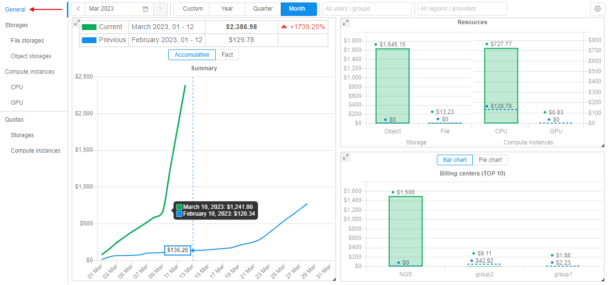

# Costs management rationale and concepts

- [Restricting the size of the compute cluster](#restricting-the-size-of-the-compute-cluster)
- [Compute nodes size](#compute-nodes-size)
- [Number of compute nodes](#number-of-compute-nodes)
- [Spot/Preemptible compute instances](#spotpreemptible-compute-instances)
- [Instance PAUSE/RESUME](#instance-pauseresume)
- [IDLE instances](#idle-instances)
- [Scheduled instances PAUSE/RESUME](#scheduled-instances-pauseresume)
- [Spending quotas](#spending-quotas)
- [Billing reports](#billing-reports)

Any job, run in the Cloud Pipeline, or any file placed into the Cloud Storage - cost money. These costs are incurred by the underlying provider: AWS/GCP/Azure/etc.

At a scale, when hundreds of the platform users submit the jobs and utilize the storage capacity, the cloud bill may grow to a quite high level.

Even more, some of the users may not be aware of the underlying billing and keep the instances up and running for months, but not performing any productive work.
To address these issues, Cloud Pipeline provides a number of features, that allow to reduce and control the costs.

This machinery can be split into separate sections:

- Features that allow to **minimize the costs**, e.g. by limiting the size of the compute nodes or automatically stopping IDLE jobs
- **Reporting features**, that make users aware of the workload costs, e.g. by notifying the users on the IDLE jobs or providing interactive spending dashboard

This document lists the concepts and corresponding features (either Ready and WIP as well).

## Restricting the size of the compute cluster

From the overall Cloud usage experience - the largest bills are generated by the compute resources, not the storages. And the key driver of the compute cost is the size/shape of the compute nodes used.

## Compute nodes size

Each of the Cloud Providers offers lots of different compute instances families and types and most likely the users won't need that variety. Users may even choose huge GPU-enabled nodes by mistake, which are the most expensive.

Cloud Pipeline allows to restrict which sizes are available to the users for a specific platform deployment, thus reducing a chance of spending money unused resources of a huge node.

These restrictions can be applied to the overall platform and than fine-tuned for a specific users' group, specific user or a docker image.

## Number of compute nodes

While we can restrict the size of each single compute node - it is still possible to spin up an uncontrolled number of smaller instances, which still costs a lot.

Cloud Pipeline offers a way to restrict the number of simultaneously running Cloud instances in the following manner:

- Administrator may configure the overall number of compute nodes, that may be created for this particular platform deployment. This restriction will be in effect across all the users/groups/tools. E.g. if the administrators sets this parameter to `50` nodes and we already have 50 nodes running jobs - the 51st node won't be created. The corresponding job will sit in the queue until the previous runs finish and free the space for the new instance.
- Users may also spin-up `on-demand clusters`, i.e. a single job run which require more than a single compute node (e.g. a molecular dynamics job, which needs a 200 of CPU cores interconnected with MPI). In this case - administrator may limit the size of such `on-demand clusters`. E.g. limiting this parameter to `5` will allow user to launch several jobs in a cluster mode, but each cluster will be limited to max `5` hosts.

## Spot/Preemptible compute instances

One of the very first cost reduction options to consider is the usage of Spot/Preemptible compute nodes.

The behavior and savings are a bit different across the underlying Cloud providers, but in general all of them follow the strategy: allow to use the compute resources for a limited time at a greatly reduced costs. It's quite hard to predict the savings in general, but typically this will be *~twice cheaper* than general on-demand instance type.

For more details on the Spot/Preemptible compute instances details, please review the corresponding provider's documentation:

- [AWS Spot instances](https://aws.amazon.com/ec2/spot/)
- [GCP Preemptible VMs](https://cloud.google.com/preemptible-vms/)
- [Azure Preemptible VMs](https://docs.microsoft.com/en-us/azure/batch/batch-low-pri-vms)

While being quite cost-effective, such type of compute instances are not reliable for the long-running or stateful jobs.

Cloud Pipeline encourages users to leverage the Spots/Preemptibles for:

- The **Batch** jobs, e.g. NGS pipelines which can be easily restarted
- **Testing/Proofing** tasks, when some script shall be debugged or a new package tested

For the interactive tasks, e.g. `Jupyter notebooks`, which require online access from the users - such type of instance does not fit well.

Another limitation of the Spots/Preemptibles is that such jobs cannot be `Paused` (i.e. stop consuming money, but keep the job's environment). Such kind of compute nodes can be fully terminated only.

From the Cloud Pipeline's point of view this option is considered a `Price Type` and can be enabled at different levels:

- Globally, at a platform level (if the Spot/Preemptible can be used by any job in the platform)
- User group or a specific user levels (if can be used by the specific users)
- Pipeline level (if a particular pipeline can tolerate Spots/Preemptibles restarts)
- Docker image/version (if a particular image can be launched using a reduced cost instances)

## Instance PAUSE/RESUME

From the existing usage scenarios the best compute costs reduction was observed, when the interactive tools were stopped while not used.

The typical use case here is:

- User launches some IDE (e.g. RStudio/Jupyter)
- Works during the day
- Keeps the instance running over the night or weekends

This introduces really high spendings, but without any actual outcome, as the instance is doing nothing.
To address this, Cloud Pipeline allows to `PAUSE` and `RESUME` any instance/job, which is created using `on-demand` price type.
While the instance is `paused` - compute is not charged, but the job's environment and filesystem is persisted. Once required - the instance can be `resumed`.

Under the hood, the "real" compute instances are `stopped/deallocated` and than restarted. Cloud Pipeline takes care of the software state persistance and restore.

In general, this feature is available via the Web GUI and API and the users are in charge of performing this pause/resume operation. API allows to automate this procedure (e.g. based on the schedule or resources usage) and the subsequent sections describe this approach.

See [Manage runs lifecycles](../11_Manage_Runs/11.1._Manage_runs_lifecycles.md) for more details.

## IDLE instances

This section extends the "plain" `PAUSE/RESUME` by managing the **IDLE** instances.

Besides the describe above night-time/weekends cases, here we also consider under-utilization of the compute resource. E.g. if the user selects 96-cored instance (maybe by mistake), but runs a single-threaded application. In this case lots of CPU resources are just wasted.

Cloud Pipeline mixes together the `PAUSE/RESUME` and instances workload monitoring and offers a set of policies, which can be applied to the compute instances to take care of such **IDLE** instances.

These policies can be used in the following manner:

- Platform administrators can define thresholds for the hardware utilization (CPU/GPU usage) and overall run duration.
- If some job is considered as **IDLE** (the hardware utilization is below the threshold for the configured period of time) – a number of actions can be performed (a single or a mixture of them):
    - Job is marked as **IDLE** in the GUI
    - Email Notification is sent (to the Adminstrators and the Owner of the instance) to make user aware of the event
    - Job can be automatically paused (if it’s price type and cluster mode are compatible with the `PAUSE` operation)
    - Job can be terminated

## Scheduled instances PAUSE/RESUME

For certain use cases (e.g. when then user leverages Cloud Pipeline as a development/research environment) users launch runs and keep them running all the time, including weekends and holidays. As shown in the examples above.

One can use the `IDLE` policy to `PAUSE` such jobs, but the `IDLE` status is set only when the threshold is exceeded. This time (while the platform will decide to treat a job as `IDLE`) also costs some money. So to manage the jobs that shall be stopped for the non-working hours - a `PAUSE/RESUME` schedule is used.

- User (who have permissions to pause/resume a run) is able to set a schedule for an active run or a run being launched
- Schedule is defined as a list of rules (user shall be able to specify any number of them):
    - Action: `PAUSE` or `RESUME`
    - Recurrence:
        - Daily: every N days, time
        - Weekly: every N weeks, weekday, time
- User is able to create/view/modify/delete schedule rules anytime run is active (i.e. running or paused)
- This is applied only to the "Pauseable" runs (i.e. On-demand/Non-cluster)

## Spending quotas

While the described options are mostly focused on the **soft** cost reduction (e.g. help the user to decide on the instance type), the platform shall be also capable of enforcing certain policies if the **soft** restrictions didn't work.

This kind of restriction is controlled by the `spending quotas`. This functionality allows to apply policies to the platform's entities:

- User - quotas can be applied to a specific user
- Users group - group of users can be restricted separately as well
- Billing/Cost center - this is a different dimension of the users grouping. Typically this is a **meta-group**, which is not used to apply security permissions. Such groups describe, e.g. the departments, which have separate budget and can manage it
- Global - administrator can define what is the overall budget for the platform

Each of those user groupings can be managed by the platform administrator or an authorized manager (who is assigned a corresponding platform role).

For each of the quotas configured – there is an option to specify the thresholds (e.g. 50% / 75% / 100%), when a specific action shall be performed by the platform:

- "Notify" (default) - this action will only notify corresponding users that a limited is exceeded. The access to the platform shall not be restricted
- "Read-only & keep jobs" - corresponding users that a limited is exceeded and then will have the "read-only" access to the platform, they won't be able to launch new jobs. All active runs will be kept
- "Read-only & stop jobs" – same as previous, but all the active runs will be stopped
- "Block" - corresponding users will be blocked and won’t have any access to the platform. After a time period for which the limit is set, the access to the platform shall be restored to users according to their permissions.

## Billing reports

To make the users aware of the current bills and quota policy attached - platform logs the information on the compute and storage costs.

This reporting feature is available in two flavors:

- When a compute job is launched - user is notified on the hourly cost of the chosen hardware configuration  
    
- Compute and storage costs are aggregated into the ElasticSearch index on a daily basis and can be queried to build the historical reports

The latter one offers graphical/tabular visualization options to get the insights on a current or a previous period bills  
    

- Daily/Monthly costs
- Compute costs
    - By workload type (CPU/GPU)
    - By toolset used (e.g. docker image)
    - By compute instance type (e.g. p2.xlarge)
- Storage costs
    - By object storages
    - By file storages
- By group/user/billing center

According to the permissions - aggregation level can be limited:

- General user can view only own reports
- Group leader - can view usage for all project members
- Platform admin – can view all available reports

More details on the implementation and graphical representation are provided in the [issue #761](https://github.com/epam/cloud-pipeline/issues/761#issuecomment-563301237).
