# Pipeline objects concept

In general, pipelines represent a sequence of tasks that are executed along with each other in order to process some data. They help to automate complex tasks that consist of many sub-tasks. Pipelines allow users to solve a wide range of analytical tasks.

The **Pipeline** object in the Cloud Pipeline environment represents a workflow script with versioned files of source code, documentation, and configuration:

- **Source code** represents the code that directly shall be performed to solve tasks according to the specific pipeline needs
- **Configuration** represents the special config that contains all settings for the environment in which the pipeline shall be performed
- **Documentation** represents the set of documents that describe purposes, main solving tasks, features of the specific pipeline, etc. This is an optional part of the **Pipeline** and could be omitted

Under the hood, each **Pipeline** is a GitLab repository.

So, each of the constituent **Pipeline** parts represents one or more versioned files in that repository.

The data processing via pipeline runs, in a nutshell, can be described in these several steps:

1. The user prepares a specific calculation script that shall be registered in the Cloud Pipeline environment as the source code file of the pipeline.
2. The user defines the environment for the pipeline execution - first of all, it is a specific package of software that is defined by a docker image. Also, the user defines the characteristics of the Cloud compute instance on which the pipeline will be run. All described definitions shall be specified in the pipeline configuration file.
3. To store pipeline's inputs and outputs datasets the Cloud data storages shall be used. The user defines paths to these datasets as different parameters of the pipeline. Pipeline parameters shall be specified in the pipeline's configuration file.
4. The user launches the pipeline execution in the Cloud Pipeline environment. This includes the following steps:  
    - the Cloud compute node (according to the specified characteristics in the pipeline configuration file) is being initialized
    - on the initialized node a docker container (from the docker image specified in the pipeline's configuration file) is being launched. The subsequent execution is being continued in the docker container
    - when the environment is set, the Git repository (corresponding to the pipeline) is being cloned to the node disk
    - pipeline calculation script (from the cloned source code files) launches
    - pipeline's input datasets are used for calculations (from the data storages according to the specified paths in the pipeline configuration file)
    - output datasets are uploaded after calculations (into the data storages according to specified paths in the pipeline configuration file)
5. After the completion of the calculation script execution, the pipeline run is being completed. The Cloud compute instance enters the pending state (no billing). The user can monitor outputs in the data storages according to specified paths in the pipeline configuration file before the pipeline run

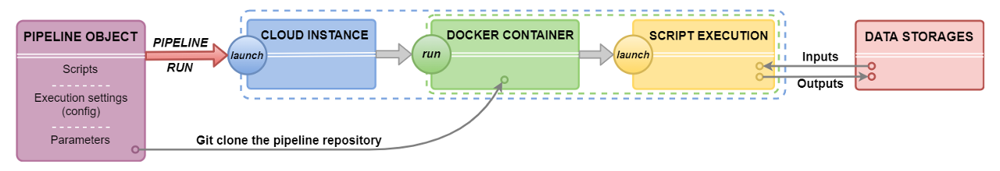

## Pipeline components

> For more details about **Pipeline** components representation see [here](../06_Manage_Pipeline/6._Manage_Pipeline.md).

### Source code

By default, when a new **Pipeline** object is being created from any available template - the Cloud Pipeline creates a default code file on the template's programming language. The user can manually edit this code file, add new ones or upload any count of existing code files from the local workstation. By default, all source code files are written into the `/src` directory of the repository. During the **Pipeline** execution, its corresponding repository is cloned to the compute node - so, all source code scripts will be downloaded to the node disk (more details about pipeline execution see above). Also, the user shall specify the order of scripts execution. The execution of the main (first) running script shall be specified in the **Pipeline** config. The execution order of other scripts should be specified in the main script or in any other, which execution is specified in the main one, otherwise, unspecified code files will be ignored.

### Configuration

By default, when a new **Pipeline** object is being created from any available template - the Cloud Pipeline creates a default configuration `json` file. It contains the list of all general execution settings that are necessary for the pipeline run:

- the characteristics of the Cloud compute instance that would be initialized:
    - type of instance (count of CPU, GPU, RAM) in terms of the Cloud Provider
    - size of the instance disk size
- based docker image from which the docker container would be launched at the initialized Cloud instance
- the command template which would be performed at the launched docker container - here the command of the main (first) script execution shall be necessarily specified
- the name of the main script from source code
- the list of the pipeline parameters - each parameter defines the parameter for the calculation pipeline script (it could be a simple string/boolean parameter or the path to the input/output dataset)
- _and others_

The user can manually change these settings via the GUI elements or via the editing of the `config.json` file.

### Documentation

By default, when a new **Pipeline** object is being created from any available template - the Cloud Pipeline creates a default **README** file. The user can edit/remove this file or upload any count of existing documents from the local workstation. By default, all documents are written into the `/docs` directory of the pipeline repository.

Schematic composition of the **Pipeline** object:  
    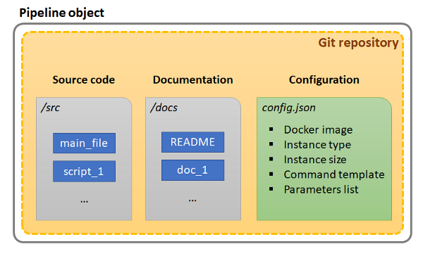

If the user makes any changes in the **Pipeline** object and saves them - it causes the new commit into the corresponding Git repository of that pipeline. All commits perform automatically by the Cloud Pipeline, the user only should specify commit message.

## Main working scenarios

Below the main scenarios of working with the **Pipeline** object in the Cloud Pipeline environment are described.

### Creation of a new Pipeline object

> For more details how to create and configure a **Pipeline** object see [here](../06_Manage_Pipeline/6.1._Create_and_configure_pipeline.md).

#### New pipeline

When the user creates a new pipeline in the Cloud Pipeline environment - it automatically leads to the creation of the GitLab repository with the same name as the pipeline.

On the **Pipeline** page, users can see general info about the repository that corresponds to the specific pipeline:

- the last commit checksum hash and commit message (on the picture below, it is pipeline initial commit and its automatically naming message)
- the info about the last repository update and the user name which did that update

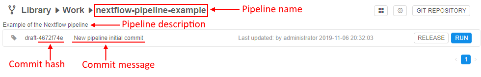

Just created pipeline contains:

- the template of the main **README** file  
    
- the template of the main file with the calculation script
- the `config.json` file with execution environments for the pipeline run  
    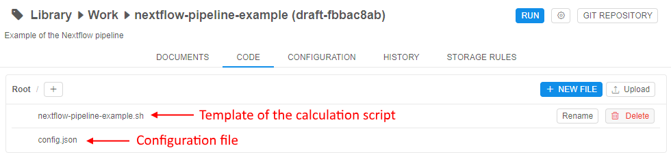

#### Edit and configure a pipeline

After the pipeline creation, the user should configure it for his needs.

Users can change the following:

- **Source code**  
    the user can manually edit the initial template code file, add new empty files and create scripts manually or upload any count of existing code files from his local workstation
- **Configuration**  
    - the user can manually edit the full set of execution settings via the `config.json` file or via the GUI elements. Both variants are identical and supported by the Cloud Pipeline
    - general settings that the user should pay attention to:
        - the characteristics of the Cloud **_compute instance_** that would be initialized for the pipeline run:
            - type of instance (count of CPU, GPU, RAM) in terms of the Cloud Provider
            - size of the instance disk size
            - the **_cluster configuration_** - if the user wants to launch pipeline tasks on several nodes he can configure the cluster
        - **_based docker image_** from which the docker container would be launched at the initialized Cloud instance. Each docker image contains a specific software package. The user can leverage one of the existing and available docker images or also can create his own docker image with the specific software using the Cloud Pipeline features (see below), and then use it for launch pipeline
        - **_command template_** which would be performed at the launched docker container during the pipeline run - here the command of the main (first) script execution shall be necessarily specified. If in the command template no execution is specified - no scripts from the source code will be performed
    - if the user wants to input/output any data to/from the pipeline script during its execution - he shall configure **_parameters_**. Parameters allow varying of the set of initial data that is necessary for the pipeline run:
        - each parameter has a name (required), a type (required) and a value (it could be optionally predefined or specified before the pipeline run)
        - each parameter can be one of the several types ("string", "boolean", "input path", "output path" and others)
            - the "_string_" parameter allows to transfer into the pipeline execution some string value
            - the "_boolean_" parameter allows to transfer into the pipeline execution the boolean value
            - the "_input path_" parameter allows to specify the path to the input dataset. The path specified as "input path" will be automatically mounted to the running docker container. The path where the file or directory will be mounted in the container is defined by the system Cloud Pipeline parameter - `$INPUT_DIR`. It has default value, but also could be redefined by the user
            - the "_output path_" parameter allows to specify the path for data output. After the finish of the pipeline execution, all data from working directory of the docker container will be automatically uploaded to the output path. The path to the working directory in the container is defined by the system Cloud Pipeline parameter - `$ANALYSIS_DIR`. It has default value, but also could be redefined by the user
        - the user can add several parameters of each type
        - so, the user can add some necessary parameters to the pipeline, use them in the pipeline code and define parameter values directly before a specific pipeline launch
- **Documentation**  
    the user can manually edit/delete the initial template **README** file or upload any count of existing documents from his local workstation

Any saved changes in the **Pipeline** object automatically lead to the new commit into the corresponding Git repository. Short info about the last commit is always available to the user.

In some cases, if users want - they can work directly with Git. Note that the repository name is the same as a pipeline name:  
    

#### Create a specific docker image

For some specific tasks, it might be convenient to create a new docker image that will be used for the Pipeline execution. Such docker image can contain special packages that are necessary for the specific Pipeline. A new image can be based on the existing one and simply created in the Cloud Pipeline environment.

For doing that:

- user shall launch one of the existing Docker images in the Cloud Pipeline environment (named "_Tools_"), allow just to initialize cloud compute instance and launch a Docker container on it. After that, the user can connect into the launched container via the SSH session ([SSH Web GUI terminal](../15_Interactive_services/15.2._Using_Terminal_access.md)), then install the necessary software and then commit the resulting container as a new Docker image or a new version of the existing one - by the Cloud Pipeline capabilities.  
See more details [here](../10_Manage_Tools/10.4._Edit_a_Tool.md#commit-a-tool).
- **_or_** user can create a Docker image without the Cloud Pipeline and then push the prepared image into the Cloud Pipeline registry.  
See more details [here](../10_Manage_Tools/10.3._Add_a_Tool.md).

After that, the user can leverage such image as the based docker image for his own **Pipeline** object.

#### Create a multi-configuration

For some reasons, the user may need to launch the **Pipeline** on different compute instances or, for example, with different sets of parameters, etc. For such cases, the Cloud Pipeline allows to create several configurations for one **Pipeline** object that all are saved in one `config.json` file but with the ability to specify which one directly should be used before the pipeline run.

### Testing an existing Pipeline object

> For more details how to launch a **Pipeline** object see [here](../06_Manage_Pipeline/6.2._Launch_a_pipeline.md).

#### Launch the Pipeline

After the pipeline is created, configured and saved - it can be launched. The Cloud Pipeline allows to launch the pipeline with the saved execution settings and parameters (if they have default values) or manually configure execution settings and parameters before a specific run (such changes will not be saved in the pipeline configuration and will use only for one pipeline run).

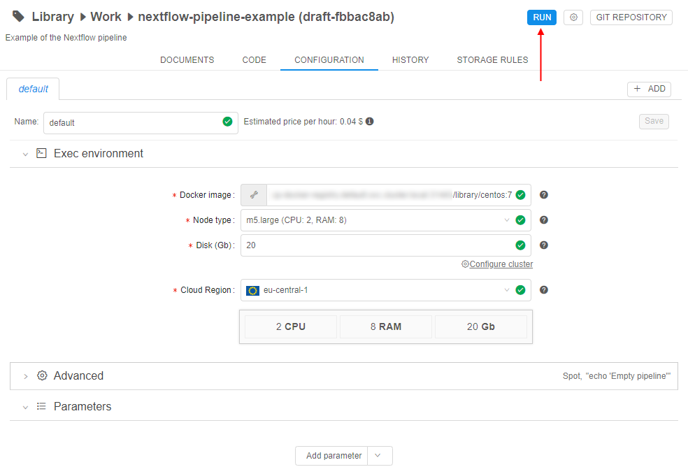

After the pipeline was launched all described procedures are performed - the cloud instance is initialized, the docker container is launched, input paths are mounted (if they were specified before the run via the parameters) - then the main script will start execution.

> As the main pipeline script is prepared manually by the user, it can be incorrect during the first runnings and contain errors. To easily debug the script the user should not launch the created pipeline and wait for the full execution, but connect to the compute node via the SSH and work with the script execution directly in the terminal.  
> For that, the user should set the **_command template_**, e.g. `sleep infinity`, to start the **Pipeline** in "idle" mode (not launching any script). It allows just to initialize cloud instance, launch a Docker container on it, clone the pipeline repository and perform other initialize tasks. After that, the user can connect into the launched container via the SSH session ([SSH Web GUI terminal](../15_Interactive_services/15.2._Using_Terminal_access.md)), launch and debug the script manually (the script is available from the cloned repository):  
> 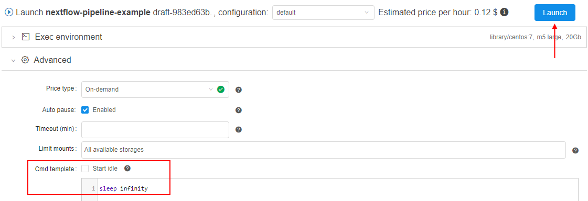  
> 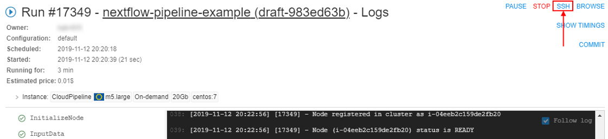
> 

All tasks performed during the run and logs are available to the user, e.g.:  
    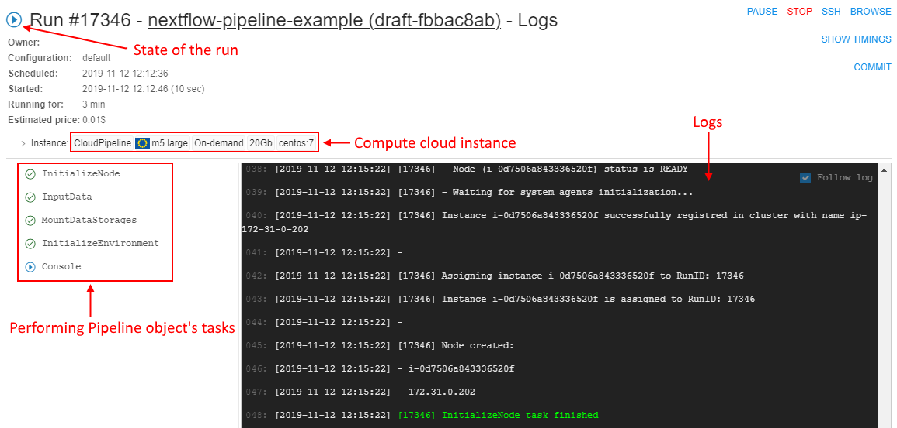

So, the user can observe for the pipeline execution in real-time.

#### Review the results

After completing all tasks the pipeline run ends. Output data is downloaded into the output path (if it was specified before the run via the parameters). Docker container stops. Run logs page is still available, the pipeline run gets the "Completed" state.

The user can view output data on the output path after the pipeline execution. These files can be downloaded to the local workstation or, for example, used in further calculations.

Also, each output file is marked by special tags that contain general info about the pipeline run, in which the file was received:

- user name who launched the run
- run ID in the Cloud Pipeline environment
- link to the **Pipeline** object
- link to the Docker image used in the run
- main characteristics of the compute cloud instance used in the run
- _and others_
E.g.:  
    

For convenience, the user can view all run history for the **Pipeline** object with short information about the run. Each record is the hyperlink to the specific run logs page (see [above](#launch-the-pipeline)), where user can review full information about that pipeline run's settings:  
    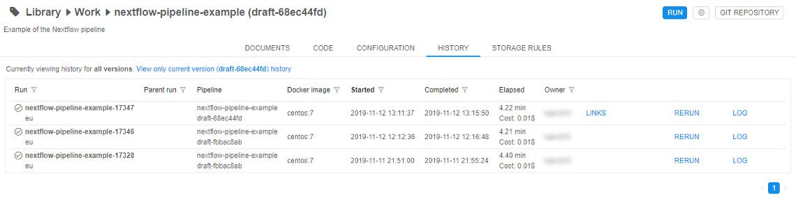

### Deployment of an existing Pipeline object

#### Release the Pipeline

After the pipeline was created, configured, saved and tested - the user can release it. In the Cloud Pipeline Web GUI this action looks like creating the named version of the **Pipeline** object. User can't change such named version, only create a new "_draft_" version over it and then work with it. Then, this "_draft_" version also can be released as another "_stable_" version, etc.

Under the hood, version release is the tagging in the corresponding Git repository. When the user releases some version - he just creates the annotated Git tag.

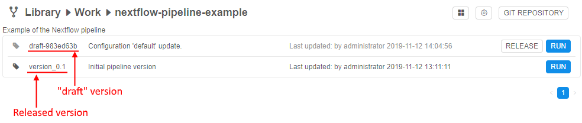

#### Share to other users

The Cloud Pipeline has a useful [RBAC](https://en.wikipedia.org/wiki/Role-based_access_control) model. The user can share his prepared pipeline with other users or user groups for further usage/common work.

There are 3 permission settings over the **Pipeline** objects in the Cloud Pipeline:

- **Read** - allows to view a pipeline, its code, configuration, settings, history of runs
- **Write** - allows to edit/delete a pipeline, its code, configuration, settings
- **Execute** - allows to run a pipeline

So, the user-owner of the pipeline (or system admin) can set combinations of described permissions to other users/user groups to rule their access to the **Pipeline**, e.g.:  
    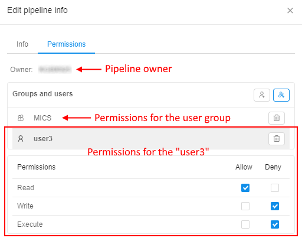

See a simple example of the complete **Pipeline** running procedure [here](../01_Quick_start/1._Quick_start.md).
