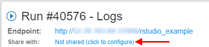
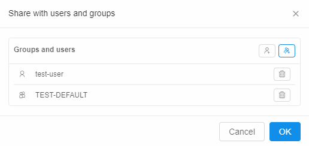
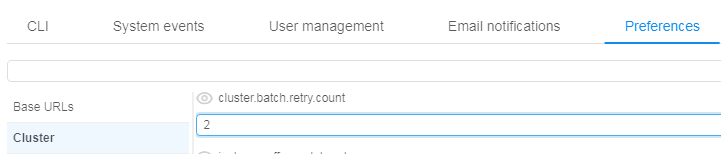
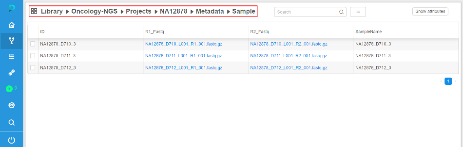

# Cloud Pipeline v.0.13 - Release notes

- [Data sharing with external collaborators](#data-sharing-with-external-collaborators)
- [Batch processing in EU](#batch-processing-in-eu)
- [Running instances sharing with other user(s) or group(s) of users](#running-instances-sharing-with-other-users-or-groups-of-users)
- [Automated instances pause/stop according to the resource usage](#automated-instances-pausestop-according-to-the-resource-usage)
- [Tools versions details](#tools-versions-details)
- [Data download from external http/ftp resources to the cloud data storage](#data-download-from-external-httpftp-resources-to-the-cloud-data-storage)
- [Automatically rerun a batch job if a spot instance is terminated](#automatically-rerun-a-batch-job-if-a-spot-instance-is-terminated)
- [Displaying estimated price of a job run](#displaying-estimated-price-of-a-job-run)
- [Displaying details of the user profile](#displaying-details-of-the-user-profile)
- [Breadcrumbs for the Library view](#breadcrumbs-for-the-library-view)

## Data sharing with external collaborators

NGS users often get the raw datasets from the external partners for processing. Typically external collaborator sends such datasets using hard drives.  
To enable such type of collaboration - S3 buckets within a Cloud Platform can now be "Shared".

1. When a bucket is created - owner can set "Enable sharing" option.  
    Bucket will be created and can be managed and consumed as any other bucket:  
    
2. But such types of buckets also display a "Share" button, which can be used to generate URL, that can be shared with the external collaborator
    - Click "Share"  
    
    - Get the URL and send it to the external partner  
    
3. Once external users loads this URL:
    - Authentication is performed using SAML
    - Access is granted according to the user's permissions
    - S3 bucket browser is displayed  
    
    - This collaboration space can be used to exchange large data files (up to 5Tb per one file)

_Compared to the "**Data download from external http/ftp resources to the cloud data storage**" feature (see below) - this use case considers that external colleague cannot provide a URL for direct download_.

For more information about data sharing with external collaborators see [8.8. Data sharing](../../manual/08_Manage_Data_Storage/8.8._Data_sharing.md).

## Batch processing in EU

Previously all computing nodes and storages were located in the US region.  
For EU NGS use cases, which operate on huge data volumes, data movement to US took too much time.  
To workaround this issue - CP Platform was improved to support batch processing and compute nodes management within other Cloud regions.

1. Bucket creation form now allows to set - where to create a data storage:  
    
2. All the buckets, that are shown in the "Library tree view", "Library details form" and "Home dashboard" are now tagged with region flag to visually distinguish storage locations:
    - Library tree  
    
    - Library details view  
    
    - Home dashboard  
    
3. When a pipeline configuration is created within a project or a new run is launched - user can specify to use a specific region for a compute node placement:
    - Project method configuration  
    
    - Launch form configuration  
    

Examples of using Cloud regions see in sections [6. Manage Pipeline](../../manual/06_Manage_Pipeline/6._Manage_Pipeline.md), [7. Manage Detached configuration](../../manual/07_Manage_Detached_configuration/7._Manage_Detached_configuration.md), [8. Manage Data Storage](../../manual/08_Manage_Data_Storage/8._Manage_Data_Storage.md).

## Running instances sharing with other user(s) or group(s) of users

For certain use cases it is beneficial to be able to share applications with other users/groups. Thus, providing a "persistent" service that can be shared and run in the Cloud platform.  
Current version introduces a feature that allows to:

1. Specify a "Friendly URL" for persistent services.  
    This produces endpoint URL in a more friendly/descriptive format: {cloud-pipeline\_url}/**`friendly_url`** instead of {cloud-pipeline\_url}/**`pipeline-XXXX-XXXX`**.
    - This can be configured at a service launch time in the "Advanced" section of the Launch form (name shall be unique)  
    
    - URL will be generated using the specified name  
      
    For more information about "Friendly URL" for persistent services see [here](../../manual/10_Manage_Tools/10.5._Launch_a_Tool.md#launch-a-tool-with-%22friendly%22-url).
2. User can now share a run with others:
    - "Share with: ..." parameter, within a run log form, can be used for this  
    
    - Specific users or whole groups can be set for sharing  
    
    - Once this is set - other users will be able to access run's endpoints (not SSH)
3. "Services" widget within a Home dashboard page is now capable of listing such "shared" services.  
    It is intended to display a "catalog" of services, that can be accessed by a current user, without running own jobs.  
    

For more information about runs sharing see [11.3. Sharing with other users or groups of users](../../manual/11_Manage_Runs/11.3._Sharing_with_other_users_or_groups_of_users.md).

## Automated instances pause/stop according to the resource usage

Version v0.12 introduced a PAUSE/RESUME option for the users, which allowed to persist whole state of the environment and resume it.  
This feature required AWS On-Demand instances to be used, which are more expensive compared to Spots.  
Current version provides a way to control spendings by automatically pausing on-demand instances if they are not used.  
Administrators can now control this behaviour using a set of parameters:  

- **system.idle.cpu.threshold**  - specify %% of the average CPU, below which action shall be taken
- **system.resource.monitoring.period** - specify period (in seconds) between the users' instances scanning to collect the monitoring metrics
- **system.max.idle.timeout.minutes** - specify a duration in minutes. If CPU utilization is below **system.idle.cpu.threshold** for this duration - notification will be sent to the user.
- **system.idle.action.timeout.minutes** - specify a duration in minutes. If CPU utilization is below **system.idle.cpu.threshold** for this duration - an action, specified in **system.idle.action** will be performed
- **system.idle.action** - which action to perform on the instance, that showed low CPU utilization:
    - _NOTIFY_ - only send notification
    - _PAUSE_ - pause an instance if possible (e.g. instance is On-Demand, Spot instances are skipped)
    - _PAUSE\_OR\_STOP_ - pause an instance if it is On-Demand, stop an instance if it is Spot
    - _STOP_ - Stop an instance, disregarding price-type

## Tools versions details

Now more information on the docker image version is available:

1. Image size
2. Modified date
3. Unique identifier (Digest)
4. Corresponding aliases (e.g. if some digest has two aliases)

For more information see [here](../../manual/10_Manage_Tools/10._Manage_Tools.md#versions-tab).

## Data download from external http/ftp resources to the cloud data storage

Users often get the raw datasets from the external partners for processing.  
Previously, users had to get the data to the local cluster storage and them upload data to the cloud using clommand-line interface.  
Now users can provide CSV/TSV files with the external links and submit a data transfer job, so that the files will be moved to the cloud storage in the background.

1. Upload CSV/TSV file and view list of samples with the external links:  
    
2. Select the transfer options:  
      
    - Which S3 bucket to use as a destination
    - Which CSV/TSV columns shall be used to get external URLs (if several columns contain URLs - both can be used)
    - (*optionally*) Select whether to rename resulting path to some other value (can be specified as another column cell, e.g. sample name)
    - (*optionally*) Create new folders within destination if several columns are selected for "Path fields" option.  
    E.g. if two columns contain URLs and both are selected - then folders will be created for the corresponding column name and used for appropriate files storage.
    - Whether to update external URL within a table to the new location of the files.  
    If set - http/ftp URLs will be changed to s3 path. Such data structure can be then used for a processing by a pipeline (See below - URLs are changed to the S3-clickable hyperlinks):  
    
3. Once transfer job is finished - files will be located in the selected S3 storage:  
    

For more information about data downloading from external http/ftp resources to the CP see [5.5. Download data from external resources to the cloud data storage](../../manual/05_Manage_Metadata/5.5._Download_data_from_external_resources_to_the_cloud_data_storage.md).

## Automatically rerun a batch job if a spot instance is terminated

In certain cases - AWS may terminate a node, that is used to run a job or an interactive tool:

- Spot prices changed
- AWS experienced a hardware issue

These cases shall not be treated as a Cloud Platform bug. To make it more explicit, the following features are implemented:

1. If a job fails due to server-related issue - a more friendly message is displayed, describing a reason for the hardware failure:  
    
2. If a *batch* job fails due to server-related issue and AWS reports one of the following EC2 status codes - batch job is restarted from scratch:
    - Server.SpotInstanceShutdown - AWS stopped a spot instance due to price changes
    - Server.SpotInstanceTermination - AWS terminated a spot instance due to price changes
    - Server.InternalError - AWS hardware issue  

Administrator can configure whether to apply this behavior and how much retries shall be performed:  

For more information about automatically reruns batch jobs in cases when spot instances are terminated see [here](../../manual/11_Manage_Runs/11._Manage_Runs.md#automatically-rerun-if-a-spot-instance-is-terminated) and in section [12.10. Manage system-level settings](../../manual/12_Manage_Settings/12.10._Manage_system-level_settings.md#cluster).

## Displaying estimated price of a job run

Now a list of active runs (both "ACTIVE RUNS" menu and "Dashboard") shows "Estimated price", which is calculated based on the run duration and selected instance type.  
This field is updated interactively (i.e. each 5 - 10 seconds)

1. **ACTIVE RUNS** menu  
    
2. **Dashboard** widget  
    

For more information and examples of using see in sections [11. Manage Runs](../../manual/11_Manage_Runs/11._Manage_Runs.md), [18. Home page](../../manual/18_Home_page/18._Home_page.md).

## Displaying details of the user profile

Previously only user id was shown within all GUI forms, that displayed object/run OWNER.  
Now one can get information on the user name/email when hovering user id, which is shown in the GUI.  
It is shown in the tooltip with all information available from the IdP.

## Breadcrumbs for the Library view

Previously user was able to collapse a "Library" tree view using  button.  
This allows to work with the plain objects lists, which is more comfortable for certain users, compared to the hierarchy.  
But navigation to the upper level of the hierarchy was not convenient in a collapsed mode.  
Now breadcrumbs are shown in the header of the plain objects list, which allow to view current path and navigate to the upper level by clicking a path item.

1. Expanded mode (default)  
    
2. Collapsed mode  
    