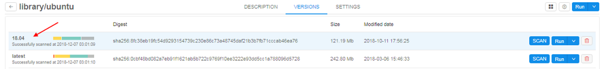
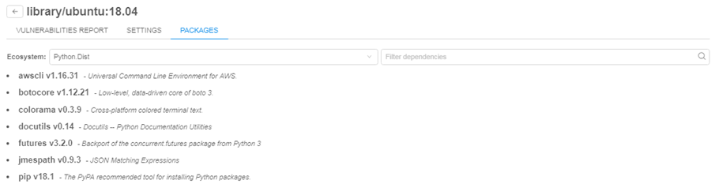
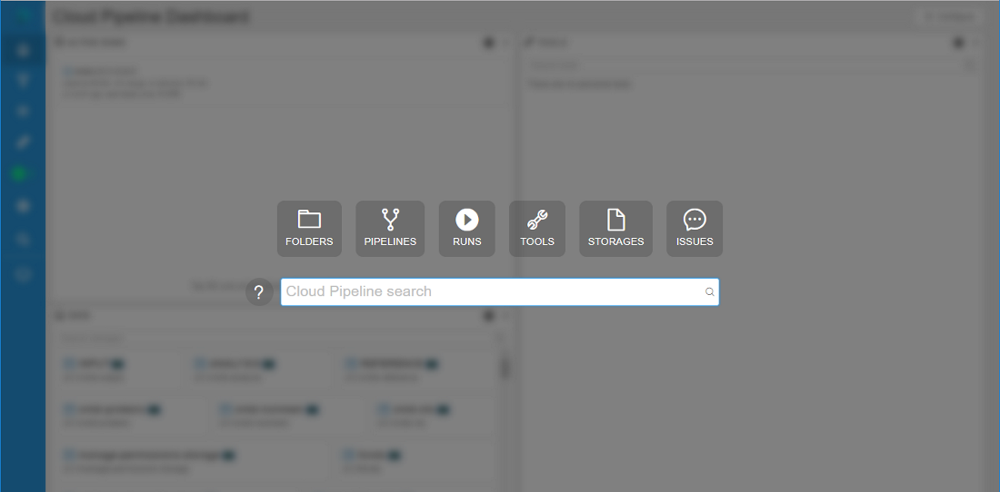
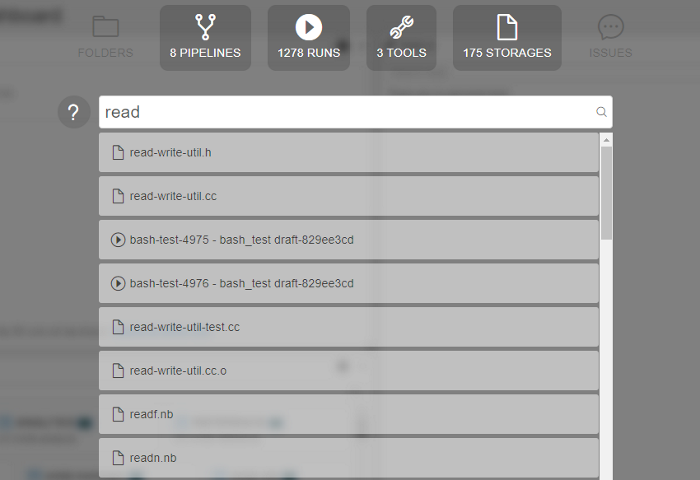
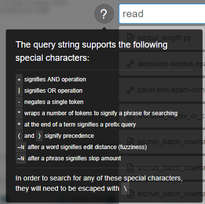
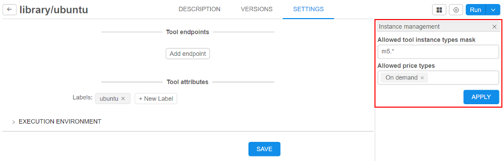
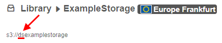
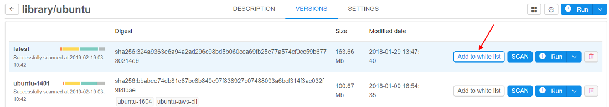
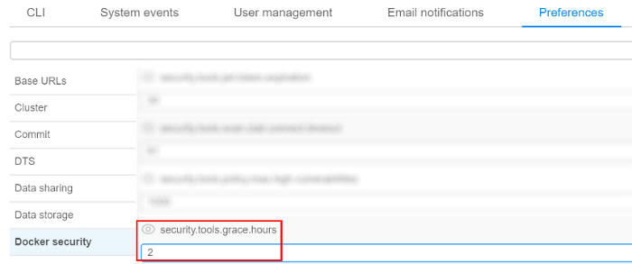

# Cloud Pipeline v.0.14 - Release notes

- [Docker image installed packages list](#docker-image-installed-packages-list)
- [Docker image version settings](#docker-image-version-settings)
- [Global Search](#global-search)
- [Default values (restrictions) on instance types for the users (groups) and tools](#default-values-restrictions-on-instance-types-for-the-users-groups-and-tools)
- [Auto-scaled cluster](#auto-scaled-cluster)
- [A mandatory prefix for the new creating S3-buckets](#a-mandatory-prefix-for-the-new-creating-s3-buckets)
- ["White list" for docker images](#white-list-for-docker-images)
- ["Grace" period for unscanned or vulnerable docker images](#grace-period-for-unscanned-or-vulnerable-docker-images)

## Docker image installed packages list

Often users would like to know the full list software packages installed into a specific Docker images. E.g. to decide which one to run.  
Now this information is available from the docker version menu.

1. User can click a specific version of the tool  
    
2. "**Packages**" tab will shown in the list of tabs in menu of tool's version.  
    List of packages is generated from the docker version together with vulnerabilities scanning (introduced in v0.12). This occurs nightly (all dockers are scanned) or if admin explicitly requests scanning by clicking SCAN button for a specific version.  
    Currently the following types of software packages can be scanned:  
    - System package manager's database (i.e. **yum**, **apt**)  
    - R packages  
    - Python packages  

    Software packages are combined into groups named "**Ecosystems**". User can select one of the ecosystems in the dropdown list and view its contents:  
    

3. Information about each package contains the package name and its short description (_if available_).
4. User can filter packages by name (search will be done across all **ecosystems**)  
    

For more details see [here](../../manual/10_Manage_Tools/10.7._Tool_version_menu.md#version-packages).

## Docker image version settings

Previously docker image settings (instance type, disk, default command) were set using the following approaches:

- Global defaults
- Docker image settings
- Specific run launch parameters

This introduces a number of limitations, e.g. if a docker image contains two version: one with CPU-only and another with GPU support, user was not able to define which instance type to use for what version.  
Now settings can be applied to the specific docker version. These settings are defined in the "**Settings**" tab of the tool's version menu:  
  
If these (version-level) settings are specified - they will be applied to each run of the docker image:
> All other settings levels are still remaining in place. If version-specific settings are not defined: docker-level settings will be applied.

  

For more details see [here](../../manual/10_Manage_Tools/10.7._Tool_version_menu.md#version-settings).

## Global Search

While Cloud Pipeline grows in terms of data and pipelines being add/implemented - it is crucial to be able to search for specific datasets or tools.  
Previously user was able to search only for the jobs runs. In v0.14 of the Cloud Pipeline Platform - a capability to search over all existing objects types is implemented.  
The following object types are being indexed and can be searched:

- "**FOLDERS**" - in the folders ("Library hierarchy") and metadata entities
- "**PIPELINES**" - in the pipelines metadata, pipelines files (documents) and configurations
- "**RUNS**" - in the runs information
- "**TOOLS**" - in the docker registries, groups and tools
- "**STORAGES**" - in S3/NFS storages metadata, S3/NFS files (names)
- "**ISSUES**" - in the issues (discussions)

User can open a search form by pressing "Ctrl+F" being at any page of the Cloud Pipeline Web GUI (*excluding case when run's logs page is open*) or by clicking on  in left menu bar (*global searching form will not be opened if any pop-up window is shown*):  

To start searching a "google-like" query string shall be entered (search can be triggered by pressing "Enter" button or automatically if no new input is provided for 2 seconds):  
  
Special expressions in query string are available as well (the rules for their assignment are described in pop-up window that appears when hovering over the  icon):  

By default search will occur across all the available object types. If user would to limit search scope - appropriate section can be selected above the query input:  

To get a brief information on the object found, user can hover an item with a mouse and a  "Preview" pane will be shown to the right or click an entry to navigate to it's location within the Cloud Pipeline.

1. Tool preview:  
    
2. Pipeline preview:  
    

In the "Preview" window user can see:

- name of the found object
- path to the object in library
- description (*optionally*)
- block with indication and highlighting of the object's concrete part, where inputted word was found
- preview of the found object (*if it's available*)

## Default values (restrictions) on instance types for the users (groups) and tools

Users may make a mistake while selecting instance types and storages when launching a run.
This may be:

- Too large instance type for the job
- Spot instance for GPU job
- Not valid data storage path
- etc.

Now admin can restrict certain options for the specific users/groups or tools to minimize a number of invalid configurations runs.  
Restrictions could be set by different ways on several forms:

- within "User management" tab (for more information see [12.4. Edit/delete a user](../../manual/12_Manage_Settings/12.4._Edit_delete_a_user.md#launch-options) and [12.6. Edit a group/role](../../manual/12_Manage_Settings/12.6._Edit_a_group_role.md#launch-options)) admin can specify for a user or a group of users (role) allowed price types and allowed instance types for the pipelines, configurations and tool runs:  
    
- within "Instance management" panel in tool settings (for more information see [10.5. Launch a Tool](../../manual/10_Manage_Tools/10.5._Launch_a_Tool.md#instance-management)) admin can specify allowed price types and allowed instance types for Tool runs:  
    
- within "Cluster" tab in "Preferences" section of the system-level settings (see [here](../../manual/12_Manage_Settings/12.10._Manage_system-level_settings.md#cluster)) admin also can specify allowed price types (with setting **`cluster.allowed.price.types`**) and allowed instance types for the pipelines, configurations and tool runs (with settings **`cluster.allowed.instance.types`** and **`cluster.allowed.instance.types.docker`**) as global defaults:  
      
      
    

Next hierarchy is set for applying of inputted allowed instance types (sorted by priority):

- User level (specified for a user on "User management" tab)
- User group level (specified for a group (role) on "User management" tab. If a user is a member of several groups - list of allowed instances will be summarized across all the groups)
- Tool level (specified for a tool on "Instance management" panel )
- _(global)_ **`cluster.allowed.instance.types.docker`** (specified on "Cluster" tab in "Preferences" section of the system-level settings)
- _(global)_ **`cluster.allowed.instance.types`** (specified on "Cluster" tab in "Preferences" section of the system-level settings)

After specifying allowed instance types, all GUI forms that allow to select the list of instance types (configurations/launch forms) - will display only valid instance type, according to hierarchy above.  
For price type specifying - if it is set for the user/group/tool - GUI will allow to select only that price type.

## Auto-scaled cluster

Previously, when you needed several nodes running at one task, you could configure and launch cluster: master machine and one or several worker machines. Their count was predefined before launching the task and could not changing during the run.  
In current version, the auto-scaled cluster is implemented. This one differs from "usual" cluster in that it can attach or drop additional nodes during the run depending on the queue load. Using such type of cluster will minimize total cost.  
If during the run there are jobs in waiting state longer than a specific time (_this time threshold is set by admin in "Preferences" section of the system-level settings_) - auto-scaled cluster will attach new computation nodes ("scale-up"). If during the run the queue is empty or all jobs are running longer than a specific time (_this time threshold is set by admin tab in "Preferences" section of the system-level settings_) - auto-scaled cluster will drop existing auto-scaled nodes ("scale-down").  
For this cluster user may specify total count of child nodes - max count of auto-scaled nodes, and the count of "persistent" child nodes - count of nodes that will never be "scaled-down".

To set auto-scaled cluster click "Configure cluster" in "Exec environment" panel before launch a run:  
  
In pop-up window select "Auto-scaled cluster" and specify total count of "auto-scaled" nodes:  
  
If you want to set a count of "persistent" child nodes, click "Setup default child nodes count" and specify the value:  

For more details see [here](../../manual/06_Manage_Pipeline/6._Manage_Pipeline.md#configuration).

## A mandatory prefix for the new creating S3-buckets

Now admin can set **`storage.object.prefix`** on "Data storage" tab in "Preferences" section of the system-level settings:  
  

If it is set, all new storages will be created with this prefix (e.g. "*ds*"):  

For more information see [8.1. Create and edit storage](../../manual/08_Manage_Data_Storage/8.1._Create_and_edit_storage.md#create-s3-storage).

## "White list" for docker images

Previously user is not able to run a new image if it is not scanned yet or has a lot of vulnerabilities.  
In current version a "white list" option for docker images is implemented. It's meaning that admin may allow users to run certain docker versions even if they are vulnerable/unscanned.

For do that admin has to check a docker version in tool-versions list by click on special flag "Add to white list" near the "SCAN" button:  
  

In this case user would be able to run such version of tool and none errors will be displayed during launch time and viewing.
Only admin can "add"/"remove" tool version to the "white list".

For more details see [10.6. Tool security check](../../manual/10_Manage_Tools/10.6._Tool_security_check.md#white-list-for-tool-versions).

## "Grace" period for unscanned or vulnerable docker images

Previously user is not able to run a new image if it is not scanned yet or has a lot of vulnerabilities.  
In current version a "grace" period option for such docker images is implemented. During this period user will be able to run a tool, but an appropriate message will be displayed when viewing a tool or running it. The duration of "grace" period (in _hours_) is set on "Docker security" tab in "Preferences" section of the system-level settings:  

If this time value is not elapsed from the date/time since the docker version became vulnerable or since the push time (if this version was not scanned yet) - user would be able to run such version of tool, but warning message will be displaying during version launch.  
Since "grace" period is elapsed for this tool's version - behavior will became as for "usual" vulnerable/unscanned docker image.

For more details see [10.6. Tool security check](../../manual/10_Manage_Tools/10.6._Tool_security_check.md) and [12.10. Manage the system-level settings](../../manual/12_Manage_Settings/12.10._Manage_system-level_settings.md#docker-security).