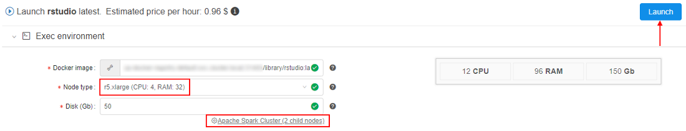
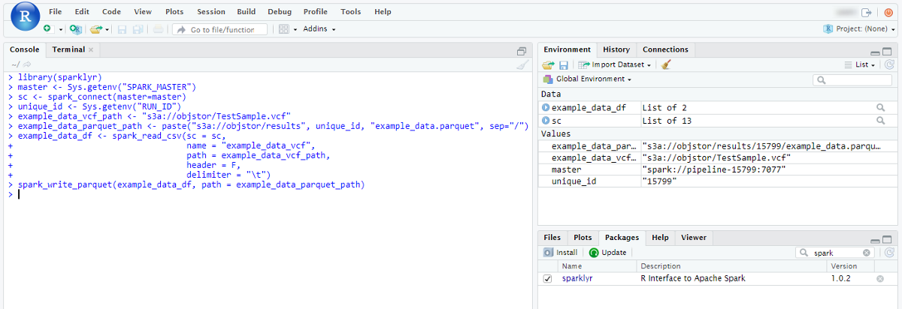
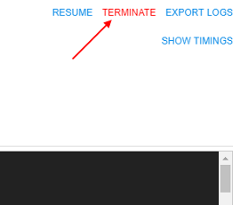
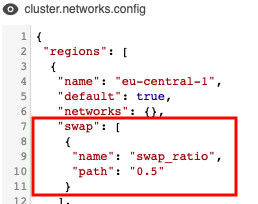
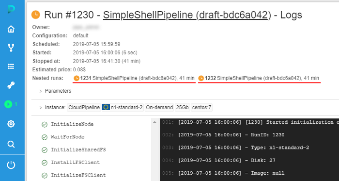
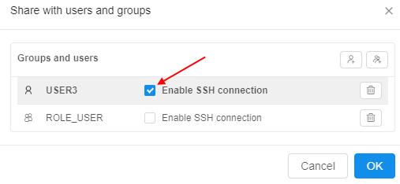
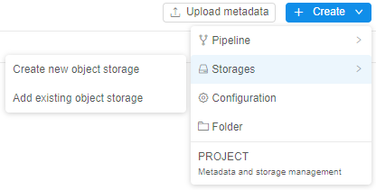
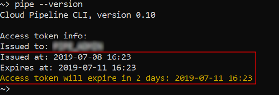
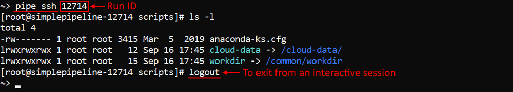

# Cloud Pipeline v.0.15 - Release notes

- [Microsoft Azure Support](#microsoft-azure-support)
- [Notifications on the RAM/Disk pressure](#notifications-on-the-ramdisk-pressure)
- [Limit mounted storages](#limit-mounted-storages)
- [Personal SSH keys configuration](#personal-ssh-keys-configuration)
- [Allow to set the Grid Engine capability for the "fixed" cluster](#allow-to-set-the-grid-engine-capability-for-the-fixed-cluster)
- [Enable Apache Spark for the Cloud Pipeline's clusters](#enable-apache-spark-for-the-cloud-pipelines-clusters)
- [Consider Cloud Providers' resource limitations when scheduling a job](#consider-cloud-providers-resource-limitations-when-scheduling-a-job)
- [Allow to terminate paused runs](#allow-to-terminate-paused-runs)
- [Pre/Post-commit hooks implementation](#prepost-commit-hooks-implementation)
- [Restricting manual installation of the nvidia tools](#restricting-manual-installation-of-the-nvidia-tools)
- [Setup swap files for the Cloud VMs](#setup-swap-files-for-the-cloud-vms)
- [Run's system paths shall be available for the general user account](#runs-system-paths-shall-be-available-for-the-general-user-account)
- [Renewed WDL visualization](#renewed-wdl-visualization)
- ["QUEUED" state of the run](#queued-state-of-the-run)
- [Help tooltips for the run state icons](#help-tooltips-for-the-run-state-icons)
- [VM monitor service](#vm-monitor-service)
- [Web GUI caching](#web-gui-caching)
- [Installation via pipectl](#installation-via-pipectl)
- [Add more logging to troubleshoot unexpected pods failures](#add-more-logging-to-troubleshoot-unexpected-pods-failures)
- [Displaying information on the nested runs](#displaying-information-on-the-nested-runs-within-a-parent-log-form)
- [Environment Modules support](#environment-modules-support-for-the-cloud-pipeline-runs)
- [Sharing SSH access to running instances with other user(s)/group(s)](#sharing-ssh-access-to-running-instances-with-other-usersgroups)
- [Allow to limit the number of concurrent SSH sessions](#allow-to-limit-the-number-of-concurrent-ssh-sessions)
- [Verification of docker/storage permissions when launching a run](#verification-of-dockerstorage-permissions-when-launching-a-run)
- [Ability to override the queue/PE configuration in the GE configuration](#ability-to-override-the-queuepe-configuration-in-the-ge-configuration)
- [Estimation run's disk size according to the input/common parameters](#estimation-runs-disk-size-according-to-the-inputcommon-parameters)
- [Disabling of the Global Search form if a corresponding service is not installed](#disabling-of-the-global-search-form-if-a-corresponding-service-is-not-installed)
- [Disabling of the FS mounts creation if no FS mount points are registered](#disabling-of-the-fs-mounts-creation-if-no-fs-mount-points-are-registered)
- [Displaying resource limit errors during run resuming](#displaying-resource-limit-errors-during-run-resuming)
- [Object storage creation in despite of that the CORS/Policies could not be applied](#object-storage-creation-in-despite-of-that-the-corspolicies-could-not-be-applied)
- [Track the confirmation of the "Blocking" notifications](#track-the-confirmation-of-the-blocking-notifications)
- [`pipe` CLI warnings on the JWT expiration](#pipe-cli-warnings-on-the-jwt-expiration)
- [`pipe` configuration for using NTLM Authentication Proxy](#pipe-configuration-for-using-ntlm-authentication-proxy)
- [Files uploading via `pipe` in case of restrictions](#execution-of-files-uploading-via-pipe-without-failures-in-case-of-lacks-read-permissions)
- [Run a single command or an interactive session over the SSH protocol via `pipe`](#run-a-single-command-or-an-interactive-session-over-the-ssh-protocol-via-pipe)
- [Perform objects restore in a batch mode via `pipe`](#perform-objects-restore-in-a-batch-mode-via-pipe)

***

- [Notable Bug fixes](#notable-bug-fixes)
    - [Incorrect behavior of the global search filter](#incorrect-behavior-of-the-global-search-filter)
    - ["COMMITING..." status hangs](#commiting-status-hangs)
    - [Instances of Metadata entity aren't correctly sorted](#instances-of-metadata-entity-arent-correctly-sorted)
    - [Tool group cannot be deleted until all child tools are removed](#tool-group-cannot-be-deleted-until-all-child-tools-are-removed)
    - [Missing region while estimating a run price](#missing-region-while-estimating-a-run-price)
    - [Cannot specify region when an existing object storage is added](#cannot-specify-region-when-an-existing-object-storage-is-added)
    - [ACL control for PIPELINE_USER and ROLE entities for metadata API](#acl-control-for-pipeline_user-and-role-entities-for-metadata-api)
    - [Getting logs from Kubernetes may cause `OutOfMemory` error](#getting-logs-from-kubernetes-may-cause-outofmemory-error)
    - [AWS: Incorrect `nodeup` handling of spot request status](#aws-incorrect-nodeup-handling-of-spot-request-status)
    - [Not handling clusters in `autopause` daemon](#not-handling-clusters-in-autopause-daemon)
    - [Incorrect `pipe` CLI version displaying](#incorrect-pipe-cli-version-displaying)
    - [JWT token shall be updated for the jobs being resumed](#jwt-token-shall-be-updated-for-the-jobs-being-resumed)
    - [Trying to rename file in the data storage, while the "Attributes" panel is opened, throws an error](#trying-to-rename-file-in-the-data-storage-while-the-attributes-panel-is-opened-throws-an-error)
    - [`pipe`: incorrect behavior of the `-nc` option for the `run` command](#pipe-incorrect-behavior-of-the-nc-option-for-the-run-command)
    - [Cluster run cannot be launched with a Pretty URL](#cluster-run-cannot-be-launched-with-a-pretty-url)
    - [Cloning of large repositories might fail](#cloning-of-large-repositories-might-fail)
    - [System events HTML overflow](#system-events-html-overflow)
    - [AWS: Pipeline run `InitializeNode` task fails](#aws-pipeline-run-initializenode-task-fails)
    - [`git-sync` shall not fail the whole object synchronization if a single entry errors](#git-sync-shall-not-fail-the-whole-object-synchronization-if-a-single-entry-errors)
    - [Broken layouts](#broken-layouts)

***

## Microsoft Azure Support

One of the major **`v0.15`** features is a support for the **[Microsoft Azure Cloud](https://azure.microsoft.com/en-us/)**.

All the features, that were previously used for `AWS`, are now available in all the same manner, from all the same GUI/CLI, for `Azure`.

Another cool thing, is that now it is possible to have a single installation of the `Cloud Pipeline`, which will manage both Cloud Providers (`AWS` and `Azure`). This provides a flexibility to launch jobs in the locations, closer to the data, with cheaper prices or better compute hardware for a specific task.

## Notifications on the RAM/Disk pressure

When a compute-intensive job is run - compute node may start starving for the resources.  
CPU high load is typically a normal situation - it could result just to the SSH/metrics slowdown. But running low on memory and disk could crash the node, in such cases autoscaler will eventually terminate the cloud instance.

In **`v0.15`** version, the `Cloud Pipeline` platform could notify user on the fact of Memory/Disk high load.  
When memory or disk consuming will be higher than a threshold value for a specified period of time (in average) - a notification will be sent (and resent after a delay, if the problem is still in place).

Such notifications could be configured at `HIGH_CONSUMED_RESOURCES` section of the `Email notifications`:  


The following items at `System` section of the `Preferences` define behavior of such notifications:

- **`system.memory.consume.threshold`** - memory threshold (in %) above which the notification would be sent
- **`system.disk.consume.threshold`** - disk threshold (in %) above which the notification would be sent
- **`system.monitoring.time.range`** - time delay (in sec) after which the notification would be sent again, if the problem is still in place.

See more information about [Email notifications](../../manual/12_Manage_Settings/12._Manage_Settings.md#email-notifications) and [System Preferences](../../manual/12_Manage_Settings/12.10._Manage_system-level_settings.md#system).

## Limit mounted storages

Previously, all available storages were mounted to the container during the run initialization. User could have access to them via `/cloud-data` or `~/cloud-data` folder using the interactive sessions (SSH/Web endpoints/Desktop) or `pipeline` runs.

For certain reasons (e.g. takes too much time to mount all or a run is going to be shared with others), user may want to limit the number of data storages being mounted to a specific job run.

Now, user can configure the list of the storages that will be mounted. This can be accomplished using the `Limit mount` field of the `Launch` form:

- By default, `All available storages` are mounted (i.e. the ones, that user has `ro` or `rw` permissions)
- To change the default behavior - click the drop-down list next to "Limit mounts" label:  
    
- Select storages that shall be mounted:  
    
- Review that only a limited number of data storages is mounted:  
    
- Mounted storage is available for the interactive/batch jobs using the path `/cloud-data/{storage_name}`:  
    

See an example [here](../../manual/06_Manage_Pipeline/6.1._Create_and_configure_pipeline.md#example-limit-mounted-storages).

## Personal SSH keys configuration

Previously, there were two options to communicate with the embedded gitlab repositories, that host pipelines code:

- From the local (non-cloud) machine: use the `https` protocol and the repository URI, provided by the GUI (i.e. `GIT REPOSITORY` button in the pipeline view)
- From the cloud compute node: `git` command line interface, that is preconfigured to authenticate using https protocol and the auto-generated credentials

Both options consider that https is used. It worked fine for 99% of the use cases. But for some of the applications - `ssh` protocol is required as this is the only way to achieve a passwordless authentication against the gitlab instance

To address this issue, SSH keys management was introduced:

- Users' ssh keys are generated by the `Git Sync` service
- SSH key-pair is created and assigned to the `Cloud Pipeline` user and a public key is registered in the GitLab
- Those SSH keys are now also configured for all the runs, launched by the user. So it is possible to perform a passwordless authentication, when working with the gitlab or other services, that will be implemented in the near future
- HTTPS/SSH selector is added to the `GIT REPOSITORY` popup of the `Cloud Pipeline` Web GUI:  
    
- Default selection is HTTP, which displays the same URI as previously (repository), but user is able to switch it to the SSH and get the reformatted address:  
    

For more details see [here](../../manual/06_Manage_Pipeline/6._Manage_Pipeline.md#details-controls).

## Allow to set the Grid Engine capability for the "fixed" cluster

Version `0.14` introduced an ability to launch `autoscaled` clusters. Besides the autoscaling itself - such cluster were configured to use `GridEngine` server by default, which is pretty handy.

On the other hand - `fixed` cluster (i.e. those which contain a predefined number of compute nodes), required user to set the `CP_CAP_SGE` explicitly. Which is no a big deal, but may be tedious.

In **`v0.15`** Grid Engine can be configured within the `Cluster` (fixed size cluster) tab.

This is accomplished by using the `Enable GridEngine` checkbox. By default, this checkbox is unticked. If the user sets this ON - `CP_CAP_SGE` parameter is added automatically.

Also a number of help icons is added to the `Cluster configuration` dialog to clarify the controls purpose:

- Popup header (E.g. next to the tabs line) - displays information on different cluster modes
- (Cluster) `Enable GridEngine` checkbox - displays information on the GridEngine usage
- (Cluster) `Enable Apache Spark` checkbox - displays information on the Apache Spark usage (see [below](#enable-apache-spark-for-the-cloud-pipelines-clusters))
- (Auto-scaled cluster) `Auto-scaled up` - displays information on the autoscaling logic
- (Auto-scaled cluster) `Default child nodes` - displays information on the initial node pool size


See more information about cluster launch [here](../../manual/06_Manage_Pipeline/6._Manage_Pipeline.md#configuration).

## Enable Apache Spark for the Cloud Pipeline's clusters

Another one feature for the Cloud Pipeline's clusters was implemented in **`v0.15`**.  
Now, [**`Apache Spark`**](https://jaceklaskowski.gitbooks.io/mastering-apache-spark/spark-overview.html) with the access to File/Object Storages from the `Spark Applications` can be configured within the `Cluster` tab. It is available only for the fixed size clusters.

To enable this feature - tick the `Enable Apache Spark` checkbox and set the child nodes count at cluster settings. By default, this checkbox is unticked. Also users can manually enable `Spark` functionality by the `CP_CAP_SPARK` system parameter:  
    

This feature, for example, allows you to run `Apache Spark` cluster with RStudio where you may code in R using `sparklyr` to run the workload over the cluster:

1. Open the **RStudio** tool  
    
2. Select the node type, set the `Apache Spark` cluster as shown above, and launch the tool:
    
3. Open main **Dashboard** and wait until the **OPEN** hyperlink for the launched tool will appear. Hover over it:  
      
    Two endpoints will appear:
    - **_RStudio_** (as the main endpoint it is in bold) - it exposes RStudio's Web IDE
    - **_SparkUI_** - it exposes Web GUI of the Spark. It allows to monitor Spark master/workers/application via the web-browser. Details are available in the [Spark UI manual](https://jaceklaskowski.gitbooks.io/mastering-apache-spark/spark-webui.html)
4. Click the **RStudio** endpoint:  
      
    Here you can start create scripts in `R` using the pre-installed `sparklyr` package to distribute the workload over the cluster.
5. Click the **SparkUI** endpoint:  
      
    Here you can view the details of the jobs being executed in Spark, how the memory is used and get other useful information.

For more information about using `Apache Spark` via the `Cloud Pipeline` see [here](../../manual/15_Interactive_services/15.3_Interactive_service_examples.md#running-apache-spark-cluster-with-rstudio-web-gui).

## Consider Cloud Providers' resource limitations when scheduling a job

`Cloud Pipeline` supports queueing of the jobs, that cannot be scheduled to the existing or new compute nodes immediately.

Queueing occurs if:

- `cluster.max.size` limit  is reached (configurable via `Preferences`)
- Cloud Provider limitations are reached (e.g. [AWS EC2 Limits](https://docs.aws.amazon.com/AWSEC2/latest/UserGuide/ec2-resource-limits.html))

If (**1**) happens - job will sit in the `QUEUED` state, until a spare will be available or stopped manually. This is the correct behavior.  
But if (**2**) occurs - an error will be raised by the Cloud Provider, `Cloud Pipeline` treats this as an issue with the node creation. Autoscaler will then resubmit the node creation task for `cluster.nodeup.retry.count` times (default: 5) and then fail the job run.  
This behavior confuses users, as (**2**) shall behave almost in the same manner as (**1**) - job shall be kept in the queue until there will be free space for a new node.

In **`v0.15`** (**2**) scenario works as described:

- If a certain limit is reached (e.g. number of `m4.large` instances exceeds the configured limit) - run will not fail, but will await for a spare node or limit increase
- A warning will be highlighted in the job initialization log:  
    

## Allow to terminate paused runs

Some of the jobs, that were paused (either manually, or by the automated service), may be not needed anymore.  
But when a run is paused - the user cannot terminate/stop it before resuming. I.e. one have to run `RESUME` operation, wait for it's completion and then `STOP` the run.

While this is the expected behavior (at least designed in this manner) - it requires some extra steps to be performed, which may look like meaningless (why one shall resume a run, that is going to be stopped?).

Another issue with such a behavior is that in certain "bad" conditions - paused runs are not able to resume and just fail, e.g.:

- An underlying instance is terminated outside of the Cloud Pipeline
- Docker image was removed from the registry
- And other cases that are not yet uncovered

This introduces a number of stale runs, that just sit there in the PAUSED state and nobody can remove them.

To address those concerns - current version of `Cloud Pipeline` allows to terminate `PAUSED` run, without a prior `RESUME`. This operation can be performed by the `OWNER` of the run and the `ADMIN` users.
Termination of the `PAUSED` run drops the underlying cloud instance and marks the run as `STOPPED`.

From the GUI perspective - `TERMINATE` button is shown (instead of `STOP`), when a run is in the `PAUSED` state:  

- on the "Active runs" page  
    
- on the "Run logs" page  
    
- on the "Dashboard" page  
    

Clicking it - performs the run termination, as described above.  
See more information [here](../../manual/11_Manage_Runs/11.1._Manage_runs_lifecycles.md#stopterminate-run).

## Pre/Post-commit hooks implementation

In certain use-cases, extra steps shall be executed before/after running the commit command in the container.  
E.g. imagine the following scenario:

1. User launches `RStudio`
2. User installs packages and commits it as a new image
3. User launches the new image
4. The following error will be displayed in the R Console:

```r
16 Jan 2019 21:17:15 [rsession-GRODE01] ERROR session hadabend; LOGGED FROM: rstudio::core::Error {anonymous}::rInit(const rstudio::r::session::RInitInfo&) /home/ubuntu/rstudio/src/cpp/session/SessionMain.cpp:563
```

There is nothing bad about this message and states that previous RSession was terminated in a non-graceful manner.
RStudio will work correctly, but it may confuse the users.

While this is only one example - there are other applications, that require extra cleanup to be performed before the termination.

To workaround such issues (RStudio and others) an approach of `pre/post-commit hooks` is implemented. That allows to perform some graceful cleanup/restore before/after performing the commit itself.

Those hooks are valid only for the specific images and therefore shall be contained within those images. `Cloud Pipeline` itself performs the calls to the hooks if they exist.

Two preferences are introduced:

- `commit.pre.command.path`: specified a path to a script within a docker image, that will be executed in a currently running container, **BEFORE** `docker commit` occurs (default: `/root/pre_commit.sh`).
    - This option is useful if any operations shall be performed with the running processes (e.g. send a signal), because in the subsequent `post` operation - only filesystem operations will be available.
    - **_Note_** that any changes done at this stage will affect the running container.
- `commit.post.command.path`: specified a path to a script within a docker image, that will be executed in a committed image, **AFTER** `docker commit` occurs (default: `/root/post_commit.sh`).
    - This hook can be used to perform any filesystem cleanup or other operations, that shall not affect the currently running processes.
- If a corresponding pre/post script is not found in the docker image - it will not be executed.

For more details see [here](../../manual/10_Manage_Tools/10.4._Edit_a_Tool.md#committing-features).

## Restricting manual installation of the nvidia tools

It was uncovered that some of the GPU-enabled runs are not able to initialize due to an issue describe at [NVIDIA/nvidia-docker#825](https://github.com/NVIDIA/nvidia-docker/issues/825).

To limit a possibility of producing such docker images (which will not be able to start using GPU instance types) - a set of restrictions/notifications was implemented:

- A notification is now displayed (in the Web GUI), that warns a user about the risks of installing any of the `nvidia` packages manually. And that all `cuda-based` dockers shall be built using `nvidia/cuda` base images instead:  
    
- Restrict users (to the reasonable extent) from installing those packages while running SSH/terminal session in the container. If user will try to install a `restricted` package - a warning will be shown (with an option to bypass it - for the advanced users):  
    

## Setup swap files for the Cloud VMs

This feature is addresses the same issues as the previous **Notifications about high resources pressure** by making the compute-intensive jobs runs more reliable.

In certain cases jobs may fail with unexpected errors if the compute node runs `Out Of Memory`.

**`v0.15`** provides an ability for admin users to configure a default `swap` volume to the compute node being created.
This allows to avoid runs failures due to memory limits.

The size of the `swap` volume can be configured via `cluster.networks.config` item of the `Preferences`. It is accomplished by adding the similar `json` object to the platform's global or a region/cloud specific configuration:  


Options that can be used to configure `swap`:

- `swap_ratio` - defines a swap file size. It is equal the node RAM multiplied by that ratio. If ratio is 0, a swap file will not be created (default: 0)
- `swap_location` - defines a location of the swap file. If that option is not set - default location will be used (default: AWS will use `SSD/gp2` EBS, Azure will be [Temporary Storage](https://blogs.msdn.microsoft.com/mast/2013/12/06/understanding-the-temporary-drive-on-windows-azure-virtual-machines/))

See an example [here](../../manual/12_Manage_Settings/12.11._Advanced_features.md#setup-swap-files-for-the-cloud-vms).

## Run's system paths shall be available for the general user account

Previously, all the system-level directories (e.g. pipeline code location - `$SCRIPTS_DIR`, input/common data folders - `$INPUT_DATA`, etc.) were owned by the `root` user with `read-only` access to the general users.

This was working fine for the `pipeline` runs, as they are executed on behalf of `root`. But for the interactive sessions (SSH/Web endpoints/Desktop) - such location were not writable.

From now on - all the system-level location will be granted `rwx` access for the `OWNER` of the job (the user, who launched that run).

## Renewed WDL visualization

**`v0.15`** offers an updated Web GUI viewer/editor for the WDL scripts. These improvements allow to focus on the WDL diagram and make it more readable and clear. Which very useful for large WDL scripts.

- Auxiliary controls ("Save", "Revert changes", "Layout", "Fit to screen", "Show links", "Zoom out", "Zoom in", "Fullscreen") are moved to the left side of the `WDL GRAPH` into single menu:  
    
- WDL search capabilities are added. This feature allows to search for any task/variable/input/output within the script and focus/zoom to the found element. Search box is on the auxiliary controls menu and supports entry navigation (for cases when more than one item was found in the WDL):  
      
    
- Workflow/Task editor is moved from the modal popup to the right floating menu `PROPERTIES`:  
    

See more details [here](../../manual/06_Manage_Pipeline/6.1.1_Building_WDL_pipeline_with_graphical_PipelineBuilder.md).

## "QUEUED" state of the run

Previously, user was not able to distinguish runs that are waiting in the queue and the runs that are being initialized (both were reporting the same state using the same icons).
Now, a more clear run's state is provided - "QUEUED" state is introduced:

  

During this phase of the lifecycle - a job is waiting in the queue for the available compute node. Typically this shall last for a couple of second and proceed to the initialization phase. But if this state lasts for a long time - it may mean that a cluster capacity is reached (limited by the administrator).

This feature allows users to make a decision - whether to wait for run in a queue or stop it and resubmit.

See more details [here](../../manual/11_Manage_Runs/11._Manage_Runs.md#active-runs).

## Help tooltips for the run state icons

With the runs' `QUEUED` state introduction - we now have a good number of possible job phases.

To make the phases meaning more clear - tooltips are provided when hovering a run state icon within all relevant forms, i.e.: `Dashboard`, `Runs` (`Active Runs`/`History`/etc.), `Run Log`.  

Tooltips contain a state name in bold (e.g. **Queued**) and a short description of the state and info on the next stage:  


See more details - [Active runs states](../../manual/11_Manage_Runs/11._Manage_Runs.md#active-runs), [Completed runs states](../../manual/11_Manage_Runs/11._Manage_Runs.md#completed-runs) and [Home page](../../manual/18_Home_page/18._Home_page.md#recently-completed-runs).

## VM monitor service

For various reasons cloud VM instances may "hang" and become invisible to `Cloud Pipeline` services. E.g. VM was created but some error occurred during joining k8s cluster or a communication to the Cloud Providers API is interrupted.

In this case `Autoscaler` service will not be able to find such instance and it won't be shut down. This problem may lead to unmonitored useless resource consumption and billing.

To address this issue - a separate `VM monitoring` service was implemented:

- Tracks all VM instances in the registered Cloud Regions
- Determines whether instances is in "hang" state
- Notifies a configurable set of users about a possible problem

Notification recipients (administrators) may check the actual state of VM in Cloud Provider console and shut down VM manually.

## Web GUI caching

Previously, `Cloud Pipeline` Web GUI was not using HTTP caching to optimize the page load time. Each time application was loaded - `~2Mb` of the app bundle was downloaded.

This caused "non-optimal" experience for the end-users.

Now the application bundle is split into chunks, which are identified by the `content-hash` in names:

- If nothing is changed - no data will be downloaded
- If some part of the app is changed - only certain chunks will be downloaded, not the whole bundle

Administrator may control cache period using the `static.resources.cache.sec.period` parameter in the `application.properties` of the Core API service.

## Installation via pipectl

Previous versions of the `Cloud Pipeline` did not offer any automated approach for deploying its components/services.
All the deployment tasks were handed manually or by custom scripts.

To simplify the deployment procedure and improve stability of the deployment - `pipectl` utility was introduced.

`pipectl` offers an automated approach to deploy and configure the `Cloud Pipeline` platform, as well as publish some demo pipelines and docker images for NGS/MD/MnS tasks.

Brief description and example installation commands are available in the [pipectl's home directory](https://github.com/epam/cloud-pipeline/tree/develop/deploy).

More sophisticated documentation on the installation procedure and resulting deployment architecture will be created further.

## Add more logging to troubleshoot unexpected pods failures

When a `Cloud Pipeline` is being for a long time (e.g. years), it is common to observe rare "strange" problems with the jobs execution.
I.e. the following behavior was observed couple of times over the last year:

### _Scenario 1_

1. Run is launched and initialized fine
2. During processing execution - run fails
3. Console logs print nothing, compute node is fine and is attached to the cluster

### _Scenario 2_

1. Run is launched, compute node is up
2. Run fails during initialization
3. Console logs print the similar error message:

```bash
failed to open log file "/var/log/pods/**.log": open /var/log/pods/**.log: no such file or directory
```

Both scenarios are flaky and almost impossible to reproduce. To provide more insights into the situation - an extended `node-level` logging was implemented:

1. `kubelet` logs (from all compute nodes) are now written to the files (via `DaemonSet`)
2. Log files are streamed to the storage, identified by `storage.system.storage.name` preference
3. Administrators can find the corresponding node logs (e.g. by the `hostname` or `ip` that are attached to the run information) in that storage under `logs/node/{hostname}`

See an example [here](../../manual/11_Manage_Runs/11._Manage_Runs.md#console-output).

## Displaying information on the nested runs within a parent log form

Previously, if user launched a run, that has a number of children (e.g. a cluster run or any other case with the parent-id specified), he could view the children list only from "Runs" page.

In **`v.0.15`** a convenient opportunity to view the list of children directly in the parent's run logs form is implemented:  


For each child-run in the list the following information is displayed:

- State icons with help tooltips when hovering over them
- Pipeline name and version/docker image and version
- Run time duration

Similar as a parent-run state, states for nested runs are automatically updated without page refreshing. So, you can watch for them in real time.

If you click any of the children-runs, you will navigate to its log page.

That feature is implemented for the comleted runs too:  


More information about nested runs displaying see [here](../../manual/11_Manage_Runs/11._Manage_Runs.md#active-cluster-runs) and [here](../../manual/11_Manage_Runs/11._Manage_Runs.md#general-information).

## Environment Modules support for the Cloud Pipeline runs

The `Environment Modules` [package](http://modules.sourceforge.net/index.html) provides for the dynamic modification of a user's environment via `modulefiles`.

In current version, an ability to configure the `Modules` support for the compute jobs is introduced, if this is required by any use case.

For using facilities of the `Environment Modules` package, a new system parameter was added to the Cloud Pipeline:

- **`CP_CAP_MODULES`** _(boolean)_ - enables installation and using the `Modules` for the current run (for all supported Linux distributions)

If `CP_CAP_MODULES` system parameter is set - the `Modules` will be installed and made available. While installing, `Modules` will be configured to the source `modulefiles` path from the `CP_CAP_MODULES_FILES_DIR` launch environment variable (value of this variable could be set only by admins via system-level settings). If that variable is not set - default `modulefiles` location will be used.

See an example [here](../../manual/15_Interactive_services/15.2_Using_Terminal_access.md#example-using-of-environment-modules-for-the-cloud-pipeline-runs).

## Sharing SSH access to running instances with other user(s)/group(s)

As was introduced in [Release Notes v.0.13](../v.0.13/v.0.13_-_Release_notes.md#running-instances-sharing-with-other-users-or-groups-of-users), for certain use cases it is beneficial to be able to share applications with other users/groups.  

**`v0.15`** introduces a feature that allows to share SSH-sessions for such shared runs:

1. User can share a run with others:
    - "Share with: ..." parameter, within a run log form, can be used for this  
    
    - Specific users or whole groups can be set for sharing  
    
    - Once this is set - other users will be able to access run's endpoints
    - Also you can share SSH access to the running instance via setting "**Enable SSH connection**" checkbox  
    
2. **SERVICES** widget within a Home dashboard page lists such "shared" services. It displays a "catalog" of services, that can be accessed by a current user, without running own jobs.  
To open shared instance application user should click the service name.  
To get SSH-access to the shared instance user should hover over service "card" and click the **SSH** hyperlink  
    

For more information about runs sharing see [11.3. Sharing with other users or groups of users](../../manual/11_Manage_Runs/11.3._Sharing_with_other_users_or_groups_of_users.md).

## Allow to limit the number of concurrent SSH sessions

Previously, some users could try to start a real big number of Web SSH sessions. If 1000+ SSH sessions are established via EDGE service, the performance will degrade. It is not common, but it could be critical as it affects all the users of the platform deploment.

To avoid such cases, in **`v0.15`** the [`pipectl`](#installation-via-pipectl) parameter **`CP_EDGE_MAX_SSH_CONNECTIONS`** (with default value `25`) for the EDGE server is introduced, that allows to control a number of simultaneous SSH connections to a single job.  
Now, if this max number will be reached, the next attemp to open another one Web SSH session to the same job will return a notification to the user and a new session will not be opened until the any one previous is closed:  
    

## Verification of docker/storage permissions when launching a run

Users are allowed to launch pipeline, detached configuration or tool if they have a corresponding **permission** for that executable.  
But in some cases this verification is not enough, e.g. when user has no read permission for input parameter - in this case, run execution could cause an error.

In **`v0.15`** additional verification implemented that checks if:

- `execution` is allowed for specified docker image;
- `read` operations are allowed for **input** and **common** path parameters;
- `write` operations are allowed for **output** path parameters.

If there are such permission issues, run won't be launched and special warning notifications will be shown to a user, e.g.:  
      
    

For more details see sections [6.2. Launch a pipeline](../../manual/06_Manage_Pipeline/6.2._Launch_a_pipeline.md), [7.2. Launch Detached Configuration](../../manual/07_Manage_Detached_configuration/7.2._Launch_Detached_Configuration.md) and [10.5. Launch a Tool](../../manual/10_Manage_Tools/10.5._Launch_a_Tool.md).

## Ability to override the `queue`/`PE` configuration in the GE configuration

Previously, if the Grid Engine was enabled, the following was configured:

- a single `queue` with all the hosts was creating, named "**main.q**"
- a single `PE` (Parallel Environment) was creating, named "**local**"

In **`v0.15`**, the overriding of the names of the `queue`/`PE` is implemented to be compatible with any existing scripts, that rely on a specific GE configuration (e.g. hardcoded).  
You can do it using two new System Parameters at the Launch or the Configuration forms:  
    

- **`CP_CAP_SGE_QUEUE_NAME`** _(string)_ - allows to override the GE's `queue` name (default: "**main.q**")
- **`CP_CAP_SGE_PE_NAME`** _(string)_ - allows to override the GE's `PE` name (default: "**local**")

More information how to use System Parameters when a job is launched see [here](../../manual/06_Manage_Pipeline/6.1._Create_and_configure_pipeline.md#example-create-a-configuration-that-uses-system-parameter).

## Estimation run's disk size according to the input/common parameters

Previously, if a job was run with the disk size, which was not enough to handle the job's inputs - it failed (e.g. 10Gb disk was set for a run, which processed data using `STAR` aligner, where the genome index file is 20Gb).

In **`v0.15`**, an attempt to handle some of such cases is implemented. Now, the Cloud Pipeline try to estimate the required disk size using the input/common parameters and warn the user if the requested disk is not enough.

When a job is launching, the system try to get the size of all input/common parameters. The time of the size getting for all files is limited, as this may take too much for lots of small files. Limit for this time is set by the **`storage.listing.time.limit`** system preference (in milliseconds). Default: 3 sec (3000 milliseconds). If computation doesn't end in this timeout, accumulated size will return as is.

If the resulting size of all input/common parameters is greater than requested disk size (considering cluster configuration) - the user will be warned:  
      
    User can set suggested disk size or launch a job at user's own risk with the requested size.

If calculated suggested disk size exceeds 16Tb (hard limit) a different warning message will be shown:

``` text
The requested disk size for this run is <N> Gb, but the data that is going to be processed exceeds 16 Tb (which is a hard limit).
Please use the cluster run configuration to scale the disks horizontally or reduce the input data volume.
Do you want to use the maximum disk size 16 Tb anyway?
```

## Disabling of the Global Search form if a corresponding service is not installed

Version **`0.14`** introduced the [Global Search](../v.0.14/v.0.14_-_Release_notes.md#global-search) feature over all Cloud Pipeline objects.  
In current version, a small enhancement for the Global Search is implemented. Now, if the **`search.elastic.host`** system preference is not set by admin - other users will not be able to try search performing:

- the "Search" button will be hidden from the left menu
- keyboard search shortcut will be disabled

## Disabling of the FS mounts creation if no FS mount points are registered

In the `Cloud Pipeline`, along with the regular data storages user can also create [FS mounts](../../manual/08_Manage_Data_Storage/8.7._Create_shared_file_system.md) - data storages based on the network file system:  
    

For the correct FS mount creation, at least one mount point shall be registered in the `Cloud Pipeline` Preferences.  
Now, if no FS mount points are registered for any Cloud Region in the System Preferences - user can not create a new FS mount, the corresponding button becomes invisible:  
    

## Displaying resource limit errors during run resuming

User may hit a situation of resource limits while trying to resume previously paused run. E.g. instance type was available when run was initially launched, but at the moment of resume operation provider has no sufficient capacity for this type. Previously, in this case run could be failed with an error of insufficient resources.

In **`v0.15`** the following approach is implemented for such cases:

- resuming run doesn't fail if resource limits are hit. That run returns to the `Paused` state
- log message that contains a reason for resume failure and returning back to the `Paused` state is being added to the `ResumeRun` task
- user is notified about such event. The corresponding warning messages are displayed:
    - at the **Run logs** page  
    
    - at the **ACTIVE RUNS** page (hint message while hovering the **RESUME** button)  
    
    - at the **ACTIVE RUNS** panel of the Dashboard (hint message while hovering the **RESUME** button)  
    

## Object storage creation in despite of that the CORS/Policies could not be applied

Previously, if the Cloud service account/role had permissions to create object storages, but lacked permissions to apply `CORS` or other policies - object storage was created, but the `Cloud Pipeline API` threw an exception and storage was not being registered.  
This led to the creation of a "zombie" storage, which was not available via GUI, but existed in the Cloud.

Currently, the `Cloud Pipeline API` doesn't fail such requests and storage is being registered normally.  
But the corresponding warning will be displayed to the user like this:

```
The storage {storage_name} was created, but certain policies were not applied.
This can be caused by insufficient permissions.
```

## Track the confirmation of the "Blocking" notifications

System events allow to create popup notifications for users.  
One of the notification types - the "Blocking" notification. Such event emerges in the middle of the window and requires confirmation from the user to disappear for proceeding with the GUI operations.  
    

In certain cases (e.g. for some important messages), it is handy to be able to check which users confirmed the notification.  
For that, in the current version the ability to view, which "blocking" notifications confirmed by specific user, was implemented for admins.  
Information about confirmed notifications can be viewed at the "**Attributes**" section of the specific user's profile page:  
    

Confirmed notifications are displayed as user attribute with the **KEY** `confirmed_notifications` (that name could be changed via the system-level preference **`system.events.confirmation.metadata.key`**) and the **VALUE** link that shows summary count of confirmed notifications for the user.  
Click the **VALUE** link with the notification count to open the detailed table with confirmed notifications:  
    

For more details see ["blocking" notifications track](../../manual/12_Manage_Settings/12.4._Edit_delete_a_user.md#blocking-notifications-track).

## `pipe` CLI warnings on the JWT expiration

By default, when `pipe` CLI is being configured JWT token is given for one month, if user didn't select another expiration date.

In **`v.0.15`** extra `pipe` CLI warnings are introduced to provide users an information on the JWT token expiration:

- When `pipe configure` command is executed - the warning about the expiration date of the provided token is printed, if it is less than 7 days left:  

- When `--version` option is specified - `pipe` prints dates of issue and expiration for the currently used token:  

- When any other command is running - the warning about the expiration date of the provided JWT token is printed, if it is less than 7 days left:  


See more information about `pipe` CLI installation [here](../../manual/14_CLI/14.1._Install_and_setup_CLI.md#how-to-install-and-setup-pipe-cli).

## `pipe` configuration for using NTLM Authentication Proxy

For some special customer needs, `pipe` configuration for using NTLM Authentication Proxy, when running in Linux, could be required.

For that, several new options were added to `pipe configure` command:

- `-nt` or `--proxy-ntlm` - flag that enable NTLM proxy support
- `-nu` or `--proxy-ntlm-user` - username for NTLM proxy authorization
- `-np` or `--proxy-ntlm-pass` - password for NTLM proxy authorization
- `-nd` or `--proxy-ntlm-domain` - domain for NTLM proxy authorization

If `--proxy-ntlm` is set, `pipe` will try to get the proxy value from the environment variables or `--proxy` option (`--proxy` option has a higher priority).  
If `--proxy-ntlm-user` and `--proxy-ntlm-pass` options are not set - user will be prompted for username/password in an interactive manner.  

Valid configuration examples:

- User will be prompted for NTLM Proxy Username, Password and Domain:

```bash
pipe configure --proxy-ntlm
...
Username for the proxy NTLM authentication: user1
Domain of the user1 user: ''
Password of the user1 user:
```

- Use `http://myproxy:3128` as the "original" proxy address. User will not be prompted for NTLM credentials:

```bash
pipe configure --proxy-ntlm --proxy-ntlm-user $MY_NAME --proxy-ntlm-pass $MY_PASS --proxy "http://myproxy:3128"
```

See more information about `pipe` CLI installation and configure [here](../../manual/14_CLI/14.1._Install_and_setup_CLI.md).

## Execution of files uploading via `pipe` without failures in case of lacks read permissions

Previously, `pipe storage cp`/`mv` commands could fail if a "local" source file/dir lacked read permissions. For example, when user tried to upload to the "remote" storage several files and when the `pipe` process had reached one of files that was not readable for the `pipe` process, then the whole command was being failed, remaining files did not upload.

In current version, the `pipe` process checks read permission for the "local" source (directories and files) and skip those that are not readable:


## Run a single command or an interactive session over the SSH protocol via `pipe`

For the certain purposes, it could be conveniently to start an interactive session over the SSH protocol for the job run via the `pipe` CLI.

For such cases, in **`v0.15`** the `pipe ssh` command was implemented. It allows you, if you are the **ADMIN** or the run **OWNER**, to perform a single command or launch an interactive session for the specified job run.  
Launching of an interactive session:  
      
This session is similar to the [terminal access](../../manual/15_Interactive_services/15.2_Using_Terminal_access.md#using-terminal-access) that user can get via the GUI.

Performing the same single command without launching an interactive session:  
      

## Perform objects restore in a batch mode via `pipe`

Users can restore files that were removed from the data storages with enabled versioning.  
For these purposes, the Cloud Pipeline's CLI has the `restore` command which is capable of restoring a single object at a time.

In **`v0.15`** the ability to recursively restore the whole folder, deleted from the storage, was implemented.  
Now, if the source path is a directory, the `pipe storage restore` command gets the top-level deleted files from the source directory and restore them to the latest version.  
Also, to the `restore` command some options were added:

- `-r` or `--recursive` - flag allows to restore the whole directory hierarchy
- `-i` or `--include [TEXT]` - flag allows to restore only files which names match the \[TEXT\] pattern and skip all others
- `-e` or `--exclude [TEXT]` - flag allows to skip restoring of files which names match the \[TEXT\] pattern and restore all others


**_Note_**: this feature is yet supported for `AWS` only.

For more details about file restoring via the `pipe` see [here](../../manual/14_CLI/14.3._Manage_Storage_via_CLI.md#restore-files).

***

## Notable Bug fixes

### Incorrect behavior of the global search filter

[#221](https://github.com/epam/cloud-pipeline/issues/221)

When user was searching for an entry, that may belong to different classes (e.g. `issues` and `folders`) - user was not able to filter the results by the class.

### "COMMITTING..." status hangs

[#152](https://github.com/epam/cloud-pipeline/issues/152)

In certain cases, while committing pipeline with the stop flag enabled - the run's status hangs in `Committing...` state. Run state does not change even after the commit operation succeeds and a job is stopped.

### Instances of Metadata entity aren't correctly sorted

[#150](https://github.com/epam/cloud-pipeline/issues/150)

Metadata entities (i.e. project-related metadata) sorting was faulty:

1. Sort direction indicator (Web GUI) was displaying an inverted direction
2. Entities were not sorted correctly

### Tool group cannot be deleted until all child tools are removed

[#144](https://github.com/epam/cloud-pipeline/issues/144)

If there is a tool group in the registry, which is not empty (i.e. contains 1+ tools) - an attempt to delete it throws SQL error.  
It works fine if the child tools are dropped beforehand.  
Now, it is possible to delete such a group if a `force` flag is set in the confirmation dialog.

### Missing region while estimating a run price

[#93](https://github.com/epam/cloud-pipeline/issues/93)

On the launch page, while calculating a price of the run, Cloud Provider's region was ignored. This way a calculation used a price of the specified instance type in any of the available regions. In practice, requested price may vary from region to region.

### Cannot specify region when an existing object storage is added

[#45](https://github.com/epam/cloud-pipeline/issues/45)

Web GUI interface was not providing an option to select a region when adding an existing object storage. And it was impossible to add a bucket from the non-default region.

### ACL control for PIPELINE_USER and ROLE entities for metadata API

[#265](https://github.com/epam/cloud-pipeline/issues/265)

All authorized users were permitted to browse the metadata of `users` and `roles` entities. But those entries may contain a sensitive data, that shall not be shared across users.  
Now, a general user may list only personal `user-level` metadata. Administrators may list both `users` and `roles` metadata across all entries.

### Getting logs from Kubernetes may cause `OutOfMemory` error

[#468](https://github.com/epam/cloud-pipeline/issues/468)

For some workloads, container logs may become very large: up to several gigabytes. When we tried to fetch such logs it is likely to cause `OutOfMemory` error, since Kubernetes library tries to load it into a single String object.  
In current version, a new system preference was introduced: **`system.logs.line.limit`**. That preference sets allowable log size in lines. If actual pod logs exceeds the specified limit only log tail lines will be loaded, the rest will be truncated.

### AWS: Incorrect `nodeup` handling of spot request status

[#556](https://github.com/epam/cloud-pipeline/issues/556)

Previously, in a situation when an `AWS` spot instance created after some timeout - spot status wasn't updated correctly in the handling of `spot request status`. It might cause errors while getting spot instance info.

### Not handling clusters in `autopause` daemon

[#557](https://github.com/epam/cloud-pipeline/issues/557)

Previously, if cluster run was launched with enabled "Auto pause" option, parent-run or its child-runs could be paused (when autopause conditions were satisfied, of course). It was incorrect behavior because in that case, user couldn't resume such paused runs and go on his work (only "Terminate" buttons were available).  
In current version, `autopause` daemon doesn't handle any clusters ("Static" or "Autoscaled").  
Also now, if the cluster is configured - **Auto pause** checkbox doesn't display in the **Launch Form** for the `On-Demand` node types.

### Incorrect `pipe` CLI version displaying

[#561](https://github.com/epam/cloud-pipeline/issues/561)

Previously, `pipe` CLI version displayed incorrectly for the `pipe` CLI installations performed via hints from the **Cloud Pipeline** System Settings menu.

### JWT token shall be updated for the jobs being resumed

[#579](https://github.com/epam/cloud-pipeline/issues/579)

In cases when users launched on-demand jobs, paused them and then, after a long time period (2+ months), tried to resume such jobs - expired JWT tokens were set for them that led to different problems when any of the initialization routines tried to communicate with the API.  
Now, the JWT token and other variables as well are being updated when a job is being resumed.

### Trying to rename file in the data storage, while the "Attributes" panel is opened, throws an error

[#520](https://github.com/epam/cloud-pipeline/issues/520)

Renaming file in the datastorage with opened "Attributes" panel caused an unexpected error.

### `pipe`: incorrect behavior of the `-nc` option for the `run` command

[#609](https://github.com/epam/cloud-pipeline/issues/609)
Previously, trying to launch a pipeline via the `pipe run` command with the single `-nc` option threw an error.

### Cluster run cannot be launched with a Pretty URL

[#620](https://github.com/epam/cloud-pipeline/issues/620)

Previously, if user tried to launch any interactive tool with [Pretty URL](../../manual/10_Manage_Tools/10.5._Launch_a_Tool.md#launch-a-tool-with-friendly-url) and configured cluster - an error appeared `URL {Pretty URL} is already used for run {Run ID}`.  
Now, pretty URL could be set only for the parent runs, for the child runs regular URLs are set.

### Cloning of large repositories might fail

[#626](https://github.com/epam/cloud-pipeline/issues/626)

When large repository (> 1Gb) was cloned (e.g. when a pipeline was being run) - `git clone` could fail with the OOM error happened at the GitLab server if it is not powerful enough.  
OOM was produced by the `git pack-objects` process, which tries to pack all the data in-memory.  
Now, `git pack-objects` memory usage is limited to avoid errors in cases described above.

### System events HTML overflow

[#630](https://github.com/epam/cloud-pipeline/issues/630)

If admin set a quite long text (without separators) into the message body of the [system event notifications](../../manual/12_Manage_Settings/12._Manage_Settings.md#system-events) - the resulting notification text "overflowed" the browser window.  
Now, text wrapping is considered for such cases.

Also, support of [Markdown](https://en.wikipedia.org/wiki/Markdown) was added for the system notification messages:  
    

### AWS: Pipeline run `InitializeNode` task fails

[#635](https://github.com/epam/cloud-pipeline/issues/635)

Previously, if `AWS` spot instance could not be created after the specific number of attempts during the run initialization - such run was failed with the error, e.g.: `Exceeded retry count (100) for spot instance. Spot instance request status code: capacity-not-available`.  
Now, in these cases, if spot instance isn't created after specific attempts number - the price type is switched to `on-demand` and run initialization continues.

### `git-sync` shall not fail the whole object synchronization if a single entry errors

[#648](https://github.com/epam/cloud-pipeline/issues/648)

When the `git-sync` script processed a repository and failed to sync permissions of a specific user (e.g. git exception was thrown) - the subsequent users were not being processed for that repository.  
Now, the repository sync routine does not fail if a single user cannot be synced. Also, the issue with the synchronization of users with duplicate email addresses was resolved.

### Broken layouts

[#553](https://github.com/epam/cloud-pipeline/issues/553), [#619](https://github.com/epam/cloud-pipeline/issues/619), [#643](https://github.com/epam/cloud-pipeline/issues/643), [#644](https://github.com/epam/cloud-pipeline/issues/644)

Previously, **pipeline versions page** had broken layout if there were pipeline versions with long description.  
**Global search page** was not rendered correctly when the search results table had too many records.  
Some of the other page layouts also were broken.
