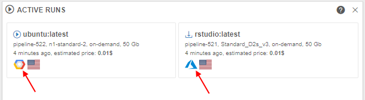
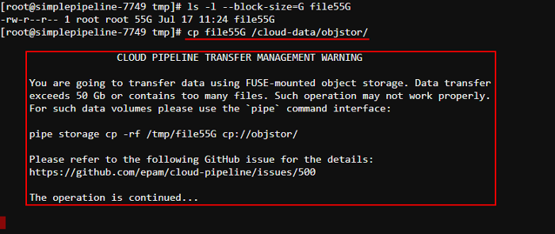

# Cloud Pipeline v.0.16 - Release notes

- [Google Cloud Platform Support](#google-cloud-platform-support)
- [Displaying Cloud Provider's icon](#displaying-cloud-providers-icon-for-the-storagecompute-resources)
- [Configurable timeout of GE Autoscale waiting](#configurable-timeout-of-ge-autoscale-waiting-for-a-worker-node-up)
- [Storage mounts data transfer restrictor](#storage-mounts-data-transfer-restrictor)
- [Extended recursive symlinks handling](#extended-recursive-symlinks-handling)
- [Displaying of the latest commit date/time](#displaying-of-the-latest-commit-datetime)
- [Renaming of the GitLab repository in case of Pipeline renaming](#renaming-of-the-gitlab-repository-in-case-of-pipeline-renaming)
- [Allowing to expose compute node FS to upload and download files](#allowing-to-expose-compute-node-FS-to-upload-and-download-files)

***

- [Notable Bug fixes](#notable-bug-fixes)
    - [`pipe`: not-handled error while trying to execute commands with invalid config](#pipe-not-handled-error-while-trying-to-execute-commands-with-invalid-config)
    - [Setting of the tool icon size](#setting-of-the-tool-icon-size)
    - [`NPE` while building cloud-specific environment variables for run](#npe-while-building-cloud-specific-environment-variables-for-run)
    - [Worker nodes fail due to mismatch of the regions with the parent run](#worker-nodes-fail-due-to-mismatch-of-the-regions-with-the-parent-run)
    - [Worker nodes shall not be restarted automatically](#worker-nodes-shall-not-be-restarted-automatically)
    - [Uploaded storage file content is downloaded back to client](#uploaded-storage-file-content-is-downloaded-back-to-client)
    - [GUI improperly works with detached configurations in a non-default region](#gui-improperly-works-with-detached-configurations-in-a-non-default-region)
    - [Detached configuration doesn't respect region setting](#detached-configuration-doesnt-respect-region-setting)
    - [Incorrect behavior of the "Transfer to the cloud" form in case when a subfolder has own metadata](#incorrect-behavior-of-the-transfer-to-the-cloud-form-in-case-when-a-subfolder-has-own-metadata)
    - [Incorrect displaying of the "Start idle" checkbox](#incorrect-displaying-of-the-start-idle-checkbox)
    - [Limit check of the maximum cluster size is incorrect](#limit-check-of-the-maximum-cluster-size-is-incorrect)
    - [Fixed cluster with SGE and DIND capabilities fails to start](#fixed-cluster-with-sge-and-dind-capabilities-fails-to-start)
    - [Azure: Server shall check Azure Blob existence when a new storage is created](#azure-server-shall-check-azure-blob-existence-when-a-new-storage-is-created)
    - [Azure: `pipe` CLI cannot transfer empty files between storages](#azure-pipe-cli-cannot-transfer-empty-files-between-storages)
    - [Azure: runs with enabled GE autoscaling doesn't stop](#azure-runs-with-enabled-ge-autoscaling-doesnt-stop)
    - [Incorrect behavior while download files from external resources into several folders](#incorrect-behavior-while-download-files-from-external-resources-into-several-folders)
    - [Detach configuration doesn't setup SGE for a single master run](#detach-configuration-doesnt-setup-sge-for-a-single-master-run)

***

## Google Cloud Platform Support

One of the major **`v0.16`** features is a support for the **[Google Cloud Platform](https://cloud.google.com/)**.

All the features, that were previously used for **`AWS`** and **`Azure`**, are now available in all the same manner, from all the same GUI/CLI, for **`GCP`**.

This provides an even greater level of a flexibility to launch different jobs in the locations, closer to the data, with cheaper prices or better compute hardware in depend on a specific task.

## Displaying Cloud Provider's icon for the storage/compute resources

As presented in **[v0.15](../v.0.15/v.0.15_-_Release_notes.md#microsoft-azure-support)**, Cloud Pipeline can manage multi Cloud Providers in a single installation.

In the current version, useful icon-hints with the information about using Cloud Provider are introduced.  
If a specific platform deployment has a number of Cloud Providers registered (e.g. `AWS`+`Azure`, `GCP`+`Azure`) - corresponding icons/text information are displaying next to the cloud resource.

Such cloud resources are:

- **`Object/File Storages`** (icons in the **Library**, at the "DATA" panel of the **Dashboard** etc.)  
      
    
- **`Regions`** (icons in the **Cloud Regions** configuration, at the **Launch** form etc.)  
      
      
- **`Running jobs`**:
    - text hints (at the **RUNS** page)  
        
    - icons (at the **Run logs** page, at the "RUNS" panels of the **Dashboard**)  
          
        

> **_Note_**: this feature is not available for deployments with a **_single_** Cloud Provider.

Examples of displaying Cloud Region icons/info see in sections [6. Manage Pipeline](../../manual/06_Manage_Pipeline/6._Manage_Pipeline.md), [7. Manage Detached configuration](../../manual/07_Manage_Detached_configuration/7._Manage_Detached_configuration.md), [8. Manage Data Storage](../../manual/08_Manage_Data_Storage/8._Manage_Data_Storage.md) and [18. Home page](../../manual/18_Home_page/18._Home_page.md).

## Configurable timeout of GE Autoscale waiting for a worker node up

Previously, `GE Autoscaler` waited for a worker node up for a fixed timeout. This could lead to incorrect behavior for specific **CLoud Providers**, because the timeout can be very different.

Current version extracts `GE Autoscaler` polling timeout to a new system preference **`ge.autoscaling.scale.up.polling.timeout`**.  
That preference defines how many seconds `GE Autoscaler` should wait for **pod initialization** and **run initialization**.  
Default value is `600` seconds (`10` minutes).

## Storage mounts data transfer restrictor

Users may perform `cp` or `mv` operations of the large files (50+ Gb) to and from the fuse-mounted storages.  
It is uncovered that such operations are not handled properly within the fuse implementations. Commands may hang for a long timeout or produce zero-sized result.  
The suggested more graceful approach for the copying of the large files is to use `pipe cp`/`pipe mv` commands, which are behaving correctly for the huge volumes.  
To avoid users of performing usual `cp` or `mv` commands for operations with the large files - now, **Cloud Pipeline** warns them about possible errors and suggest to use corresponding `pipe` commands.

Specified approach is implemented in the following manner:

- if a `cp`/`mv` command is called with the source/dest pointing to the storage (e.g. `/cloud-data/<storage_path>/...`) - the overall size of the data being transferred is checked - if that size is greater than allowed, a warning message will be shown, e.g.:  
    
- this warning doesn't abort the user's command execution, it is continued
- appearance of this warning is configured by the following launch environment variables (values of these variables could be set only by admins via system-level settings):  
    - **`CP_ALLOWED_MOUNT_TRANSFER_SIZE`** - sets number of gigabytes that is allowed to be transferred without warning. By default _50 Gb_.
    - **`CP_ALLOWED_MOUNT_TRANSFER_SIZE_TIMEOUT`** - sets number of seconds that the transfer size retrieving operation can take. By default _5 seconds_.
    - **`CP_ALLOWED_MOUNT_TRANSFER_FILES`** - sets number of files that is allowed to be transferred without warning. Supported only for `Azure` Cloud Provider. By default _100 files_.

> **_Note_**: this feature is not available for `NFS`/`SMB` mounts, only for object storages.

## Extended recursive symlinks handling

There could be specific cases when some services execute tasks using the on-prem storages, where "recursive" symlinks are presented. This causes the Cloud Pipeline `Data transfer service` to follow symlinks infinitely.

In **`v0.16`**, a new feature is introduced for `Data transfer service` to detect such issues and skip the upload for files/folders, that cause infinite loop over symlinks.  
A new option `-sl` (`--symlinks`) was added to the `pipe storage cp` / `mv` operations to handle symlinks (for local source) with the following possible values:

- `follow` - follow symlinks (_default_)
- `skip` - do not follow symlinks
- `filter` - follow symlinks but check for cyclic links and skip them

Example for the folder with recursive and non-recursive symbolic links:  
    

Also options were added to the `Data transfer service` to set symlink policy for transfer operations.

For more details about `pipe storage cp` / `mv` operations see [here](../../manual/14_CLI/14.3._Manage_Storage_via_CLI.md#upload-and-download-data).

## Displaying of the latest commit date/time

Users can modify existing tools and then commit them to save performed changes.  
It can be done by **COMMIT** button on the run's details page:  
    

Previously, if user committed some tool, only commit status was shown on the run's details page.  
In the current version, displaying of the date/time for the tool latest commit is added:  
    

For more details about tool commit see [here](../../manual/10_Manage_Tools/10.4._Edit_a_Tool.md#commit-a-tool).

## Renaming of the GitLab repository in case of Pipeline renaming

Pipeline in the Cloud Pipeline environment is a workflow script with versioned source code, documentation, and configuration. Under the hood, it is a git repository.

Previously, if the Pipeline object was renamed - the underlying GitLab repository was keeping the previous name.  
In the current version, if user renames a Pipeline the corresponding GitLab repository will be also automatically renamed:  

- 
- 
- 

Need to consider in such case that the clone/pull/push URL changes too. Make sure to change the remote address, if you use the Pipeline somewhere else.

For more details see [here](../../manual/06_Manage_Pipeline/6.1._Create_and_configure_pipeline.md#edit-a-pipeline-info).

## Allowing to expose compute node FS to upload and download files

For the `interactive runs` users are processing data in ad-hoc manner, which requires upload data from the local storage to the cloud and download results from the cloud to the local storage.
Cloud Pipeline supports a number of options for the user to perform that data transfers for the interactive runs:

- via the Object Storage (using Web GUI or CLI)
- via the File Storage (using Web GUI, CLI, WebDav-mounted-drive)

Previously, view, download, upload and delete operations required an intermediate location (bucket or fs) to be used. It might confuse user when a small dataset shall be loaded to the specific location within a run's filesystem.

In the current version, direct exposure of the run's filesystem is supported. The "Browse" hyperlink is displayed in the **Active Run** dashboard after a job had been initialized:         
    

User can click the link and a Storage browser Web GUI will be loaded:
    

User is able to:
- view files and directories
- download and delete files and directories
    
- upload files and directories  
    
- search files and directories  
    

For more details see [here](../..\manual\15_Interactive_services\15.4._Expose_node_filesystem.md).

***

## Notable Bug fixes

### `pipe`: not-handled error while trying to execute commands with invalid config

[#750](https://github.com/epam/cloud-pipeline/issues/750)

Previously, if `pipe` config contained some invalid data (e.g. outdated or invalid access token), then trying to execute any `pipe` command had been causing an not-handled error.

### Setting of the tool icon size

[#493](https://github.com/epam/cloud-pipeline/issues/493)

Previously, setting of any value for the maximum tool's icon size via the sytem-level preference **`misc.max.tool.icon.size.kb`** didn't lead to anything - restriction for the size while trying to change an icon was remaining the same - 50 Kb.

### `NPE` while building cloud-specific environment variables for run

[#486](https://github.com/epam/cloud-pipeline/issues/486)

For each run a set of cloud-specific environment variables (including account names, credentials, etc.) is build. This functionality resulted to fails with `NPE` when some of these variables are `null`.
Now, such `null` variables are filtered out with warn logs.

### Worker nodes fail due to mismatch of the regions with the parent run

[#485](https://github.com/epam/cloud-pipeline/issues/485)

In certain cases, when a new child run was launching in cluster, cloud region was not specified directly and it might be created in a region differing from the parent run, that could lead to fails.  
Now, worker runs inherit parent's run cloud region.

### Worker nodes shall not be restarted automatically

[#483](https://github.com/epam/cloud-pipeline/issues/483)

Cloud Pipeline has a functionality to restart so called `batch job` runs automatically when run is terminated due to some technical issues, e.g. spot instance termination. Previously, runs that were created as **child nodes** for some **parent** run were also restarted.
Now, automatically **child** reruns for the described cases with the `batch job` runs are rejected.

### Uploaded storage file content is downloaded back to client

[#478](https://github.com/epam/cloud-pipeline/issues/478)

Cloud Pipeline clients use specific POST API method to upload local files to the cloud storages. Previously, this method not only uploaded files to the cloud storage but also mistakenly returned uploaded file content back to the client. It led to a significant upload time increase.

### GUI improperly works with detached configurations in a non-default region

[#476](https://github.com/epam/cloud-pipeline/issues/476)

Saved instance type of a non-default region in a detached configuration wasn't displayed in case when such configuration was reopened (instance type field was displayed as empty in that cases).

### Detached configuration doesn't respect region setting

[#458](https://github.com/epam/cloud-pipeline/issues/458)

Region setting was not applied when pipeline is launched using detached configuration.  
Now, cloud region ID is merged into the detached configuration settings.

### Incorrect behavior of the "Transfer to the cloud" form in case when a subfolder has own metadata

[#434](https://github.com/epam/cloud-pipeline/issues/434)

Previously, when you tried to download files from external resources using metadata (see [here](../../manual/05_Manage_Metadata/5.5._Download_data_from_external_resources_to_the_cloud_data_storage.md)) and in that metadata's folder there was any subfolder with its own metadata - on the "Transfer to the Cloud" form attributes (columns) of **both** metadata files were mistakenly displaying.

### Incorrect displaying of the "Start idle" checkbox

[#418](https://github.com/epam/cloud-pipeline/issues/418)

If for the configuration form with several tabs user was setting the **Start idle** checkbox on any tab and then switched between sub-configurations tabs - the "checked" state of the **Start idle** checkbox didn't change, even if **Cmd template** field was appearing with its value (these events are mutually exclusive).

### Limit check of the maximum cluster size is incorrect

[#412](https://github.com/epam/cloud-pipeline/issues/412)

Maximum allowed number of runs (size of the cluster) created at once is limited by system preference **`launch.max.scheduled.number`**. This check used strictly "less" check rather then "less or equal" to allow or deny cluster launch.  
Now, the "less or equal" check is used.

### Fixed cluster with SGE and DIND capabilities fails to start

[#392](https://github.com/epam/cloud-pipeline/issues/392)

Previously, fixed cluster with both **`CP_CAP_SGE`** and **`CP_CAP_DIND_CONTAINER`** options enabled with more than one worker failed to start. Some of the workers failed on either `SGEWorkerSetup` or `SetupDind` task with different errors. Scripts were executed in the same one shared analysis directory. So, some workers could delete files downloaded by other workers.

### Azure: Server shall check Azure Blob existence when a new storage is created

[#768](https://github.com/epam/cloud-pipeline/issues/768)

During the creation of `AZ` Storage, the validation whether `Azure Blob` exists or not didn't perform. In that case, if `Azure Blob` had already existed, the user was getting failed request with `Azure` exception.

### Azure: `pipe` CLI cannot transfer empty files between storages

[#386](https://github.com/epam/cloud-pipeline/issues/386)

Previously, empty files couldn't be transferred within a single `Azure` storage or between two `Azure` storages using `pipe` CLI, it throwed an error. So for example, a folder that contained empty files couldn't be copied correctly.

### Azure: runs with enabled GE autoscaling doesn't stop

[#377](https://github.com/epam/cloud-pipeline/issues/377)

All `Azure` runs with enabled GE autoscaling were stuck after the `launch.sh` script has finished its execution. Daemon GE autoscaler process kept container alive. It was caused by the run process `stdout` and `stderr` aren't handled the same way for different Cloud Provider. So background processes launched from `launch.sh` directly could prevent `Azure` run finalization.

### Incorrect behavior while download files from external resources into several folders

[#373](https://github.com/epam/cloud-pipeline/issues/373)

If user was tried to download files from external resources and at the **Transfer settings** form was set **Create folders for each _path_ field** checkbox without setting any name field, all files downloaded into one folder without creating folders for each path field (column).

### Detach configuration doesn't setup SGE for a single master run

[#342](https://github.com/epam/cloud-pipeline/issues/342)

`Grid Engine` installation was mistakenly being skipped, if pipeline was launched with enabled system parameter **`CP_CAP_SGE`** via a detach configuration.
