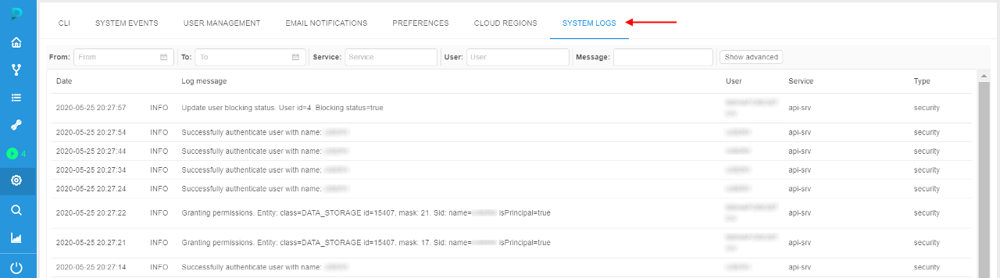
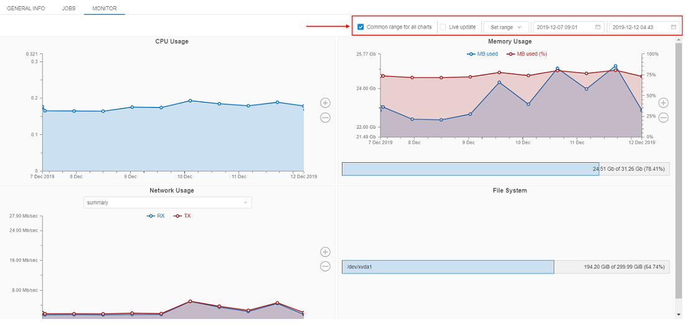
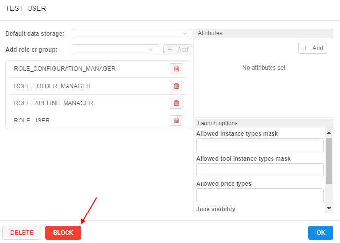
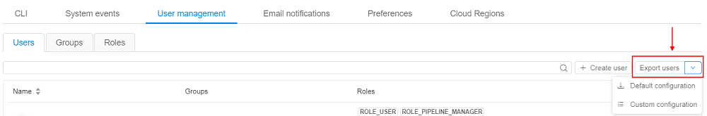
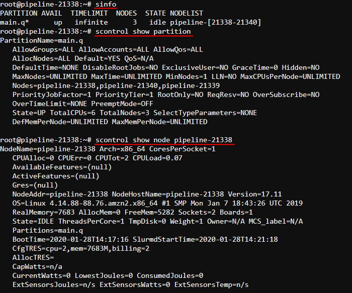
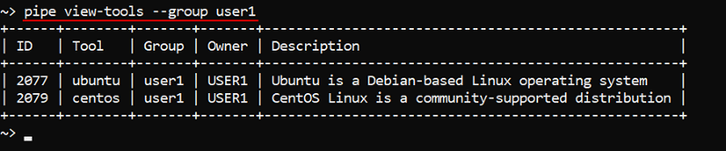
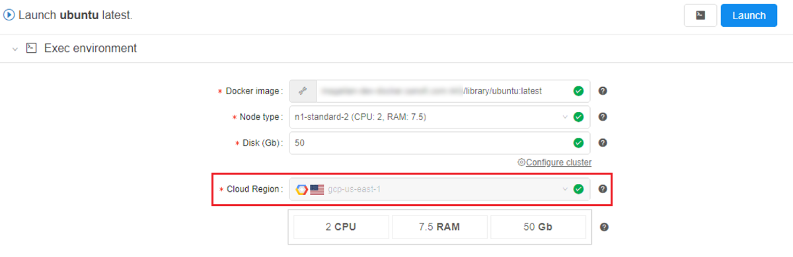

# Cloud Pipeline v.0.16 - Release notes

- [Google Cloud Platform Support](#google-cloud-platform-support)
- [System logs](#system-logs)
- [Displaying Cloud Provider's icon](#displaying-cloud-providers-icon-for-the-storagecompute-resources)
- [Configurable timeout of GE Autoscale waiting](#configurable-timeout-of-ge-autoscale-waiting-for-a-worker-node-up)
- [Storage mounts data transfer restrictor](#storage-mounts-data-transfer-restrictor)
- [Extended recursive symlinks handling](#extended-recursive-symlinks-handling)
- [Displaying of the latest commit date/time](#displaying-of-the-latest-commit-datetime)
- [Renaming of the GitLab repository in case of Pipeline renaming](#renaming-of-the-gitlab-repository-in-case-of-pipeline-renaming)
- [Pushing pipeline changes to the GitLab on behalf of the user](#pushing-pipeline-changes-to-the-gitlab-on-behalf-of-the-user)
- [Allowing to expose compute node FS to upload and download files](#allowing-to-expose-compute-node-fs-to-upload-and-download-files)
- [Resource usage form improvement](#resource-usage-form-improvement)
- [View the historical resources utilization](#allow-to-view-the-historical-resources-utilization)
- [Ability to schedule automatic pause/restart of the running jobs](#ability-to-schedule-automatic-pauserestart-of-the-running-jobs)
- [Update pipe CLI version](#update-pipe-cli-version)
- [Blocking/unblocking users and groups](#blockingunblocking-users-and-groups)
- [Displaying additional node metrics](#displaying-additional-node-metrics-at-the-runs-page)
- [Export user list](#export-user-list)
- [Displaying SSH link for the active runs in the Dashboard view](#displaying-ssh-link-for-the-active-runs-in-the-dashboard-view)
- [Enable Slurm for the Cloud Pipeline's clusters](#enable-slurm-workload-manager-for-the-cloud-pipelines-clusters)
- [The ability to generate the `pipe run` command from the GUI](#the-ability-to-generate-the-pipe-run-command-from-the-gui)
- [`pipe` CLI: view tools definitions](#pipe-cli-view-tools-definitions)
- [List the users/groups/objects permissions globally via `pipe` CLI](#list-the-usersgroupsobjects-permissions-globally-via-pipe-cli)
- [Storage usage statistics retrieval via `pipe`](#storage-usage-statistics-retrieval-via-pipe)
- [GE Autoscaler respects CPU requirements of the job in the queue](#ge-autoscaler-respects-cpu-requirements-of-the-job-in-the-queue)
- [Restrictions of "other" users permissions for the mounted storage](#restrictions-of-other-users-permissions-for-the-storages-mounted-via-the-pipe-storage-mount-command)
- [Search the tool by its version/package name](#the-ability-to-find-the-tool-by-its-versionpackage-name)
- [The ability to restrict which run statuses trigger the email notification](#the-ability-to-restrict-which-run-statuses-trigger-the-email-notification)
- [The ability to force the specific Cloud Provider for an image](#the-ability-to-force-the-usage-of-the-specific-cloud-providerregion-for-a-given-image)

***

- [Notable Bug fixes](#notable-bug-fixes)
    - [Parameter values changes cannot be saved for a tool](#parameter-values-changes-cannot-be-saved-for-a-tool)
    - [Packages are duplicated in the tool's version details](#packages-are-duplicated-in-the-tools-version-details)
    - [Autoscaling cluster can be autopaused](#autoscaling-cluster-can-be-autopaused)
    - [`pipe`: not-handled error while trying to execute commands with invalid config](#pipe-not-handled-error-while-trying-to-execute-commands-with-invalid-config)
    - [Setting of the tool icon size](#setting-of-the-tool-icon-size)
    - [`NPE` while building cloud-specific environment variables for run](#npe-while-building-cloud-specific-environment-variables-for-run)
    - [Worker nodes fail due to mismatch of the regions with the parent run](#worker-nodes-fail-due-to-mismatch-of-the-regions-with-the-parent-run)
    - [Worker nodes shall not be restarted automatically](#worker-nodes-shall-not-be-restarted-automatically)
    - [Uploaded storage file content is downloaded back to client](#uploaded-storage-file-content-is-downloaded-back-to-client)
    - [GUI improperly works with detached configurations in a non-default region](#gui-improperly-works-with-detached-configurations-in-a-non-default-region)
    - [Detached configuration doesn't respect region setting](#detached-configuration-doesnt-respect-region-setting)
    - [Incorrect behavior of the "Transfer to the cloud" form in case when a subfolder has own metadata](#incorrect-behavior-of-the-transfer-to-the-cloud-form-in-case-when-a-subfolder-has-own-metadata)
    - [Incorrect displaying of the "Start idle" checkbox](#incorrect-displaying-of-the-start-idle-checkbox)
    - [Limit check of the maximum cluster size is incorrect](#limit-check-of-the-maximum-cluster-size-is-incorrect)
    - [Fixed cluster with SGE and DIND capabilities fails to start](#fixed-cluster-with-sge-and-dind-capabilities-fails-to-start)
    - [Azure: Server shall check Azure Blob existence when a new storage is created](#azure-server-shall-check-azure-blob-existence-when-a-new-storage-is-created)
    - [Azure: `pipe` CLI cannot transfer empty files between storages](#azure-pipe-cli-cannot-transfer-empty-files-between-storages)
    - [Azure: runs with enabled GE autoscaling doesn't stop](#azure-runs-with-enabled-ge-autoscaling-doesnt-stop)
    - [Incorrect behavior while download files from external resources into several folders](#incorrect-behavior-while-download-files-from-external-resources-into-several-folders)
    - [Detach configuration doesn't setup SGE for a single master run](#detach-configuration-doesnt-setup-sge-for-a-single-master-run)
    - [Broken layouts](#broken-layouts)

***

## Google Cloud Platform Support

One of the major **`v0.16`** features is a support for the **[Google Cloud Platform](https://cloud.google.com/)**.

All the features, that were previously used for **`AWS`** and **`Azure`**, are now available in all the same manner, from all the same GUI/CLI, for **`GCP`**.

This provides an even greater level of a flexibility to launch different jobs in the locations, closer to the data, with cheaper prices or better compute hardware in depend on a specific task.

## System logs

In the current version, the "Security Logging" was implemented.

Now, the system records audit trail events:

- users' authentication attempts
- users' profiles modifications
- platform objects' permissions management
- access to interactive applications from pipeline runs
- other platform functionality features

Logs are collected/managed at the `Elasticsearch` node and backed up to the object storage (that could be configured during the platform deployment).

The administrator can view/filter these logs via the GUI - in the System-level settings, e.g.:  
    

Each record in the logs list contains:

| Field | Description |
|-|-|
| **Date** | The date and time of the log event |
| **Log status** | The status of the log message (`INFO`, `ERROR`, etc.) |
| **Log message** | Description of the log event |
| **User** | User name who performed the event |
| **Service** | Service name that registered the event (`api-srv`, `edge`) |
| **Type** | Log message type (currently, only `security` type is available) |

For more details see [here](../../manual/12_Manage_Settings/12._Manage_Settings.md#system-logs).

## Displaying Cloud Provider's icon for the storage/compute resources

As presented in **[v0.15](../v.0.15/v.0.15_-_Release_notes.md#microsoft-azure-support)**, Cloud Pipeline can manage multi Cloud Providers in a single installation.

In the current version, useful icon-hints with the information about using Cloud Provider are introduced.  
If a specific platform deployment has a number of Cloud Providers registered (e.g. `AWS`+`Azure`, `GCP`+`Azure`) - corresponding icons/text information are displaying next to the cloud resource.

Such cloud resources are:

- **`Object/File Storages`** (icons in the **Library**, at the "DATA" panel of the **Dashboard** etc.)  
      
    
- **`Regions`** (icons in the **Cloud Regions** configuration, at the **Launch** form etc.)  
      
      
- **`Running jobs`**:
    - text hints (at the **RUNS** page)  
        
    - icons (at the **Run logs** page, at the "RUNS" panels of the **Dashboard**)  
          
        

> **_Note_**: this feature is not available for deployments with a **_single_** Cloud Provider.

Examples of displaying Cloud Region icons/info see in sections [6. Manage Pipeline](../../manual/06_Manage_Pipeline/6._Manage_Pipeline.md), [7. Manage Detached configuration](../../manual/07_Manage_Detached_configuration/7._Manage_Detached_configuration.md), [8. Manage Data Storage](../../manual/08_Manage_Data_Storage/8._Manage_Data_Storage.md) and [18. Home page](../../manual/18_Home_page/18._Home_page.md).

## Configurable timeout of GE Autoscale waiting for a worker node up

Previously, `GE Autoscaler` waited for a worker node up for a fixed timeout. This could lead to incorrect behavior for specific **CLoud Providers**, because the timeout can be very different.

Current version extracts `GE Autoscaler` polling timeout to a new system preference **`ge.autoscaling.scale.up.polling.timeout`**.  
That preference defines how many seconds `GE Autoscaler` should wait for **pod initialization** and **run initialization**.  
Default value is `600` seconds (`10` minutes).

## Storage mounts data transfer restrictor

Users may perform `cp` or `mv` operations of the large files (50+ Gb) to and from the fuse-mounted storages.  
It is uncovered that such operations are not handled properly within the fuse implementations. Commands may hang for a long timeout or produce zero-sized result.  
The suggested more graceful approach for the copying of the large files is to use `pipe cp`/`pipe mv` commands, which are behaving correctly for the huge volumes.  
To avoid users of performing usual `cp` or `mv` commands for operations with the large files - now, **Cloud Pipeline** warns them about possible errors and suggest to use corresponding `pipe` commands.

Specified approach is implemented in the following manner:

- if a `cp`/`mv` command is called with the source/dest pointing to the storage (e.g. `/cloud-data/<storage_path>/...`) - the overall size of the data being transferred is checked - if that size is greater than allowed, a warning message will be shown, e.g.:  
    
- this warning doesn't abort the user's command execution, it is continued
- appearance of this warning is configured by the following launch environment variables (values of these variables could be set only by admins via system-level settings):  
    - **`CP_ALLOWED_MOUNT_TRANSFER_SIZE`** - sets number of gigabytes that is allowed to be transferred without warning. By default _50 Gb_.
    - **`CP_ALLOWED_MOUNT_TRANSFER_SIZE_TIMEOUT`** - sets number of seconds that the transfer size retrieving operation can take. By default _5 seconds_.
    - **`CP_ALLOWED_MOUNT_TRANSFER_FILES`** - sets number of files that is allowed to be transferred without warning. Supported only for `Azure` Cloud Provider. By default _100 files_.

> **_Note_**: this feature is not available for `NFS`/`SMB` mounts, only for object storages.

## Extended recursive symlinks handling

There could be specific cases when some services execute tasks using the on-prem storages, where "recursive" symlinks are presented. This causes the Cloud Pipeline `Data transfer service` to follow symlinks infinitely.

In **`v0.16`**, a new feature is introduced for `Data transfer service` to detect such issues and skip the upload for files/folders, that cause infinite loop over symlinks.  
A new option `-sl` (`--symlinks`) was added to the `pipe storage cp` / `mv` operations to handle symlinks (for local source) with the following possible values:

- `follow` - follow symlinks (_default_)
- `skip` - do not follow symlinks
- `filter` - follow symlinks but check for cyclic links and skip them

Example for the folder with recursive and non-recursive symbolic links:  
    

Also options were added to the `Data transfer service` to set symlink policy for transfer operations.

For more details about `pipe storage cp` / `mv` operations see [here](../../manual/14_CLI/14.3._Manage_Storage_via_CLI.md#upload-and-download-data).

## Displaying of the latest commit date/time

Users can modify existing tools and then commit them to save performed changes.  
It can be done by **COMMIT** button on the run's details page:  
    

Previously, if user committed some tool, only commit status was shown on the run's details page.  
In the current version, displaying of the date/time for the tool latest commit is added:  
    

For more details about tool commit see [here](../../manual/10_Manage_Tools/10.4._Edit_a_Tool.md#commit-a-tool).

## Renaming of the GitLab repository in case of Pipeline renaming

**Pipeline** in the Cloud Pipeline environment is a workflow script with versioned source code, documentation, and configuration. Under the hood, it is a git repository.

Previously, if the **Pipeline** object was renamed - the underlying GitLab repository was keeping the previous name.  
In the current version, if user renames a **Pipeline** the corresponding GitLab repository will be also automatically renamed:  

- 
- 
- 

Need to consider in such case that the clone/pull/push URL changes too. Make sure to change the remote address, if you use the **Pipeline** somewhere else.

For more details see [here](../../manual/06_Manage_Pipeline/6.1._Create_and_configure_pipeline.md#edit-a-pipeline-info).

## Pushing pipeline changes to the GitLab on behalf of the user

If the user saves the changed **Pipeline** object - it actually means that a new commit is created and pushed to the corresponding GitLab repo.  
Previously, all the commits pushed to the GitLab via the Cloud Pipeline GUI were made on behalf of the `service account`. This could break traceability of the changes.

In current version, the author of the commit is displayed in the Web GUI (for all **Pipeline** versions - the draft and released), the commits are performed on behalf of the real user:  
    

## Allowing to expose compute node FS to upload and download files

For the `interactive runs` users are processing data in ad-hoc manner, which requires upload data from the local storage to the cloud and download results from the cloud to the local storage.
Cloud Pipeline supports a number of options for the user to perform that data transfers for the interactive runs:

- via the Object Storage (using Web GUI or CLI)
- via the File Storage (using Web GUI, CLI, WebDav-mounted-drive)

Previously, view, download, upload and delete operations required an intermediate location (bucket or fs) to be used. It might confuse user when a small dataset shall be loaded to the specific location within a run's filesystem.

In the current version, direct exposure of the run's filesystem is supported. The **BROWSE** hyperlink is displayed on the **Run logs** page after a job had been initialized:  
    

User can click the link and a Storage browser Web GUI will be loaded:  
    

User is able to:

- view files and directories
- download and delete files and directories  
    
- upload files and directories  
    
- search files and directories  
    

For more details see [here](../../manual/15_Interactive_services/15.3._Expose_node_filesystem.md).

## Resource usage form improvement

In **`v0.16`**, the number of filters were added to the [Monitor cluster nodes](../../manual/09_Manage_Cluster_nodes/9._Manage_Cluster_nodes.md) feature:

- *Common range for all charts*  
    User can synchronize the time period for all plots. To do so user should mark the "Common range for all charts" filter.  
    If this filter is unmarked, user can zoom any plot without any change for others.
- *Live update*  
    The plots data will be updated every 5 seconds in a real-time manner. The fields with dates will be updated as well.
- *Set range*  
    User can select the predefined time range for all plots from the list:
    - Whole range
    - Last week
    - Last day
    - Last hour
- *Date filter*  
    User can specify the Start and the End dates for plots. The system will substitute the node creating date as the Start date and current date for the End date, if user doesn't select anything.



All filters are working for all plots simultaneously: data for all plots will be dynamically updated as soon as the user changes filter value.

For more details see [here](../../manual/09_Manage_Cluster_nodes/9._Manage_Cluster_nodes.md).

## Allow to view the historical resources utilization

Another convenient feature that was implemented in **`v0.16`** linked to the [Cluster nodes monitor](../../manual/09_Manage_Cluster_nodes/9._Manage_Cluster_nodes.md) is viewing of the detailed history of the resource utilization for any jobs.  
Previously, it was available only for active jobs. Now, users can view the utilization data even for completed (succeed/stopped/failed) jobs for debugging/optimization purposes.  

The utilization data for all runs is stored for a preconfigured period of time that is set by the system preference **`system.resource.monitoring.stats.retention.period`** (defaults to 5 days).  
I.e. if the job has been stopped and the specified time period isn't over - the user can access to the resources utilization data of that job:

- Open the **Run logs** page for the completed job:  
      
    Click the node name hyperlink
- The **Monitor** page of the node resources utilization will be opened:  
    

Also now, users have the ability to export the utilization information into a `.csv` file.  
This is required, if the user wants to keep locally the information for a longer period of time than defined by **`system.resource.monitoring.stats.retention.period`**:  
      
The user can select the interval for the utilization statistics output and export the corresponding file.

For more details see [here](../../manual/09_Manage_Cluster_nodes/9._Manage_Cluster_nodes.md#monitor).

## Ability to schedule automatic pause/restart of the running jobs

For certain use cases (e.g. when `Cloud Pipeline` is used as a development/research environment) users can launch jobs and keep them running all the time, including weekends and holidays.  
To reduce costs, in the current version, the ability to set a **Run schedule** was implemented. This feature allows to automatically pause/resume runs, based on the configuration specified. This feature is applied only to the "Pausable" runs (i.e. "On-demand" and non-cluster):

- The user (who has permissions to pause/resume a run) is able to set a schedule for a run being launched:  
    
- Schedule is defined as a list of rules - user is able to specify any number of them:  
      
    
- For each rule in the list user is able to set the action (`PAUSE`/`RESUME`) and the recurrence:  
    

If any schedule rule is configured for the launched active run - that run will be paused/restarted accordingly in the scheduled day and time.  
Also, users (who have permissions to pause/resume a run) can create/view/modify/delete schedule rules anytime run is active via the **Run logs** page:  
    

See more details [here](../../manual/06_Manage_Pipeline/6.2._Launch_a_pipeline.md) (item 5).

## Update `pipe` CLI version

Previously, if the user installed `pipe` CLI to his local workstation, used it some time - and the Cloud Pipeline API version could be updated during this period - so the user had to manually perform complete re-installing of `pipe` CLI every time to have an actual version.

Currently, the **`pipe update`** command to update the Cloud Pipeline CLI version was implemented.

This command compare the CLI and API versions. If the CLI version is less than the API one, it will update the CLI - the latest Cloud Pipeline CLI version will be installed. Otherwise no actions will be performed:


For more details see [here](../../manual/14_CLI/14.1._Install_and_setup_CLI.md#update-the-cli).

## Blocking/unblocking users and groups

In current version, the ability for administrators to set the "blocked" flag for the specific user or a whole group is implemented.  
This flag prevents user(s) to access Cloud Pipeline platform by the GUI.

Administrators can block or unblock users/groups via the **User management** tab of the System Settings dashboard.

For example, for a user:  
      
For the blocked user the special label will be displayed aside to the user's name:  
      
The blocked user won't be able to access `Cloud Pipeline` via the GUI. The error message will be displayed when trying to login:  
      

> **_Note_**: any content generated by the blocked users is kept in the Cloud Pipeline, all the log trails on the users activities are kept as well. Only access to the platform is being restricted.

To unblock click the **UNBLOCK** button that appeared instead of the **BLOCK** button:  
      

All these actions could be performed also to a group. Users from a blocked group will not have access to the platform.

For more details about users blocking/unblocking see [here](../../manual/12_Manage_Settings/12.4._Edit_delete_a_user.md#blockunblock-a-user).  
For more details about groups blocking/unblocking see [here](../../manual/12_Manage_Settings/12.6._Edit_a_group_role.md#blockunblock-a-group).

## Displaying additional node metrics at the Runs page

In **`v0.16`**, the displaying of high-level metrics information for the Active Runs is implemented:

-  - "Idle" - this auxiliary label is shown when node's CPU consumption is lower than a certain level, defined by the admin. This label should attract the users attention cause such run may produce extra costs.
-  - "Pressure" - this auxiliary label is shown when node's Memory/Disk consumption is higher than a certain level, defined by the admin. This label should attract the users attention cause such run may accidentally fail.

These labels are displayed:  

- at the **Runs** page  
    
- at the **Run logs** page  
    
- at the main dashboard (the **ACTIVE RUNS** panel)  
    

**_Note_**: if a user clicks this label from the **Runs** or the **Run logs** page the [Cluster node Monitor](../../manual/09_Manage_Cluster_nodes/9._Manage_Cluster_nodes.md#monitor) will be opened to view the current node consumption.

Admins can configure the emergence of these labels by the set of previous implemented system-level parameters.  
For the **`IDLE`** label:

- `system.max.idle.timeout.minutes` - specifies the duration in minutes how often the system should check node's activity
- `system.idle.cpu.threshold` - specifies the percentage of the CPU utilization, below which label will be displayed

For the **`PRESSURE`** label:

- `system.disk.consume.threshold` - specifies the percentage of the node disk threshold above which the label will be displayed
- `system.memory.consume.threshold` - specifies the percentage of the node memory threshold above which the label will be displayed

For more details see [here](../../manual/11_Manage_Runs/11._Manage_Runs.md#displaying-additional-node-metrics).

## Export user list

In the current version, the ability to export list of the platform users is implemented. This feature is available only for admins via **User management** tab of the system-level settings:  
      

Admin can download list with all users and their properties (user name, email, roles, attributes, state, etc.) by default or custom configure which properties should be exported:  
      

The downloaded file will have the `.csv` format.

For more details see [here](../../manual/12_Manage_Settings/12._Manage_Settings.md#export-users).

## Displaying SSH link for the active runs in the Dashboard view

Users can run SSH session over launched container. Previously, SSH link is only available from the **Run logs** page.  
In **`v0.16`**, a new helpful capability was implemented that allows to open the SSH connection right from the **Active Runs** panel of the main Dashboard:  
      
    

That SSH link is available for all the non-paused active jobs (interactive and non-interactive) after all run's checks and initializations have passed (same as at the **Run logs** page).

## Enable Slurm workload manager for the Cloud Pipeline's clusters

A new feature for the Cloud Pipeline's clusters was implemented in **`v0.16`**.  
Now, [**`Slurm`**](https://slurm.schedmd.com/overview.html) can be configured within the `Cluster` tab. It is available only for the fixed size clusters.

To enable this feature - tick the `Enable Slurm` checkbox and set the child nodes count at cluster settings. By default, this checkbox is unticked. Also users can manually enable `Slurm` functionality by the `CP_CAP_SLURM` system parameter:  
    

This feature allows you to use the full stack of `Slurm` cluster's commands to allocate the workload over the cluster, for example:  
    

For more information about using `Slurm` via the `Cloud Pipeline` see
[here](../../manual/15_Interactive_services/15.2._Using_Terminal_access.md#example-using-of-slurm-for-the-cloud-pipelines-clusters).

## The ability to generate the `pipe run` command from the GUI

A user has a couple of options to launch a new job in the Cloud Pipeline:

- `API`
- `CLI`
- `GUI`

The easiest way to perform it is the `GUI`. But for automation purposes - the `CLI` is much more handy. Previously, users had to construct the commands manually, which made it hard to use.

Now, the ability to automatically generate the `CLI` commands for job runs appeared in the `GUI`.  
Now, users can get a generated `CLI` command (that assembled all the run information):

- at the **Launch** form:  
    
- at the **Run logs** form:  
      
    **_Note_**: this button is available for completed runs too

Once click these buttons - the popup with the corresponding `pipe run` command will appear:  
      
User can copy such command and paste it to the `CLI` for further launch.  
Also user can select the **API** tab in that popup and get the `POST` request for a job launch:  
    

See an example [here](../../manual/14_CLI/14.5._Manage_pipeline_executions_via_CLI.md#generate-pipeline-launch-command-via-the-gui).

## `pipe` CLI: view tools definitions

In **`v0.16`** the ability to view details of a tool/tool version or tools group via the `CLI` was implemented.  
The general command to perform these operations:

``` bash
pipe view-tools [OPTIONS]
```

Via the options users can specify a Docker registry (`-r` option), a tools group (`-g` option), a tool (`-t` option), a tool version (`-v` option) and view the corresponding information.

For example, to show a full tools list of a group:  
    

To show a tool definition with versions list:  
    

Also the specifying of "path" to the object (registry/group/tool) is supported. The "full path" format is: `<registry_name>:<port>/<group_name>/<tool_name>:<verion_name>`:  
    

For more details and usage examples see [here](../../manual/14_CLI/14.8._View_tools_definitions_via_CLI.md).

## List the users/groups/objects permissions globally via `pipe` CLI

Administrators may need to receive the following information - in a quick and convenient way:

- Which objects are accessible by a user?
- Which objects are accessible by a user group?
- Which user(s)/group(s) have access to the object?

The lattest case was implemented early - see the command [`pipe view-acl`](../../manual/14_CLI/14.7._View_and_manage_Permissions_via_CLI.md#view-permissions).

For other cases, new commands were implemented: `pipe view-user-objects <Username> [OPTIONS]` and `pipe view-group-objects <Groupname> [OPTIONS]` - to get a list of objects accessible by a user and by a user group/role respectively:  
    

Each of these commands has the non-required option `-t` (`--object-type`) `<OBJECT_TYPE>` - to restrict the output list of accessible objects only for the specific type (e.g., "pipeline" or "tool", etc.):  
    

For more details see: [`pipe view-user-objects`](../../manual/14_CLI/14.7._View_and_manage_Permissions_via_CLI.md#view-the-list-of-objects-accessible-by-a-user) and [`pipe view-group-objects`](../../manual/14_CLI/14.7._View_and_manage_Permissions_via_CLI.md#view-the-list-of-objects-accessible-by-a-group).

## Storage usage statistics retrieval via `pipe`

In some cases, it may be necessary to obtain an information about storage usage or some inner folder(s).  
In the current version, the command `pipe storage du` is implemented that provides "disk usage" information on the supported data storages/path:

- number of files in the storage/path
- summary size of the files in the storage/path

In general, the command has the following format:

``` bash
pipe storage du [OPTIONS] [STORAGE]
```

Without specifying any options and storage this command prints the full list of the available storages (both types - object and FS) with the "usage" information for each of them.  
With specifying the storage name this command prints the "usage" information only by that storage, e.g.:  
      
With `-p` (`--relative-path`) option the command prints the "usage" information for the specified path in the required storage, e.g.:  
      
With `-d` (`--depth`) option the command prints the "usage" information in the required storage (and path) for the specified folders nesting depth, e.g.:  
    

For more details about that command and full list of its options see [here](../../manual/14_CLI/14.3._Manage_Storage_via_CLI.md#show-storage-usage).

## GE Autoscaler respects CPU requirements of the job in the queue

At the moment, **GE Autoscaler** treats each job in the queue as a single-core job.  
Previously, autoscale workers could have only fixed instance type (the same as the master) - that could lead to `unschedulable` jobs in the queue - for examle, if one of the jobs requested **4** slots in the `local` parallel environment within a **2**-cored machine. Described job waited in a queue forever (as autoscaler could setup only new **2**-cored nodes).

In the current version the `hybrid` behavior for the **GE Autoscaler** was implemented, that allows processing the data even if the initial node type is not enough. That behavior allows to scale-up the cluster (attach a worker node) with the instance type distinct of the master - worker is being picked up based on the amount of unsatisfied **CPU** requirements of all pending jobs (according to required slots and parallel environment types).

There are several **System parameters** to configure that behavior:

- **`CP_CAP_AUTOSCALE_HYBRID`** (_boolean_) - enables the `hybrid` mode. In that mode the additional worker type can vary within either master instance type family (or `CP_CAP_AUTOSCALE_HYBRID_FAMILY` if specified). If `disabled` or not specified - the **GE Autoscaler** will work in a general regimen (when scaled-up workers have the same instance type as the master node)
- **`CP_CAP_AUTOSCALE_HYBRID_FAMILY`** (_string_) - defines the instance "family", from which the **GE Autoscaler** should pick up the worker node in case of `hybrid` behavior. If not specified (by default) - the **GE Autoscaler** will pick up worker instance from the same "family" as the master node
- **`CP_CAP_AUTOSCALE_HYBRID_MAX_CORE_PER_NODE`** (_string_) - determines the maximum number of instance cores for the node to be scaled up by the **GE Autoscaler** in case of `hybrid` behavior


Also now, if no matching instance is present for the job (no matter - in `hybrid` or general regimen), **GE Autoscaler** logs error message and rejects such job:  
    for example, when try to request **32** slots for the autoscaled cluster launched in `hybrid` mode with the parameter `CP_CAP_AUTOSCALE_HYBRID_MAX_CORE_PER_NODE` set to **20**:  
      
    and in the logs console at the same time:  
    

For more details about **GE Autoscaler** see [here](../../manual/Appendix_C/Appendix_C._Working_with_autoscaled_cluster_runs.md).

## Restrictions of "other" users permissions for the storages mounted via the `pipe storage mount` command

As was introduced in [Release Notes v.0.15](../v.0.15/v.0.15_-_Release_notes.md#mounting-data-storages-to-linux-and-mac-workstations), the ability to mount Cloud data storages (both - File Storages and Object Storages) to Linux and Mac workstations (requires **`FUSE`** installed) was added.  
For that, the `pipe storage mount` command was implemented.

Previously, Cloud Pipeline allowed read access to the mounted cloud storages for the other users, by default. This might introduce a security issue when dealing with the sensitive data.

In the current version, for the `pipe storage mount` command the new option is added: `-m` (`--mode`), that allows to set the permissions on the mountpoint at a mount time.  
Permissions are being configured by the numerical mask - similarly to `chmod` Linux command.  

E.g. to mount the storage with `RW` access to the **OWNER**, `R` access to the **GROUP** and no access to the **OTHERS**:  
    

If the option `-m` isn't specified - the default permission mask will be set - `700` (full access to the **OWNER** (`RWX`), no access to the **GROUP** and **OTHERS**).

For more details about mounting data storages via the `pipe` see [here](../../manual/14_CLI/14.3._Manage_Storage_via_CLI.md#mounting-of-storages).

## The ability to find the tool by its version/package name

Cloud Pipeline allows searching for the tools in the registry by its name or description. But in some cases, it is more convenient and useful to find which tool contains a specific software package and then use it.

In the current version, this ability - to find a tool by its content - is implemented based on the global search capabilities.  
Now, via the Global Search, you may find a tool by its version name, e.g.:  
      
And by the package name (from any available ecosystem), e.g.:  
    

## The ability to restrict which run statuses trigger the email notification

Cloud Pipeline can be configured to send the email to the owner of the job (or specific users) if its status is changed.  
But in certain cases - it is not desired to get a notification about all changes of the run state.  
To reduce a number of the emails in these cases, the ability to configure, which statuses are triggering the notifications, is implemented in **`v0.16`**.

Now, when the administrator configures the emails sending linked to the run status changes - he can select specific run states that will trigger the notifications.  
It is done through the `PIPELINE_RUN_STATUS` section at the **Email notifications** tab of the System Settings (the "**Statuses to inform**" field):  
      
The email notifications will be sent only if the run enters one of the selected states.  
**_Note_**: if no statuses are selected in the "**Statuses to inform**" field - email notifications will be sent as previously - for all status changes.

For more information how to configure the email notifications see [here](../../manual/12_Manage_Settings/12.9._Change_email_notification.md).

## The ability to force the usage of the specific Cloud Provider/Region for a given image

Previously, the platform allowed to select a **Cloud Provider** (and **Cloud Region**) for a particular job execution via the **Launch** Form, but a tool/version itself didn't not have any link with a region.

In certain cases, it's necessary to enforce users to run some tools in a specific **Cloud Provider**/**Region**.

In the current version, such ability was implemented. The **Tool**/**Version Settings** forms contain the field for specifying a **Cloud Region**, e.g.:  
    

By default, this parameter has **`Not configured`** value. This means, that a tool will be launched in a _Default region_ (configured by the Administrator in the global settings). Or a user can set any allowed **Cloud Region**/**Provider** manually. This behavior will be the same as previously.

- Admin or a tool owner can forcibly set a specific **Cloud Region**/**Provider** where the run shall be launched, e.g.:  
    
- Then, if a specific **Cloud Region**/**Provider** is configured - users will have to use it, when launching a tool (regardless of how the launch was started - with default or custom settings):  
    
- And if a user does not have access to that **Cloud Region**/**Provider** - tool won't launch:  
      
    

**_Note_**: if a specific **Cloud Region**/**Provider** is being specified for the Tool, in general - this action enforce the **Region**/**Provider** only for the latest version of that tool. For other versions the settings will remain previous.

See for more details about tool execution settings [here](../../manual/10_Manage_Tools/10._Manage_Tools.md#settings-tab).
See for more details about tool version execution settings [here](../../manual/10_Manage_Tools/10.7._Tool_version_menu.md#version-settings).

***

## Notable Bug fixes

### Parameter values changes cannot be saved for a tool

[#871](https://github.com/epam/cloud-pipeline/issues/871)

Previously, if a user changed only the parameter value within a tool's settings form - the **SAVE** button stayed still unavailable. One had to modify some other option (e.g. disk size) to save the overall changes.

### Packages are duplicated in the tool's version details

[#843](https://github.com/epam/cloud-pipeline/issues/843)

Previously, certain tools packages were duplicated in the **PACKAGES** details page of the tools version.

### Autoscaling cluster can be autopaused

[#819](https://github.com/epam/cloud-pipeline/issues/819)

Previously, when users launched auto-scaled clusters without default child-nodes and the `PAUSE` action was specified as action for the "idle" run (via system-levels settings), such cluster runs could be paused. Any cluster runs shall not have the ability to be paused, only stopped.

### `pipe`: not-handled error while trying to execute commands with invalid config

[#750](https://github.com/epam/cloud-pipeline/issues/750)

Previously, if `pipe` config contained some invalid data (e.g. outdated or invalid access token), then trying to execute any `pipe` command had been causing an not-handled error.

### Setting of the tool icon size

[#493](https://github.com/epam/cloud-pipeline/issues/493)

Previously, setting of any value for the maximum tool's icon size via the sytem-level preference **`misc.max.tool.icon.size.kb`** didn't lead to anything - restriction for the size while trying to change an icon was remaining the same - 50 Kb.

### `NPE` while building cloud-specific environment variables for run

[#486](https://github.com/epam/cloud-pipeline/issues/486)

For each run a set of cloud-specific environment variables (including account names, credentials, etc.) is build. This functionality resulted to fails with `NPE` when some of these variables are `null`.
Now, such `null` variables are filtered out with warn logs.

### Worker nodes fail due to mismatch of the regions with the parent run

[#485](https://github.com/epam/cloud-pipeline/issues/485)

In certain cases, when a new child run was launching in cluster, cloud region was not specified directly and it might be created in a region differing from the parent run, that could lead to fails.  
Now, worker runs inherit parent's run cloud region.

### Worker nodes shall not be restarted automatically

[#483](https://github.com/epam/cloud-pipeline/issues/483)

Cloud Pipeline has a functionality to restart so called `batch job` runs automatically when run is terminated due to some technical issues, e.g. spot instance termination. Previously, runs that were created as **child nodes** for some **parent** run were also restarted.
Now, automatically **child** reruns for the described cases with the `batch job` runs are rejected.

### Uploaded storage file content is downloaded back to client

[#478](https://github.com/epam/cloud-pipeline/issues/478)

Cloud Pipeline clients use specific POST API method to upload local files to the cloud storages. Previously, this method not only uploaded files to the cloud storage but also mistakenly returned uploaded file content back to the client. It led to a significant upload time increase.

### GUI improperly works with detached configurations in a non-default region

[#476](https://github.com/epam/cloud-pipeline/issues/476)

Saved instance type of a non-default region in a detached configuration wasn't displayed in case when such configuration was reopened (instance type field was displayed as empty in that cases).

### Detached configuration doesn't respect region setting

[#458](https://github.com/epam/cloud-pipeline/issues/458)

Region setting was not applied when pipeline is launched using detached configuration.  
Now, cloud region ID is merged into the detached configuration settings.

### Incorrect behavior of the "Transfer to the cloud" form in case when a subfolder has own metadata

[#434](https://github.com/epam/cloud-pipeline/issues/434)

Previously, when you tried to download files from external resources using metadata (see [here](../../manual/05_Manage_Metadata/5.5._Download_data_from_external_resources_to_the_cloud_data_storage.md)) and in that metadata's folder there was any subfolder with its own metadata - on the "Transfer to the Cloud" form attributes (columns) of **both** metadata files were mistakenly displaying.

### Incorrect displaying of the "Start idle" checkbox

[#418](https://github.com/epam/cloud-pipeline/issues/418)

If for the configuration form with several tabs user was setting the **Start idle** checkbox on any tab and then switched between sub-configurations tabs - the "checked" state of the **Start idle** checkbox didn't change, even if **Cmd template** field was appearing with its value (these events are mutually exclusive).

### Limit check of the maximum cluster size is incorrect

[#412](https://github.com/epam/cloud-pipeline/issues/412)

Maximum allowed number of runs (size of the cluster) created at once is limited by system preference **`launch.max.scheduled.number`**. This check used strictly "less" check rather then "less or equal" to allow or deny cluster launch.  
Now, the "less or equal" check is used.

### Fixed cluster with SGE and DIND capabilities fails to start

[#392](https://github.com/epam/cloud-pipeline/issues/392)

Previously, fixed cluster with both **`CP_CAP_SGE`** and **`CP_CAP_DIND_CONTAINER`** options enabled with more than one worker failed to start. Some of the workers failed on either `SGEWorkerSetup` or `SetupDind` task with different errors. Scripts were executed in the same one shared analysis directory. So, some workers could delete files downloaded by other workers.

### Azure: Server shall check Azure Blob existence when a new storage is created

[#768](https://github.com/epam/cloud-pipeline/issues/768)

During the creation of `AZ` Storage, the validation whether `Azure Blob` exists or not didn't perform. In that case, if `Azure Blob` had already existed, the user was getting failed request with `Azure` exception.

### Azure: `pipe` CLI cannot transfer empty files between storages

[#386](https://github.com/epam/cloud-pipeline/issues/386)

Previously, empty files couldn't be transferred within a single `Azure` storage or between two `Azure` storages using `pipe` CLI, it throwed an error. So for example, a folder that contained empty files couldn't be copied correctly.

### Azure: runs with enabled GE autoscaling doesn't stop

[#377](https://github.com/epam/cloud-pipeline/issues/377)

All `Azure` runs with enabled GE autoscaling were stuck after the `launch.sh` script has finished its execution. Daemon GE autoscaler process kept container alive. It was caused by the run process `stdout` and `stderr` aren't handled the same way for different Cloud Provider. So background processes launched from `launch.sh` directly could prevent `Azure` run finalization.

### Incorrect behavior while download files from external resources into several folders

[#373](https://github.com/epam/cloud-pipeline/issues/373)

If user was tried to download files from external resources and at the **Transfer settings** form was set **Create folders for each _path_ field** checkbox without setting any name field, all files downloaded into one folder without creating folders for each path field (column).

### Detach configuration doesn't setup SGE for a single master run

[#342](https://github.com/epam/cloud-pipeline/issues/342)

`Grid Engine` installation was mistakenly being skipped, if pipeline was launched with enabled system parameter **`CP_CAP_SGE`** via a detach configuration.

### Broken layouts

[#747](https://github.com/epam/cloud-pipeline/issues/747), [#834](https://github.com/epam/cloud-pipeline/issues/834)

Previously, **pipeline versions page** had broken layout if there "Attributes" and "Issues" panels were simultaneously opened.  
If there were a lot of node labels at the **Cluster nodes** page, some of them were "broken" and spaced to different lines.  
Some of the other page layouts also were broken.
