# Cloud Pipeline v.0.17 - Release notes

- [Billing reports enhancements](#billing-reports-enhancements)
- [System dictionaries](#system-dictionaries)
- [Cloud Data application](#cloud-data-application)
- [Sending of email notifications enhancements](#sending-of-email-notifications-enhancements)
- [Allowed price types for a cluster master node](#allowed-price-types-for-a-cluster-master-node)
- ["Max" data series in the resources Monitoring](#max-data-series-at-the-resource-monitoring-dashboard)
- [Export custom user's attributes](#export-custom-users-attributes)
- [User management and export in read-only mode](#user-management-and-export-in-read-only-mode)
- ["All pipelines" and "All storages" repositories](#all-pipelines-and-all-storages-repositories)
- [Sensitive storages](#sensitive-storages)
- [Updates of "Limit mounts" for object storages](#updates-of-limit-mounts-for-object-storages)
- [Hot node pools](#hot-node-pools)
- [Export cluster utilization in Excel format](#export-cluster-utilization-in-excel-format)
- [Export cluster utilization via `pipe`](#export-cluster-utilization-via-pipe)
- [Pause/resume runs via `pipe`](#pauseresume-runs-via-pipe)
- [Home storage for each user](#home-storage-for-each-user)
- [Batch users import](#batch-users-import)
- [SSH tunnel to the running compute instance](#ssh-tunnel-to-the-running-compute-instance)
- [Updates of Metadata object](#updates-of-metadata-object)
- [Custom node images](#custom-node-images)
- [Launch a tool with "hosted" applications](#launch-a-tool-with-hosted-applications)
- [Advanced global search with faceted filters](#advanced-global-search-with-faceted-filters)
- [Explicitly "immutable" pipeline parameters](#explicitly-immutable-pipeline-parameters)
- [Disable Hyper-Threading](#disable-hyper-threading)
- [Saving of interim data for jobs stopped by a timeout](#saving-of-interim-data-for-jobs-stopped-by-a-timeout)
- [Resolve variables for a rerun](#resolve-variables-for-a-rerun)
- [NAT gateway](#nat-gateway)
- [Custom Run capabilities](#custom-run-capabilities)
- [Storage lifecycle management](#storage-lifecycle-management)
- [Image history](#image-history)
- [Environments synchronization via `pipectl`](#environments-synchronization-via-pipectl)
- [AWS: seamless authentication](#aws-seamless-authentication)
- [AWS: transfer objects between AWS regions](#aws-transfer-objects-between-aws-regions-using-pipe-storage-cpmv-commands)

***

- [Notable Bug fixes](#notable-bug-fixes)
    - [Unable to view pipeline sources for previous draft versions](#unable-to-view-pipeline-sources-for-previous-draft-versions)
    - [`pipe storage ls` works incorrectly with the option `--page`](#pipe-storage-ls-works-incorrectly-with-the-option-page)
    - [AWS deployment: unable to list more than 1000 files in the S3 bucket](#aws-deployment-unable-to-list-more-than-1000-files-in-the-s3-bucket)
    - [Size of tool version created from original tool without any changes is a lot larger than original one](#size-of-tool-version-created-from-original-tool-without-any-changes-is-a-lot-larger-than-original-one)
    - [`pipe storage cp` fails in Windows for the GCS](#pipe-storage-cp-fails-in-windows-for-the-gcs-with-sslv3-error)
    - [Shared endpoint for `anonymous` users is being opened from the second time](#shared-endpoint-for-anonymous-users-is-being-opened-from-the-second-time)
    - [Attempt to view permissions on a pipeline via the `pipe view-pipes` throws an error](#attempt-to-view-permissions-on-a-pipeline-via-the-pipe-view-pipes-throws-an-error)
    - [Scale down "cold" SGE autoscaling cluster](#scale-down-cold-sge-autoscaling-cluster)
    - ["Launch Command" functionality issues](#launch-command-functionality-issues)
    - [Inner data storages navigation bar fails to navigate](#inner-data-storages-navigation-bar-fails-to-navigate)
    - [Region is being set incorrectly when trying to rerun pipeline](#region-is-being-set-incorrectly-when-trying-to-rerun-pipeline)
    - [`PAUSE` and `COMMIT` operations fail for the jobs with an autoscaled disk](#pause-and-commit-operations-fail-for-the-jobs-with-an-autoscaled-disk)

***

## Billing reports enhancements

In the previous version, the **Billing reports** functionality was introduced (see details [here](../../manual/Appendix_D/Appendix_D._Costs_management.md#billing-reports)).  
In **`v0.17`**, several useful features for the **Billing reports** were implemented.

### Access to Billing reports for non-admin users

Previously, only admins had access to the **Billing reports** Dashboard and can view Platform's spendings data.  
In some cases, it is convenient that non-admin users also have the access to specific cost reports info.

In the current version, such ability was implemented - in two ways:

- a new role was added into the predefined roles list - **`ROLE_BILLING_MANAGER`**. If that role is assigned to the user - for him/her the **Billing reports** Dashboard becomes available. And all possible filters, charts and their types, discounts configuration, export feature and etc. become available too. So, users who are granted this role are able to view the whole **Billing reports** info of the platform (as if they were admins).
    - **_Note_**: this behavior is enabled by the new system preference **`billing.reports.enabled.admins`**. It allows to configure **Billing reports** visibility for admins and billing managers. Default value is _true_.
- base access to the **Billing reports** for "general" users that allows to view some information - about users' own spendings:
    - this behavior is enabled by the new system preference **`billing.reports.enabled`**. If this preference is set, all "general" users can access personal billing information - runs/storages where the user is an owner. Also "general" users can use filters, change chart types, make reports export.
    - the following restrictions are set for "general" users when "base" billing access is enabled:
        - all showing charts are being displayed only spendings of the current user
        - there isn't an ability to configure discounts, the button "Configure discounts" is disabled
        - "Billing centers (TOP 10)" chart isn't displayed

For example, the view of the **Billing reports** Dashboard for the "general" user when the system preference `billing.reports.enabled` is enabled:  
    

### Storage data consumption

Previously, **Cloud Pipeline** allowed to show only costs for the data storages.  
But it would be convenient to understand what is the total consumption of the data usage (volume of storages usage in GB) across all operational groups or individual by specific user.

Currently, this ability is implemented.

In all "Storages" reports, for the **TOP 10 Storages...** chart, the **Volume** in GB for each storage is displayed in the table, e.g.:  
    

Additionally for each storage, its Billing Center is displayed (if it's defined) and the storage Type (`S3`/`GS`/`NFS`/`LustreFS`/etc.).

There are two **Volume** values displaying for each storage:

- **`Avg. Vol.`** is the _average_ storage volume, in GB. It means that the exact volumes for each day of the selected report period were brought and then the average value was calculated
- **`Cur. Vol.`** is the _current_ storage volume, in GB. This volume is a real volume for a current moment/last day of the given period

The user can switch the view of the **TOP 10 Storages...** charts by a new control -   
By default, **Costs** displaying is selected. When **Volume** displaying is being selected, "average" volumes of the corresponding storages (in GB) will be displayed in the chart:  
    

These new columns (_Average Volume_, _Current Volume_, _Billing Center_, _Type_) also are being exported in tables reports.

### Region/Provider filter

Previously, **Billing reports** allowed displaying the different Cloud Providers' instance types and their usage. But there was no way to get the overall _per-Cloud_ or _per-Region_ information.

In **`v0.17`**, these abilities were implemented. Now the user can use the following filters:

- specific Cloud Provider(s) (_for multi-Provider deployments_)
- specific Region(s) of the specific Cloud Provider

They all can be specified via the "**Regions/Providers**" dropdown list in the top of any **Billing reports** page, e.g.:  
    

### Custom date range for the report

Previously, **Cloud Pipeline** allowed to configure date range on the **Billing reports** dashboard for different periods (_year_, _quarter_, _month(s)_), but the minimum period for any report was only _month_.  
Sometimes, it is needed to view cost utilization for a specific period in days.

In **`v0.17`**, it was implemented - the user can view **Billing reports** with manually configured period accurate to the day:

- Select the "Custom" period and click the "Calendar" control:  
    
- Select "From" and "To" dates, confirm the selection:  
    
- Reports (charts and tables) will be rebuilt for the configured custom date range:  
    

### Spendings for old versions of object storages

As object storages supports versioning, it is convenient to view spendings for the old (previous) versions of the storage data. Old versions include all non-last (previous) versions of the versioning object storage.  
From the current version, the **Object storages** report supports the displaying of the corresponding related information.

At the summary chart, new dashed lines of the same colors (as for current and previous periods) appeared - these lines show summary spendings on the data usage for all _old versions_ of object storages:  
    

On all other object storage charts, bars are presented as stacks of _current version_ spendings / _old versions_ spendings. _Current version_ spendings are shown with solid filling, _old versions_ spendings are shown without filling, e.g.:  
      
    

Also now, the detailed spendings table for object storages shows the info for spendings/usage in the format `total spendings/usage for all versions` / `spendings/usage for old versions only`:  
      
    Breakdown by versions is shown in the CSV report export as well.

### Spendings for object storages' archive layers

As object storages supports archiving data into different archive tiers (layers), it is convenient to view spendings separately for each layer.  
From the current version, the **Object storages** report supports the displaying of the corresponding related information.  
This information is shown on the separate chart - bar chart with division to different tiers (archive types). This chart does not contain any information for _previous_ period. Only layers used for data storing in the _current_ period according to selected filters are shown. Up to 4 layers can be here: `Standard`, `Glacier`, `Glacier IR`, `Deep Archive`.  
Example:  
    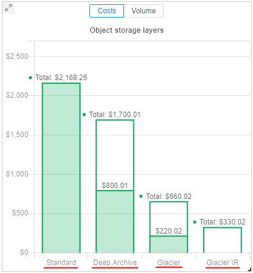

Object storage layers chart can show the information as storages usage costs - in `$` or as average storages volumes - in `Gb`:  
    

If data in the storage is storing in different tiers (archive types), this can be viewed in a tooltip of other object storages charts - there will be a division of spendings by the used tiers, e.g.:  
      
Breakdown by archive layers is shown in the CSV report export as well.

User can select one of the object storage layers - by click it on this new chart.  
In this case, all charts and tables will be updated - only storages, that contain files in the selected layer type, will be shown in forms.  
Also, shown spendings/data volume will be related only to files in the selected layer, not for the whole storage(s) or other layers.  
For example, `Glasier IR` was selected:  
    

### Displaying different user's attributes in the Billing reports

Previously, in all the **Billing reports**, info about users was displayed as user ID only. In some cases, it would be more convenient to display user names or emails - to take a more readable form.

In the current version, this ability is implemented.  
A new System Preference is introduced: **`billing.reports.user.name.attribute`**  
It defines which user's attribute shall be used to display the users in the **Billing reports**. If it is set, specified attribute will be used in all billing charts, tables, export reports.

Possible values for described preference: _`userName`_, _`FirstName`_, _`LastName`_, etc.

### Export reports in `CSV` from any Billing page

Previously, **Cloud Pipeline** allowed to export the **Billing reports** data into the `CSV` format via the "General" section only. But in separate sections - "Storages" and "Compute Instances" - the user could export data as `PNG` image format only.

Currently, `CSV` export has been added to all the reports sections ("Storages"/"Compute instances" and all sub-sections):

- reports display the same structure as in the GUI - the top 10 records of the corresponding entities (e.g. storages or instances)
- for the reports, which contain more than one table - all the tables are exported one after another
- export in `CSV` from the "General" page remains the same

Example of an export from the "CPU" page:

- 
- 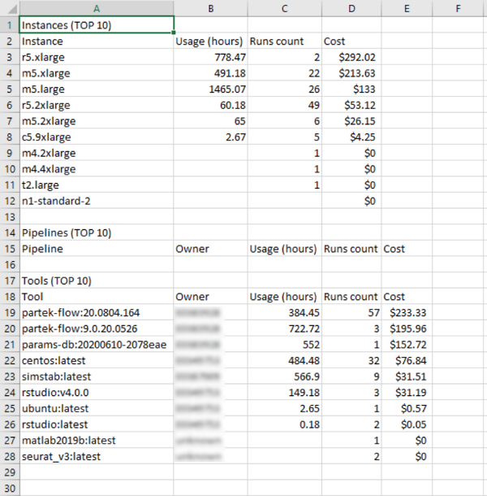

### Breakdown the billing reports by month

**Cloud Pipeline** allows exporting billing reports in the `CSV`. Previously, the values were shown as aggregates for the _whole_ selected period. In some cases, it is more convenient to change this view to a breakdown by month.

In the current version, this ability is implemented.  
Now, if any period - longer than a month is selected (including a `custom` period), the `CSV`-report contains an aggregate for each month of that period.  
The whole period summary is being included as well (as previously).

Example of the report for a custom period:  
    

### "Billing General" export broken by the user

Previously, **Cloud Pipeline** could export the "General" billing report split by the "Cost Center". For some use cases, needs to have this report broken by the user as well.

Now, this ability is implemented.  
User can specify which dimension to use for the export:

- by **Cost Center** - in this case, the "General" billing report will be split by the "Cost Center" (as it was previosly)
- by **User** - in this case, export will be in the same format as for the "Cost Center", but split the values by the user (using [`billing.reports.user.name.attribute`](#displaying-different-users-attributes-in-the-billing-reports) to display the username)

Format of the report is being selected before the export:  
    

Example of the report broken by the user:  
    

## System dictionaries

Often admins have to set attributes (metadata) for "general" users manually. In case, when such metadata keys aren't different for each user and has certain amount of values, it is convenient to select these values from the predefined values list, not to specify them manually each time.

In the current version, the ability to create **System Dictionaries** was implemented.
Each **dictionary** is the categorical attribute. I.e. it is attribute which values are predefined.  
Each **dictionary** has its name and values, e.g.:  
    

If the dictionary exists in the system, then admins can use it when specifying attributes for any Platform object (**`Pipeline`**, **`Folder`**, **`Storage`**, **`Project`**, **`Tool`**), and also for **`User`**, **`Group`** or **`Role`**. In this case, it is enough to specify only the dictionary name as the attribute key, the list of dictionary values will appear automatically in the value field:  
    

Also, the different dictionaries may be connected (linked). I.e. admins can create two dictionaries, which values are mapped `1-1` or `1-many`, e.g.:  
    

In the GUI, such connection is being handled in the following way:

1. Admin specifies the links between the dictionaries items (e.g. for the example above _`ProjectID`:`BRCA1`_ -> _`DataStorage`:`<path>`_).
2. Links have the "autofill" attribute. If the admin selects the source key (_`ProjectID`:`BRCA1`_) as attribute key for any object - the destination key will be specified automatically (_`DataStorage`_ will be added with the _`<path>`_ selection):  
      
    

For more details see [here](../../manual/12_Manage_Settings/12._Manage_Settings.md#system-dictionaries).

## Cloud Data application

Previously, there were several ways to manage data between local workstation and Cloud data storages, including CLI, GUI, mounting data storages as a network drives, and others.  

In the current version, a new Platform capability was implemented that provides a simple and convenient way to manage files, copy/move them between Cloud data storage and local workstation or even FTP-server.  
This introduces via the new separate application that can be downloaded from the Cloud Pipeline Platform and launched at the local machine - **Cloud Data** application.


Cloud Data application allows you manage files/folders as in a file commander.  
Main application form contains two panels (left and right).  
In each panel, one of the following sources can be opened: **local workstation** / **FTP server** / **Cloud data** (datastorages).

- the **_local_** content shows files and folders of the local workstation (by default, _home_ user's directory). Navigation between and inside folders is available:  
   
- the **_Cloud data_** content includes:
    - all FS mounts from the Cloud Pipeline environment - to which current user has permissions.  
      They are shown as simple folders
    - those object storages from the Cloud Pipeline environment - to which current user has permissions and "File system access" was requested.  
      They are shown with storage icon
    - Navigation between and inside folders/storages is available  
   
- the **_ftp_** content shows files and folders of the FTP/SFTP server. Navigation between and inside folders is available:  
    

The base scenario of the application usage:

1. User selects desired source and destination in panels, e.g. FTP server and object datastorage correspondingly:  
    
2. Users selects desired files/folders in the source and clicks the data management button in the source panel - according to the action user wants to perform, e.g. to copy a file:  
    
3. Action will be performed, content of the panels will be updated:  
    

For more details see [here](../../manual/08_Manage_Data_Storage/8.12._Cloud_Data_app.md).

## Sending of email notifications enhancements

Several additions and updates were implemented in the current version for the System Email notifications.  
You can view the general mechanism of the **Cloud PIpeline** email notifications sending described [here](../../manual/12_Manage_Settings/12.9._Change_email_notification.md#configure-automatic-email-notifications-on-users-runs).

### Additional options for `IDLE`/`HIGH-CONSUMED` runs notifications

Previously, to customize a platform behavior with respect to **_idle_** or **_high-consumed_** runs, admin had to set a number of settings in two different system forms - **Preferences** and **Email Notifications**. It was inconvenient and could confused users.  
It would be nice to duplicate input fields for some preferences into the **Email Notifications** section - for faster and more convenient input of their values, and to avoid possible confusion and mistakes.

In the current version, it was implemented. Now:

1. For **`HIGH_CONSUMED_RESOURCES`** notification type settings, the following input fields were added:
    - "_Threshold of disk consume (%)_" that duplicates **`system.disk.consume.threshold`** preference value
    - "_Threshold of memory consume (%)_" that duplicates **`system.memory.consume.threshold`** preference value  
      
    Saving of the listed values changes at the **Email Notifications** form will automatically change the corresponding values in the **Preferences**, and vice versa.
2. For **`IDLE_RUN`**, **`IDLE_RUN_PAUSED`**, **`IDLE_RUN_STOPPED`** notification types settings, the following input fields were added:
    - "_Max duration of idle (min)_" that duplicates **`system.max.idle.timeout.minutes`** preference value
    - "_Action delay (min)_" that duplicates **`system.idle.action.timeout.minutes`** preference value
    - "_CPU idle threshold (%)_" that duplicates **`system.idle.cpu.threshold`** preference value
    - "_Action_" that should duplicates **`system.idle.action`** preference value  
    These 4 fields are united into a single section for all **_idle_** notification types - you may configure these fields from any **_idle_** notification settings tab.  
      
    Saving of the listed values changes at the **Email Notifications** form will automatically change the corresponding values in the **Preferences**, and vice versa.

For all these fields, help tooltips were added to clarify their destination, e.g.:  
    

### Notifications for long paused runs

In **`v0.17`**, new email notification types were added:

1. **`LONG_PAUSED`** - the notification that is being sent when the run is in the **_PAUSED_** state for a long time.  
    This new notification type has the following additional configurable parameters:
    - _Threshold (sec)_ - it is a time interval of the run **_PAUSED_** state after which the notification will be sent
    - _Resend delay (sec)_ - it is a delay after which the notification will be sent again, if the run is still in the **_PAUSED_** state  
    
2. **`LONG_PAUSED_STOPPED`** - the notification that is being sent when the run that has been in the `PAUSED` state for a long time, has been stopped by the system.  
    This new notification type has the following additional configurable parameter:
    - _Threshold (sec)_ - it is a time interval of the run **_PAUSED_** state after which the notification will be sent and the run will be terminated  
    

There is a common setting for the both described notification types - _Action_. This setting could be only `NOTIFY` or `STOP`. It defines the system behavior with the long paused runs:

- if the _Action_ is `NOTIFY` - for the appropriate run, the notification **`LONG_PAUSED`** will being sent according to its settings
- if the _Action_ is `STOP` - for the appropriate run, the notification **`LONG_PAUSED_STOPPED`** will be sent once and the run will be terminated

Action type also can be configured via the Systemp preference **`system.long.paused.action`**. Saving of the _Action_ setting value changes at the **Email Notifications** form will automatically change the corresponding value in the **Preferences**, and vice versa.

### "Resend" setting for `IDLE` runs

Previously, **`IDLE_RUN`** notifications were sent only once and then configured action had being performed.  
In the current version, the ability to resend this notifications was implemented.  
It could be configured via the corresponding field at the **`IDLE_RUN`** notification type form:  
    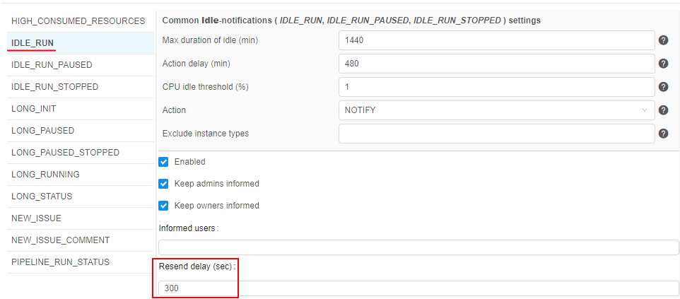  
If the _Resend delay_ is specified and the _Action_ for the **_idle_** runs is set as `NOTIFY`, then the **`IDLE_RUN`** notification will being resent every appropriate time interval.

### Allow to exclude certain node type from the specific notifications

For quite small/cheap nodes, the users may not want to receive the following email notifications for the run:

- **`IDLE_RUN`**
- **`LONG_PAUSED`**
- **`LONG_RUNNING`**

So, a new System preference **`system.notifications.exclude.instance.types`** was implemented to control that behavior.  
If the node type is specified in this preference, listed above notifications will not be submitted to the jobs, that use this node type.  
This preference allows a comma-separated list of the node types and wildcards, e.g.:  
    

### Push notifications

Previously, Cloud Pipeline platform sent notifications to users via email only. For many cases it would be useful to show such notifications in the GUI as well. In the current version, such ability was implemented.

Now, all email notifications, that are sending by the platform, are also duplicated as push notifications. This allows to view notifications right in the Cloud Pipeline GUI.  
Push notifications do not require additional configuring - they are fully the same as corresponding email notifications, i.e. have the same header, content, recepients list, frequency and trigger of sending, etc.

Once any system event is occurred and its trigger for sending email notification has fired, email will be sent to the configured recipients. Simultaneously, the push notification (with the same subject and body as in the email) will be "sent" to the same recipients, e.g.:  
    

Click it to view the whole notification - it will be opened in a pop-up:  
    

Additionally, a new section appeared in the main menu - **Notifications**.  
It allows to view all push notifications/emails sent to the current user, e.g.:  
    

User can switch notifications lists - to display only new "unread" notifications or only "read" ones.  
To view the notification full details, user can click it - notification will be opened in a pop-up:  
    

For more details see [here](../../manual/12_Manage_Settings/12.9._Change_email_notification.md#push-notifications).

## Allowed price types for a cluster master node

Previously, **Cloud Pipeline** allowed the user to choose whether the cluster master node be a `spot` or `on-demand` instance.  
While spots are acceptable for the worker nodes, as they can be recreated in failure cases - master node failure will terminate the whole cluster.  
To make things easy for the end-users, an optional restriction on the specific price types usage for the master nodes was implemented.

There is a new string system preference - **`cluster.allowed.price.types.master`** - that force the clusters' master node price type.

**Default value**: "spot,on_demand" - so, both types are accessible for the user when he/she wants to launch a cluster.

**Possible values**: "spot", "on_demand" or both together comma-separated.

Specified value for that preference defines which price type(s) will be shown in the drop-down, when the cluster run is being configured. For example:

- set in the Preferences:  
    
- once the user selects any _cluster_ configuration in the "Exec environment" section - available price types becomes equal to the set value:  
    

**_Note_**: **`cluster.allowed.price.types.master`** preference doesn't apply on the price types for single-node jobs

## "Max" data series at the "Resource Monitoring" dashboard

Previously, **Cloud Pipeline** displayed the resources utilization as an average value. This could hide some spikes (which resulted in job failure), when reviewing at a high zoom-level (e.g. several days).

In the current version, to the "CPU Usage" and the "Memory Usage" charts additional data-series ("lines") were added, which are calculated as a `max` function in each moment.  
Existing lines are kept as well, but were renamed to `average`.

For example:  
    

For more details see [here](../../manual/09_Manage_Cluster_nodes/9._Manage_Cluster_nodes.md).

## Export custom user's attributes

Previously, user's metadata attributes couldn't be exported in an automatic way.

In the current version, such feature is implemented.  
Now, before the users export, there is the ability to select which user's metadata attributes shall be exported. Previous export settings remain the same.

- Click the "**Export users**" button at the **USER MANAGEMENT** tab of the **System Settings**. Select the "Custom configuration":  
    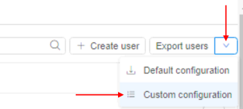
- In the export pop-up, select additional metadata keys you wish to export with general user's info:  
    
- Exported metadata will be included into the export file as separate columns, e.g. (part of the output):  
    

For more details about users export see [here](../../manual/12_Manage_Settings/12._Manage_Settings.md#export-users).

## User management and export in read-only mode

Previously, only admins had access to the users info/metadata.
In the current version, a new "built-in" role **_ROLE\_USER\_READER_** was added.  
This role allows:

- read-only access to the `API` endpoints, responsible for the users, groups, roles information
- in the `GUI`, users with this role can:
    - get "general" user/groups information in read-only mode - name/email/etc. - **without** users' metadata
    - get access to the user management tab in read-only mode - **without** users' metadata and launch options
    - export users list - **including** users' metadata

For more details about user roles see [here](../../manual/12_Manage_Settings/12._Manage_Settings.md#roles).

## "All pipelines" and "All storages" repositories

There are several ways for users to find the appropriate storage/pipeline object in the **Cloud Pipeline Platform** - manually via the **Library**, using the **Search** ability or via the corresponding panels of the main Dashboard.

It would be convenient to get all lists of the storages/pipelines accessible to the user in one place with short info about each object and easy access to it.  
In the current version, such ability was implemented:

- there are two new controls displaying at the **Library** page, above the library-tree - separate "repositories" for storages and pipelines:  
    
- each "repository" displays the full list of the corresponding objects accessible by the current user, e.g. for pipelines:  
    
- for each object in the "repository" are displayed:
    - object name
    - object description (if it is available)
    - `OWNER` user name
    - _additionally_ for pipelines, the **Run** button - if the pipeline is available for execute for the user
    - _additionally_ for storages, **Cloud Region**/**Provider** icons for multi-provider deployments
- if the user clicks any object in the list - its regular page is being opened
- for each "repository", there is a search field for the quick search over objects list

## Sensitive storages

Previously, Cloud Pipeline platform allows performing upload/download operations for any authorized data storage.  
But certain storages may contain sensitive data, which shall not be copied anywhere outside that storage.

For storing such data, special "sensitive" storages are implemented.  
Sensitive data from that storages can be used for calculations or different other jobs, but this data cannot be copy/download to another regular storage/local machine/via the Internet etc.  
Viewing of the sensitive data is also partially restricted.

Sensitive storage is being created similar to general object storage, user only should tick the corresponding checkbox:  
    

Via the GUI, the sensitive storage looks similar to the regular object storage, but there are some differences (even for admin/storage **_OWNER_**):  
    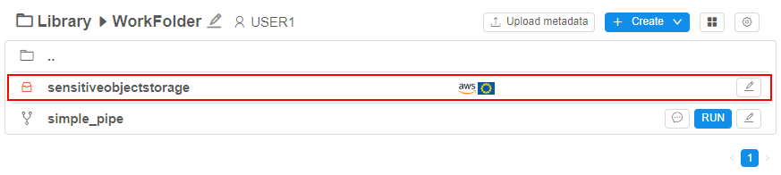  
      

I.e. files/folders in the sensitive storage can be created/renamed/removed but can't be downloaded/viewed or edited by any user.

Sensitive storages can be mounted to the run. In this case, the run will become _sensitive_ too.  
In sensitive runs, all storages selected for the mounting including sensitive are being mounted in **readonly** mode to exclude any copy/move operations between storages.

Files from the sensitive storages can be viewed **_inside_** the sensitive run and also copied into the inner instance disk, but not to any other storage:  
    

Files from the sensitive storages can't be viewed **_outside_** the sensitive run or copied/moved anywhere (for example, when using not the web-terminal version of `pipe` SSH):  
    

For more details and restrictions that are imposed by using of sensitive storages see [here](../../manual/08_Manage_Data_Storage/8.11._Sensitive_storages.md).

## Updates of "Limit mounts" for object storages

### Displaying of the `CP_CAP_LIMIT_MOUNTS` in a user-friendly manner

Previously, **Cloud Pipeline** displayed the run-enabled data storages (selected via ["Limit mounts"](../v.0.15/v.0.15_-_Release_notes.md#limit-mounted-storages) feature before the launch) as a list of IDs at the **Run logs** page (as the **`CP_CAP_LIMIT_MOUNTS`** parameter).  

In the current version, this viewing was changed to more "friendly" for users:

- The data storage names are being displayed instead of the IDs
- Showing names are hyperlinks, pointing to the data storage in the **Cloud Pipeline** GUI
- "Sensitive" storages are being highlighted appropriately


See details [here](../../manual/06_Manage_Pipeline/6.1._Create_and_configure_pipeline.md#example-limit-mounted-storages).

### Allow to create run without mounts

Previously, users could select all/several storages (from the available scope) to be mounted during the run.  
But in some cases, it might be needed to launch runs without mounts at all.  
In the current version, such ability was implemented.

For that, the separate checkbox was added to the "Limit mounts" settings section:  
    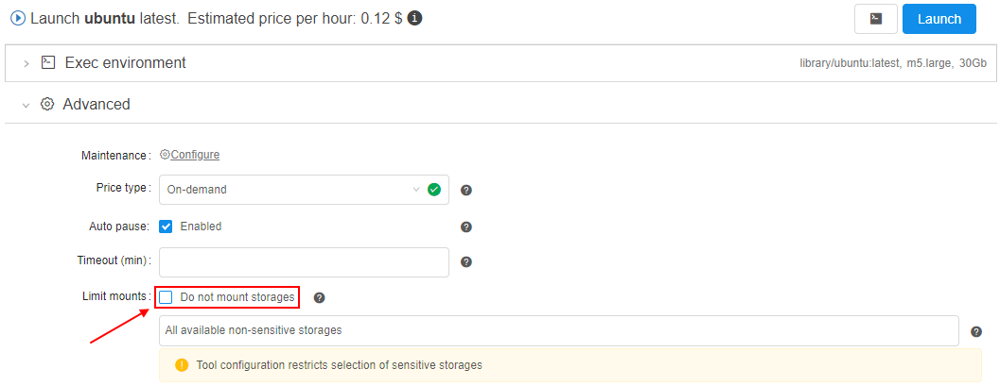

If this checkbox is set - there are **_no storages_** will be mounted during the run initialization:

- 
- 

The ability to set "Do not mount storages" is added to all forms where limit mounts can be configured.

### Warning in case of a risk of `OOM` due to the number of the object storage mounts

If the user has 100+ object storages available - they all are mounted to the jobs, by default. When using rather small nodes - this leads to the `OOM` errors, as the 100+ mount processes may oversubscribe the memory.  
Even if the memory consumption will be greatly optmized - the user may still face such issues, if the number of object storages grow.  
So in the current version, a sort of hard-limit was implemented to warn the user if there is risk of `OOM`.

A new **System preference** is introduced - **`storage.mounts.per.gb.ratio`** (_int_).  
This preference allows to specify the "safe" number of storages per Gb of `RAM` (by default, it is `5` - i.e. "5 storages per each Gb of `RAM`").

When launching a job - the user's available object storages count is being calculated and checked that this count does not exceed the selected instance type `RAM` multiplied by the **`storage.mounts.per.gb.ratio`**.  
If it's exceeded - the user is being warned with the following wording and asked to reduce a number of mounts via the **Limit mounts** feature, e.g.:  
    

**_Note_**:

- Warning does not prohibit the run launching, user can start it at his own discretion changing nothing.
- If the **`storage.mounts.per.gb.ratio`** is not set - no checks are being performed, no warning appears.
- Before the launch, only the _object storages_ count is being calculated, _file mounts_ do not introduce this limitation.

## Hot node pools

For some jobs, a waiting for a node launch can be too long. It is convenient to have some scope of the running nodes in the background that will be always or on schedule be available.

In the current version, the mechanism of "**Hot node pools**" was implemented. It allows controlling the number of persistent compute nodes (of the certain configuration) in the cluster during the certain schedule.  
This is useful to speed up the compute instances creation process (as the nodes are already up and running).  


Admins can create node pools:

- each pool contains _one or several identical nodes_ - admin specifies the node configuration (instance type, disk, **Cloud Region**, etc.) and a corresponding number of such nodes. This count can be fixed or flexible ("autoscaled")
- each pool has _the schedule of these nodes creation/termination_. E.g. the majority of the new compute jobs are started during the workday, so no need to keep these persistent instances over the weekends. For the pool, several schedules can be specified
- for each pool can be configured additional filters - to restrict its usage by the specific users/groups or for the specific pipelines/tools etc.

When the pool is created, corresponding nodes are being up (_according to pool's schedule(s)_) and waiting in the background:  
    

If the user starts a job in this time (_pool's schedule(s)_) and the instance requested for a job matches to the pool's node - such running node from the pool is automatically being assigned to the job, e.g.:  
    

**_Note_**: pools management is available only for admins. Usage of pool nodes is available for any user.

For more details and examples see [here](../../manual/09_Manage_Cluster_nodes/9.1._Hot_node_pools.md).

## Export cluster utilization in Excel format

Previously, users could export **Cluster Node Monitor** reports only in **`CSV`** format.

From now, the ability to export these reports in **`XLSX`** format is implemented.  
Users can choose the format of the report before the download:  
    

**Excel**-reports contain not only raw monitoring data but the graphical info (diagrams) too as users can see on the GUI.  
Example of the **Excel**-report sheets:  
      
    

For more details how to configure **Cluster Node Monitor** reports see [here](../../manual/09_Manage_Cluster_nodes/9._Manage_Cluster_nodes.md#export-utilization-data).

## Export cluster utilization via `pipe`

Also in the current version, the ability to export **Cluster Node Monitor** reports by `pipe` CLI is introduced.

The command to download the node usage metrics:

``` bash
pipe cluster monitor [OPTIONS]
```

The one of the below options should be specified:

- **`-i`** / **`--instance-id`** **{ID}** - allows to specify the cloud instance ID. This option cannot be used in conjunction with the **`--run-id`** option
- **`-r`** / **`--run-id`** **{RUN\_ID}** - allows to specify the pipeline run ID. This option cannot be used in conjunction with the **`--instance-id`** option

Using non-required options, user can specify desired format of the exported file, statistics intervals, report period, etc.

For details and examples see [here](../../manual/14_CLI/14.6._View_cluster_nodes_via_CLI.md#export-cluster-utilization).

## Pause/resume runs via `pipe`

Previously, users could automate the pause and resume operation for the pipeline execution only via the API calls.  
In the current version, `pipe pause` and `pipe resume` operations are exposed to the CLI.

The command to pause a specific running pipeline:

``` bash
pipe pause [OPTIONS] RUN_ID
```

Possible options:

- **`--check-size`** - to check firstly if free disk space is enough for the commit operation
- **`-s`** / **`--sync`** - to perform operation in a sync mode. This option blocks the terminal until the **_PAUSED_** status won't be returned for the pausing pipeline

The command to resume a specific paused pipeline:

``` bash
pipe resume [OPTIONS] RUN_ID
```

Possible option:

- **`-s`** / **`--sync`** - to perform operation in a sync mode. This option blocks the terminal until the **_RUNNING_** status won't be returned for the resuming pipeline

For details and examples see here - [pause command](../../manual/14_CLI/14.5._Manage_pipeline_executions_via_CLI.md#pause-a-pipeline-execution) and [resume command](../../manual/14_CLI/14.5._Manage_pipeline_executions_via_CLI.md#resume-paused-pipeline-execution).

## Home storage for each user

Typically each general user stores personal assets in the data storage, that is created for him/her by the Administrator.  
This is treated as a "home" storage and is used a lot. But the creation of multiple users becomes a tedious task (create the user/create storage/grant permissions for the user).
To facilitate this task, in the current version the ability (optionally) to create home storages for the newly created users in automatic mode was implemented.

This behavior is controlled by the system preference **`storage.user.home.auto`** (_Boolean_, default value is `false`).  
It controls whether the home storages shall be created automatically.  
If it is set to `true` - new storage will be created for the user automatically simultaneously with the user creation. Also the just-created user is being granted **_OWNER_** permissions for the new storage.

The "home" storage automatic creation is being driven by a template. The template is being described as `JSON` element in the other new system preference - **`storage.user.home.template`**.  
In this preference for the template, being described:

- settings for the storage
- permissions on the storage

Example of the configured preferences:  
    

So, after the user creation, the new storage according to the settings in template is being created:  
    

The newly created storage is being set as a "default" storage in the user's profile:  
    

For more details and examples see [here](../../manual/12_Manage_Settings/12.11._Advanced_features.md#home-storage-for-each-user).

## Batch users import

Previously, **Cloud Pipeline** allowed creating users only one-by-one via the GUI. If a number of users shall be created - it could be quite complicated to perform those operation multiple times.

To address this, a new feature was implemented in the current version - now, admins can import users from a `CSV` file using GUI and CLI.

`CSV` format of the file for the batch import:

``` csv
UserName,Groups,<AttributeItem1>,<AttributeItem2>,<AttributeItemN>
<user1>,<group1>,<Value1>,<Value2>,<ValueN>
<user2>,<group2>|<group3>,<Value3>,<Value4>,<ValueN>
<user3>,,<Value3>,<Value4>,<ValueN>
<user4>,<group4>,,,
```

Where:

- **UserName** - contains the user name
- **Groups** - contains the "permission" groups, which shall be assigned to the user
- **`<AttributeItem1>`**, **`<AttributeItem2>`** ... **`<AttributeItemN>`** - set of optional columns, which correspond to the user attributes (they could be existing or new)

The import process takes a number of inputs:

- `CSV` file
- _Users/Groups/Attributes creation options_, which control if a corresponding object shall be created if not found in the database. If a creation option is not specified - the object creation won't happen:
    - "`create-user`"
    - "`create-group`"
    - "`create-<ATTRIBUTE_ITEM_NAME>`"

### Import users via GUI

Import users from a `CSV` file via GUI can be performed at the **USER MANAGEMENT** section of the **System Settings**.

1. Click the "**Import users**" button:  
    
2. Select a `CSV` file for the import. The GUI will show the creation options selection, e.g.:  
    
3. After the options are selected, click the **IMPORT** button, e.g.:  
    
4. Once the import is done - you can review the import results:  
    - Users and groups have been created
    - Users were assigned to the specified groups
    - Attributes were assigned to the users as well

For more details and examples see [here](../../manual/12_Manage_Settings/12.3._Create_a_new_user.md#users-batch-import).

### Import users via CLI

Also in the current version, a new `pipe` command was implemented to import users from a `CSV` file via CLI:

``` bash
pipe users import [OPTIONS] FILE_PATH
```

Where **FILE_PATH** - defines a path to the `CSV` file with users list

Possible options:

- **`-cu`** / **`--create-user`** - allows the creation of new users
- **`-cg`** / **`--create-group`** - allows the creation of new groups
- **`-cm`** / **`--create-metadata` `<KEY>`** - allows the creation of a new metadata with specified key

Results of the command execution are similar to the users import operation via GUI.

For more details and examples see [here](../../manual/14_CLI/14.9._User_management_via_CLI.md#batch-import).

## SSH tunnel to the running compute instance

In the current version, a new ability to access **Cloud Pipeline** run instances from local workstations is implemented.  
Now, **Cloud Pipeline** run instance can be accessed via SSH directly using special **network tunnels**. Such tunnels can be established between a local **Windows** or **Linux** workstation and a **Cloud Pipeline** run.

`pipe` CLI provides a set of command to manage such network tunnels. `pipe` CLI automatically manages SSH keys and configures **passwordless SSH access**. As a result no manual SSH keys management is required to access **Cloud Pipeline** run from the local workstation.

SSH tunnels to **Cloud Pipeline** runs can be used for interactive SSH sessions, files transferring and third-party applications which depends on SSH protocol.

The command that runs ports tunnelling operations:

``` bash
pipe tunnel COMMAND [ARGS]
```

Where **COMMAND** - one of the following commands:

- **`start <RUN_ID>`** - establishes tunnel connection to specified run instance port and serves it as a local port
- **`stop <RUN_ID`** - stops background tunnel processes with specified run

For the `start` command there are two _mandatory_ options:

- **`-lp`** / **`--local-port`** - specifies local port to establish connection from
- **`-rp`** / **`--remote-port`** - specifies remote port to establish connection to

Example of the command that establishes tunnel connection to the run:

``` bash
pipe tunnel start 12345 -lp 4567 -rp 22 --ssh
```

Here: `12345` is the _Run ID_, `4567` is just a random free _local port_ and `22` is the **Cloud Pipeline** run _SSH port_. Additional `--ssh` flag enables passwordless SSH access.

For more details and examples see [here](../../manual/14_CLI/14.10._SSH_tunnel.md).

## Updates of Metadata object

In the current version, several enhancements were implemented for the Metadata objects displaying and working with:

### Controls placement reorganization

- Several controls (for adding a new instance, upload and delete metadata, transfer to the cloud and showing attributes) were moved to **Additional parameters** control (gear icon):  
      
    See details [here](../../manual/05_Manage_Metadata/5._Manage_Metadata.md#additional-options).
- **Bulk operation panel** is hidden/disabled until at least one instance is selected in a table, e.g.:  
      
    To manage selected items, click the **V** button next to the "**Show only selected items**" control to open the corresponding menu:  
      
    See details [here](../../manual/05_Manage_Metadata/5._Manage_Metadata.md#bulk-operation-panel).

### Ability to show only selected instances

The ability is implemented to show separately only selected metadata instances. All unselected items will be hidden. For that: select items of interest (they can be at different pages too) and click the "**Show only selected items**" button at the **Bulk operation** panel, e.g.:  
      
    For shown selected items, all functionality as for the general table is available except filtering.

### Improvements in the search over the metadata

- users can search over any attribute values (not only over `ID` as previously)
- the metadata search field supports multiple terms search - in this case, multiple terms for the search should be specified space separated, e.g. `sample1 sample2`
- the metadata search field supports a `key:value` search, where `key` is an attribute name (column header) and `value` is a term that shall be searched in that attribute values, e.g. `ID:D703`  
    See details [here](../../manual/05_Manage_Metadata/5._Manage_Metadata.md#search-field).

### Ability to filter instances

The ability is implemented to filter instances of an entity in a table. Now,user can click aspecial control in a header of thedesiredcolumn and set one or several filters for the column values - to restrict the output table, e.g.:  
      
    See details [here](../../manual/05_Manage_Metadata/5.3._Customize_view_of_the_entity_instance_table.md#filter-instances).

### Displaying of the creation date info

For all Metadata entities the "**Created date**" fields are displayed. This column appears and filled in automatically when the Metadata is uploaded or created manually, e.g.:  
    

### Sorting by several columns

Ability to sort a list of entities by several columns is implemented. For that, a list is being sorted by one column, then user should click the second column he(she) wants to sort by, then the third, etc.:  
      
    See details [here](../../manual/05_Manage_Metadata/5.3._Customize_view_of_the_entity_instance_table.md#metadata-table-sorting).

### Autofill

An autofill feature for metadata cells was implemented. It allows to fill metadata instances with data that are based on data in other instances in the same column/row, e.g.:

- click the right-bottom corner of the cell you wish to copy and move the mouse holding the left button - vertically or horizontally, e.g.:  
    
- once you will release the mouse button - selected cells will be autofilled by the value of the cell that you've dragged:  
      
    See details [here](../../manual/05_Manage_Metadata/5.1._Add_Delete_metadata_items.md#field-values-autofill).

### Entity ID autogeneration

In some cases, it could be convenient not to specify entity ID during import. Therefore Metadata entities support IDs autogeneration (in the [`UUID4`](https://en.wikipedia.org/wiki/Universally_unique_identifier) format). This works and for the import Metadata operation (for empty ID fields), and for the manual instance creation, e.g.:  
      
    See after the creation:  
    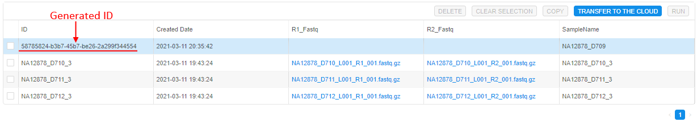

> **_Note_**: IDs still should be unique

### Ability to add SampleSet item via GUI

Now, users may create SampleSets or other "Container-like" entities from the GUI (previously it was possible via the `CSV` import only).  
This feature could be useful, if the Samples were imported using the IDs autogeneration, as it could be complicated to grab those IDs and copy to the `CSV`.

To create a new SampleSet:

- Click the **+ Add instance** button in the Metadata section and choose the _SampleSet_ instance type:  
    
- Provide the information for the new SampleSet and click the **Browse** button to select a list of Samples, which will be associated with the creating SampleSet:  
      
    
- After creation, the new SampleSet will appear in the corresponding metadata class:  
    

See details [here](../../manual/05_Manage_Metadata/5.1._Add_Delete_metadata_items.md#add-sampleset-item).

### Preselect instances for a rerun

Additionally, if metadata instances were used for the run via the expansion expressions in the parameters - then for the rerun of such run, the ability to choose was implemented - to use the same resolved expressions values from the initial run or preselect another metadata instance(s) for a coming rerun, e.g.:  

- imagine, that some run was launched from the detached configuration. Moreover, one configuration parameter uses the expansion expression:  
    
- for the run, some instance was selected
- after the run is completed, user tries to rerun this run. The **Launch** form will appear. By default, parameters are substituted fully the same as they were in the initial run:  
      
    If click the **Launch** button in this case - during the rerun, all parameter(s) will use their resolved values from the initial run (previous behavior).
- but now, the ability to preselect another metadata instance for the re-launch is implemented. For that, user can click "**v**" button near the launch button and in the appeared list click "**Select metadata entries and launch**" item:  
      
    In this case, the pop-up will appear to select a metadata instance for which the rerun will be launched. And during the rerun, all parameter(s) that use expansion expression(s) will be resolved according to a new selected metadata instance(s):  
    

See example [here](../../manual/11_Manage_Runs/11.1._Manage_runs_lifecycles.md#preselect-metadata-instances-for-a-rerun).

## Custom node images

Previously, Cloud Pipeline allowed to run instances only using some default predefined node images.  
For example, some node image was used for all CPU instance types, another - for GPU ones.  
Nevertheless there are cases than some of the tools or pipelines require special node images. For example, some tool may require specific `nvidia` driver version which default GPU node image doesn't have.

In the current version, the ability to use a custom node image was implemented.  
If a custom node image is specified for a pipeline, tool or just a single launch then cloud instance with the required node image will be used for their runs.

In a pipeline config, a custom node is specified in format: `"instance_image": "<custom_node_image>"`.  
For runs launched via `API`, a custom node is specified in format: `"instanceImage": "<custom_node_image>"`.  
In both cases, `<custom_node_image>` is the name of the custom image.

For example, to use a custom node for a pipeline:

- open pipeline's **CODE** tab
- open `config.json` file
- in the configuration, specify a custom node image:  
    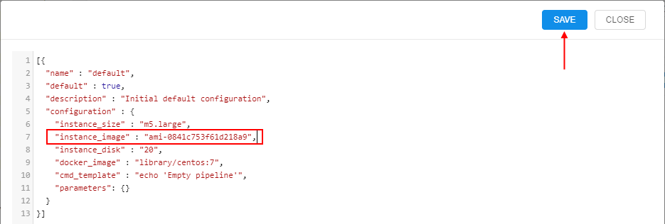
- save changes
- when launching such pipeline, you can observe that specified image is used for a node:  
    

See an example for a pipeline in details [here](../../manual/06_Manage_Pipeline/6.1._Create_and_configure_pipeline.md#example-configure-a-custom-node-image).

## Launch a tool with "hosted" applications

"Long-running" Cloud Pipeline applications may occasionally failed.  
And one of the main task caused this situation - saving the internal access to the services (e.g. if a database was hosted) as the IP and name (which match the pod) are being changed during the default run restarts.

To resolve that, a special option to assign an internal DNS name to the run was implemented.

Name of the service and a list of ports can be supplied by the user in the GUI, at the **Launch** form before the run:  
      
      
    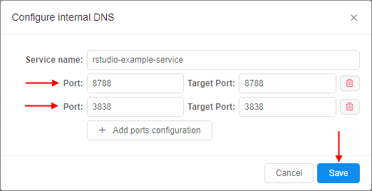

Configured DNS service is shown at the **Launch** form:  
    

And [**FQDN**](https://en.wikipedia.org/wiki/Fully_qualified_domain_name) of all configured services are shown during the run - at the **Run logs** page:  
    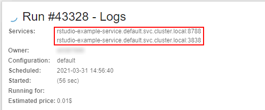

Checking that the run is launched with a "hosted" application:  
    

For more details see [here](../../manual/10_Manage_Tools/10.5._Launch_a_Tool.md#launch-a-tool-with-hosted-applications).

## Advanced global search with faceted filters

In **`v0.14`**, the **Global search** over the platform was [introduced](../v.0.14/v.0.14_-_Release_notes.md#global-search).  
Now, in **`v0.17`**, the new version of the search was implemented - **Advanced search**.  
**Advanced search** repeats the functionality of the **Simple search** but has some advanced capabilities.

To open the **Advanced search** click the **Search** icon in the main menu:  
    

> Please note, the previous form of the global search is still available - by pressing "Ctrl+F". Currently, **Advanced search** is available for admins only

To start searching, a query string shall be entered (search can be triggered by pressing the "Enter" button or by the correspoding **Search** button near the search bar), e.g.:  
    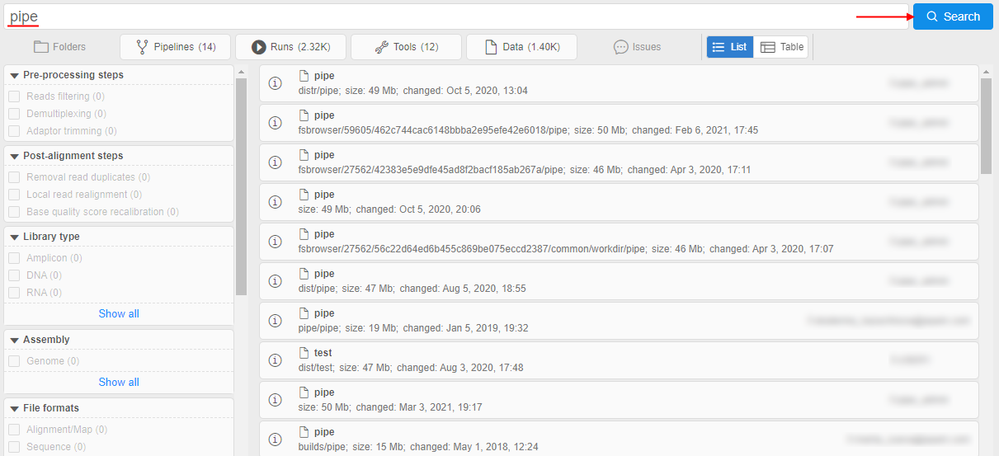

As in the previous form, you can:

- restrict search results selecting desired object types from all results scope (the corresponding panel with the object types selector is placed under the search bar):  
    
- open the "Preview" pane for the certain result hovering mouse point over it and click the **Info** icon:  
      
    
- scroll search results to view more or use the paging control

New features:

- "**Faceted filters**" panel at the left side of the search form.  
    It allows to search objects by their attributes (tags). Operating principle is similar to the E-Commerce sites.  
    Tags' keys and values displayed in this panel are loaded from separate **System Dictionaries** marked as filter sources.  
    User can restrict (filter) search results - by checking/unchecking desired filters.  
    In the search results, only objects were associated with the checked filter value (dictionary entry) will remain, e.g.:  
    
    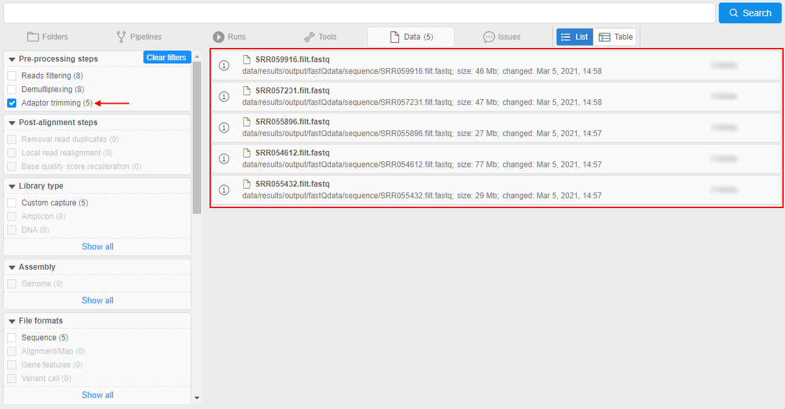  
    I.e. only objects **tagged** by this dictionary entry remained in the search results.  
    You can select several filters values from different facets. Each time, other filters will be updated, and also displayed search results will be changed according to the selected filters.  
    You can hover over any displayed search result and click the **Info** icon to check that the object is really tagged by selected filters (attributes), e.g.:  
      
      
    More details - how to add dictionaries to the "Faceted filters" panel, how to configure filters and use them for the search - see [here](../../manual/17_Tagging_by_attributes/17.1._Faceted_filters_search_by_tags.md).
- Changeable view of the search results output:  
    Results output in the **Simple search** has the view as simple list of the object names only.  
    In the **Advanced search**, that output contains the additional info - according to the entity type of the certain result - it can be `OWNER`, `DESCRIPTION`, `DATE_CHANGED`, `PATH`, etc.  
    Also user can switch between output view formats - `list` and `table` - by special control :  
    - `list` view (_default_) - each result is presented by the "row" in the list, _additional_ info is placed in line, e.g.:  
    
    - `table` view - all results are presented by the single table, _additional_ info is placed in columns, e.g.:  
    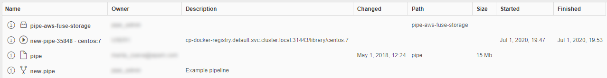  
    Also the `table` view can be customized by the admin user.  
    To the existing columns, user can add ones for the object attributes (tags) values, where the attribute `key` becomes the column header. If the object in results has the `value` for that attribute - it will be displayed in the corresponding column.  
    Customizing of additional attribute columns is being performed by the new system preference - **`search.elastic.index.metadata.fields`**:  
      
      
    For more details about the view of the results output see [here](../../manual/19_Search/19._Global_search.md#results-output-view).

For more details about **Advanced search** see [here](../../manual/19_Search/19._Global_search.md).

## Explicitly "immutable" pipeline parameters

Previously, if the pipeline parameter had a default value - it could not be changed in the detached configuration that used this pipeline.  
In different cases, it might be convenient to provide the ability to specify the own parameter value before the configuration launch or vice versa - the ability to launch the configuration with only defaults parameter values.  

In the current version, the special option was implemented that allows/denies the parameter value overriding for described cases - `no_override` (_boolean_). This option can be specified for the pipeline parameter via `config.json` file:

- if a pipeline parameter has a default value and `no_override` is `true` - the parameter field will be read-only in the detached configuration that uses this pipeline:  
    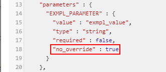  
    
- if a pipeline parameter has a default value and `no_override` is `false` or not set - the parameter field will be writable in the detached configuration that uses this pipeline:  
      
    
- if a pipeline parameter has no default value - `no_override` is ignored and the parameter field will be writable in the detached configuration that uses this pipeline

## Disable Hyper-Threading

**Hyper-Threading technology** makes a single physical processor appear as multiple logical processors. To do this, there is one copy of the architecture state for each logical processor, and the logical processors share a single set of physical execution resources.

Hyper-Threading technology is enabled by default for all nodes in **Cloud Pipeline**.

But not in all cases this technology is useful. In cases when threads are operating primarily on very close or relatively close instructions or data, the overall throughput occasionally decreases compared to non-interleaved, serial execution of the lines.  
For example, at a high performance computing that relies heavily on floating point calculations, the two threads in each core share a single floating point unit (FPU) and are often blocked by one another. In such case Hyper-Threading technology only slows computations.

In the current version, the ability to disable Hyper-Threading for a specific job was implemented.  
So, this technology can be turned on or off, as is best for a particular application at the user's discretion.

In Cloud Provider environment, each vCPU is a thread of a physical processor core. All cores of the instance has two threads. Disabling of Hyper-Threading disables the set of vCPUs that are relied to the second thread, set of first thread vCPUs stays enabled (see details for `AWS` [here](https://aws.amazon.com/blogs/compute/disabling-intel-hyper-threading-technology-on-amazon-linux/)).

To disable Hyper-Threading technology for a job:

- set the corresponding option in "**Run capabilities**" before the run:  
    
- check that Hyper-Threading was disabled via the following command after the run is launched:  
      
    Here you can check that only 1 thread per core is set, virtual CPUs 4-7 are offline. Only one thread is enabled (set of CPUs 0-3).

For more details see [here](../../manual/10_Manage_Tools/10.9._Run_capabilities.md#disable-hyper-threading).

## Saving of interim data for jobs stopped by a timeout

Previously, if for a job a timeout was set and it has elapsed - the job was stopped and all the data was erased.  
In the current version, the solution to extract the current data from the timed-out jobs was implemented.

Now, if a job has timed out - it will not be stopped immediately.  
Instead, the new `OutputData` task will be triggered.  
During this task performing, all the contents of the `$ANALYSIS_DIR` directory will be copied to all `output` storages - in the same manner, as if the job has succeeded.

This feature doesn't require additional actions from the user side. Only `$ANALYSIS_DIR` and `output` paths should be defined.

Additionally, a new system parameter was added - **`CP_EXEC_TIMEOUT`**. This parameter allows to define a timeout period after which the job shall be stopped. The essence of the parameter is the same as the configured value in the "**Timeout**" field. If both values are specified - for a job, `CP_EXEC_TIMEOUT` value will be used:  
    

## Resolve variables for a rerun

Previously, if the user launched some job containing environment variables in its parameters and then, after the job was completed, user tried to rerun that job - all environment variables from the job parameters had been resolving again during the new run.  
But for some cases, it might be needed to use in the rerun all the same values of environment variables that were in the initial run.  
In the current version, the ability to choose was implemented - for the rerun, to resolve such variables in a new run or use their initial values.

For that, when user tries to rerun some completed run that used environment variables in its parameters - at the **Launch** form, the checkbox "**Use resolved values**" appears in the **_Parameters_** section, e.g.:  
      
    By default, this checkbox is disabled. In this case, all environment variables are shown as is and will be resolved only during the new (re-launched) run - with the values corresponding to this new run.

If this checkbox is ticked, all environment variables will be resolved with the values of the initial run. Correspondingly, parameters that use environment variables will not be changed during the new launch, e.g.:  
    

See example [here](../../manual/11_Manage_Runs/11.1._Manage_runs_lifecycles.md#resolve-variables-for-a-rerun).

## NAT gateway

Previously, if the **Cloud Pipeline** Platform was being deployed in some private subnet, it could be quite difficult for the admin to expose a network endpoint for some service to use in a Platform. This required manual execution of a number of tasks on the Platform Core instance and, accordingly, might lead to errors.  
To resolve this, in the current version, the convenient way to manage network routes (creating/removing) from the GUI was implemented.

For that, a new **NAT gateway** subtab was added to the [**System Management**](../../manual/12_Manage_Settings/12._Manage_Settings.md#system-management) section of the System settings.  
The **NAT gateway** subtab allows to configure network routes:  
    

To add a route, admin shall:

- click the **ADD ROUTE** button:  
    
- in the appeared pop-up, specify details of an _external_ resource: server name, IP (_if needs_), port(s) and comment to route (_optionally_), e.g.:  
    
- just-added external server will appear in the list. Admin should click the **SAVE** button to confirm made changes:  
    
- once the route creation will be done, the route details will appear in the **_INTERNAL CONFIG_** fields and near the route, the status will be shown as _ACTIVE_:  
    

For more details see [here](../../manual/12_Manage_Settings/12.14._NAT_gateway.md).

## Custom Run capabilities

Previously, users might select only predefined "system" **Run capabilities** for a job.  
In some cases or deployments, these capabilities may not be enough.  
In the current version, the ability for admins to add custom **Run capabilities** was implemented. Use them for a job/tool run all users can.

Managing of the custom capabilities is being performed via the new system preference **`launch.capabilities`**.  
This preference contains an array of capability descriptions in `JSON`-format and has the following structure:

``` json
{
  "<capability_name_1>": {
    "description": "<Description of the capability>",
    "commands": [
        "<command_1>",
        "<command_2>",
        ...
    ],
    "params": {
        "<parameter_1>": "<value_1>",
        "<parameter_2>": "<value_2>",
        ...
    }
  },
  "<capability_name_2": {
      ...
  },
  ...
}
```

For example:  
    

Saved capability then can be used for a job/tool:  
      
    

For more details see [here](../../manual/10_Manage_Tools/10.9._Run_capabilities.md#custom-capabilities).

## Storage lifecycle management

Previously, users had the simplified opportunity to configure the lifecycle of data in storages - via specifying STS/LTS durations in the storage settings.  
This way is rather primitive and does not allow to fine-tune data archiving/restoring.

In the current version, the ability to configure datastorage lifecycle in details was implemented.  
This new option allows to perform the automatical data transition from standard storage to different types of archival storages by occurance of a certain event and restore that data back as well if needed.  
Previous functionality (STS/LTS durations) was excluded.  
For the new one, an additional tab was included to the storage settings - **Transition rules**:  
      
    

New implemented functionality includes abilities:

- automatic data archiving/removing according to specified transition rule(s)
- restoring of previously archived data for the specified period

_Data archiving_ is provided by configurable set of transition rules for each separate storage. Each rule defines which files, when (specific date or by the event) and where (different types of archive) shall be automatically transferred:

- firstly, user creates a rule for a storage - specifying the path and glob pattern for a file(s) name(s) which shall be transferred, e.g.:  
    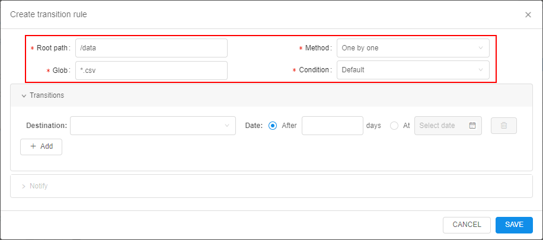  
    User can select to transfer files one-by-one or in bulk-mode by the first/last appeared file in a group.  
    Also, an additional condition for the files transition can be configured.
- then user selects an archive class as the data destination. Here, several destinations can be added (for different dates), e.g.:  
      
    **_Note_**: archive classes depend on the Cloud Provider
- then user defines the event by which the data shall be transferred - after certain period after the file(s) creation or at the specific date:  
      
    
- also, notifications can be configured for the rule events (optionally):  
    - recipients list
    - notification title and text
    - ability to specify a delay for data transition - user that receive such notification will have the ability to prolong (delay) transition for some period  
    
- created rule can be found in the **Transition rules** tab of the storage settings:  
    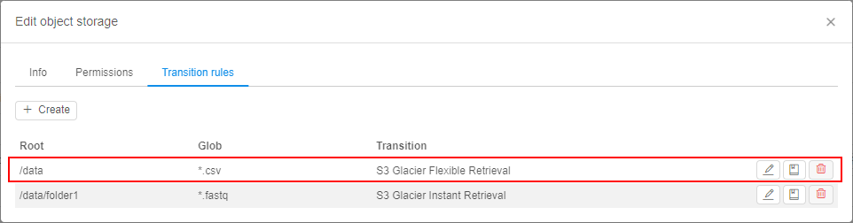
- after the rule is created, it starts to work. If file matches the condition of any storage rule - it will be transferred to some archive or removed (if `Deletion` is set as data destination). Transferred file becomes disabled for changing/renaming from the GUI/CLI. At the GUI, near such file a label appears that corresponds to the transition destination, e.g.:  
    

For more details see [here](../../manual/08_Manage_Data_Storage/8.10._Storage_lifecycle.md#archiving).

_Data restoring_ can be applied to previously archived files. Separate files or whole folders (with sub-folders) can be restored:

- user selects which files/folders shall be restored, e.g.:  
    
- user defines the period for which files shall be restored and notification recipients list:  
    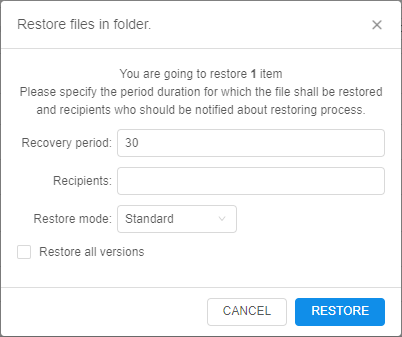
- after the confirmation, the restore process begins - it is shown by the special status icon:  
    
- when file is restored - it is shown by the special status icon as well:  
    
- once the restore period is over, files will be automatically transferred to the archive where they were before

For more details see [here](../../manual/08_Manage_Data_Storage/8.10._Storage_lifecycle.md#restoring).

## Image history

**Cloud Pipeline** performs scanning of the Docker images on a regular basis. This is used to grab the information on:

- Available software packages
- Possible vulnerabilities of those packages

The users may leverage this feature to choose which docker image to use, depending on the needs for a specific application.  
But this list of the software packages may not show the full list of the applications as the scanning mechanism uses only the "well-known" filesystem locations to collect the applications/versions informations. Some of the apps, might be installed into any custom location and the scanner won't be able to find it.

To fulfill this gap and to address some advanced cases, in the current version, a new feature was introduced: now it's possible to view the list of the "Docker layers" and corresponding commands, which were used to generate those layers.  
It can be viewed via the specific tab in the tool version menu - **Image history**:  
    

This allows to get information on the exact commands and settings, which were used to create an image and even reproduce it from scratch.

For more details see [here](../../manual/10_Manage_Tools/10.7._Tool_version_menu.md#image-history).

## Environments synchronization via `pipectl`

In some cases, admins need to synchronize two different environments of the Cloud Pipeline.  
New special routine in the [`pipectl`](https://github.com/epam/cloud-pipeline/tree/develop/deploy/README.md) utility is implemented for that - `pipectl sync`.

It allows to synchronize from the source environment to the destination one the following objects:

- users / user groups / user roles
- docker registry / tool groups / tools

Synchronization can be performed with or without synchronization of attributes (metadata) for the specified Platform objects.

During the synchronization, changes are being performed only in the **_destination_** environment, the **_source_** environment remains the same.

For details and examples see [here](../../installation/management/environments_sync.md).

## AWS: seamless authentication

In some cases, users are faced with the following scenarios:

1. Some jobs are running in the **Cloud Pipeline** and accessing data/services located in the external accounts (e.g. `Amazon S3`, `Amazon DynamoDB`). This requires the user to specify the authentication keys explicitly (either in the shell session or in the `R`/`Python` scripts). This is not user-friendly and not secure, if the users include the credentials into the scripts.
2. There are also users who would like to leverage `R`/`Python` libraries, that have embedded `Amazon S3` support. Users have to download data locally first (via `pipe`) and then perform the processing.

In the current version, a new mechanism of the seamless `AWS` authentication was implemented.  
It allows users to execute any request to the `AWS` API, from inside the **Cloud Pipeline** environment, without an authentication request.  

The following mechanism automates the _Cloud Provider_ authentication for the users scripts:

- Administrator is able to configure the users access permissions in the **Cloud Pipeline** account of the _Cloud Provider_ or provide credentials for the external _Cloud Provider_ account
- All the requests to the _Cloud Provider_ authentication are handled by the certain **Cloud Pipeline** service, which authenticates the user with the configured credentials
- Users are able to use the _Cloud Provider_ API without the authentication request

Administrator can create specific interfaces - _Cloud Credentials Profiles_, that contain the following fields:

- **Provider** - to specify the _Cloud Provider_
- **Name** - to specify the profile name
- **Assumed Role** - to specify the role received from the _Cloud Provider_ that will be used for the authentication to the _Cloud Provider_ API
- **Policy** - to specify the _Cloud Provider_ policy of the objects access

It could be configured in _Cloud Provider_ settings, e.g.:  
      
    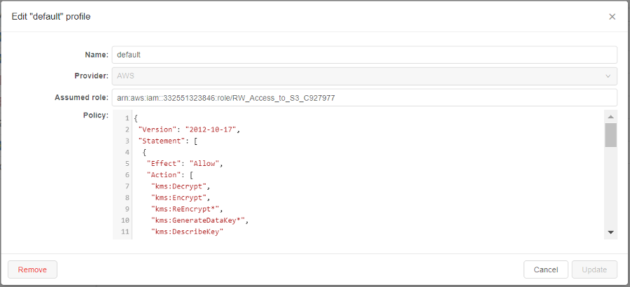  

Administrator can assign profiles to User/Role/Group entity.  
For each entity many profiles can be assigned.  
Also, from the profiles assigned to the certain User/Role/Group the one can be selected as _default_. If the _default_ profile isn't selected - during the authentication operation there shall be selected the profile to use.

It could be configured via the _User management_ panel, e.g.:  
    

Usage of the assigned profiles is being configured via the new Cloud Region option - "**Mount Credentials Rule**" with the following allowed values:

- **NONE** - for runs in this region, credentials will not be configured
- **SAME CLOUD** - for runs in this region, the set user credentials will be configured only allowed for the same _Cloud Provider_
- **ALL** - for runs in this region, the all user credentials will be configured


As example, if for the user such `AWS` credential profile is assigned and the mount rule is allowed - he/she can use `AWS` CLI directly to the bucket (defined and allowed by profile policy) without extra-authentication:  
    

For details and example see [here](../../manual/12_Manage_Settings/12.11._Advanced_features.md#seamless-authentication-in-cloud-provider).

## AWS: transfer objects between AWS regions using `pipe storage cp`/`mv` commands

Previously, `pipe storage cp`/`pipe storage mv` commands allowed to transfer objects only within one `AWS` region.  
In the current version, the ability to transfer objects between storages from different `AWS` regions is implemented.  
The commands themselves remain the same.

Example:

- 
- 

***

## Notable Bug fixes

### Unable to view pipeline sources for previous draft versions

[#1353](https://github.com/epam/cloud-pipeline/issues/1353)

Previously, Pipeline's "**Documents**" and "**Code**" tabs always showed content of the last "_draft_" version of pipeline, even if one of the previous versions was forcibly specified in the url.

### `pipe storage ls` works incorrectly with the option `--page`

[#1339](https://github.com/epam/cloud-pipeline/issues/1339)

Previously, the `pipe` CLI storage listing worked incorrectly with `--page` (`-p`) option with S3 provider. All items were displayed without pagination.

### AWS deployment: unable to list more than 1000 files in the S3 bucket

[#1312](https://github.com/epam/cloud-pipeline/issues/1312)

Previously, when `s3` bucket contained more than 1000 files - user could list all the files in the bucket via the GUI, but only first 1000 files via any `pipe` CLI capabilities (`pipe storage ls`, `pipe storage mount`, etc.).

### Size of tool version created from original tool without any changes is a lot larger than original one

[#1270](https://github.com/epam/cloud-pipeline/issues/1270)

Previously, the size of the tool version that had created from the original tool without any changes or after resume operation for paused run - by `COMMIT` operation - was a lot larger than original version.

### `pipe storage cp` fails in Windows for the GCS with `sslv3` error

[#1268](https://github.com/epam/cloud-pipeline/issues/1268)

Previously, the `sslv3` issue happened when data to/from the GCS was copying using the Windows workstation.

### Shared endpoint for `anonymous` users is being opened from the second time

[#1265](https://github.com/epam/cloud-pipeline/issues/1265)

Previously, when `anonymous` user tried to open a hyperlink with the shared endpoint - he/she got the Platform's "Access denied" page.
But if user tried to open the page in the second time - it was being opened correctly.

### Attempt to view permissions on a pipeline via the `pipe view-pipes` throws an error

[#1216](https://github.com/epam/cloud-pipeline/issues/1216)

Previously, when trying to view permissions of a pipeline via the `pipe view-pipes -r` command - the command execution failed.

### Scale down "cold" SGE autoscaling cluster

[#1123](https://github.com/epam/cloud-pipeline/issues/1123)

Previously, `SGE` autoscaling cluster didn't scale down until at least one running job appears in queue. Currently, `SGE` autoscaling cluster is being scaled down even if there weren't any running jobs yet.

### "Launch Command" functionality issues

[#1086](https://github.com/epam/cloud-pipeline/issues/1086), [#1090](https://github.com/epam/cloud-pipeline/issues/1090)

Previously, if a user specified the values of the parameters with "spaces" (e.g. selection of the input parameter value from the GUI bucket browser) - this broke the command format.  
Also, the **Launch Command** generation function used single-quotes to wrap the `-cmd` value. This was causing to fail when running the generate commands from the Windows environment. As the Windows CMD shell can't resolve it correctly (the command value is still split by the space).

### Inner data storages navigation bar fails to navigate

[#1077](https://github.com/epam/cloud-pipeline/issues/1077)

Previously, navigation bar for so-called "inner" data storages produced `You cannot navigate to another storage` in case of any interaction with it.

### Region is being set incorrectly when trying to rerun pipeline

[#1066](https://github.com/epam/cloud-pipeline/issues/1066)

Previously, when tried to rerun any run - the default region was being set in the **Cloud Region** field. But the instance type wasn't being changed automatically and remained the same as was set before the run. This could lead to inconsistencies.

### `PAUSE` and `COMMIT` operations fail for the jobs with an autoscaled disk

[#998](https://github.com/epam/cloud-pipeline/issues/998)

Previously, `PAUSE` and `COMMIT` operations failed with the `NullPointerException` error for the jobs with an autoscaled disk.

### Broken layouts

[#1504](https://github.com/epam/cloud-pipeline/issues/1504), [#1505](https://github.com/epam/cloud-pipeline/issues/1505)

- In **Groups**/**Roles** membership view, the vertical scrollbar was shown even if there was a plenty of space below the list. Currently, the list size is increased to the pop up size.
- At the **Billing reports** page, if the whole header menu didn't not fit the screen width - the "discounts" links overflew the regions selector. Currently, row breaks feature is implemeted for this page.
