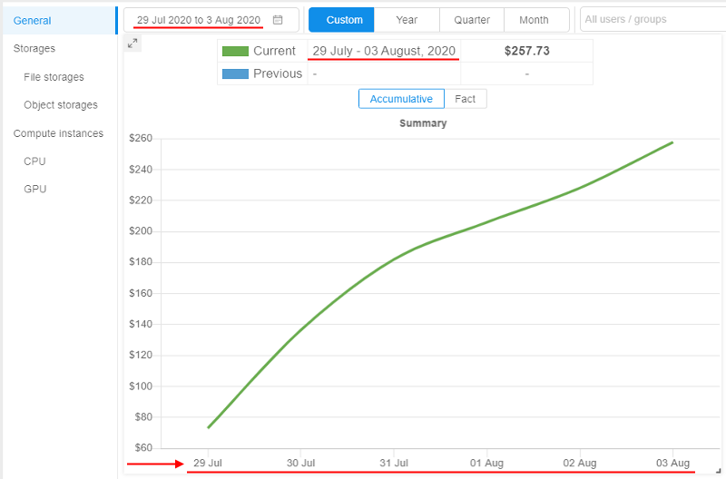

# Cloud Pipeline v.0.17 - Release notes

- [Billing reports enhancements](#billing-reports-enhancements)
- [System dictionaries](#system-dictionaries)
- [Sending of email notifications enhancements](#sending-of-email-notifications-enhancements)
- [Allowed price types for a cluster master node](#allowed-price-types-for-a-cluster-master-node)
- ["Max" data series in the resources Monitoring](#max-data-series-at-the-resource-monitoring-dashboard)
- [Export custom user's attributes](#export-custom-users-attributes)
- [User management and export in read-only mode](#user-management-and-export-in-read-only-mode)
- ["All pipelines" and "All storages" repositories](#all-pipelines-and-all-storages-repositories)
- [Updates of "Limit mounts" for object storages](#updates-of-limit-mounts-for-object-storages)

***

- [Notable Bug fixes](#notable-bug-fixes)
    - [AWS deployment: unable to list more than 1000 files in the S3 bucket](#aws-deployment-unable-to-list-more-than-1000-files-in-the-s3-bucket)
    - [Size of tool version created from original tool without any changes is a lot larger than original one](#size-of-tool-version-created-from-original-tool-without-any-changes-is-a-lot-larger-than-original-one)
    - [`pipe storage cp` fails in Windows for the GCS](#pipe-storage-cp-fails-in-windows-for-the-gcs-with-sslv3-error)
    - [Shared endpoint for `anonymous` users is being opened from the second time](#shared-endpoint-for-anonymous-users-is-being-opened-from-the-second-time)
    - [Attempt to view permissions on a pipeline via the `pipe view-pipes` throws an error](#attempt-to-view-permissions-on-a-pipeline-via-the-pipe-view-pipes-throws-an-error)
    - [Scale down "cold" SGE autoscaling cluster](#scale-down-cold-sge-autoscaling-cluster)
    - ["Launch Command" functionality issues](#launch-command-functionality-issues)
    - [Inner data storages navigation bar fails to navigate](#inner-data-storages-navigation-bar-fails-to-navigate)
    - [Region is being set incorrectly when trying to rerun pipeline](#region-is-being-set-incorrectly-when-trying-to-rerun-pipeline)
    - [`PAUSE` and `COMMIT` operations fail for the jobs with an autoscaled disk](#pause-and-commit-operations-fail-for-the-jobs-with-an-autoscaled-disk)

***

## Billing reports enhancements

In the previous version, the **Billing reports** functionality was introduced (see details [here](../../manual/Appendix_D/Appendix_D._Costs_management.md#billing-reports)).  
In **`v0.17`**, several useful features for the **Billing reports** were implemented.

### Access to Billing reports for non-admin users

Previously, only admins had access to the **Billing reports** Dashboard and can view Platform's spendings data.  
In some cases, it is convenient that non-admin users also have the access to specific cost reports info.

In the current version, such ability was implemented - in two ways:

- a new role was added into the predefined roles list - **`ROLE_BILLING_MANAGER`**. If that role is assigned to the user - for him/her the **Billing reports** Dashboard becomes available. And all possible filters, charts and their types, discounts configuration, export feature and etc. become available too. So, users who are granted this role are able to view the whole **Billing reports** info of the platform (as if they were admins).
    - **_Note_**: this behavior is enabled by the new system preference **`billing.reports.enabled.admins`**. It allows to configure **Billing reports** visibility for admins and billing managers. Default value is _true_.
- base access to the **Billing reports** for "general" users that allows to view some information - about users' own spendings:
    - this behavior is enabled by the new system preference **`billing.reports.enabled`**. If this preference is set, all "general" users can access personal billing information - runs/storages where the user is an owner. Also "general" users can use filters, change chart types, make reports export.
    - the following restrictions are set for "general" users when "base" billing access is enabled:
        - all showing charts are being displayed only spendings of the current user
        - there isn't an ability to configure discounts, the button "Configure discounts" is disabled
        - "Billing centers (TOP 10)" chart isn't displayed

For example, the view of the **Billing reports** Dashboard for the "general" user when the system preference `billing.reports.enabled` is enabled:  
    

### Storage data consumption

Previously, **Cloud Pipeline** allowed to show only costs for the data storages.  
But it would be convenient to understand what is the total consumption of the data usage (volume of storages usage in GB) across all operational groups or individual by specific user.

Currently, this ability is implemented.

In all "Storages" reports, for the **TOP 10 Storages...** chart, the **Volume** in GB for each storage is displayed in the table, e.g.:  
    

Additionally for each storage, its Billing Center is displayed (if it's defined) and the storage Type (`S3`/`GS`/`NFS`/`LustreFS`/etc.).

There are two **Volume** values displaying for each storage:

- **`Avg. Vol.`** is the _average_ storage volume, in GB. It means that the exact volumes for each day of the selected report period were brought and then the average value was calculated
- **`Cur. Vol.`** is the _current_ storage volume, in GB. This volume is a real volume for a current moment/last day of the given period

The user can switch the view of the **TOP 10 Storages...** charts by a new control -   
By default, **Costs** displaying is selected. When **Volume** displaying is being selected, "average" volumes of the corresponding storages (in GB) will be displayed in the chart:  
    

These new columns (_Average Volume_, _Current Volume_, _Billing Center_, _Type_) also are being exported in tables reports.

### Region/Provider filter

Previously, **Billing reports** allowed displaying the different Cloud Providers' instance types and their usage. But there was no way to get the overall _per-Cloud_ or _per-Region_ information.

In **`v0.17`**, these abilities were implemented. Now the user can use the following filters:

- specific Cloud Provider(s) (_for multi-Provider deployments_)
- specific Region(s) of the specific Cloud Provider

They all can be specified via the "**Regions/Providers**" dropdown list in the top of any **Billing reports** page, e.g.:  
    

### Custom date range for the report

Previously, **Cloud Pipeline** allowed to configure date range on the **Billing reports** dashboard for different periods (_year_, _quarter_, _month(s)_), but the minimum period for any report was only _month_.  
Sometimes, it is needed to view cost utilization for a specific period in days.

In **`v0.17`**, it was implemented - the user can view **Billing reports** with manually configured period accurate to the day:

- Select the "Custom" period and click the "Calendar" control:  
    
- Select "From" and "To" dates, confirm the selection:  
    
- Reports (charts and tables) will be rebuilt for the configured custom date range:  
    

### Displaying different user's attributes in the Billing reports

Previously, in all the **Billing reports**, info about users was displayed as user ID only. In some cases, it would be more convenient to display user names or emails - to take a more readable form.

In the current version, this ability is implemented.  
A new System Preference is introduced: **`billing.reports.user.name.attribute`**  
It defines which user's attribute shall be used to display the users in the **Billing reports**. If it is set, specified attribute will be used in all billing charts, tables, export reports.

Possible values for described preference: _`userName`_, _`FirstName`_, _`LastName`_, etc.

### Export reports in `csv` from any Billing page

Previously, **Cloud Pipeline** allowed to export the **Billing reports** data into the `*.csv` format via the "General" section only. But in separate sections - "Storages" and "Compute Instances" - the user could export data as `*.png` image format only.

Currently, `*.csv` export has been added to all the reports sections ("Storages"/"Compute instances" and all sub-sections):

- reports display the same structure as in the GUI - the top 10 records of the corresponding entities (e.g. storages or instances)
- for the reports, which contain more than one table - all the tables are exported one after another
- export in `*.csv` from the "General" page remains the same

Example of an export from the "CPU" page:

- 
- 

### Breakdown the billing reports by month

**Cloud Pipeline** allows exporting billing reports in the `*.csv`. Previously, the values were shown as aggregates for the _whole_ selected period. In some cases, it is more convenient to change this view to a breakdown by month.

In the current version, this ability is implemented.  
Now, if any period - longer than a month is selected (including a `custom` period), the `*.csv`-report contains an aggregate for each month of that period.  
The whole period summary is being included as well (as previously).

Example of the report for a custom period:  
    

### "Billing General" export broken by the user

Previously, **Cloud Pipeline** could export the "General" billing report split by the "Cost Center". For some use cases, needs to have this report broken by the user as well.

Now, this ability is implemented.  
User can specify which dimension to use for the export:

- by **Cost Center** - in this case, the "General" billing report will be split by the "Cost Center" (as it was previosly)
- by **User** - in this case, export will be in the same format as for the "Cost Center", but split the values by the user (using [`billing.reports.user.name.attribute`](#displaying-different-users-attributes-in-the-billing-reports) to display the username)

Format of the report is being selected before the export:  
    

Example of the report broken by the user:  
    

## System dictionaries

Often admins have to set attributes (metadata) for "general" users manually. In case, when such metadata keys aren't different for each user and has certain amount of values, it is convenient to select these values from the predefined values list, not to specify them manually each time.

In the current version, the ability to create **System Dictionaries** was implemented.
Each **dictionary** is the categorical attribute. I.e. it is attribute which values are predefined.  
Each **dictionary** has its name and values, e.g.:  
    

If the dictionary exists in the system, then admins can use it when specifying attributes for any Platform object (**`Pipeline`**, **`Folder`**, **`Storage`**, **`Project`**, **`Tool`**), and also for **`User`**, **`Group`** or **`Role`**. In this case, it is enough to specify only the dictionary name as the attribute key, the list of dictionary values will appear automatically in the value field:  
    

Also, the different dictionaries may be connected (linked). I.e. admins can create two dictionaries, which values are mapped `1-1` or `1-many`, e.g.:  
    

In the GUI, such connection is being handled in the following way:

1. Admin specifies the links between the dictionaries items (e.g. for the example above _`ProjectID`:`BRCA1`_ -> _`DataStorage`:`<path>`_).
2. Links have the "autofill" attribute. If the admin selects the source key (_`ProjectID`:`BRCA1`_) as attribute key for any object - the destination key will be specified automatically (_`DataStorage`_ will be added with the _`<path>`_ selection):  
      
    

For more details see [here](../../manual/12_Manage_Settings/12._Manage_Settings.md#system-dictionaries).

## Sending of email notifications enhancements

Several additions and updates were implemented in the current version for the System Email notifications.  
You can view the general mechanism of the **Cloud PIpeline** email notifications sending described [here](../../manual/12_Manage_Settings/12.9._Change_email_notification.md#configure-automatic-email-notifications-on-users-runs).

### Additional options for `IDLE`/`HIGH-CONSUMED` runs notifications

Previously, to customize a platform behavior with respect to **_idle_** or **_high-consumed_** runs, admin had to set a number of settings in two different system forms - **Preferences** and **Email Notifications**. It was inconvenient and could confused users.  
It would be nice to duplicate input fields for some preferences into the **Email Notifications** section - for faster and more convenient input of their values, and to avoid possible confusion and mistakes.

In the current version, it was implemented. Now:

1. For **`HIGH_CONSUMED_RESOURCES`** notification type settings, the following input fields were added:
    - "_Threshold of disk consume (%)_" that duplicates **`system.disk.consume.threshold`** preference value
    - "_Threshold of memory consume (%)_" that duplicates **`system.memory.consume.threshold`** preference value  
      
    Saving of the listed values changes at the **Email Notifications** form will automatically change the corresponding values in the **Preferences**, and vice versa.
2. For **`IDLE_RUN`**, **`IDLE_RUN_PAUSED`**, **`IDLE_RUN_STOPPED`** notification types settings, the following input fields were added:
    - "_Max duration of idle (min)_" that duplicates **`system.max.idle.timeout.minutes`** preference value
    - "_Action delay (min)_" that duplicates **`system.idle.action.timeout.minutes`** preference value
    - "_CPU idle threshold (%)_" that duplicates **`system.idle.cpu.threshold`** preference value
    - "_Action_" that should duplicates **`system.idle.action`** preference value  
    These 4 fields are united into a single section for all **_idle_** notification types - you may configure these fields from any **_idle_** notification settings tab.  
      
    Saving of the listed values changes at the **Email Notifications** form will automatically change the corresponding values in the **Preferences**, and vice versa.

For all these fields, help tooltips were added to clarify their destination, e.g.:  
    

### Notifications for long paused runs

In **`v0.17`**, new email notification types were added:

1. **`LONG_PAUSED`** - the notification that is being sent when the run is in the **_PAUSED_** state for a long time.  
    This new notification type has the following additional configurable parameters:
    - _Threshold (sec)_ - it is a time interval of the run **_PAUSED_** state after which the notification will be sent
    - _Resend delay (sec)_ - it is a delay after which the notification will be sent again, if the run is still in the **_PAUSED_** state  
    
2. **`LONG_PAUSED_STOPPED`** - the notification that is being sent when the run that has been in the `PAUSED` state for a long time, has been stopped by the system.  
    This new notification type has the following additional configurable parameter:
    - _Threshold (sec)_ - it is a time interval of the run **_PAUSED_** state after which the notification will be sent and the run will be terminated  
    

There is a common setting for the both described notification types - _Action_. This setting could be only `NOTIFY` or `STOP`. It defines the system behavior with the long paused runs:

- if the _Action_ is `NOTIFY` - for the appropriate run, the notification **`LONG_PAUSED`** will being sent according to its settings
- if the _Action_ is `STOP` - for the appropriate run, the notification **`LONG_PAUSED_STOPPED`** will be sent once and the run will be terminated

Action type also can be configured via the Systemp preference **`system.long.paused.action`**. Saving of the _Action_ setting value changes at the **Email Notifications** form will automatically change the corresponding value in the **Preferences**, and vice versa.

### "Resend" setting for `IDLE` runs

Previously, **`IDLE_RUN`** notifications were sent only once and then configured action had being performed.  
In the current version, the ability to resend this notifications was implemented.  
It could be configured via the corresponding field at the **`IDLE_RUN`** notification type form:  
      
If the _Resend delay_ is specified and the _Action_ for the **_idle_** runs is set as `NOTIFY`, then the **`IDLE_RUN`** notification will being resent every appropriate time interval.

### Allow to exclude certain node type from the specific notifications

For quite small/cheap nodes, the users may not want to receive the following email notifications for the run:

- **`IDLE_RUN`**
- **`LONG_PAUSED`**
- **`LONG_RUNNING`**

So, a new System preference **`system.notifications.exclude.instance.types`** was implemented to control that behavior.  
If the node type is specified in this preference, listed above notifications will not be submitted to the jobs, that use this node type.  
This preference allows a comma-separated list of the node types and wildcards, e.g.:  
    

## Allowed price types for a cluster master node

Previously, **Cloud Pipeline** allowed the user to choose whether the cluster master node be a `spot` or `on-demand` instance.  
While spots are acceptable for the worker nodes, as they can be recreated in failure cases - master node failure will terminate the whole cluster.  
To make things easy for the end-users, an optional restriction on the specific price types usage for the master nodes was implemented.

There is a new string system preference - **`cluster.allowed.price.types.master`** - that force the clusters' master node price type.

**Default value**: "spot,on_demand" - so, both types are accessible for the user when he/she wants to launch a cluster.

**Possible values**: "spot", "on_demand" or both together comma-separated.

Specified value for that preference defines which price type(s) will be shown in the drop-down, when the cluster run is being configured. For example:

- set in the Preferences:  
    
- once the user selects any _cluster_ configuration in the "Exec environment" section - available price types becomes equal to the set value:  
    

**_Note_**: **`cluster.allowed.price.types.master`** preference doesn't apply on the price types for single-node jobs

## "Max" data series at the "Resource Monitoring" dashboard

Previously, **Cloud Pipeline** displayed the resources utilization as an average value. This could hide some spikes (which resulted in job failure), when reviewing at a high zoom-level (e.g. several days).

In the current version, to the "CPU Usage" and the "Memory Usage" charts additional data-series ("lines") were added, which are calculated as a `max` function in each moment.  
Existing lines are kept as well, but were renamed to `average`.

For example:  
    

For more details see [here](../../manual/09_Manage_Cluster_nodes/9._Manage_Cluster_nodes.md).

## Export custom user's attributes

Previously, user's metadata attributes couldn't be exported in an automatic way.

In the current version, such feature is implemented.  
Now, before the users export, there is the ability to select which user's metadata attributes shall be exported. Previous export settings remain the same.

- Click the "**Export users**" button at the **USER MANAGEMENT** tab of the **System Settings**. Select the "Custom configuration":  
    
- In the export pop-up, select additional metadata keys you wish to export with general user's info:  
    
- Exported metadata will be included into the export file as separate columns, e.g. (part of the output):  
    

For more details about users export see [here](../../manual/12_Manage_Settings/12._Manage_Settings.md#export-users).

## User management and export in read-only mode

Previously, only admins had access to the users info/metadata.
In the current version, a new "built-in" role **_ROLE\_USER\_READER_** was added.  
This role allows:

- read-only access to the `API` endpoints, responsible for the users, groups, roles information
- in the `GUI`, users with this role can:
    - get "general" user/groups information in read-only mode - name/email/etc. - **without** users' metadata
    - get access to the user management tab in read-only mode - **without** users' metadata and launch options
    - export users list - **including** users' metadata

For more details about user roles see [here](../../manual/12_Manage_Settings/12._Manage_Settings.md#roles).

## "All pipelines" and "All storages" repositories

There are several ways for users to find the appropriate storage/pipeline object in the **Cloud Pipeline Platform** - manually via the **Library**, using the **Search** ability or via the corresponding panels of the main Dashboard.

It would be convenient to get all lists of the storages/pipelines accessible to the user in one place with short info about each object and easy access to it.  
In the current version, such ability was implemented:

- there are two new controls displaying at the **Library** page, above the library-tree - separate "repositories" for storages and pipelines:  
    
- each "repository" displays the full list of the corresponding objects accessible by the current user, e.g. for pipelines:  
    
- for each object in the "repository" are displayed:
    - object name
    - object description (if it is available)
    - `OWNER` user name
    - _additionally_ for pipelines, the **Run** button - if the pipeline is available for execute for the user
    - _additionally_ for storages, **Cloud Region**/**Provider** icons for multi-provider deployments
- if the user clicks any object in the list - its regular page is being opened
- for each "repository", there is a search field for the quick search over objects list

## Updates of "Limit mounts" for object storages

### Displaying of the `CP_CAP_LIMIT_MOUNTS` in a user-friendly manner

Previously, **Cloud Pipeline** displayed the run-enabled data storages (selected via ["Limit mounts"](../v.0.15/v.0.15_-_Release_notes.md#limit-mounted-storages) feature before the launch) as a list of IDs at the **Run logs** page (as the **`CP_CAP_LIMIT_MOUNTS`** parameter).  

In the current version, this viewing was changed to more "friendly" for users:

- The data storage names are being displayed instead of the IDs
- Showing names are hyperlinks, pointing to the data storage in the **Cloud Pipeline** GUI
- "Sensitive" storages are being highlighted appropriately

See details [here](../../manual/06_Manage_Pipeline/6.1._Create_and_configure_pipeline.md#example-limit-mounted-storages).

### Warning in case of a risk of `OOM` due to the number of the object storage mounts

If the user has 100+ object storages available - they all are mounted to the jobs, by default. When using rather small nodes - this leads to the `OOM` errors, as the 100+ mount processes may oversubscribe the memory.  
Even if the memory consumption will be greatly optmized - the user may still face such issues, if the number of object storages grow.  
So in the current version, a sort of hard-limit was implemented to warn the user if there is risk of `OOM`.

A new **System preference** is introduced - **`storage.mounts.per.gb.ratio`** (_int_).  
This preference allows to specify the "safe" number of storages per Gb of `RAM` (by default, it is `5` - i.e. "5 storages per each Gb of `RAM`").

When launching a job - the user's available object storages count is being calculated and checked that this count does not exceed the selected instance type `RAM` multiplied by the **`storage.mounts.per.gb.ratio`**.  
If it's exceeded - the user is being warned with the following wording and asked to reduce a number of mounts via the **Limit mounts** feature, e.g.:  
    

**_Note_**:

- Warning does not prohibit the run launching, user can start it at his own discretion changing nothing.
- If the **`storage.mounts.per.gb.ratio`** is not set - no checks are being performed, no warning appears.
- Before the launch, only the _object storages_ count is being calculated, _file mounts_ do not introduce this limitation.

***

## Notable Bug fixes

### AWS deployment: unable to list more than 1000 files in the S3 bucket

[#1312](https://github.com/epam/cloud-pipeline/issues/1312)

Previously, when `s3` bucket contained more than 1000 files - user could list all the files in the bucket via the GUI, but only first 1000 files via any `pipe` CLI capabilities (`pipe storage ls`, `pipe storage mount`, etc.).

### Size of tool version created from original tool without any changes is a lot larger than original one

[#1270](https://github.com/epam/cloud-pipeline/issues/1270)

Previously, the size of the tool version that had created from the original tool without any changes or after resume operation for paused run - by `COMMIT` operation - was a lot larger than original version.

### `pipe storage cp` fails in Windows for the GCS with `sslv3` error

[#1268](https://github.com/epam/cloud-pipeline/issues/1268)

Previously, the `sslv3` issue happened when data to/from the GCS was copying using the Windows workstation.

### Shared endpoint for `anonymous` users is being opened from the second time

[#1265](https://github.com/epam/cloud-pipeline/issues/1265)

Previously, when `anonymous` user tried to open a hyperlink with the shared endpoint - he/she got the Platform's "Access denied" page.
But if user tried to open the page in the second time - it was being opened correctly.

### Attempt to view permissions on a pipeline via the `pipe view-pipes` throws an error

[#1216](https://github.com/epam/cloud-pipeline/issues/1216)

Previously, when trying to view permissions of a pipeline via the `pipe view-pipes -r` command - the command execution failed.

### Scale down "cold" SGE autoscaling cluster

[#1123](https://github.com/epam/cloud-pipeline/issues/1123)

Previously, `SGE` autoscaling cluster didn't scale down until at least one running job appears in queue. Currently, `SGE` autoscaling cluster is being scaled down even if there weren't any running jobs yet.

### "Launch Command" functionality issues

[#1086](https://github.com/epam/cloud-pipeline/issues/1086), [#1090](https://github.com/epam/cloud-pipeline/issues/1090)

Previously, if a user specified the values of the parameters with "spaces" (e.g. selection of the input parameter value from the GUI bucket browser) - this broke the command format.  
Also, the **Launch Command** generation function used single-quotes to wrap the `-cmd` value. This was causing to fail when running the generate commands from the Windows environment. As the Windows CMD shell can't resolve it correctly (the command value is still split by the space).

### Inner data storages navigation bar fails to navigate

[#1077](https://github.com/epam/cloud-pipeline/issues/1077)

Previously, navigation bar for so-called "inner" data storages produced `You cannot navigate to another storage` in case of any interaction with it.

### Region is being set incorrectly when trying to rerun pipeline

[#1066](https://github.com/epam/cloud-pipeline/issues/1066)

Previously, when tried to rerun any run - the default region was being set in the **Cloud Region** field. But the instance type wasn't being changed automatically and remained the same as was set before the run. This could lead to inconsistencies.

### `PAUSE` and `COMMIT` operations fail for the jobs with an autoscaled disk

[#998](https://github.com/epam/cloud-pipeline/issues/998)

Previously, `PAUSE` and `COMMIT` operations failed with the `NullPointerException` error for the jobs with an autoscaled disk.
