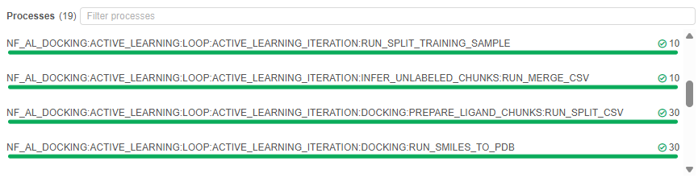
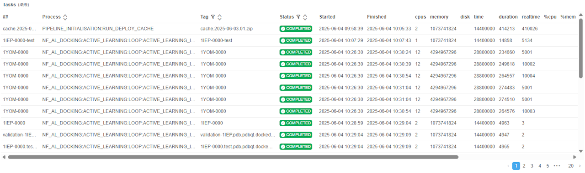
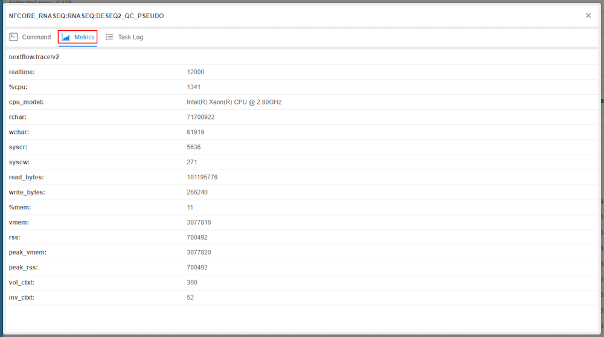
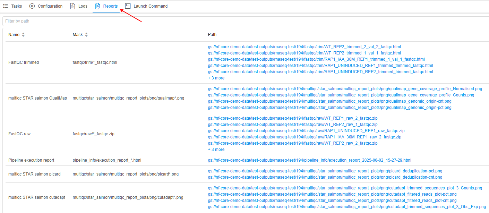

# Cloud Pipeline v.0.20 - Release notes

- [Visualization of Nextflow pipeline execution](#visualization-of-nextflow-pipeline-execution)
- [Visualization of genomics pipeline results](#visualization-of-genomics-pipeline-results)

## Visualization of Nextflow pipeline execution

**Run logs** page of the Cloud Pipeline platform allows to view different run information like timings, instance info, run parameters, console output, etc.  
In some cases, current view could be insufficient or, on the contrary, excessive - for example, for Nextflow runs.  
For such runs, it could be useful to view separate Nextflow tasks and processes, their metrics and separate logs.

In the current version, the ability to change the view of the **Run logs** page was implemented.  
This view tailored for Nextflow pipeline runs and enabled for them by default:  
    

This view includes:

- header with general run info and main controls
- set of tabs

Almost the whole functionality of the "original" **Run logs** page is organised and distributed between header and set of tabs.  
The only difference is the **Tasks** tab in the set - this tab contains visualization of specific Nextflow pipeline execution details:

- full list of Nextflow processes and short summary over task statuses per each process  
    
- task statuses of all/selected processes as an horizontal bar graph  
    
- list of tasks and their metrics of all/selected processes as a table  
    

User can click any task in the tasks list, and task details will be opened in a separate pop-up:

- **Command** - displays the command that is executed in the selected task  
    
- **Metrics** - displays all non-empty task metrics like CPU and memory usage, realtime of the task execution, disk usage  
    
- **Task log** - displays task execution logs  
    

For more details about visualization of Nextflow pipeline execution integrated to the Cloud Pipeline GUI, see [here](../../manual/11_Manage_Runs/11.6._Nextflow_runs_visualization.md#tasks-tab).

## Visualization of genomics pipeline results

During genomics pipeline execution, different auxiliary output documents may be generated.  
Once pipeline is completed, user might want to view/download such documents.  
As these documents can be located in different places of the output directory, it can be hard to find files of interest manually.  

Therefore, in the current version a separate previewer for pipeline output documents was implemented.  
List of documents, retrieved from the pipeline's output directory and available for the preview after the pipeline has completed, can be found at the **Reports** tab of the **Run logs** page:  
    

Each path in the documents table is presented as a hyperlink - by click it, a corresponding document will be opened in a preview pop-up, e.g.:  
    

Within the preview pop-up, user can:

- view name and full path of the report document
- view document preview
- download the document as a raw file to the local workstation

At least, the following formats are supported for the previewing: `HTML`, `PNG`, `CSV`, `TSV`, `JSON`, `TXT` and other plain text files.  
Preview for other binary files is not supported but these files can be easily downloaded to the local workstation via the preview pop-up.

For more details about visualization of genomics pipeline results see [here](../../manual/11_Manage_Runs/11.6._Nextflow_runs_visualization.md#reports-tab).

Please note, not all pipeline output files are displayed in the **Reports** tab.  
Here, only documents are available that were loaded whithin special `Pipeline Results` storage rules, that are defined in the pipeline settings.  
For more details about storage rules see [here](../../manual/06_Manage_Pipeline/6._Manage_Pipeline.md#storage-rules).
