# Cloud Pipeline v.0.20 - Release notes

- [Visualization of Nextflow pipeline execution](#visualization-of-nextflow-pipeline-execution)
- [Visualization of genomics pipeline results](#visualization-of-genomics-pipeline-results)
- [GUI plugins framework](#gui-plugins-framework)
- [Gemini Integration: platform's chatbot](#gemini-integration-platforms-chatbot)
- [Pre-packaged pipelines for genomics](#pre-packaged-pipelines-for-genomics)
    - [Rnaseq](#rnaseq)
    - [Scrnaseq](#scrnaseq)
    - [Sarek](#sarek)
    - [Methylseq](#methylseq)
    - [Proteinfold](#proteinfold)
    - [Active Learning Pipeline](#active-learning-pipeline)
- [Google-native infrastructure integration](#google-native-infrastructure-integration)
    - [Compute engines management: Google Kubernetes Engine integration](#compute-engines-management-google-kubernetes-engine-integration)
    - [Platform database: Google Cloud SQL integration](#platform-database-google-cloud-sql-integration)
    - [Docker images storing: Google Artifact Registry integration](#docker-images-storing-google-artifact-registry-integration)
    - [Resource monitoring: Google Cloud Monitoring integration](#resource-monitoring-google-cloud-monitoring-integration)
    - [Terraform-based platform deployment on Google Cloud](#terraform-based-platform-deployment-on-google-cloud)
    - [System logs: Google Cloud Logging integration](#system-logs-google-cloud-logging-integration)
    - [Billing: Google Cloud Billing integration](#billing-google-cloud-billing-integration)
    - [Data catalog: improvements and Google Cloud integration](#data-catalog-improvements-and-google-cloud-integration)
    - [Pipeline execution: Google Batch integration](#pipeline-execution-google-batch-integration)

## Visualization of Nextflow pipeline execution

**Run logs** page of the Cloud Pipeline platform allows to view different run information like timings, instance info, run parameters, console output, etc.  
In some cases, current view could be insufficient or, on the contrary, excessive - for example, for Nextflow runs.  
For such runs, it could be useful to view separate Nextflow tasks and processes, their metrics and separate logs.

In the current version, the ability to change the view of the **Run logs** page was implemented.  
This view tailored for Nextflow pipeline runs and enabled for them by default:  
    

This view includes:

- header with general run info and main controls
- set of tabs

Almost the whole functionality of the "original" **Run logs** page is organised and distributed between header and set of tabs.  
The only difference is the **Tasks** tab in the set - this tab contains visualization of specific Nextflow pipeline execution details:

- full list of Nextflow processes and short summary over task statuses per each process  
    
- task statuses of all/selected processes as an horizontal bar graph  
    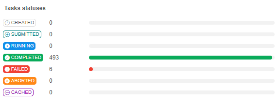
- list of tasks and their metrics of all/selected processes as a table  
    

User can click any task in the tasks list, and task details will be opened in a separate pop-up:

- **Command** - displays the command that is executed in the selected task  
    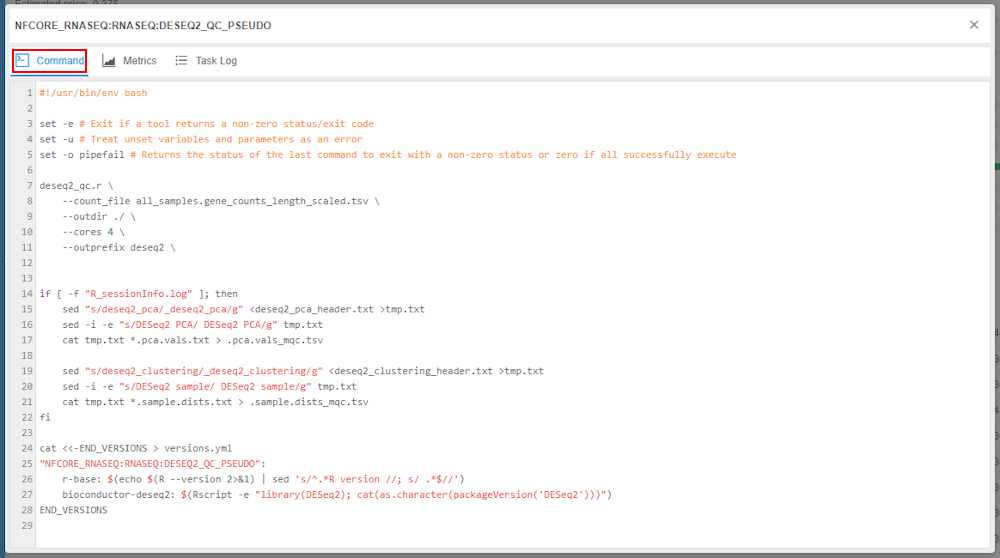
- **Metrics** - displays all non-empty task metrics like CPU and memory usage, realtime of the task execution, disk usage  
    
- **Task log** - displays task execution logs  
    

For more details about visualization of Nextflow pipeline execution integrated to the Cloud Pipeline GUI, see [here](../../manual/11_Manage_Runs/11.6._Nextflow_runs_visualization.md#tasks-tab).

## Visualization of genomics pipeline results

During genomics pipeline execution, different auxiliary output documents may be generated.  
Once pipeline is completed, user might want to view/download such documents.  
As these documents can be located in different places of the output directory, it can be hard to find files of interest manually.  

Therefore, in the current version a separate previewer for pipeline output documents was implemented.  
List of documents, retrieved from the pipeline's output directory and available for the preview after the pipeline has completed, can be found at the **Reports** tab of the **Run logs** page:  
    

Each path in the documents table is presented as a hyperlink - by click it, a corresponding document will be opened in a preview pop-up, e.g.:  
    

Within the preview pop-up, user can:

- view name and full path of the report document
- view document preview
- download the document as a raw file to the local workstation

At least, the following formats are supported for the previewing: `HTML`, `PNG`, `CSV`, `TSV`, `JSON`, `TXT` and other plain text files.  
Preview for other binary files is not supported but these files can be easily downloaded to the local workstation via the preview pop-up.

For more details about visualization of genomics pipeline results see [here](../../manual/11_Manage_Runs/11.6._Nextflow_runs_visualization.md#reports-tab).

Please note, not all pipeline output files are displayed in the **Reports** tab.  
Here, only documents are available that were loaded whithin special `Pipeline Results` storage rules, that are defined in the pipeline settings.  
For more details about storage rules see [here](../../manual/06_Manage_Pipeline/6._Manage_Pipeline.md#storage-rules).

## GUI plugins framework

Cloud Pipeline provides wide abilities to launch different tools and pipelines allowing to customize settings and parameters for such runs.  
But in some cases, the appearance of separate platform pages could confuse general users cause of the large amount of different configurable options, seem overloaded or just unfamiliar.  
For such cases, it would be convenient to setup a custom UI for specific pages - to simplify them, or make them similar to other third-party solutions as users used to.

In **`v0.20`**, GUI plugins framework was implemented.  
This framework allows external developers to extend the visualization capabilities of Cloud Pipeline by developing custom UI plugins for platform pages.  
Then, that plugins for specific pages can be easily enabled in the Cloud Pipeline deployment for separate tools/pipelines and users.

GUI plugins framework implies the following usage workflow:

- Developer creates a new custom UI plugin
- System administrator adds this plugin to the server side
- Then, via the platform GUI, administrator or user with enough permissions:
    - selects tool/pipeline for which the plugin shall be enabled  
    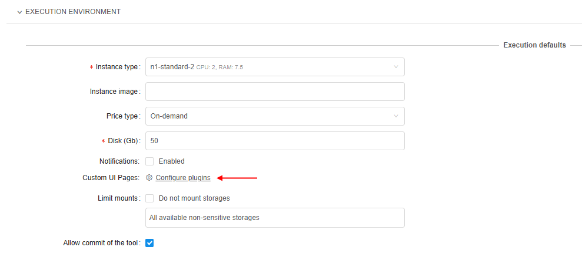
    - selects a base page that shall be replaced by the plugin, plugin itself, and user(s)/user group(s) for which that plugin shall be applied  
    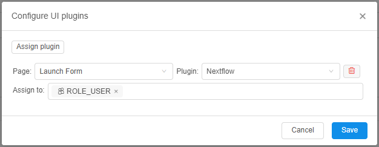
- After, when any user (from the assigned ones at the previous step) tries to launch selected tool/pipeline and opens the page for which the plugin was configured - that user will see only custom configured UI from the plugin, not the base UI of the page.  
    For example, enabled Nextflow plugin for the tool/pipeline **Launch form** page:  
    

For more details and example see [here](../../manual/11_Manage_Runs/11.7._Plugins_framework.md).

## Gemini Integration: platform's chatbot

Currently, Cloud Pipeline platform is quite large and has a lot of functionality.  
There is a scope of the documentation that describes platform features and can help users to perform some tasks.  
But sometimes it could be difficult to find exactly necessary manual or execute a task without special experience.  

To address these diffuculties, in the current version, an AI-powered chatbot (based on [Gemini LLM](https://deepmind.google/models/gemini/)) was integrated to the platform, enabling users to ask questions about the platform usage or request assistance in launching certain jobs.

Chatbot is being opened from the main sidebar and looks like this when started:  
    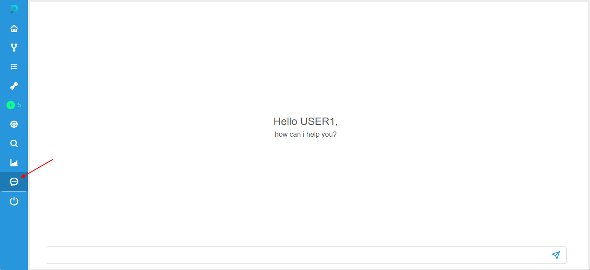

To start a conversation, user should specify a question and click the **submit** button (or press the _Enter_ key).  
Once the request is submitted, chatbot starts the analysis of the submitted request, then generates the response and outputs it to the chat content form, e.g.:  
    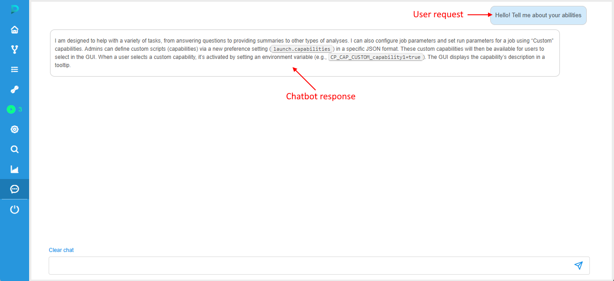

In addition to the general text responses, chatbot may generate:

- "how-to" instructions and platform-reference information based on the documentation, e.g.:  
    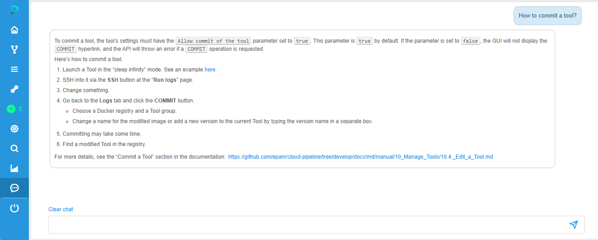  
    Such responses may include formatted text and hyperlinks to the platform documentation.
- information based on the content from Issues of the platform's [GitHub page](https://github.com/epam/cloud-pipeline) - in cases, when user requests help on the corresponding platform features that were mentioned in such Issues, e.g.:  
      
    Such responses may include formatted text and hyperlinks to the GitHub Issues.
- when the chatbot recognizes a request to perform a task (launch a pipeline/tool), the response contains the prepared "card" that allows to launch a task, e.g.:  
    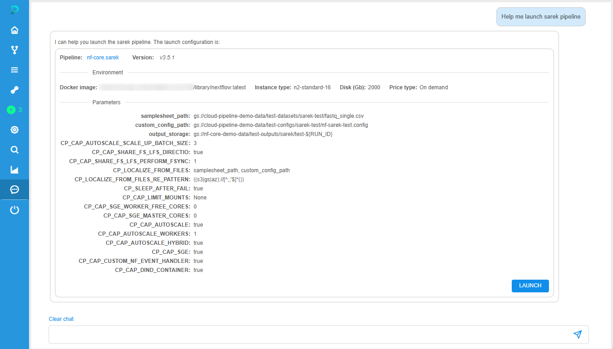  
    Such "card" contains:  
    - object (tool/pipeline) name and version
    - **Environment** section that shows main execution settings that will be used for the run
    - **Parameters** section that shows all task parameters and their values
    - button to confirm task execution  
    User can ask the chatbot to correct something in settings/parameters of the suggested task execution, e.g.:  
    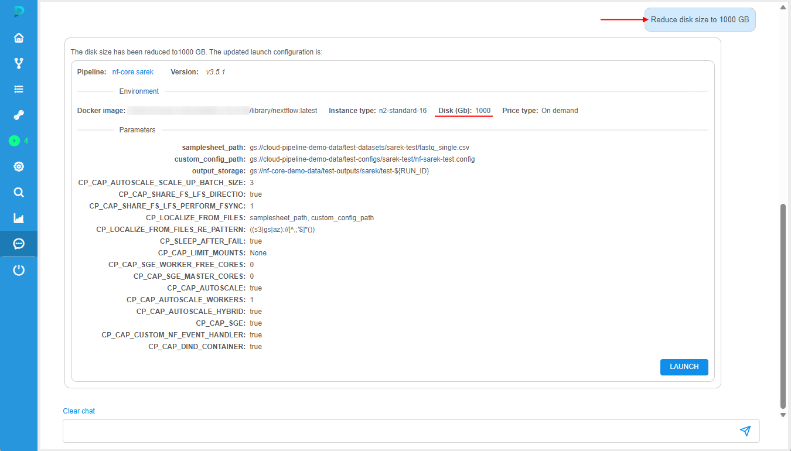  
    When all settings/parameters are configured, user can click the **Launch** button to submit job execution.  
    Once the launch is confirmed, corresponding information will appear as a response from the chatbot - this response includes state and ID of the launched task, e.g.:  
    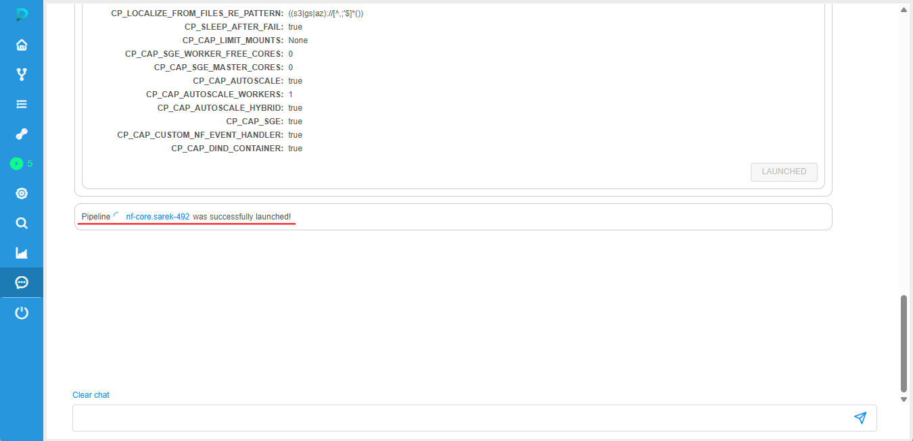

For more details and examples of the chatbot using, see [here](../../manual/20_Chatbot/20._Chatbot.md).

## Pre-packaged pipelines for genomics

In the current version, a set of pre-packaged pipelines, that could be deployed simultaneously with the Cloud Pipeline platform, was added.  
They are pre-configured and allow users to easily execute their genomics workflows "out of the box".  
Pre-packaged pipelines, added to the Cloud Pipeline platform within this version, are related to the [Nextflow](https://www.nextflow.io/) pipelines and include:

### Rnaseq

**Rnaseq** is a bioinformatics pipeline that can be used to analyse RNA sequencing data obtained from organisms with a reference genome and annotation.  
It takes a samplesheet and FASTQ files as input, performs quality control (QC), trimming and (pseudo-)alignment, and produces a gene expression matrix and extensive QC report.


For more details see [here](../../manual/06_Manage_Pipeline/6.6._Pre-packaged_pipelines.md#rnaseq).

### Scrnaseq

**Scrnaseq** is a bioinformatics analysis pipeline for processing 10x Genomics single-cell RNA-seq data, offering support for various alignment tools and downstream analyses, and supporting:

- `SimpleAF` (`Alevin-Fry`) + `AlevinQC`
- `STARSolo`
- `Kallisto` + `BUStools`
- `Cellranger`
- `Universc`


For more details see [here](../../manual/06_Manage_Pipeline/6.6._Pre-packaged_pipelines.md#scrnaseq).

### Sarek

**Sarek** is a workflow designed to detect variants on whole genome or targeted sequencing data.  
Initially designed for Human, and Mouse, it can work on any species with a reference genome. Sarek can also handle tumour / normal pairs and could include additional relapses.


For more details see [here](../../manual/06_Manage_Pipeline/6.6._Pre-packaged_pipelines.md#sarek).

### Methylseq

**Methylseq** is a bioinformatics analysis pipeline used for Methylation (Bisulfite) sequencing data.  
It pre-processes raw data from `FastQ` inputs, aligns the reads and performs extensive quality-control on the results.


For more details see [here](../../manual/06_Manage_Pipeline/6.6._Pre-packaged_pipelines.md#methylseq).

### Proteinfold

**Proteinfold** is a bioinformatics analysis pipeline for Protein 3D structure prediction.  
It leverages deep learning models like `AlphaFold2`, `RoseTTAFold` and `ESMFold` to predict protein structures from amino acid sequences.  
For sequences already existing in Protein Database, their structures are obtained from the database without a fold calculating.

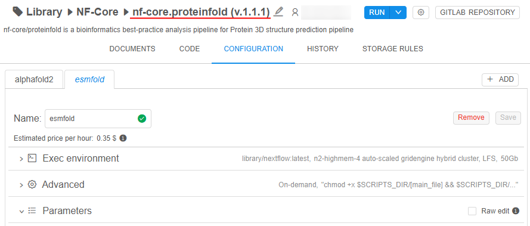

For more details see [here](../../manual/06_Manage_Pipeline/6.6._Pre-packaged_pipelines.md#proteinfold).

### Active Learning Pipeline

**Al-docking** is an active learning-driven molecular docking pipeline that ingests 3D receptor structures and a chemical compound database.  
It iteratively performs docking simulations (`QuickVina`) and trains machine learning models (`DGL`, `PyTorch`) over protein structure files to prioritize promising ligands, producing docking score prediction results, trained models, and a summary report with progress through iteration figures.  
Totally, it allows to predict drug candidates using active learning from a set of small molecule 2D input structures or protein structure files.

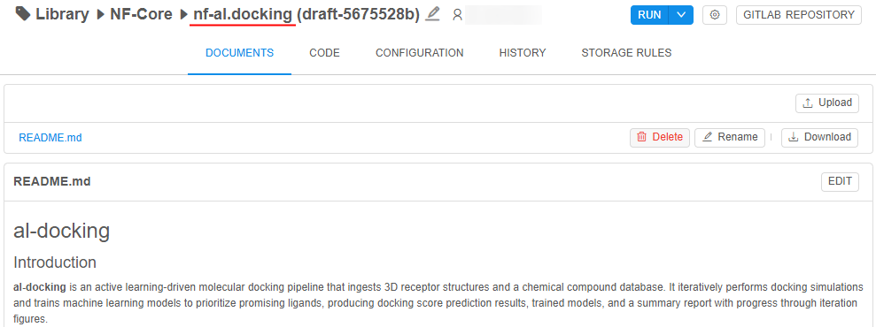

For more details see [here](../../manual/06_Manage_Pipeline/6.6._Pre-packaged_pipelines.md#active-learning-pipeline).

## Google-native infrastructure integration

[Previously](../v.0.16/v.0.16_-_Release_notes.md#google-cloud-platform-support), the support of [Google Cloud Platform](https://cloud.google.com/) (GCP) resources in Cloud Pipeline (in terms of data storages and compute engine instances) was implemented.

And in the current version, one of the major features implemented is the core integration of the Cloud Pipeline solution with native GCP services.  
As a result of this integration Cloud Pipeline platform leverages GCP services to provide a scalable, intelligent, and user-friendly platform for managing and running genomics pipelines and HPC tasks.

In the context of the integration of Cloud Pipeline with GCP, the process of replacing the on-premises general infrastructure components with GCP-native solutions was carried out.  
This replacement includes the following core systems and components:

- self-hosted `Kubernetes` was replaced with [`Google Kubernetes Engine (GKE)`](https://cloud.google.com/kubernetes-engine)
- self-hosted `PostgreSQL` database was replaced with [`Cloud SQL`](https://cloud.google.com/sql)
- self-hosted `Docker Registry` was replaced with [`Artifact Registry`](https://cloud.google.com/artifact-registry/docs)
- built-in `Kubernetes` node monitoring functionality was replaced with [`Cloud Monitoring`](https://cloud.google.com/monitoring)
- additionally, Terraform-based code scripts for automated deployment of the Cloud Pipeline platform on GCP was provided

In addition, several Cloud Pipeline application services have been implemented using GCP-native services.  
This includes:

- support [`Cloud Logging`](https://developers.google.com/maps/documentation/mobility/operations/cloud-logging) for system logs storage
- support [`Cloud Billing`](https://cloud.google.com/billing/docs) for billing reports generation
- improved stability and scalability of platform’s data catalog feature
- support [`GCP Batch`](https://cloud.google.com/batch) for pipeline execution

The resulting Cloud Pipeline deployment using GCP-native services and infrastructure is shown below:  
    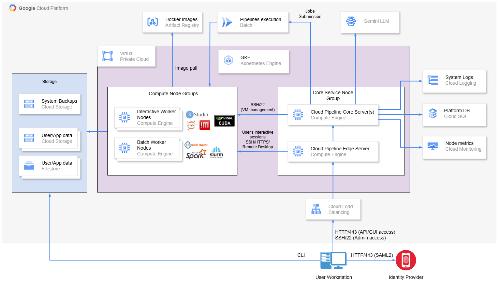

### Compute engines management: Google Kubernetes Engine integration

Previously, only one approach for the management of compute engine instances was supported - using self-hosted `Kubernetes` configuration.  
Since the current **`v0.20`**, Cloud Pipeline platform could be deployed with [`Google Kubernetes Engine`](https://cloud.google.com/kubernetes-engine) as the core hosting and execution platform on GCP.  
In terms of the GUI and the general platform use, for the end user everything remains the same.

### Platform database: Google Cloud SQL integration

Previously, only one approach for the storing the state of the Cloud Pipeline platform deployment was supported - using self-hosted `PostgreSQL 16` instance.  
Since the current **`v0.20`**, Cloud Pipeline platform could be deployed with [`Google Cloud SQL`](https://cloud.google.com/sql) database for the storing the platform state. It provides better reliability and easier support for Cloud Pipeline deployment on GCP.  
In terms of the GUI and the general platform use, for the end user everything remains the same.

### Docker images storing: Google Artifact Registry integration

Previously, only one approach for the storing docker images and Linux software packages for the Cloud Pipeline platform was supported - using self-hosted `Docker Registry`.  
Since the current **`v0.20`**, Cloud Pipeline platform could be deployed with [`Google Artifact Registry`](https://cloud.google.com/artifact-registry/docs) repository that allows to store docker images and Linux software packages needed to start workloads and install missing dependencies in a same way.  
In terms of the GUI and the general platform use, for the end user everything remains the same.

### Resource monitoring: Google Cloud Monitoring integration

In Cloud Pipeline, lots of metrics to monitor cluster compute nodes are collected.  
For users, these metrics are available via the [**Cluster Monitor**](../../manual/09_Manage_Cluster_nodes/9._Manage_Cluster_nodes.md#monitor) form.  

Previously, built-in `Kubernetes` functionality was used to monitor compute nodes metrics.

In **`v0.20`**, new ability is integrated to the Cloud Pipeline platform - [`Google Cloud Monitoring`](https://cloud.google.com/monitoring) to monitor metrics on Google Compute Engine nodes.  
In case of `Google Cloud Monitoring`:

- metrics are collected within built-in Google Cloud services (for such metrics like CPU utilization and Network traffic tracking) and special [`Ops Agent`](https://cloud.google.com/monitoring/api/metrics_opsagent) (for such metrics like memory and disk usage)
- the following metrics are monitored:
    - `CPU Utilization`: load and `max` usage
    - `Memory Usage`: used and `max` memory
    - `Disk Usage`: per-device capacity and free space
    - `Network Traffic`: sent/received bytes summary
    - `GPU Utilization`: `avg`, `min`, `max` usages
    - `GPU Memory Usage`: `avg`, `min`, `max` memory
    - `GPU Processes Utilization`: `avg`, `min`, `max` usages
- in terms of the **Cluster Monitor** usage and the GUI, for the end user everything remains the same  
    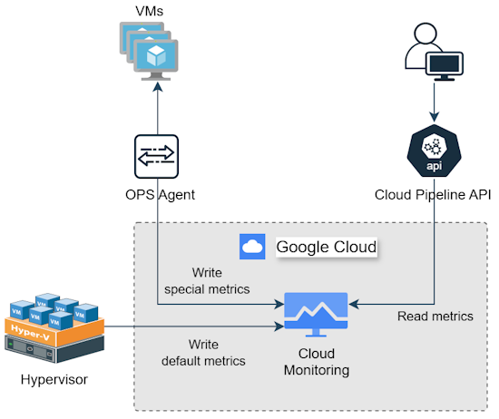

Besides, new **System Preferences** were added to have the ability to configure `Google Cloud Monitoring` in the Cloud Pipeline platform:

- **`cluster.monitoring.gcp.intervals.number`** - sets a number of intervals in monitoring period by which metrics should be received
- **`cluster.monitoring.gcp.minimal.interval`** - defines minimum interval (in seconds) between metrics taking.  
    This interval duration will be used for metrics taking only in case when monitoring period divided on `cluster.monitoring.gcp.intervals.number` is smaller than this interval

For more technical details about metrics getting, see [here](https://github.com/epam/cloud-pipeline/issues/3969#issuecomment-2879486629).

### Terraform-based platform deployment on Google Cloud

From the current version, any new Cloud Pipeline platform release can be easily deployed on Google Cloud Platform using [**`Terraform`**](https://developer.hashicorp.com/terraform).

A full technical guidance how to deploy infrastructure using `Terraform` and install Cloud Pipeline on Google Cloud, see in the [Platform on GCP deployment manual](../../installation/native/gcp/terraform/README.md).  
That guidance provisions everything needed to run Cloud Pipeline reliably and securely, including:

- **Google Kubernetes Engine (GKE) cluster**
- **Filestore (NFS)**
- **Cloud SQL (Private IP)**
- **Cloud Storage bucket**
- **Artifact Registry**
- **Firewall rules**
- **Jump Host**

### System logs: Google Cloud Logging integration

In Cloud Pipeline, [Security logging](../../manual/12_Manage_Settings/12.12._System_logs.md) is supported.  
Platform records audit trail events like:

- users' authentication attempts
- users' profiles modifications
- platform objects' permissions management
- access to interactive applications from pipeline runs
- access to the data

Previously, only one approach for such logging was supported - logs were collected/managed to the index database (based on `ElasticSearch`) and backed up to the preconfigured data storage.

In **`v0.20`**, new approach is implemented - ability to switch logging to [`Google Cloud Logging`](https://cloud.google.com/logging/docs/overview) was added.  
In case of enabled `Google Cloud Logging`:

- [`Ops Agent`](https://cloud.google.com/logging/docs/agent/ops-agent) is used to collect log data from the Cloud Pipeline platform deployment to the linked Google Cloud project
- [`BigQuery`](https://cloud.google.com/bigquery) dataset within Sink connector is used to access, manage and store logs
- in terms of the **System logs** usage and the GUI, for the end user everything remains the same  
    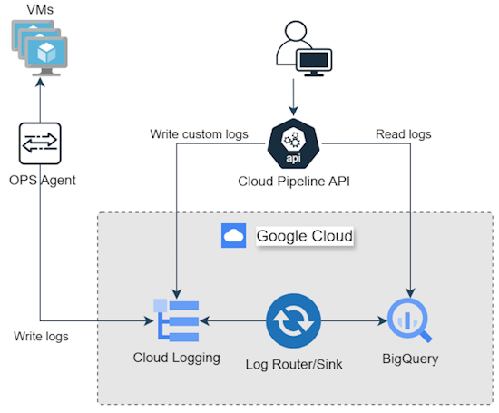

Switching between `Google Cloud Logging` and `ElasticSearch` is enabled via a configuration flag in application properties - system administrators should set **`logging.provider=gcp`** or **`logging.provider=elastic`** to select a provider for system logs.

Besides, new **System Preferences** were added to have the ability to configure `Google Cloud Logging` in the Cloud Pipeline platform:

- **`gcp.logging.log.name`** - logname for Google Cloud Logging
- **`gcp.logging.sink.label.key`** - key of the label that defines from where the log comes. It is necessary for the Sink connector that redirects the log to `BigQuery`
- **`gcp.logging.sink.label.value`** - value of the label that defines from where the log comes. It is necessary for the Sink connector that redirects the log to `BigQuery`
- **`gcp.logging.bigquery.table.name`** - specifies the `BigQuery` project table name
- **`gcp.logging.bigquery.read.timeout.mills`** - sets the read timeout (in milliseconds) for `BigQuery` read operations
- **`gcp.logging.bigquery.connect.timeout.mills`** - sets the connection timeout (in milliseconds) for the `BigQuery` client
- **`gcp.logging.bigquery.max.bytes`** - sets the maximum limit (in bytes) that could be fetched per request

### Billing: Google Cloud Billing integration

Cloud Pipeline platform has integrated billing service.  
It allows to get from Cloud provider and then process, track and display the associated costs for using platform resources by the users.  
Costs on compute instances launch are available from runs pages. Additionally, there is a separate [**Billing Dashboard**](../../manual/Appendix_D/Appendix_D._Costs_management.md#billing-reports) to monitor platform expenses.

Cloud Pipeline already supports billing functionality for different Cloud providers, including Google Cloud.  
But in the current version, default collecting of the billing information for the Google Cloud provider was supplemented with the using of [`Cloud Billing`](https://cloud.google.com/billing/docs) API for more accuracy.

A new **System Preference** was added - **`gcp.billing.account.id`**  
This preference allows to specify billing account ID of the GCP account used in the current Cloud Pipeline deployment. And if this preference is set (billing account is specified):

- GCP billing prices associated with the specific account will be retrieved.  
    Such account-specific prices retrieving enables more granular and accurate price calculations in the Cloud Pipeline platform based on some discounts for a billing account
- Prices are now fetched from the following endpoint: `https://cloudbilling.googleapis.com/v1beta/billingAccounts/<BILLING_ACCOUNT_ID>/skus/-/price?currencyCode=<CURRENCY>`  
    **_Note_**: API requires the `billing.billingAccountSkus.list` permission to function properly.
- in terms of the GUI of different platform pages displaying billing information, for the end user everything remains the same

If `gcp.billing.account.id` preference is not set and GCP is the current Cloud provider of the Cloud Pipeline platform, for all billing calculations default GCP prices will be retrieved without taking into account possible discounts of the specific billing account.

### Data catalog: improvements and Google Cloud integration

Cloud Pipeline platform has integrated system of the displaying and searching over the platform objects (runs, tools, pipelines, data storage files and folders, and others) - [Data Catalog](../../manual/19_Search/19._Global_search.md#advanced-search).  
It allows easily find and filter necessary objects and data, and then open them or navigate for the further work with.

In the current version, some issues, that were previously observed with the Data Catalog time to time, were solved including:

- instability of security logs
- low performance for large indices
- duplication of indices

#### Instability of security logs

Previously, System Logs could be partially unavailable or not stored due to `ElasticSearch` issues.  
These issues could caused to hardly track security events and analyze historical data.  
In **`v0.20`**, such instability of security logs was addressed via the [Google Cloud Logging integration](#system-logs-google-cloud-logging-integration).  
Now, audit logs are stored and managed using more stable Google Cloud APIs.

#### Low performance for large indices

Performance of the previous implementation of the Data Catalog based on `ElasticSearch` could degrade with large indices due to various factors like improper shard allocation, high ingestion rates, and resource limitations.  
In **`v0.20`**, the following measures were taken to avoid a performance decrease:

- Support of the multi node deployment for `ElasticSearch` on Google Kubernetes Engine is implemented.  
    This offers several advantages - higher availability, scalability, and efficient resource utilization. By distributing `Elasticsearch` across multiple nodes within a cluster, Cloud Pipeline gains resilience against node failures, enabling search and catalog engine to remain operational even if one or more nodes go down. This distributed architecture also allows for horizontal scaling via adding more nodes to handle increased data volume and query load. That all allows to improve service performance.
- Ability to exclude files from indexing and search availability.

The last measure reduces the amount of data the system needs to process, store, and update, thereby lowering resource consumption.  
This improves query performance by keeping the index smaller and more efficient, focusing only on relevant, necessary data.  
To exclude certain data from indexing, users can use the **System Preference** **`search.storage.elements.settings`**.  
It has a format of `JSON` array. To exclude data from indexing, the following item shall be added to the preference value:

```json
{
    "storageName": <STORAGE_NAME>,
    "hiddenFilePathGlobs": [
        <GLOB1>,
        <GLOB2>,
        ...
    ]
}
```

Where, `<STORAGE_NAME>` is an exact storage name or a wildcard for a storage name (e.g. "Home-Storage-\*"), `<GLOB>` - path glob to a directory or a file within a storage, which will be hidden during the indexing.  

> In reality, hidden files are excluded from the index and search, but their total size is taken into account for the catalog engine, reducing the number of data files that will be in the index (not changing the total volume of files).  
> For example, if for a storage `"hiddenFilePathGlobs": ["temp/**"]` was configured, the following situation with this storage will be in terms of files availability for the search:
> 
>     File                    Size    Hidden (not available for search)
>     data/file1.txt          10G     false
>     data/file2.txt          20G     false
>     temp/file3.txt          15G     true
>     temp/file4.txt          15G     true
>     temp/interim/file5.txt  10G     true
>     temp/interim/file6.txt  10G     true
> 
>     Total size:             80G
>     Number of documents:    6
>
> And for the catalog engine in terms of the index, hidden files will be like the one file without content but with the size of all hidden files matched that glob, i.e.:
>
>     File                    Size    Hidden (not available for search)
>     data/file1.txt          10G     false
>     data/file2.txt          20G     false
>     .temp                   50G     true -> no content
>
>     Total size:             80G
>     Number of documents:    3

#### Duplication of indices

From time to time, in the `ElasticSearch` database duplicated, unused or detached indices are occurred.  
It may lead to wasting extra space, consuming more system resources, and slowing down query performance.

To prevent such situation, in **`v0.20`**, extended clean up logic for indices was added to `ElasticSearch` agent service implementation.  
This allows to easily remove identified duplicated, unused or detached indices from alias during the regular index management in automatic mode.

### Pipeline execution: Google Batch integration

In the current version, the ability that extends Cloud Pipeline's main execution backend to run Nextflow pipelines on [`Batch`](https://cloud.google.com/batch) in Google Cloud deployment was added.

From now on, to enable Batch using for Nextflow pipeline runs on GCP, it is enough to meet the following conditions:

- Nextflow pipeline based on Nextflow docker image shall be used for the run.
- In the `cluster.networks.config` System Preference, configuration section of the machine image, that is used for the running Nextflow pipelines, shall contain additional specification that includes GCP service account details:  
    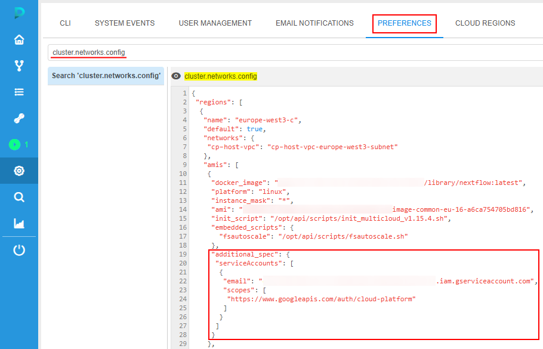
- `nextflow.config` of the pipeline shall contain special `google-batch` profile, that is used for the Nextflow pipeline run:  
    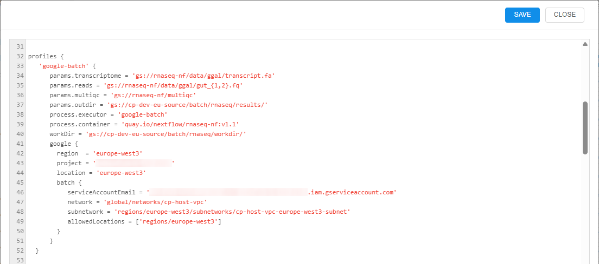
- Pipeline's `nextflow run` command shall use created `google-batch` profile:  
    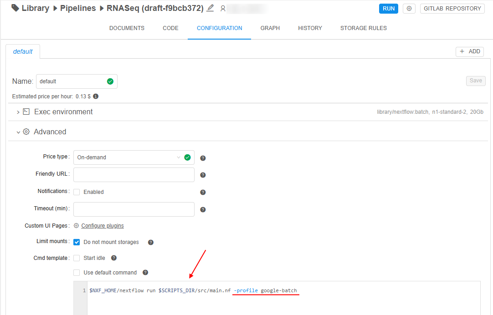

During the such pipeline run, Nextflow Batch execution logs will be diplayed in the console:  
    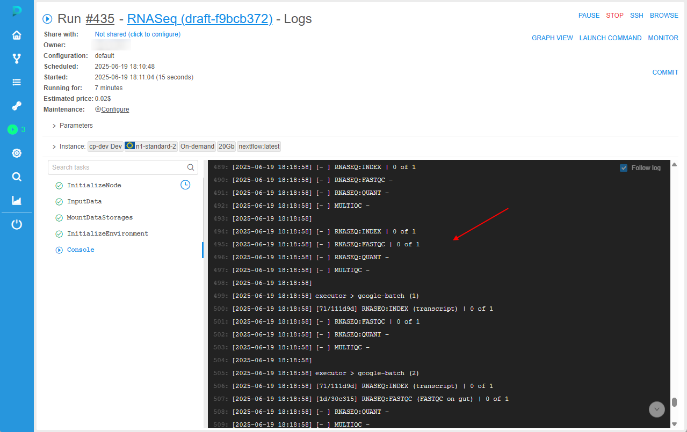

For more details, see [here](../../manual/06_Manage_Pipeline/6.6._Pre-packaged_pipelines.md#running-nextflow-pipelines-on-batch-in-google-cloud).
